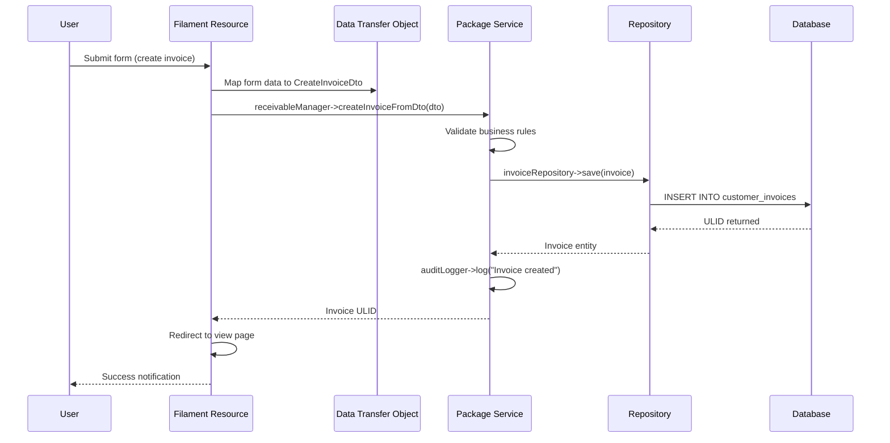

# Nexus Architecture (Planned): Nexus Monorepo with Headless-First Approach

**Document Status:** PLANNED - Future architectural direction with Filament PHP v4 admin UI

This document outlines the **planned evolution** of the `nexus` monorepo architecture. It maintains the core philosophy of decoupling while introducing a **Headless-First** approach that includes an admin UI alongside the API.

**The Core Philosophy: "Logic in Packages, Implementation in Applications."**

Our architecture is built on one primary concept: **Decoupling**.

  * **`📦 packages/`** contain pure, framework-agnostic business logic. They are the "engines."
  * **`🚀 apps/`** are the runnable applications. They are the "cars" that use the engines.

**The Planned Evolution: Headless-First**

While maintaining full API capabilities, the planned architecture introduces **Filament PHP v4** as an optional admin UI layer, enabling both headless API consumption and traditional web-based administration.

## Packages:

  * Must be atomic, self-contained units of functionality.
  * Must define their persistence needs via **Contracts (Interfaces)**.
  * Must not contain any database logic or framework-specific code.
  * Must be publishable to Packagist independently.
  * Allowed to depend on other atomic packages in the monorepo
      (e.g., `nexus/uom` can be required by `nexus/inventory`).
  * Allowed to require framework-agnostic libraries (e.g., `psr/log`).
  * Allowed to require low-level library for Laravel support (e.g., `illuminate/support`). Should be limited to non-invasive helpers (Collections, support functions) and avoid other Illuminate namespaces.
  * Is mostly engine and logic processing thus persistence agnostic. It does not care how data is stored. It only provides the interfaces. Most case it does not provide any model traits or classes.
  * All primary keys are ULIDs (26-character Crockford base32 strings, sortable and distributed-friendly).

## Package Inventory (50+ Atomic Packages)

### Foundation & Infrastructure (7 packages)
1. **Nexus\Tenant** - Multi-tenancy context and isolation with queue propagation
2. **Nexus\Sequencing** - Auto-numbering with atomic counter management
3. **Nexus\Period** - Fiscal period management for compliance
4. **Nexus\Uom** - Unit of measurement conversions
5. **Nexus\AuditLogger** - Timeline feeds and audit trails
6. **Nexus\EventStream** - Event sourcing for critical domains (Finance GL, Inventory)
7. **Nexus\Setting** - Application settings management

### Identity & Security (3 packages)
8. **Nexus\Identity** - Authentication, RBAC, MFA, session/token management
9. **Nexus\Crypto** - Cryptographic operations and key management
10. **Nexus\Audit** - Advanced audit capabilities (extends AuditLogger)

### Finance & Accounting (7 packages)
11. **Nexus\Finance** - General ledger, journal entries, double-entry bookkeeping
12. **Nexus\Accounting** - Financial statements, period close, consolidation
13. **Nexus\Receivable** - Customer invoicing, collections, credit control
14. **Nexus\Payable** - Vendor bills, payment processing, 3-way matching
15. **Nexus\CashManagement** - Bank reconciliation, cash flow forecasting
16. **Nexus\Budget** - Budget planning and variance tracking
17. **Nexus\Assets** - Fixed asset management, depreciation

### Sales & Operations (6 packages)
18. **Nexus\Sales** - Quotation-to-order lifecycle, pricing engine
19. **Nexus\Inventory** - Stock management with lot/serial tracking (depends on Uom)
20. **Nexus\Warehouse** - Warehouse operations and bin management
21. **Nexus\Procurement** - Purchase requisitions, POs, goods receipt
22. **Nexus\Manufacturing** - Bill of materials, work orders, MRP
23. **Nexus\Product** - Product catalog, pricing, categorization

### Human Resources (3 packages)
24. **Nexus\Hrm** - Leave, attendance, performance reviews
25. **Nexus\Payroll** - Payroll processing framework
26. **Nexus\PayrollMysStatutory** - Malaysian statutory calculations (EPF, SOCSO, PCB)

### Customer & Partner Management (4 packages)
27. **Nexus\Party** - Customers, vendors, employees, contacts
28. **Nexus\Crm** - Leads, opportunities, sales pipeline
29. **Nexus\Marketing** - Campaigns, A/B testing, GDPR compliance
30. **Nexus\FieldService** - Work orders, technicians, service contracts

### Integration & Automation (7 packages)
31. **Nexus\Connector** - Integration hub with circuit breaker, OAuth
32. **Nexus\Workflow** - Process automation, state machines
33. **Nexus\Notifier** - Multi-channel notifications (email, SMS, push, in-app)
34. **Nexus\Scheduler** - Task scheduling and job management
35. **Nexus\DataProcessor** - OCR, ETL interfaces (interface-only package)
36. **Nexus\Intelligence** - AI-assisted automation and predictions
37. **Nexus\Geo** - Geocoding, geofencing, routing

### Reporting & Data (6 packages)
38. **Nexus\Reporting** - Report definition and execution engine
39. **Nexus\Export** - Multi-format export (PDF, Excel, CSV, JSON)
40. **Nexus\Import** - Data import with validation and transformation
41. **Nexus\Analytics** - Business intelligence, predictive models
42. **Nexus\Currency** - Multi-currency management, exchange rates
43. **Nexus\Document** - Document management with versioning

### Compliance & Governance (4 packages)
44. **Nexus\Compliance** - Process enforcement, operational compliance
45. **Nexus\Statutory** - Reporting compliance, statutory filing
46. **Nexus\Backoffice** - Company structure, offices, departments
47. **Nexus\OrgStructure** - Organizational hierarchy management

### Support & Utilities (3 packages)
48. **Nexus\Storage** - File storage abstraction layer
49. **Nexus\Routing** - Route optimization and caching
50. **Nexus\ProjectManagement** - Projects, tasks, timesheets, milestones

**Package Dependencies:** Packages may depend on other packages (e.g., `Inventory` requires `Uom`, `Receivable` requires `Finance`, `Sales`, `Party`). All dependencies must be explicit in `composer.json`.

## Getting Started & Roadmap

### Current Implementation Status

**MVP Packages (Production-Ready):**
- Foundation: Tenant, Sequencing, Period, Uom, AuditLogger, Setting
- Finance Core: Finance, Accounting, Currency
- Sales & Operations: Sales, Party, Product
- Integration: Connector, Notifier, Storage, Document

**In Development:**
- Receivable (Phase 3), Payable, Inventory, Warehouse
- Hrm, Payroll (with Malaysia statutory adapter)
- FieldService, Workflow, EventStream

**Planned:**
- Manufacturing, Procurement, ProjectManagement
- Analytics, Intelligence, Reporting
- Marketing, Crm, Backoffice, OrgStructure

**Publishing Strategy:** Start with ~15 core packages. Consolidate small, tightly-coupled packages to reduce operational overhead until CI/release automation is mature.

### Quick Start for New Contributors

1. **Clone and Setup:**
   ```bash
   git clone <repo-url> nexus
   cd nexus
   composer install
   ```

2. **Run Atomy Locally:**
   ```bash
   cd apps/Atomy
   cp .env.example .env
   php artisan key:generate
   php artisan migrate
   php artisan serve
   ```

3. **Enable Filament Admin (Optional):**
   ```bash
   # In apps/Atomy/.env
   ADMIN_UI_ENABLED=true
   
   # Install Filament
   composer require filament/filament:"^4.0"
   php artisan filament:install --panels
   npm install && npm run build
   ```

4. **Create Your First Package:** See Section 5 (Developer Workflow)
   


## Applications:

   There are two types of application in this monorepo:

### **Headless-First Orchestrator (`apps/Atomy`):**

**Atomy** is the main ERP backend built with Laravel 12, offering **dual interfaces**: a comprehensive RESTful API for headless consumption and a Filament PHP v4 admin panel for web-based administration.

**Architectural Principles:**
- **Headless-First Design:** API remains the primary interface; admin UI is a consumer of the same APIs
- **Dual Interface Strategy:** Both API and admin UI access the same business logic layer
- **API Supremacy:** All admin UI operations must go through published APIs (no direct model access in Filament)
- **Optional UI:** Admin panel can be disabled entirely for pure headless deployments
- **Contract Implementation Layer:** Implements all interfaces defined by atomic packages
- **Persistence Provider:** Contains all database migrations and Eloquent models
- **Service Orchestration:** Combines atomic packages into higher-level business workflows

**Core Responsibilities:**
1. **Implement Package Contracts:** Provides concrete implementations (e.g., `app/Repositories/DbUomRepository.php` implements `UomRepositoryInterface`)
2. **Provide Persistence:** Houses all database migrations and Eloquent models that fulfill package persistence contracts
3. **Orchestrate Business Logic:** Creates domain services by composing multiple packages (e.g., `ReceivableManager` uses Finance, Sales, Party, Sequencing)
4. **Expose APIs:** Publishes RESTful and GraphQL endpoints for all ERP capabilities
5. **Provide Admin UI:** Offers Filament-based admin panel that consumes the same APIs
6. **Dependency Injection:** Binds package interfaces to concrete implementations in `AppServiceProvider.php`

**Technology Stack:**
- Laravel 12 (PHP 8.3+)
- Filament PHP v4 (Admin Panel)
- PostgreSQL/MySQL for persistence
- Redis for caching and queues
- RESTful API (JSON)
- GraphQL (optional)
- Livewire (Filament dependency)

**Admin UI Architecture:**

**Filament Integration Pattern:**
```
app/Filament/
├── Resources/              # Admin CRUD interfaces
│   ├── CustomerResource.php
│   ├── InvoiceResource.php
│   └── ProductResource.php
├── Pages/                  # Custom admin pages
│   ├── Dashboard.php
│   └── Reports/
├── Widgets/                # Dashboard widgets
│   └── RevenueChart.php
└── Actions/                # Custom actions
    └── ApproveInvoiceAction.php
```

**Filament Resources Use Services (Not Models):**
```php
namespace App\Filament\Resources;

use Filament\Resources\Resource;
use Nexus\Receivable\Contracts\ReceivableManagerInterface;

class InvoiceResource extends Resource
{
    // Inject service interface, not Eloquent model
    public function __construct(
        private readonly ReceivableManagerInterface $receivableManager
    ) {}
    
    // All operations go through service layer
    public function create(array $data): void
    {
        $this->receivableManager->createInvoiceFromOrder($data['order_id']);
    }
}
```

**Design Constraints:**
- Admin UI must never bypass the API layer
- Filament resources must use package services, not Eloquent directly
- All business logic remains in packages
- UI layer is purely presentation and user input
- API-first: All features must work via API before UI implementation
- UI can be fully disabled via configuration for pure headless deployments

**Deployment Modes:**
1. **Headless-Only Mode:** API-only, Filament disabled (original architecture)
2. **Headless-First Mode:** API + Admin UI both available (planned architecture)
3. **Hybrid Mode:** API for external consumers, Admin UI for internal users

**Configuration:**
```php
// config/atomy.php
return [
    'admin_ui' => [
        'enabled' => env('ADMIN_UI_ENABLED', true),
        'route_prefix' => env('ADMIN_UI_PREFIX', 'admin'),
        'middleware' => ['web', 'auth', 'verified'],
    ],
    'api' => [
        'enabled' => env('API_ENABLED', true),
        'route_prefix' => env('API_PREFIX', 'api'),
        'rate_limiting' => true,
    ],
];
```

### **Terminal Client (`apps/Edward`):**

**Edward** is a Terminal User Interface (TUI) client that demonstrates headless consumption of Atomy's API.

**Architectural Principles:**
- **Complete Decoupling:** Treats Atomy as a remote API service
- **API-Only Communication:** Uses HTTP client to consume Atomy endpoints
- **Zero Direct Database Access:** Never connects to Atomy's database
- **Package Isolation:** Never requires atomic packages directly

**Core Responsibilities:**
1. **API Client:** Implements `AtomyApiClient` for HTTP communication with Atomy
2. **Console UI:** Builds user interface using Laravel Artisan commands
3. **Data Presentation:** Formats API responses for terminal display
4. **User Input:** Validates and transforms user input before API calls

**Technology Stack:**
- Laravel Artisan Commands
- Guzzle HTTP Client
- Terminal formatting libraries

**Design Constraints:**
- Must never access Atomy database directly
- Must never require any `nexus/*` packages
- All functionality via API consumption
- Can be deployed separately from Atomy

**Purpose:** Serves as reference implementation showing how any client (web, mobile, desktop) can consume Atomy's API.


-----

## 1\. 🌲 Proposed Monorepo Structure

This visual map illustrates the physical layout of the monorepo. The **`Nexus\Tenant`** package is expanded to serve as the template for all other atomic packages.

```md
nexus/
├── .gitignore
├── composer.json               # Root monorepo workspace configuration (defines 'path' repositories)
├── ARCHITECTURE.md             # (This document)
├── README.md
│
├── 📦 packages/                  # Atomic, publishable PHP packages
│   ├── Hrm/                      # Nexus\Hrm
│   │   ├── composer.json
│   │   └── src/
│   ├── Inventory/                # Nexus\Inventory (Requires 'nexus/uom')
│   │   ├── composer.json
│   │   └── src/
│   ├── Tenant/                   # Nexus\Tenant (The Expanded Template)
│   │   ├── composer.json         # Defines 'nexus/tenant', autoloading
│   │   ├── README.md             # Package-specific documentation
│   │   ├── LICENSE               # Package licensing file
│   │   └── src/                  # The source code root
│   │       ├── Contracts/        # REQUIRED: Interfaces defining persistence needs and data structures
│   │       │   ├── TenantInterface.php         # Data structure contract (What a Tenant IS)
│   │       │   └── TenantRepositoryInterface.php # Persistence contract (How to SAVE/FIND a Tenant)
│   │       ├── Exceptions/       # REQUIRED: Domain-specific exceptions
│   │       │   └── TenantNotFoundException.php
│   │       ├── Services/         # REQUIRED: Core business logic (The "Engine")
│   │       │   └── TenantManager.php           # e.g., createNewTenant(data), switchTenant(id)
│   │       └── NexusTenantServiceProvider.php  # OPTIONAL: Laravel integration point
│   ├── Uom/                      # Nexus\Uom
│   │   ├── composer.json
│   │   └── src/
│   └── Workflow/                 # Nexus\Workflow
│       ├── composer.json
│       └── src/
│
└── 🚀 apps/                      # Deployable applications
    ├── Atomy/                    # Nexus\Atomy (Headless-First Orchestrator with Admin UI)
    │   ├── .env.example
    │   ├── artisan
    │   ├── composer.json         # Requires all 'nexus/*' packages + filament/filament
    │   ├── /app
    │   │   ├── /Console
    │   │   ├── /Filament/        # Admin UI layer (Filament resources, pages, widgets)
    │   │   │   ├── /Resources/   # CRUD interfaces (CustomerResource, InvoiceResource)
    │   │   │   ├── /Pages/       # Custom admin pages (Dashboard, Reports)
    │   │   │   ├── /Widgets/     # Dashboard widgets (RevenueChart, StockAlert)
    │   │   │   └── /Actions/     # Custom admin actions (ApproveInvoice, CloseBooks)
    │   │   ├── /Http/
    │   │   │   ├── /Controllers/Api/  # RESTful API controllers
    │   │   │   └── /Resources/   # API response resources
    │   │   ├── /Models           # Eloquent Models (implements package Contracts)
    │   │   ├── /Repositories     # Concrete Repository implementations
    │   │   └── /Services         # Application-layer services (domain managers, adapters)
    │   ├── /config/
    │   │   ├── features.php      # Feature flags (admin_ui, api)
    │   │   └── filament.php      # Filament admin panel configuration
    │   ├── /database/migrations/ # ALL migrations for the ERP
    │   ├── /resources/
    │   │   ├── /views/           # Blade views (Filament panels)
    │   │   └── /css/             # Admin UI styles
    │   └── /routes/
    │       ├── api.php           # RESTful API routes
    │       └── web.php           # Admin UI routes (Filament)
    └── Edward/                   # Edward (Terminal Client)
        ├── .env.example
        ├── artisan
        ├── composer.json
        ├── /app/Console/Commands/
        └── /app/Http/Clients/AtomyApiClient.php

```

-----

## 2\. 📦 The "Packages" Directory (The Logic)

This is the most strictly controlled part of the monorepo. All code in this directory must follow these rules.

> **The Golden Rule:** A package must **never** depend on an application. Applications **always** depend on packages. `Nexus\Tenant` can *never* know what `Nexus\Atomy` is.

### Rules of Atomicity

1.  **Must Be Framework-Agnostic:**

      * Packages must be "pure PHP" or, at most, depend on framework-agnostic libraries (e.g., `psr/log`).
      * **DO NOT** use Laravel-specific classes like `Illuminate\Database\Eloquent\Model`, `Illuminate\Http\Request`, or `Illuminate\Support\Facades\Route`.
      * A light dependency on `illuminate/support` (for Collections, Contracts, etc.) is acceptable if needed, but it should be avoided if possible.

2.  **Must NOT Have Persistence (The "Contract-Driven" Pattern):**

      * Packages **must not** contain database migrations.
      * Packages **must not** contain Eloquent Models or any concrete database logic.
      * Instead, a package *defines its need for persistence* by providing **interfaces (Contracts)** (e.g., `Nexus\Uom\Contracts\UomRepositoryInterface`).

3.  **Must Define Explicit Dependencies:**

      * If a package requires another atomic package, it must be explicitly defined in its own `packages/MyPackage/composer.json`.
      * **Example:** `packages/Inventory/composer.json` must contain `"require": { "nexus/uom": "^1.0" }`.

4.  **Must Be Publishable:**

      * Every package must be a complete, self-contained unit that *could* be published to Packagist at any time. It must have its own `composer.json`, `LICENSE`, and `README.md`.

-----

## 3\. 🚀 The "Apps" Directory (The Implementation)

Applications are the consumers of the packages. They provide the "glue" that connects the logic, the database, and the user.

### Nexus\\Atomy (The Headless Orchestrator)

`Atomy` is the central "headless" ERP backend. It assembles the atomic packages into a single, cohesive application.

  * **Its Job is to Implement Contracts:** `Atomy` contains the *concrete implementations* of the interfaces defined in the packages (e.g., `app/Repositories/DbUomRepository.php`).
  * **Its Job is to Provide Persistence:** `Atomy` is where all **`database/migrations`** and **Eloquent `app/Models`** live. It defines the schema that fulfills the needs of the packages.
  * **Its Job is to Orchestrate Logic:** `Atomy` creates new, higher-level services by combining one or more atomic packages (e.g., `StaffLeaveApprovalWorkflow` using `Nexus\Workflow` and `Nexus\Hrm`).
  * **Its Job is to Be Headless:** All functionality must be exposed via **API/GraphQL**. The `resources/views` directory must remain empty.

### Edward (The Terminal Client)

`Edward` is a TUI (Terminal User Interface) client. It is a consumer of `Atomy`.

  * **Golden Rule:** `Edward` **must never** access the `Atomy` database directly. It **must never** `require` any of the atomic packages (like `nexus/tenant`).
  * **It is Fully Decoupled:** Treat `Edward` as if it were a React frontend or a native mobile app. Its *only* connection to the system is the API provided by `Atomy`.
  * **It is API-Driven:** All its functionality is built on top of an API client (e.g., `app/Http/Clients/AtomyApiClient.php`) that consumes `Atomy`'s endpoints.
  * **Its UI is the Console:** The entire user interface is built using Laravel Artisan commands (e.g., `php artisan edward:dashboard`).

-----

## 4\. 🗺️ Developer Workflow: How to Implement an Atomy Feature

When given a user story for `Atomy`, follow this decision-making process.

**User Story Example:** "As a staff member, I want to view the current stock level of a product in kilograms."

1.  **Question 1: Is the *core logic* missing?**

      * *Analysis:* The core logic for stock management (`StockManager`) and UoM conversion (`UomConverter`) already exists in **`packages/Inventory`** and **`packages/Uom`**. No new atomic package code needed.

2.  **Question 2: How is this logic *stored*?**

      * *Analysis:* We need the `Product` and `Unit` models (which implement the package interfaces). These must exist in `Atomy`.
      * *Action:* Verify that `apps/Atomy/database/migrations/` has the tables and `apps/Atomy/app/Models/` has the corresponding Eloquent models (`Product.php`, `Unit.php`) and Repositories that bind the contracts.

3.  **Question 3: How is this logic *orchestrated*?**

      * *Analysis:* No complex orchestration is needed here; the service call is direct.
      * *Action:* Define a simple service or use the `StockManager` directly in a controller.

4.  **Question 4: How is this logic *exposed*?**

      * *Action:* Go to `apps/Atomy`.
      * Add a new endpoint in `routes/api.php`:
        `Route::get('/v1/inventory/products/{sku}/stock', [InventoryController::class, 'getStock']);`
      * The `InventoryController` will inject the `StockManager` and return the result via JSON.

5.  **Question 5: How does the *user access* this?**

      * *Action:* Go to `apps/Edward`.
      * Add a `getStockLevel` method to `app/Http/Clients/AtomyApiClient.php` to call the new endpoint.
      * Create a new command `app/Console/Commands/ViewStockCommand.php` that uses the client and formats the green text output.

-----

## 5\. 🏗️ Developer Workflow: How to Create a New Atomic Package

When a new business domain is required (e.g., `Nexus\Crm` or `Nexus\AuditLogger`), follow these steps, using the structure of `Nexus\Tenant` as a reference.

1.  **Create Directory:** Create the `packages/AuditLogger` folder.
2.  **Init Composer:** `cd packages/AuditLogger` and run `composer init`.
      * Set the name to `nexus/audit-logger`.
      * Define the PSR-4 autoloader: `"Nexus\\AuditLogger\\": "src/"`.
3.  **Define Contracts:** Define all persistence and model needs as interfaces in `packages/AuditLogger/src/Contracts/`.
      * *Example:* `AuditLogEntryInterface.php`, `AuditLogRepositoryInterface.php`.
4.  **Update Monorepo Root:** Go to the root `nexus/` directory and add your new package to the `repositories` path array.
5.  **Install in Atomy:** `cd apps/Atomy` and run `composer require nexus/audit-logger:"*@dev"`.
6.  **Implement in Atomy:** Go back to `apps/Atomy` and create the necessary migrations, models (`App\Models\AuditLog`), and repositories (`DbAuditLogRepository`) that implement the contracts from `Nexus\AuditLogger`.
7.  **Bind Implementation:** Bind the interface to the concrete implementation in `apps/Atomy/app/Providers/AppServiceProvider.php`.

**Example Package `composer.json`:**
```json
{
  "name": "nexus/uom",
  "type": "library",
  "description": "Unit of measurement management and conversions",
  "license": "MIT",
  "autoload": {
    "psr-4": {
      "Nexus\\Uom\\": "src/"
    }
  },
  "require": {
    "php": ">=8.3",
    "psr/log": "^3.0"
  },
  "require-dev": {
    "phpunit/phpunit": "^11.0"
  }
}
```

**Example Service Provider Binding:**
```php
namespace App\Providers;

use Illuminate\Support\ServiceProvider;

class AppServiceProvider extends ServiceProvider
{
    public function register(): void
    {
        // Rule A: Bind package interfaces to application implementations
        $this->app->bind(
            \Nexus\Uom\Contracts\UomRepositoryInterface::class,
            \App\Repositories\DbUomRepository::class
        );
        
        $this->app->bind(
            \Nexus\Tenant\Contracts\TenantRepositoryInterface::class,
            \App\Repositories\DbTenantRepository::class
        );
        
        // Rule B: Bind to package-provided concrete classes
        $this->app->singleton(
            \Nexus\Tenant\Contracts\TenantContextInterface::class,
            \Nexus\Tenant\Services\TenantContextManager::class
        );
        
        // Rule C: DO NOT bind concrete package services (auto-resolved)
        // $this->app->singleton(\Nexus\Tenant\Services\TenantManager::class); // ❌ REMOVE
    }
}
```

-----

## 6. 🏛️ Architectural Patterns & Principles

### 6.1 The Hybrid Event Architecture

The monorepo implements a **dual-track event system** for different use cases:

#### Timeline Feed Pattern: `Nexus\AuditLogger` (95% of use cases)
- **Purpose:** User-facing timeline showing "what happened" on entity pages
- **Use Cases:** Customer records, HR data, settings, inventory adjustments, workflows
- **Mechanism:** Logs outcomes after transaction commit
- **Query Pattern:** Simple chronological display
- **Storage:** Outcome-based records (e.g., "Invoice status changed to Paid")

#### Event Sourcing Pattern: `Nexus\EventStream` (Critical domains only)
- **Purpose:** State reconstruction at any point in history for compliance
- **Use Cases:** 
  - Finance GL (SOX/IFRS compliance - MANDATORY)
  - Inventory (Stock accuracy verification - MANDATORY)
  - Large Enterprise AP/AR (Optional)
- **Mechanism:** Append-only immutable event log
- **Query Pattern:** Temporal queries ("What was the balance on 2024-10-15?")
- **Storage:** Event-based records with projections for read models

**Decision Rule:** Use EventStream only when you need to answer: *"What was the exact state of this entity on [specific date]?"* for legal/compliance reasons.

### 6.2 Stateless Package Architecture

All atomic packages must be **stateless** across execution cycles to enable horizontal scaling:

#### The State Management Problem
- **Anti-Pattern:** Storing application state in package instance properties (e.g., `private array $circuitStates = []`)
- **Impact:** State isolated to single PHP-FPM worker; other workers remain unaware
- **Consequence:** Circuit breakers, rate limiters, and caches fail in distributed environments

#### The Solution: Dependency Inversion for State
- **Pattern:** Delegate state to shared, persistent stores (Redis, Database)
- **Implementation:** Packages define `StorageInterface` contracts; applications provide implementations
- **Examples:**
  - `CircuitBreakerStorageInterface` for Connector package
  - `CacheRepositoryInterface` for Period package
  - `SessionStorageInterface` for Identity package

**Principle:** If state must persist across requests or be visible to multiple workers, it must be externalized via an injected interface.

### 6.3 Compliance & Statutory Architecture

The system separates **process enforcement** from **output formatting** for regulatory agility:

#### Two Pillar Design

**Pillar A: `Nexus\Compliance` (Process Enforcement)**
- Enforces internal controls (e.g., segregation of duties)
- Manages feature composition via licensing/flags
- Audits system configuration for scheme requirements
- Example: ISO 14001 adapter forces hazardous material fields on assets

**Pillar B: `Nexus\Statutory` (Reporting Compliance)**
- Defines reporting interface contracts (e.g., `PayrollStatutoryInterface`)
- Manages filing metadata (frequency, format, recipient)
- Provides default implementations (e.g., `DefaultPayrollCalculator` with zero deductions)
- Example: Malaysian adapter implements EPF/SOCSO/PCB calculations

#### Pluggable Architecture Flow
1. Atomy binds default adapter to interface (e.g., `PayrollStatutoryInterface` → `DefaultStatutoryCalculator`)
2. Compliance orchestrator checks active schemes and licenses
3. If enabled, Atomy overrides with specific adapter (e.g., `MYSStatutoryCalculator`)
4. Core packages call generic interface, unaware of implementation

**Benefit:** New regulations added as self-contained packages without touching core logic.

### 6.4 Cross-Package Integration Pattern

When Package A needs Package B's functionality, use the **Adapter Pattern** in the application layer:

**Structure:**
```
packages/Sales/src/Contracts/InvoiceCreatorInterface.php  # Sales defines need
apps/Atomy/app/Services/Sales/ReceivableInvoiceAdapter.php  # Atomy bridges packages
```

**Implementation:**
- Sales package defines what it needs (`InvoiceCreatorInterface`)
- Atomy implements interface using Receivable package (`ReceivableManager`)
- Sales package remains ignorant of Receivable implementation details

**Benefits:**
- Maintains package independence
- Enables package substitution
- Facilitates testing with mocks

### 6.5 Service Provider Binding Strategy

Application service providers follow strict binding rules:

**Rule A: Essential Bindings (MANDATORY)**
- Bind package interfaces to application implementations
- Example: `TenantRepositoryInterface` → `DbTenantRepository`

**Rule B: Package Defaults (MANDATORY)**
- Bind interfaces to package-provided concrete classes
- Example: `TenantContextInterface` → `TenantContextManager`

**Rule C: Redundant Bindings (REMOVE)**
- Never bind concrete package classes (Laravel auto-resolves)
- Example: Don't bind `TenantLifecycleService` (redundant)

**Rule D: Application Utilities (OPTIONAL)**
- Bind only if complex constructor or singleton required
- Example: `FileUploader` if needs shared state

**Principle:** Only bind interfaces. Laravel's IoC container auto-resolves concrete classes.

### 6.6 Package Organization Patterns

#### Simple Packages (< 10 files)
```
src/
├── Contracts/
├── Exceptions/
└── Services/
```

#### Complex Packages (> 10 files, internal engine)
```
src/
├── Contracts/          # Public API interfaces
├── Services/           # Public API services (orchestrators)
├── Core/               # Internal engine (hidden from consumers)
│   ├── Engine/         # Complex business logic
│   ├── ValueObjects/   # Immutable domain objects
│   └── Contracts/      # Internal interfaces
└── Exceptions/
```

**Decision Rule:** Use `Core/` folder when:
- Package exceeds 300 lines in main service
- Requires internal contracts for dependency injection
- Contains value objects used only by engine
- Main service is merely an orchestrator

### 6.7 Filament Admin UI Integration Pattern (Headless-First Approach)

The Filament admin panel in `apps/Atomy` follows strict architectural constraints to maintain API supremacy and package decoupling.

#### Core Principles

1. **API-First Architecture:** All admin UI operations must flow through the same service layer used by the API
2. **Service Layer Dependency:** Filament resources must inject package service interfaces, never Eloquent models directly
3. **No Business Logic in UI:** Filament resources are purely presentation and user input handlers
4. **Package Ignorance:** Filament code exists only in `apps/Atomy`; packages remain unaware of Filament

**Engineering Cost Note:** Filament's scaffolding expects Eloquent models. Enforcing service-layer-only access requires custom resource pages, Livewire actions, and DTO mapping. Budget additional development time for custom forms and table actions compared to default Filament usage.

#### Resource Architecture Pattern

**✅ CORRECT - Service-driven Filament resource with DTO:**
```php
namespace App\Filament\Resources;

use Filament\Resources\Resource;
use Nexus\Receivable\Contracts\ReceivableManagerInterface;
use Nexus\Party\Contracts\CustomerRepositoryInterface;
use App\DataTransferObjects\CreateInvoiceDto;

class InvoiceResource extends Resource
{
    public function __construct(
        private readonly ReceivableManagerInterface $receivableManager,
        private readonly CustomerRepositoryInterface $customerRepository
    ) {}
    
    public function create(array $data): void
    {
        // Map Filament form data to DTO (decouples UI from persistence)
        $dto = new CreateInvoiceDto(
            customerId: $data['customer_id'],
            items: $data['items'],
            dueDate: new \DateTimeImmutable($data['due_date']),
            notes: $data['notes'] ?? null
        );
        
        // Use service layer with DTO, not Eloquent
        $this->receivableManager->createInvoiceFromDto($dto);
    }
    
    public function getFormSchema(): array
    {
        return [
            Forms\Components\Select::make('customer_id')
                ->label('Customer')
                ->options($this->customerRepository->getAllActive())
                ->required(),
            // ... other fields
        ];
    }
}
```

**❌ WRONG - Direct Eloquent access:**
```php
use App\Models\Invoice;  // Bypasses service layer!

class InvoiceResource extends Resource
{
    protected static ?string $model = Invoice::class;
    
    public function create(array $data): void
    {
        Invoice::create($data);  // Violates API-first principle!
    }
}
```

#### Filament Directory Structure

```
app/Filament/
├── Resources/              # CRUD interfaces for entities
│   ├── CustomerResource.php
│   ├── InvoiceResource.php
│   ├── ProductResource.php
│   └── PayrollResource.php
├── Pages/                  # Custom admin pages
│   ├── Dashboard.php       # Main dashboard
│   ├── Reports/            # Domain-specific reports
│   │   ├── FinancialStatements.php
│   │   └── InventoryValuation.php
│   └── Settings/           # Admin configuration pages
├── Widgets/                # Dashboard widgets
│   ├── RevenueChart.php
│   ├── StockAlerts.php
│   └── PendingApprovals.php
└── Actions/                # Custom bulk/row actions
    ├── ApproveInvoiceAction.php
    ├── ClosePeriodAction.php
    └── GeneratePayslipAction.php
```

#### Integration with Package Services

**Pattern 1: Form Data Preparation**
```php
// Filament resource prepares UI data
public function getFormSchema(): array
{
    return [
        Forms\Components\Select::make('uom_id')
            ->label('Unit of Measurement')
            ->options(function () {
                // Call package service to get available UOMs
                return $this->uomManager->getAllUnits()
                    ->mapWithKeys(fn($uom) => [$uom->getId() => $uom->getName()]);
            })
    ];
}
```

**Pattern 2: Action Execution**
```php
// Custom action calls service layer
use Filament\Tables\Actions\Action;

public static function table(Table $table): Table
{
    return $table->actions([
        Action::make('approve')
            ->action(function (Invoice $record) {
                // Call package service, not model method
                app(ReceivableManagerInterface::class)->approveInvoice($record->id);
            })
    ]);
}
```

**Pattern 3: Data Display (Read Operations)**
```php
// Table column transformations use services
use Filament\Tables\Columns\TextColumn;

public static function table(Table $table): Table
{
    return $table->columns([
        TextColumn::make('balance')
            ->getStateUsing(function (Invoice $record) {
                // Calculate via service, not raw SQL or model accessors
                return app(ReceivableManagerInterface::class)
                    ->getInvoiceBalance($record->id);
            })
    ]);
}
```

#### Configuration and Feature Flags

**Disable Admin UI for Pure Headless Mode:**
```php
// config/atomy.php
return [
    'admin_ui' => [
        'enabled' => env('ADMIN_UI_ENABLED', true),
        'route_prefix' => env('ADMIN_UI_PREFIX', 'admin'),
        'middleware' => ['web', 'auth', 'verified', 'tenant.context'],
    ],
];

// config/filament.php
'enabled' => config('atomy.admin_ui.enabled'),
```

**Service Provider Conditional Registration:**
```php
// app/Providers/FilamentServiceProvider.php
public function register(): void
{
    if (!config('atomy.admin_ui.enabled')) {
        return; // Skip Filament registration entirely
    }
    
    // Register Filament resources and panels
}
```

#### Deployment Modes

**Mode 1: API-Only (Pure Headless)**
```env
ADMIN_UI_ENABLED=false
API_ENABLED=true
```
- Atomy runs as pure API backend
- Filament routes and assets not loaded
- Minimal resource consumption

**Mode 2: Headless-First (API + Admin UI)**
```env
ADMIN_UI_ENABLED=true
API_ENABLED=true
```
- Both API and admin panel available
- Internal users use Filament admin
- External consumers use API

**Mode 3: Admin-Only (Internal Systems)**
```env
ADMIN_UI_ENABLED=true
API_ENABLED=false
```
- Only admin panel accessible
- API routes disabled
- For isolated internal deployments

#### Testing Filament Resources

**Use Service Mocks, Not Database:**
```php
use Tests\TestCase;
use Nexus\Receivable\Contracts\ReceivableManagerInterface;

class InvoiceResourceTest extends TestCase
{
    public function test_create_invoice_calls_service(): void
    {
        $mock = $this->mock(ReceivableManagerInterface::class);
        $mock->shouldReceive('createInvoice')
            ->once()
            ->with('customer-id', Mockery::any(), Mockery::any());
        
        // Test Filament resource action
        $this->actingAs($this->adminUser)
            ->post('/admin/invoices', [...]);
    }
}
```

**Principle:** Filament tests should verify correct service calls, not database state.

#### Migration Path from Pure Headless to Headless-First

1. **Install Filament:** `composer require filament/filament:^4.0`
2. **Create Panel:** `php artisan make:filament-panel admin`
3. **Generate Resources:** Reference existing API controllers for service injection patterns
4. **Configure Feature Flag:** Add `ADMIN_UI_ENABLED` to `.env`
5. **Test Dual Mode:** Verify both API and admin UI work independently
6. **Deploy:** Use feature flag to enable admin UI in production when ready

**Key Constraint:** Existing API must remain unchanged; Filament is additive only.

#### Filament Integration Flow Diagram



**Flow Explanation:**
1. **User submits Filament form** → Form validation in Filament resource
2. **Filament maps to DTO** → Decouples UI from domain model
3. **Service receives DTO** → Business logic in package service
4. **Service validates** → Domain rules enforced (period open, permissions, etc.)
5. **Repository persists** → Eloquent repository writes to database
6. **Audit logged** → AuditLogger records action
7. **Response flows back** → Filament displays success, redirects

**Key Principle:** Filament never touches Eloquent directly. All operations flow through service layer, ensuring API and admin UI use identical business logic.

#### Service → API → Filament Lifecycle Comparison

**Same Operation, Two Interfaces:**

**Via API (External Client):**
```http
POST /api/v1/invoices HTTP/1.1
Authorization: Bearer {token}
Content-Type: application/json

{
  "customer_id": "01ARZ3NDEKTSV4RRFFQ69G5FAV",
  "items": [
    {"product_id": "01ARZ...", "quantity": 5, "unit_price": "100.00"}
  ],
  "due_date": "2024-12-31"
}
```

**Controller:**
```php
class InvoiceController extends Controller
{
    public function __construct(
        private readonly ReceivableManagerInterface $receivableManager
    ) {}
    
    public function store(CreateInvoiceRequest $request): JsonResponse
    {
        $dto = CreateInvoiceDto::fromArray($request->validated());
        $invoiceId = $this->receivableManager->createInvoiceFromDto($dto);
        
        return response()->json([
            'id' => $invoiceId,
            'message' => 'Invoice created successfully'
        ], 201);
    }
}
```

**Via Filament Admin UI (Internal User):**
```php
class InvoiceResource extends Resource
{
    public function __construct(
        private readonly ReceivableManagerInterface $receivableManager
    ) {}
    
    public static function form(Form $form): Form
    {
        return $form->schema([
            Forms\Components\Select::make('customer_id')
                ->relationship('customer', 'name')
                ->required(),
            Forms\Components\Repeater::make('items')
                ->schema([
                    Forms\Components\Select::make('product_id'),
                    Forms\Components\TextInput::make('quantity')->numeric(),
                    Forms\Components\TextInput::make('unit_price')->numeric(),
                ]),
            Forms\Components\DatePicker::make('due_date')->required(),
        ]);
    }
    
    public static function create(array $data): void
    {
        $dto = CreateInvoiceDto::fromArray($data);
        app(ReceivableManagerInterface::class)->createInvoiceFromDto($dto);
    }
}
```

**Identical Flow:**
1. Request validation (API: `CreateInvoiceRequest`, Filament: form validation)
2. Map to DTO (`CreateInvoiceDto::fromArray`)
3. Call service (`receivableManager->createInvoiceFromDto`)
4. Service orchestrates business logic (same code path)
5. Repository persists (same Eloquent repository)
6. Response (API: JSON 201, Filament: redirect with notification)

**Result:** Both interfaces use **identical business logic** via service layer. No duplicate code, no divergence risk.

#### Converting API Controller to Filament Resource (Step-by-Step)

**Scenario:** You have a working API endpoint. Now add Filament admin UI for internal users.

**Example: Invoice CRUD**

**Step 1: Identify the Service Layer**

Existing API Controller:
```php
// app/Http/Controllers/Api/InvoiceController.php
class InvoiceController extends Controller
{
    public function __construct(
        private readonly ReceivableManagerInterface $receivableManager,
        private readonly CustomerRepositoryInterface $customerRepository
    ) {}
    
    public function index(): JsonResponse
    {
        $invoices = $this->receivableManager->getAllInvoices();
        return response()->json($invoices);
    }
    
    public function store(CreateInvoiceRequest $request): JsonResponse
    {
        $dto = CreateInvoiceDto::fromArray($request->validated());
        $invoiceId = $this->receivableManager->createInvoiceFromDto($dto);
        return response()->json(['id' => $invoiceId], 201);
    }
    
    public function show(string $id): JsonResponse
    {
        $invoice = $this->receivableManager->getInvoiceById($id);
        return response()->json($invoice);
    }
}
```

**Step 2: Create Filament Resource**

```bash
php artisan make:filament-resource Invoice --generate
```

**Step 3: Inject Services (Not Models)**

```php
// app/Filament/Resources/InvoiceResource.php
namespace App\Filament\Resources;

use Filament\Resources\Resource;
use Nexus\Receivable\Contracts\ReceivableManagerInterface;
use Nexus\Party\Contracts\CustomerRepositoryInterface;
use App\DataTransferObjects\CreateInvoiceDto;

class InvoiceResource extends Resource
{
    protected static ?string $model = Invoice::class; // For Filament scaffolding only
    
    // Inject services, not repositories
    public function __construct(
        private readonly ReceivableManagerInterface $receivableManager,
        private readonly CustomerRepositoryInterface $customerRepository
    ) {}
```

**Step 4: Map API Logic to Filament Methods**

| API Method | Filament Equivalent | Service Call |
|-----------|-------------------|-------------|
| `index()` | `table()` | `receivableManager->getAllInvoices()` |
| `store()` | `create()` in CreateInvoice page | `receivableManager->createInvoiceFromDto()` |
| `show()` | `view()` in ViewInvoice page | `receivableManager->getInvoiceById()` |
| `update()` | `edit()` in EditInvoice page | `receivableManager->updateInvoiceFromDto()` |
| `destroy()` | `delete()` action | `receivableManager->deleteInvoice()` |

**Step 5: Implement Table (Index)**

```php
public static function table(Table $table): Table
{
    return $table
        ->columns([
            Tables\Columns\TextColumn::make('invoice_number')
                ->searchable()
                ->sortable(),
            Tables\Columns\TextColumn::make('customer.name')
                ->getStateUsing(function (Invoice $record) {
                    // Use service to get customer name
                    $customer = app(CustomerRepositoryInterface::class)
                        ->findById($record->customer_id);
                    return $customer->getName();
                }),
            Tables\Columns\TextColumn::make('total')
                ->getStateUsing(function (Invoice $record) {
                    // Calculate via service, not model accessor
                    return app(ReceivableManagerInterface::class)
                        ->calculateInvoiceTotal($record->id);
                })
                ->money('MYR'),
        ])
        ->actions([
            Tables\Actions\ViewAction::make(),
            Tables\Actions\EditAction::make(),
        ]);
}
```

**Step 6: Implement Form (Create/Edit)**

```php
public static function form(Form $form): Form
{
    return $form->schema([
        Forms\Components\Select::make('customer_id')
            ->label('Customer')
            ->options(function () {
                // Use service to get customer options
                return app(CustomerRepositoryInterface::class)
                    ->getAllActive()
                    ->mapWithKeys(fn($c) => [$c->getId() => $c->getName()]);
            })
            ->searchable()
            ->required(),
            
        Forms\Components\Repeater::make('items')
            ->schema([
                Forms\Components\Select::make('product_id')
                    ->options(function () {
                        return app(ProductRepositoryInterface::class)
                            ->getAll()
                            ->mapWithKeys(fn($p) => [$p->getId() => $p->getName()]);
                    }),
                Forms\Components\TextInput::make('quantity')->numeric()->required(),
                Forms\Components\TextInput::make('unit_price')->numeric()->required(),
            ]),
            
        Forms\Components\DatePicker::make('due_date')->required(),
        Forms\Components\Textarea::make('notes'),
    ]);
}
```

**Step 7: Override Create Logic (Custom Page)**

```php
// app/Filament/Resources/InvoiceResource/Pages/CreateInvoice.php
namespace App\Filament\Resources\InvoiceResource\Pages;

use Filament\Resources\Pages\CreateRecord;
use App\DataTransferObjects\CreateInvoiceDto;
use Nexus\Receivable\Contracts\ReceivableManagerInterface;

class CreateInvoice extends CreateRecord
{
    protected static string $resource = InvoiceResource::class;
    
    protected function mutateFormDataBeforeCreate(array $data): array
    {
        // Map to DTO
        $dto = CreateInvoiceDto::fromArray($data);
        
        // Call service layer (same as API controller)
        $invoiceId = app(ReceivableManagerInterface::class)
            ->createInvoiceFromDto($dto);
        
        // Return minimal data for Filament record tracking
        return ['id' => $invoiceId];
    }
}
```

**Step 8: Add Custom Actions (Business Logic)**

```php
public static function table(Table $table): Table
{
    return $table
        ->actions([
            Tables\Actions\Action::make('approve')
                ->icon('heroicon-o-check-circle')
                ->requiresConfirmation()
                ->action(function (Invoice $record) {
                    // Call service method (same as API endpoint)
                    app(ReceivableManagerInterface::class)
                        ->approveInvoice($record->id);
                })
                ->successNotification('Invoice approved successfully'),
                
            Tables\Actions\Action::make('void')
                ->icon('heroicon-o-x-circle')
                ->requiresConfirmation()
                ->action(function (Invoice $record) {
                    app(ReceivableManagerInterface::class)
                        ->voidInvoice($record->id);
                })
                ->color('danger'),
        ]);
}
```

**Step 9: Test Dual Interface**

```php
// tests/Feature/InvoiceCreationTest.php
class InvoiceCreationTest extends TestCase
{
    public function test_invoice_creation_via_api()
    {
        $response = $this->postJson('/api/v1/invoices', [
            'customer_id' => $this->customer->id,
            'items' => [['product_id' => $this->product->id, 'quantity' => 5]],
            'due_date' => '2024-12-31',
        ]);
        
        $response->assertStatus(201);
        $this->assertDatabaseHas('customer_invoices', [
            'customer_id' => $this->customer->id,
        ]);
    }
    
    public function test_invoice_creation_via_filament()
    {
        Livewire::test(InvoiceResource\Pages\CreateInvoice::class)
            ->fillForm([
                'customer_id' => $this->customer->id,
                'items' => [['product_id' => $this->product->id, 'quantity' => 5]],
                'due_date' => '2024-12-31',
            ])
            ->call('create')
            ->assertHasNoFormErrors();
        
        // Same database assertion
        $this->assertDatabaseHas('customer_invoices', [
            'customer_id' => $this->customer->id,
        ]);
    }
}
```

**Checklist:**
- [ ] Identified all service layer dependencies from API controller
- [ ] Injected services into Filament resource (not Eloquent models)
- [ ] Mapped API methods to Filament equivalents (table, form, actions)
- [ ] Created DTOs for form data mapping
- [ ] Overrode create/edit logic to call services
- [ ] Added custom actions for business operations
- [ ] Tested both API and Filament produce identical database state
- [ ] Verified no direct Eloquent queries in Filament resource

**Common Pitfalls to Avoid:**
- ❌ Using `Invoice::create($data)` in Filament (bypasses service layer)
- ❌ Accessing model relationships directly (use service methods)
- ❌ Duplicating validation logic (use shared DTOs)
- ❌ Different business rules for API vs Filament (must be identical)

**Result:** API and Filament admin UI are now **equivalent interfaces** consuming the same business logic, ensuring consistency and preventing divergence.

-----

## 7. 🔒 Architectural Constraints & Guardrails

### 7.1 Package Isolation Rules

**FORBIDDEN in Packages:**
- Direct database access (no Eloquent, no query builders)
- Laravel facades (Log::, Cache::, DB::, Config::, etc.)
- Global helpers (now(), config(), app(), dd(), etc.)
- Application code references (never import from `apps/` directory)
- Concrete framework classes (Illuminate\Http\Request, etc.)

**REQUIRED in Packages:**
- Interface-driven dependencies (all constructor parameters must be interfaces)
- Explicit package dependencies in composer.json
- PSR-compliant interfaces (PSR-3 LoggerInterface, PSR-14 EventDispatcherInterface)
- Native PHP alternatives (DateTimeImmutable instead of now())

### 7.2 Data Sovereignty

**Primary Keys:**
- All primary keys use ULIDs (26-character Crockford base32 strings)
- Never use auto-incrementing integers
- Benefits: Sortable, distributed generation without central coordination, URL-safe, case-insensitive
- Format: `01ARZ3NDEKTSV4RRFFQ69G5FAV` (timestamp-prefixed for natural ordering)

**Multi-Tenancy:**
- All business entities include `tenant_id` column (ULID reference)
- Automatic tenant scoping via Eloquent global scopes
- Queue jobs preserve tenant context via serialized metadata
- **Row-level security:** For PostgreSQL deployments, consider enabling Row-Level Security (RLS) policies for defense-in-depth data isolation
- Database-level tenant constraints enforced via foreign keys and check constraints

### 7.3 Technology Constraints

**Required Stack:**
- PHP 8.3+ (required in all package composer.json)
- Laravel 12 (application layer only)
- PostgreSQL or MySQL (recommended: PostgreSQL for JSON support)
- Redis (caching, queues, sessions)

**Forbidden:**
- PHP versions below 8.3
- Symfony-specific code in packages
- Framework-specific code in packages (except illuminate/support with constraints)

### 7.4 Performance Guardrails

**Critical Paths (Target SLOs):**
- Period validation: < 5ms (cached lookups, measured via APM traces)
- Tenant context resolution: < 2ms (cached, measured per request)
- Sequence generation: Atomic with SELECT FOR UPDATE (< 10ms, measured at P99)
- API response times: Target < 200ms for read, < 500ms for write (excluding network latency)

**Measurement Strategy:**
- Benchmark on staging with production-like data volumes
- Use OpenTelemetry traces for critical flows
- Profile with Blackfire or XDebug on staging
- Set up Prometheus metrics and Grafana dashboards for SLO tracking

**Caching Strategy:**
- Period data cached with 1-hour TTL
- Tenant configuration cached per request
- Sequence counters never cached (atomic operations)
- Permission checks cached with configurable TTL

### 7.5 Security Requirements

**Authentication:**
- Multi-factor authentication support (TOTP, SMS, Email)
- Session management with expiration
- API token management with scopes
- Trusted device tracking

**Authorization:**
- Role-based access control (RBAC)
- Wildcard permissions (users.*, reports.*.view)
- Permission inheritance through role hierarchy
- Tenant-scoped permissions
- **Permission caching:** Cache permission checks with configurable TTL (default 5 minutes), invalidate on role changes
- **Audit failed checks:** Log all permission denials with user, resource, and timestamp

**Data Protection:**
- **Encryption at rest:** Encrypt sensitive fields (PII, financial data) using Laravel's encrypted casts
- **Key management:** Use AWS KMS, Azure Key Vault, or HashiCorp Vault for encryption key storage
- **Key rotation:** Quarterly rotation schedule with re-encryption jobs for active data
- **Secrets management:** Never commit secrets to version control; use environment variables and secret managers

**Compliance:**
- **GDPR/PDPA support:** Right to access (export), right to erasure (pseudonymization), data portability
- **Data retention:** Configurable retention policies per entity type
- **Audit logging:** Immutable audit trails for all data access and modifications

**Audit:**
- All state changes logged via AuditLogger
- Failed authentication attempts tracked (rate limiting after 5 failures)
- Permission checks logged (configurable verbosity)
- Immutable audit trail (append-only tables or WORM storage)

-----

## 8. 📐 Dependency Management Strategy

### 8.1 Package Dependency Graph

**Foundation Layer (Zero Dependencies):**
- Tenant, Sequencing, Uom, Setting

**Core Business Layer:**
- Period → (depends on Tenant, Sequencing, AuditLogger)
- Finance → (depends on Period, Currency, Party, Sequencing, AuditLogger)
- Identity → (depends on Tenant)

**Domain Layer:**
- Accounting → (depends on Finance, Period, Analytics, Setting)
- Receivable → (depends on Finance, Sales, Party, Currency, Period, Sequencing, AuditLogger)
- Payable → (depends on Finance, Party, Currency, Period, Sequencing, AuditLogger)
- Sales → (depends on Party, Product, Uom, Currency, Finance, Sequencing, Period, AuditLogger)

**Integration Layer:**
- Connector → (depends on Crypto, Storage, AuditLogger)
- Notifier → (depends on Connector, Identity, AuditLogger)
- Reporting → (depends on Analytics, Export)

### 8.2 Circular Dependency Prevention

**Rule:** Package A cannot depend on Package B if B already depends on A.

**Violation Example:**
```
❌ Finance depends on Receivable
❌ Receivable depends on Finance
```

**Solution:** Use interfaces and adapter pattern in application layer:
```
✅ Finance defines GLManagerInterface
✅ Receivable depends on GLManagerInterface (not Finance directly)
✅ Atomy binds GLManagerInterface to Finance's implementation
```

### 8.3 Dependency Version Constraints

**Internal Packages:**
- Use `"*@dev"` for monorepo development
- Use semantic versioning for published packages

**External Dependencies:**
- PSR interfaces: Use exact PSR version (e.g., `"psr/log": "^3.0"`)
- Avoid framework-specific versions in packages
- Lock versions in application composer.lock

-----

## 9. 🚀 Deployment Architecture

### 9.1 Horizontal Scalability

**Stateless Design:**
- No session state in application instances
- All state externalized to Redis/Database
- Queue jobs can run on any worker
- API requests routable to any instance

**Scaling Strategy:**
- Load balancer distributes requests across Atomy instances
- Redis Cluster for cache and session sharing
- Database read replicas for query optimization
- Queue workers scale independently

### 9.2 Environment Separation

**Development:**
- Local Docker containers
- SQLite or PostgreSQL
- Redis for local caching
- Hot reload for rapid development
- Filament asset hot-reloading via Vite

**Staging:**
- Mirrors production architecture
- Anonymized production data
- Full integration testing
- Performance profiling
- Compiled Filament assets

**Production:**
- Multi-instance deployment
- PostgreSQL with replication
- Redis Cluster
- CDN for static assets (API responses, Filament assets)
- Background job workers (separate instances)
- Compiled and versioned Filament assets

### 9.3 Asset Management (Headless-First Mode)

**Pure Headless Deployment (API-Only):**
- No asset compilation required
- `npm` dependencies not needed
- Minimal container size
- Fast build times

**Headless-First Deployment (API + Admin UI):**
- Filament requires Livewire + Alpine.js assets
- Build pipeline: `npm install && npm run build`
- Compiled assets served via CDN or app server
- Asset versioning for cache busting

**Build Configuration:**
```javascript
// vite.config.js (for Filament assets)
export default defineConfig({
    plugins: [
        laravel({
            input: ['resources/css/app.css', 'resources/js/app.js'],
            refresh: true,
        }),
    ],
    build: {
        manifest: true,
        outDir: 'public/build',
        rollupOptions: {
            output: {
                manualChunks: {
                    'filament': ['@filament/support'],
                }
            }
        }
    }
});
```

**Deployment Script:**
```bash
#!/bin/bash
# Production deployment for headless-first mode

# Install dependencies
composer install --no-dev --optimize-autoloader

# Build Filament assets (only if admin UI enabled)
if [ "$ADMIN_UI_ENABLED" = "true" ]; then
    npm ci --production=false
    npm run build
fi

# Cache optimization
php artisan config:cache
php artisan route:cache
php artisan view:cache  # For Filament blade views
php artisan filament:cache-components  # Filament-specific cache

# Database migrations
php artisan migrate --force

# Clear application cache
php artisan optimize:clear
```

**CDN Integration:**
- Serve Filament assets from CDN for reduced latency
- Use Laravel Mix or Vite asset versioning
- Configure `ASSET_URL` environment variable
- Separate CDN subdomain (e.g., `assets.atomy.app`)

**Container Optimization:**
```dockerfile
# Multi-stage build for headless-first deployment
FROM node:20-alpine AS asset-builder
WORKDIR /app
COPY package*.json ./
RUN npm ci
COPY resources ./resources
COPY vite.config.js ./
RUN npm run build

FROM php:8.3-fpm-alpine
# Copy compiled assets only
COPY --from=asset-builder /app/public/build /var/www/html/public/build
# API-only containers skip this stage
```

-----

## 10. 📊 Monitoring & Observability

### 10.1 Logging Strategy

**Package Layer:**
- All packages inject PSR-3 `LoggerInterface`
- Log business events (not infrastructure)
- Structured logging with context

**Application Layer:**
- Infrastructure logging (database queries, HTTP requests)
- Error tracking with stack traces
- Performance metrics

### 10.2 Audit Requirements

**AuditLogger Integration:**
- All state-changing operations logged
- User attribution for actions
- Timestamp and metadata capture
- Retention policies enforced
- **Immutable Storage:** Append-only database tables or WORM (Write-Once-Read-Many) storage for compliance
- **Anonymization:** Support for GDPR/PDPA erasure requests with pseudonymization of audit trails

**EventStream (Critical Domains):**
- Immutable event log for Finance GL
- Immutable event log for Inventory
- Temporal queries for compliance
- Snapshot management for performance

**Operational Requirements:**
- **Retention Policy:** Indefinite retention for compliance domains (Finance GL, Inventory), 7-year minimum
- **Snapshot Frequency:** Create snapshots every 100 events or 24 hours (whichever comes first)
- **Projection Rebuilding:** Support full replay from event 0 or from latest snapshot
- **Storage Sizing:** Plan for ~1KB per event, partition by aggregate ID and year
- **Backup Strategy:** Daily incremental backups to WORM storage (write-once-read-many) for audit compliance

### 10.3 Observability & Metrics

**OpenTelemetry Integration:**
- Distributed tracing for critical flows (invoice creation, period close, payroll runs)
- Custom spans for package service calls
- Trace context propagation across queue jobs

**Prometheus Metrics:**
- Request latency histograms (P50, P90, P99)
- Worker queue depth and processing time
- Sequence generation latency
- Cache hit/miss ratios
- Database query counts per request

**Grafana Dashboards:**
- Real-time SLO compliance (99.9% of reads < 200ms)
- Error rate trends by endpoint
- Tenant-specific performance metrics
- EventStream projection lag

**Alerting Thresholds:**
- API latency P99 > 1s (warning), > 2s (critical)
- Error rate > 1% (warning), > 5% (critical)
- Queue processing lag > 5 minutes (warning), > 15 minutes (critical)
- Database connection pool exhaustion (critical)

-----

## 11. 🧪 Testing Strategy

### 11.1 Package Testing

**Unit Tests:**
- Test business logic in isolation
- Mock all external dependencies
- No database required
- Fast execution (< 1 second per test)

**Contract Tests:**
- Verify interface compliance
- Test value object validation
- Exception handling coverage

### 11.2 Application Testing

**Integration Tests:**
- Test repository implementations
- Database migrations
- API endpoints (feature tests)
- Queue job execution

**Filament Admin UI Tests (Headless-First Mode):**
- Test resource CRUD operations via service layer
- Verify form validation and data transformation
- Test custom actions and bulk operations
- Ensure service calls, not direct model access

**Example Filament Test:**
```php
use Tests\TestCase;
use Nexus\Receivable\Contracts\ReceivableManagerInterface;
use Livewire\Livewire;
use App\Filament\Resources\InvoiceResource;

class InvoiceResourceTest extends TestCase
{
    public function test_create_invoice_uses_service_layer(): void
    {
        // Mock the service
        $mock = $this->mock(ReceivableManagerInterface::class);
        $mock->shouldReceive('createInvoice')
            ->once()
            ->with('customer-123', Mockery::any(), Mockery::any())
            ->andReturn('invoice-456');
        
        // Test Filament resource
        $this->actingAs($this->adminUser);
        
        Livewire::test(InvoiceResource\Pages\CreateInvoice::class)
            ->fillForm([
                'customer_id' => 'customer-123',
                'items' => [['product_id' => 'prod-1', 'quantity' => 5]],
                'due_date' => '2024-12-31',
            ])
            ->call('create')
            ->assertHasNoFormErrors();
        
        // Verify service was called, not database directly
    }
    
    public function test_approve_action_calls_service(): void
    {
        $mock = $this->mock(ReceivableManagerInterface::class);
        $mock->shouldReceive('approveInvoice')
            ->once()
            ->with('invoice-789');
        
        $invoice = Invoice::factory()->create(['id' => 'invoice-789']);
        
        Livewire::test(InvoiceResource\Pages\ListInvoices::class)
            ->callTableAction('approve', $invoice);
    }
}
```

**Performance Tests:**
- Benchmark critical paths
- Load testing for scalability (API endpoints)
- Stress testing for limits
- Admin UI responsiveness under load

### 11.3 End-to-End Testing

**API Client Tests:**
- Test Edward consuming Atomy API
- Verify API contracts between systems
- Test authentication flows
- Error handling and retry logic

**Dual-Interface Tests (Headless-First):**
- Same operation via API and admin UI
- Verify identical results
- Ensure admin UI doesn't bypass API layer
- Test feature flag toggling

-----

## 12. 🔄 Migration & Evolution Strategy

### 12.1 Database Schema Evolution

**Migration Principles:**
- Migrations in Atomy only (never in packages)
- Backward-compatible changes preferred
- Blue-green deployments for breaking changes
- Rollback strategy required

### 12.2 API Versioning

**Strategy:**
- URL versioning (/api/v1/, /api/v2/)
- Maintain previous version for 6 months
- Deprecation warnings in headers
- Migration guides for major versions

### 12.3 Package Publishing

**Before Publishing:**
- Complete test coverage (>95% for packages)
- Comprehensive README with usage examples
- Semantic versioning (MAJOR.MINOR.PATCH)
- License file included (MIT recommended)
- No application dependencies
- CHANGELOG.md with release notes

**Publishing Workflow:**
1. Tag release in monorepo (`git tag nexus/uom-v1.2.0`)
2. Extract subtree for package (`git subtree split`)
3. Publish to Packagist (automated via GitHub Actions)
4. Update CHANGELOG
5. Create GitHub release with notes

**Publishing Cadence:** Start with ~15 core packages. Consolidate small, tightly-coupled packages until CI/release automation is mature. Avoid publishing 50+ packages initially to reduce operational overhead.

-----

## 13. 🔧 CI/CD & Automation Requirements

### 13.1 Continuous Integration Pipeline

**GitHub Actions Workflows:**

**Package Unit Tests (Parallel Matrix):**
```yaml
jobs:
  package-tests:
    strategy:
      matrix:
        package: [Tenant, Uom, Period, Sequencing, Finance, Receivable, ...]
    runs-on: ubuntu-latest
    steps:
      - name: Run Package Tests
        run: |
          cd packages/${{ matrix.package }}
          composer install
          vendor/bin/phpunit --coverage-clover coverage.xml
      - name: Check Coverage (95% minimum)
        run: |
          COVERAGE=$(php coverage-parser.php coverage.xml)
          if (( $(echo "$COVERAGE < 95" | bc -l) )); then
            echo "Coverage $COVERAGE% is below 95%"
            exit 1
          fi
```

**Static Analysis:**
```yaml
- name: PHPStan
  run: vendor/bin/phpstan analyse --level=max packages/
  
- name: Psalm
  run: vendor/bin/psalm --show-info=false
  
- name: PHP CS Fixer
  run: vendor/bin/php-cs-fixer fix --dry-run --diff
```

**Atomy Integration Tests:**
```yaml
- name: Atomy Feature Tests
  run: |
    cd apps/Atomy
    php artisan migrate --seed
    vendor/bin/phpunit --testsuite=Feature
```

**API Contract Testing:**
- Generate OpenAPI spec from routes
- Run Dredd or Pact contract tests
- Validate response schemas
- Test authentication flows

### 13.2 Pre-Commit Hooks

```bash
#!/bin/bash
# .git/hooks/pre-commit

# Run PHPStan on staged files
git diff --cached --name-only --diff-filter=ACM | grep '\.php$' | xargs vendor/bin/phpstan analyse

# Run PHP CS Fixer
vendor/bin/php-cs-fixer fix --dry-run

# Run package tests for changed packages
CHANGED_PACKAGES=$(git diff --cached --name-only | grep '^packages/' | cut -d'/' -f2 | sort -u)
for package in $CHANGED_PACKAGES; do
  cd packages/$package && vendor/bin/phpunit
done
```

### 13.3 Continuous Deployment

**Deployment Pipeline:**
1. **Build:** Compile assets, optimize autoloader
2. **Test:** Run full test suite on staging
3. **Deploy to Staging:** Blue-green deployment
4. **Smoke Tests:** Verify critical flows (login, invoice creation, period close)
5. **Deploy to Production:** Rolling update with health checks
6. **Monitor:** Track error rates and latency for 1 hour post-deployment

**Rollback Strategy:**
- Database migrations: Include `down()` methods, test rollbacks in staging
- Application code: Keep previous release for instant rollback
- Monitoring: Auto-rollback if error rate > 5% or latency P99 > 2s

-----

## 14. 📚 Glossary

**ULID (Universally Unique Lexicographically Sortable Identifier):**
26-character Crockford base32 string (e.g., `01ARZ3NDEKTSV4RRFFQ69G5FAV`). Sortable by creation time, URL-safe, case-insensitive. Used for all primary keys in Nexus.

**Atomic Package:**
A self-contained, publishable PHP package in the `packages/` directory. Contains only business logic, no persistence. Defines needs via interfaces (Contracts).

**Contract (Interface):**
PHP interface defining dependencies (e.g., `UomRepositoryInterface`). Packages define contracts; applications implement them.

**Headless-First:**
Architecture approach where API is primary interface, with optional admin UI (Filament) consuming the same API/service layer. Contrast with pure headless (API-only).

**EventStream:**
Event sourcing engine (`Nexus\EventStream`) for critical domains (Finance GL, Inventory). Append-only immutable event log enabling state reconstruction at any point in history.

**AuditLogger:**
Timeline feed engine (`Nexus\AuditLogger`) for user-facing "what happened" timelines. Logs outcomes after transaction commit (95% of use cases).

**Service Layer:**
Business logic layer in packages (`src/Services/`). Contains managers and orchestrators (e.g., `TenantManager`, `FinanceManager`). Must be injected via interfaces.

**DTO (Data Transfer Object):**
Immutable object carrying data between Filament UI and service layer. Decouples presentation from persistence shapes.

**Tenant:**
Isolated customer/organization in multi-tenant system. All business entities scoped to `tenant_id`. Context propagated via `TenantContextInterface`.

**Projection:**
Read model rebuilt from EventStream events. Optimized for queries (e.g., account balances). Rebuilt by replaying events.

**WORM Storage:**
Write-Once-Read-Many storage for immutable audit logs. Prevents tampering with compliance records.

**SLO (Service Level Objective):**
Target performance metric (e.g., "99.9% of API reads < 200ms"). Measured via APM and Prometheus.

-----

## 15. 🤝 Contributing Guidelines

### Package Addition Checklist

**Before Creating a Package:**
- [ ] Package solves a single, well-defined domain problem
- [ ] No existing package can be extended to solve this problem
- [ ] Package can be published independently (no app dependencies)
- [ ] Team consensus on package scope and contracts

**Package Requirements:**
- [ ] `composer.json` with `php: >=8.3` and PSR-4 autoloading
- [ ] `README.md` with usage examples
- [ ] `LICENSE` file (MIT recommended)
- [ ] All interfaces in `src/Contracts/`
- [ ] All business logic in `src/Services/`
- [ ] Custom exceptions in `src/Exceptions/`
- [ ] Unit tests with >95% coverage
- [ ] No Laravel facades or global helpers
- [ ] No direct database access

**Pull Request Checklist:**
- [ ] All tests passing (CI green)
- [ ] PHPStan level max passing
- [ ] Code coverage >95% for packages, >85% for Atomy
- [ ] Documentation updated (README, CHANGELOG)
- [ ] Migration guide if breaking changes
- [ ] Reviewed by at least 2 team members

### Issue Templates

**Bug Report:**
- Environment (PHP version, Laravel version, package version)
- Steps to reproduce
- Expected vs actual behavior
- Error messages and stack traces

**Feature Request:**
- Problem statement (what pain point does this solve?)
- Proposed solution
- Alternatives considered
- Package scope (which package should own this feature?)

**Package Proposal:**
- Domain problem description
- Proposed contracts (interfaces)
- Dependency graph (which packages will this depend on?)
- Publishing timeline (MVP vs planned features)

-----

## 16. 📊 Architecture Diagram

```
┌─────────────────────────────────────────────────────────────┐
│                    External Consumers                        │
│   (Mobile Apps, Web Clients, Edward TUI, 3rd Party APIs)   │
└────────────────────┬────────────────────────────────────────┘
                     │
                     ▼
         ┌───────────────────────┐
         │   Load Balancer       │
         └───────────┬───────────┘
                     │
        ┌────────────┼────────────┐
        ▼            ▼            ▼
    ┌─────────┐ ┌─────────┐ ┌─────────┐
    │ Atomy   │ │ Atomy   │ │ Atomy   │  (Horizontal scaling)
    │Instance1│ │Instance2│ │Instance3│
    └────┬────┘ └────┬────┘ └────┬────┘
         │           │           │
         └───────────┼───────────┘
                     │
        ┌────────────┴────────────┐
        │                         │
        ▼                         ▼
┌──────────────┐          ┌──────────────┐
│   API Layer  │          │ Admin UI     │ (Filament)
│ (REST/Graph) │          │ (Livewire)   │
└──────┬───────┘          └──────┬───────┘
       │                         │
       └────────────┬────────────┘
                    │
       ┌────────────┴────────────┐
       │   Service Layer         │
       │ (Domain Managers)       │
       │ - ReceivableManager     │
       │ - FinanceManager        │
       │ - TenantManager         │
       └────────────┬────────────┘
                    │
       ┌────────────┴────────────┐
       │                         │
       ▼                         ▼
┌──────────────┐          ┌──────────────┐
│  Packages    │          │ Repositories │
│ (Business    │◄─────────┤ (Eloquent)   │
│  Logic)      │          │              │
│              │          │              │
│ - Finance    │          │ - DbAccount  │
│ - Receivable │          │ - DbInvoice  │
│ - Tenant     │          │ - DbTenant   │
│ - Period     │          │              │
└──────────────┘          └──────┬───────┘
                                 │
                    ┌────────────┴────────────┐
                    │                         │
                    ▼                         ▼
            ┌──────────────┐          ┌──────────────┐
            │  PostgreSQL  │          │   Redis      │
            │  (Primary)   │          │  (Cache/     │
            │              │          │   Queue/     │
            │  + Replicas  │          │   Session)   │
            └──────────────┘          └──────────────┘
```

**Data Flow Example (Create Invoice):**
1. External client → POST /api/v1/invoices
2. Load balancer → Atomy Instance
3. API Controller → ReceivableManager (service layer)
4. ReceivableManager → FinanceManager, SequencingManager (packages)
5. Repositories → PostgreSQL
6. AuditLogger → Audit trail
7. Response → Client (201 Created with invoice JSON)

-----
