# HumanResourceOperations Final Package Structure

**Version:** 1.0  
**Last Updated:** December 2, 2025  
**Status:** Refactored Architecture (Planned)

This document contains the final file and folder structure for the HumanResourceOperations ecosystem after refactoring the monolithic `Nexus\Hrm` package into composable atomic packages plus an orchestrator named `HumanResourceOperations`.

---

## Change Summary

| Package | Removals | Relocations | Additions |
|---------|----------|-------------|-----------|
| **EmployeeManagement** | N/A (New) | Employee entities/services from Hrm | 8 |
| **LeaveManagement** | N/A (New) | Leave entities/services from Hrm | 10 |
| **AttendanceManagement** | N/A (New) | Attendance entities/services from Hrm | 8 |
| **PerformanceReview** | N/A (New) | Review entities/services from Hrm | 9 |
| **TrainingDevelopment** | N/A (New) | Training entities/services from Hrm | 8 |
| **DisciplinaryManagement** | N/A (New) | Disciplinary entities/services from Hrm | 7 |
| **ContractManagement** | N/A (New) | Contract entities/services from Hrm | 6 |
| **HumanResourceOperations** | N/A (New) | Cross-package workflows | 18 |

---

## 1. packages/EmployeeManagement/

```
packages/EmployeeManagement/
├── composer.json
├── README.md
├── LICENSE
├── IMPLEMENTATION_SUMMARY.md
├── REQUIREMENTS.md
├── TEST_SUITE_SUMMARY.md
├── VALUATION_MATRIX.md
├── docs/
│   ├── getting-started.md
│   ├── api-reference.md
│   ├── integration-guide.md
│   └── examples/
├── src/
│   ├── Contracts/
│   │   ├── EmployeeInterface.php
│   │   ├── EmployeeRepositoryInterface.php
│   │   ├── EmployeeLifecycleManagerInterface.php
│   │   ├── EmployeeValidatorInterface.php
│   │   ├── EmployeeDataProviderInterface.php          # NEW: Data source contract
│   │   └── OrganizationContextInterface.php           # NEW: Organization integration
│   ├── Entities/
│   │   ├── Employee.php
│   │   ├── EmergencyContact.php
│   │   ├── Dependent.php
│   │   ├── EmployeeDocument.php
│   │   ├── EducationalQualification.php
│   │   └── ProfessionalCertification.php
│   ├── ValueObjects/
│   │   ├── PersonalInformation.php
│   │   ├── ContactInformation.php
│   │   ├── EmployeeIdentification.php
│   │   ├── Demographics.php
│   │   ├── WorkExperience.php
│   │   └── EmployeeMetadata.php
│   ├── Enums/
│   │   ├── EmployeeStatus.php
│   │   ├── Gender.php
│   │   ├── MaritalStatus.php
│   │   ├── DocumentType.php
│   │   ├── RelationshipType.php
│   │   └── LifecycleState.php
│   ├── Services/
│   │   ├── EmployeeValidator.php                      # Pure validation logic
│   │   ├── EmployeeLifecycleService.php               # Pure lifecycle management
│   │   ├── DemographicsCalculator.php                 # Age, service length calculations
│   │   └── DocumentExpiryChecker.php                  # Document expiry validation
│   └── Exceptions/
│       ├── EmployeeException.php
│       ├── EmployeeNotFoundException.php
│       ├── EmployeeDuplicateException.php
│       ├── EmployeeValidationException.php
│       └── InvalidLifecycleTransitionException.php
└── tests/
```

---

## 2. packages/LeaveManagement/

```
packages/LeaveManagement/
├── composer.json
├── README.md
├── LICENSE
├── IMPLEMENTATION_SUMMARY.md
├── REQUIREMENTS.md
├── TEST_SUITE_SUMMARY.md
├── VALUATION_MATRIX.md
├── docs/
│   ├── getting-started.md
│   ├── api-reference.md
│   ├── integration-guide.md
│   └── examples/
├── src/
│   ├── Contracts/
│   │   ├── LeaveInterface.php
│   │   ├── LeaveRepositoryInterface.php
│   │   ├── LeaveTypeInterface.php
│   │   ├── LeaveTypeRepositoryInterface.php
│   │   ├── LeaveBalanceInterface.php
│   │   ├── LeaveBalanceRepositoryInterface.php
│   │   ├── LeaveCalculatorInterface.php
│   │   ├── LeaveAccrualEngineInterface.php
│   │   ├── LeavePolicyInterface.php
│   │   └── LeaveDataProviderInterface.php             # NEW: Data source contract
│   ├── Entities/
│   │   ├── Leave.php
│   │   ├── LeaveType.php
│   │   ├── LeaveBalance.php
│   │   └── LeaveEntitlement.php
│   ├── ValueObjects/
│   │   ├── LeavePeriod.php
│   │   ├── LeaveAllocation.php
│   │   ├── AccrualRule.php
│   │   ├── CarryForwardRule.php
│   │   ├── ProrationRule.php
│   │   └── LeaveMetadata.php
│   ├── Enums/
│   │   ├── LeaveStatus.php
│   │   ├── LeaveCategory.php
│   │   ├── AccrualFrequency.php
│   │   ├── ApprovalStatus.php
│   │   └── LeaveDuration.php                          # Full-day, Half-day, Hourly
│   ├── Services/
│   │   ├── LeaveBalanceCalculator.php                 # Pure balance calculation
│   │   ├── LeaveAccrualEngine.php                     # Pure accrual logic
│   │   ├── LeaveEntitlementCalculator.php             # Service-based entitlement
│   │   ├── LeavePolicyValidator.php                   # Policy rule validation
│   │   ├── LeaveOverlapDetector.php                   # Overlap detection
│   │   ├── CarryForwardProcessor.php                  # Year-end carry-forward
│   │   ├── LeaveProrationCalculator.php               # Mid-year joiner proration
│   │   └── LeaveEncashmentCalculator.php              # Unused leave encashment
│   ├── Policies/
│   │   ├── NegativeBalancePolicy.php
│   │   ├── RetroactiveLeavePolicy.php
│   │   ├── MedicalCertificatePolicy.php
│   │   └── EmergencyLeavePolicy.php
│   └── Exceptions/
│       ├── LeaveException.php
│       ├── LeaveNotFoundException.php
│       ├── LeaveOverlapException.php
│       ├── LeaveValidationException.php
│       ├── InsufficientBalanceException.php
│       ├── LeaveTypeNotFoundException.php
│       └── InvalidAccrualRuleException.php
└── tests/
```

---

## 3. packages/AttendanceManagement/

```
packages/AttendanceManagement/
├── composer.json
├── README.md
├── LICENSE
├── IMPLEMENTATION_SUMMARY.md
├── REQUIREMENTS.md
├── TEST_SUITE_SUMMARY.md
├── VALUATION_MATRIX.md
├── docs/
│   ├── getting-started.md
│   ├── api-reference.md
│   ├── integration-guide.md
│   └── examples/
├── src/
│   ├── Contracts/
│   │   ├── AttendanceInterface.php
│   │   ├── AttendanceRepositoryInterface.php
│   │   ├── AttendanceCalculatorInterface.php
│   │   ├── OvertimeCalculatorInterface.php
│   │   ├── ShiftRuleInterface.php
│   │   └── AttendanceDataProviderInterface.php        # NEW: Data source contract
│   ├── Entities/
│   │   ├── Attendance.php
│   │   ├── AttendanceRecord.php
│   │   ├── BreakRecord.php
│   │   └── AttendanceAnomaly.php
│   ├── ValueObjects/
│   │   ├── ClockTime.php
│   │   ├── WorkingHours.php
│   │   ├── OvertimeHours.php
│   │   ├── BreakDuration.php
│   │   ├── LocationCoordinates.php
│   │   └── AttendanceMetadata.php
│   ├── Enums/
│   │   ├── AttendanceStatus.php
│   │   ├── OvertimeType.php                           # Regular, Weekend, Holiday
│   │   ├── AnomalyType.php                            # Multiple clock-ins, no clock-out
│   │   ├── ShiftType.php
│   │   └── RegularizationReason.php
│   ├── Services/
│   │   ├── AttendanceCalculator.php                   # Working hours calculation
│   │   ├── OvertimeCalculator.php                     # Overtime hours calculation
│   │   ├── BreakTimeCalculator.php                    # Break deduction logic
│   │   ├── LateArrivalDetector.php                    # Late arrival detection
│   │   ├── EarlyDepartureDetector.php                 # Early departure detection
│   │   ├── AnomalyDetector.php                        # Attendance anomaly detection
│   │   ├── RegularizationValidator.php                # Regularization validation
│   │   └── AbsentMarkingService.php                   # Auto-absent marking
│   ├── Rules/
│   │   ├── ClockInBeforeClockOutRule.php
│   │   ├── NoOverlappingRecordsRule.php
│   │   ├── MinimumOvertimeThresholdRule.php
│   │   └── BreakTimeDeductionRule.php
│   └── Exceptions/
│       ├── AttendanceException.php
│       ├── AttendanceNotFoundException.php
│       ├── AttendanceDuplicateException.php
│       ├── AttendanceValidationException.php
│       ├── InvalidClockSequenceException.php
│       └── OverlappingAttendanceException.php
└── tests/
```

---

## 4. packages/PerformanceReview/

```
packages/PerformanceReview/
├── composer.json
├── README.md
├── LICENSE
├── IMPLEMENTATION_SUMMARY.md
├── REQUIREMENTS.md
├── TEST_SUITE_SUMMARY.md
├── VALUATION_MATRIX.md
├── docs/
│   ├── getting-started.md
│   ├── api-reference.md
│   ├── integration-guide.md
│   └── examples/
├── src/
│   ├── Contracts/
│   │   ├── PerformanceReviewInterface.php
│   │   ├── PerformanceReviewRepositoryInterface.php
│   │   ├── ReviewTemplateInterface.php
│   │   ├── ReviewCycleInterface.php
│   │   ├── RatingCalculatorInterface.php
│   │   ├── GoalTrackerInterface.php
│   │   └── ReviewDataProviderInterface.php            # NEW: Data source contract
│   ├── Entities/
│   │   ├── PerformanceReview.php
│   │   ├── ReviewCycle.php
│   │   ├── ReviewTemplate.php
│   │   ├── Goal.php
│   │   ├── Competency.php
│   │   ├── KPI.php
│   │   ├── SelfAssessment.php
│   │   ├── ManagerAssessment.php
│   │   └── PeerFeedback.php
│   ├── ValueObjects/
│   │   ├── RatingScore.php
│   │   ├── ReviewPeriod.php
│   │   ├── GoalProgress.php
│   │   ├── CompetencyRating.php
│   │   ├── CalibrationAdjustment.php
│   │   └── ReviewMetadata.php
│   ├── Enums/
│   │   ├── ReviewStatus.php
│   │   ├── ReviewType.php
│   │   ├── RatingScale.php
│   │   ├── GoalStatus.php
│   │   ├── CompetencyLevel.php
│   │   └── FeedbackType.php                           # Self, Manager, Peer, Subordinate
│   ├── Services/
│   │   ├── ReviewCycleManager.php                     # Cycle management logic
│   │   ├── RatingCalculator.php                       # Rating aggregation
│   │   ├── GoalProgressTracker.php                    # Goal tracking
│   │   ├── CompetencyEvaluator.php                    # Competency assessment
│   │   ├── CalibrationEngine.php                      # Rating calibration
│   │   ├── FeedbackAggregator.php                     # 360 feedback aggregation
│   │   └── PerformanceAnalyzer.php                    # Performance trend analysis
│   ├── Templates/
│   │   ├── AnnualReviewTemplate.php
│   │   ├── ProbationReviewTemplate.php
│   │   ├── QuarterlyReviewTemplate.php
│   │   └── CustomReviewTemplate.php
│   └── Exceptions/
│       ├── PerformanceReviewException.php
│       ├── ReviewNotFoundException.php
│       ├── ReviewValidationException.php
│       ├── InvalidRatingException.php
│       ├── GoalNotFoundException.php
│       └── CalibrationException.php
└── tests/
```

---

## 5. packages/TrainingDevelopment/

```
packages/TrainingDevelopment/
├── composer.json
├── README.md
├── LICENSE
├── IMPLEMENTATION_SUMMARY.md
├── REQUIREMENTS.md
├── TEST_SUITE_SUMMARY.md
├── VALUATION_MATRIX.md
├── docs/
│   ├── getting-started.md
│   ├── api-reference.md
│   ├── integration-guide.md
│   └── examples/
├── src/
│   ├── Contracts/
│   │   ├── TrainingInterface.php
│   │   ├── TrainingRepositoryInterface.php
│   │   ├── TrainingEnrollmentInterface.php
│   │   ├── TrainingEnrollmentRepositoryInterface.php
│   │   ├── TrainingEvaluatorInterface.php
│   │   ├── CertificationTrackerInterface.php
│   │   └── TrainingDataProviderInterface.php          # NEW: Data source contract
│   ├── Entities/
│   │   ├── Training.php
│   │   ├── TrainingSession.php
│   │   ├── TrainingEnrollment.php
│   │   ├── TrainingProvider.php
│   │   ├── Instructor.php
│   │   ├── TrainingMaterial.php
│   │   └── Certification.php
│   ├── ValueObjects/
│   │   ├── TrainingSchedule.php
│   │   ├── SessionCapacity.php
│   │   ├── TrainingCost.php
│   │   ├── CompletionCriteria.php
│   │   ├── EvaluationScore.php
│   │   ├── CertificationValidity.php
│   │   └── TrainingMetadata.php
│   ├── Enums/
│   │   ├── TrainingStatus.php
│   │   ├── TrainingCategory.php                       # Technical, Soft Skills, Compliance, Leadership
│   │   ├── TrainingType.php                           # Internal, External, Online, Workshop
│   │   ├── EnrollmentStatus.php
│   │   ├── AttendanceStatus.php
│   │   └── CompletionStatus.php
│   ├── Services/
│   │   ├── TrainingScheduler.php                      # Session scheduling
│   │   ├── EnrollmentManager.php                      # Enrollment processing
│   │   ├── CapacityValidator.php                      # Capacity validation
│   │   ├── AttendanceTracker.php                      # Training attendance
│   │   ├── CompletionValidator.php                    # Completion criteria check
│   │   ├── CertificationManager.php                   # Certification tracking
│   │   ├── TrainingCostCalculator.php                 # Cost calculation
│   │   └── ComplianceTracker.php                      # Mandatory training compliance
│   └── Exceptions/
│       ├── TrainingException.php
│       ├── TrainingNotFoundException.php
│       ├── EnrollmentException.php
│       ├── EnrollmentDuplicateException.php
│       ├── CapacityExceededException.php
│       ├── CertificationExpiredException.php
│       └── ComplianceViolationException.php
└── tests/
```

---

## 6. packages/DisciplinaryManagement/

```
packages/DisciplinaryManagement/
├── composer.json
├── README.md
├── LICENSE
├── IMPLEMENTATION_SUMMARY.md
├── REQUIREMENTS.md
├── TEST_SUITE_SUMMARY.md
├── VALUATION_MATRIX.md
├── docs/
│   ├── getting-started.md
│   ├── api-reference.md
│   ├── integration-guide.md
│   └── examples/
├── src/
│   ├── Contracts/
│   │   ├── DisciplinaryInterface.php
│   │   ├── DisciplinaryRepositoryInterface.php
│   │   ├── DisciplinaryCaseInterface.php
│   │   ├── ProgressiveDisciplineTrackerInterface.php
│   │   └── DisciplinaryDataProviderInterface.php      # NEW: Data source contract
│   ├── Entities/
│   │   ├── DisciplinaryCase.php
│   │   ├── Incident.php
│   │   ├── Investigation.php
│   │   ├── Hearing.php
│   │   ├── DisciplinaryAction.php
│   │   ├── Warning.php
│   │   └── Appeal.php
│   ├── ValueObjects/
│   │   ├── CaseDetails.php
│   │   ├── IncidentInformation.php
│   │   ├── InvestigationFindings.php
│   │   ├── HearingRecord.php
│   │   ├── ActionDetails.php
│   │   └── CaseMetadata.php
│   ├── Enums/
│   │   ├── DisciplinaryStatus.php
│   │   ├── DisciplinarySeverity.php                   # Minor, Major, Severe, Gross Misconduct
│   │   ├── CaseType.php                               # Misconduct, Policy Violation, Attendance
│   │   ├── CaseLifecycleState.php                     # Reported → Investigation → Hearing → Decision
│   │   ├── ActionType.php                             # Verbal, Written, Suspension, Termination
│   │   └── AppealStatus.php
│   ├── Services/
│   │   ├── CaseLifecycleManager.php                   # Case state management
│   │   ├── InvestigationManager.php                   # Investigation processing
│   │   ├── HearingManager.php                         # Hearing management
│   │   ├── ProgressiveDisciplineTracker.php           # Progressive escalation
│   │   ├── WarningExpiryChecker.php                   # Warning expiry tracking
│   │   ├── AppealProcessor.php                        # Appeal handling
│   │   └── EvidenceValidator.php                      # Evidence validation
│   ├── Rules/
│   │   ├── ProgressiveDisciplineRule.php
│   │   ├── DocumentedEvidenceRule.php
│   │   ├── InvestigationTimelineRule.php
│   │   └── TerminationBlockedDuringInvestigationRule.php
│   └── Exceptions/
│       ├── DisciplinaryException.php
│       ├── DisciplinaryNotFoundException.php
│       ├── DisciplinaryDuplicateException.php
│       ├── DisciplinaryValidationException.php
│       ├── InvalidCaseTransitionException.php
│       └── TerminationBlockedException.php
└── tests/
```

---

## 7. packages/ContractManagement/

```
packages/ContractManagement/
├── composer.json
├── README.md
├── LICENSE
├── IMPLEMENTATION_SUMMARY.md
├── REQUIREMENTS.md
├── TEST_SUITE_SUMMARY.md
├── VALUATION_MATRIX.md
├── docs/
│   ├── getting-started.md
│   ├── api-reference.md
│   ├── integration-guide.md
│   └── examples/
├── src/
│   ├── Contracts/
│   │   ├── EmploymentContractInterface.php
│   │   ├── ContractRepositoryInterface.php
│   │   ├── ContractValidatorInterface.php
│   │   ├── ContractLifecycleManagerInterface.php
│   │   └── ContractDataProviderInterface.php          # NEW: Data source contract
│   ├── Entities/
│   │   ├── EmploymentContract.php
│   │   ├── ContractAmendment.php
│   │   ├── ContractRenewal.php
│   │   └── ContractTermination.php
│   ├── ValueObjects/
│   │   ├── ContractDuration.php
│   │   ├── ProbationPeriod.php
│   │   ├── NoticePeriod.php
│   │   ├── WorkSchedule.php
│   │   ├── PositionDetails.php
│   │   └── ContractMetadata.php
│   ├── Enums/
│   │   ├── ContractType.php                           # Permanent, Fixed-term, Probation, Internship
│   │   ├── ContractStatus.php
│   │   ├── EmploymentType.php                         # Full-time, Part-time, Shift
│   │   ├── AmendmentType.php
│   │   └── TerminationReason.php
│   ├── Services/
│   │   ├── ContractValidator.php                      # Contract validation
│   │   ├── ContractLifecycleService.php               # Lifecycle management
│   │   ├── OverlapDetector.php                        # Contract overlap detection
│   │   ├── ProbationCompletionChecker.php             # Probation completion
│   │   ├── RenewalProcessor.php                       # Contract renewal
│   │   └── NoticePeriodCalculator.php                 # Notice period calculation
│   ├── Rules/
│   │   ├── NoOverlappingContractsRule.php
│   │   ├── EndDateAfterStartDateRule.php
│   │   ├── ProbationBeforeConfirmationRule.php
│   │   └── MinimumNoticePeriodRule.php
│   └── Exceptions/
│       ├── ContractException.php
│       ├── ContractNotFoundException.php
│       ├── ContractOverlapException.php
│       ├── ContractValidationException.php
│       └── InvalidContractTransitionException.php
└── tests/
```

---

## 8. orchestrators/HumanResourceOperations/

```
orchestrators/HumanResourceOperations/
├── composer.json
├── README.md
├── LICENSE
├── IMPLEMENTATION_SUMMARY.md
├── REQUIREMENTS.md
├── TEST_SUITE_SUMMARY.md
├── VALUATION_MATRIX.md
├── docs/
│   ├── getting-started.md
│   ├── api-reference.md
│   ├── integration-guide.md
│   └── examples/
├── src/
│   ├── Workflows/
│   │   ├── EmployeeOnboarding/
│   │   │   ├── EmployeeOnboardingWorkflow.php
│   │   │   └── Steps/
│   │   │       ├── CreateEmployeeRecordStep.php
│   │   │       ├── CreateContractStep.php
│   │   │       ├── InitializeLeaveBalanceStep.php
│   │   │       ├── CreateUserAccountStep.php           # Nexus\Identity integration
│   │   │       ├── AssignToOrganizationStep.php        # Nexus\Backoffice integration
│   │   │       └── NotifyStakeholdersStep.php          # Nexus\Notifier integration
│   │   ├── EmployeeOffboarding/
│   │   │   ├── EmployeeOffboardingWorkflow.php
│   │   │   └── Steps/
│   │   │       ├── ProcessResignationStep.php
│   │   │       ├── CalculateNoticePeriodStep.php
│   │   │       ├── CalculateFinalSettlementStep.php    # Nexus\Payroll integration
│   │   │       ├── ProcessExitClearanceStep.php
│   │   │       ├── DeactivateUserAccountStep.php       # Nexus\Identity integration
│   │   │       └── ArchiveEmployeeDataStep.php         # Nexus\Document integration
│   │   ├── LeaveApproval/
│   │   │   ├── LeaveApprovalWorkflow.php
│   │   │   └── Steps/
│   │   │       ├── ValidateLeaveRequestStep.php
│   │   │       ├── CheckBalanceStep.php
│   │   │       ├── RouteToApproverStep.php             # Nexus\Workflow integration
│   │   │       ├── ProcessApprovalStep.php
│   │   │       └── NotifyEmployeeStep.php              # Nexus\Notifier integration
│   │   ├── PerformanceReviewCycle/
│   │   │   ├── PerformanceReviewCycleWorkflow.php
│   │   │   └── Steps/
│   │   │       ├── InitiateReviewCycleStep.php
│   │   │       ├── CollectSelfAssessmentStep.php
│   │   │       ├── CollectManagerAssessmentStep.php
│   │   │       ├── CollectPeerFeedbackStep.php
│   │   │       ├── CalibrateRatingsStep.php
│   │   │       ├── FinalizeReviewStep.php
│   │   │       └── LinkToCompensationStep.php          # Nexus\Payroll integration
│   │   ├── TrainingEnrollment/
│   │   │   ├── TrainingEnrollmentWorkflow.php
│   │   │   └── Steps/
│   │   │       ├── ValidateEnrollmentStep.php
│   │   │       ├── CheckCapacityStep.php
│   │   │       ├── ProcessApprovalStep.php
│   │   │       ├── AllocateBudgetStep.php              # Nexus\Budget integration
│   │   │       └── NotifyParticipantStep.php
│   │   ├── DisciplinaryProcess/
│   │   │   ├── DisciplinaryProcessWorkflow.php
│   │   │   └── Steps/
│   │   │       ├── CreateCaseStep.php
│   │   │       ├── ConductInvestigationStep.php
│   │   │       ├── ScheduleHearingStep.php
│   │   │       ├── RecordDecisionStep.php
│   │   │       ├── ApplyActionStep.php
│   │   │       └── AuditLogStep.php                    # Nexus\AuditLogger integration
│   │   └── ProbationCompletion/
│   │       ├── ProbationCompletionWorkflow.php
│   │       └── Steps/
│   │           ├── CheckProbationDurationStep.php
│   │           ├── CollectManagerFeedbackStep.php
│   │           ├── ProcessConfirmationStep.php
│   │           ├── UpdateContractStep.php
│   │           └── AdjustLeaveEntitlementStep.php      # Leave entitlement upgrade
│   ├── Coordinators/
│   │   ├── EmployeeLifecycleCoordinator.php
│   │   ├── LeaveRequestCoordinator.php
│   │   ├── LeaveAccrualCoordinator.php
│   │   ├── AttendanceProcessingCoordinator.php
│   │   ├── PerformanceReviewCoordinator.php
│   │   ├── TrainingEnrollmentCoordinator.php
│   │   ├── DisciplinaryCaseCoordinator.php
│   │   ├── ContractManagementCoordinator.php
│   │   ├── FinalSettlementCoordinator.php              # Resignation/Termination settlement
│   │   └── ComplianceReportingCoordinator.php          # Statutory compliance reporting
│   ├── DataProviders/                                   # NEW FOLDER
│   │   ├── EmployeeDataProvider.php                    # Implements EmployeeDataProviderInterface
│   │   ├── LeaveDataProvider.php                       # Implements LeaveDataProviderInterface
│   │   ├── AttendanceDataProvider.php                  # Implements AttendanceDataProviderInterface
│   │   ├── PerformanceDataProvider.php                 # Implements ReviewDataProviderInterface
│   │   ├── TrainingDataProvider.php                    # Implements TrainingDataProviderInterface
│   │   ├── DisciplinaryDataProvider.php                # Implements DisciplinaryDataProviderInterface
│   │   ├── ContractDataProvider.php                    # Implements ContractDataProviderInterface
│   │   ├── OrganizationAdapter.php                     # Implements OrganizationContextInterface (Nexus\Backoffice)
│   │   ├── IdentityAdapter.php                         # User account management (Nexus\Identity)
│   │   └── PayrollAdapter.php                          # Payroll integration (Nexus\Payroll)
│   ├── Services/                                        # NEW FOLDER
│   │   ├── EmployeeOnboardingService.php               # Cross-package onboarding orchestration
│   │   ├── EmployeeOffboardingService.php              # Cross-package offboarding orchestration
│   │   ├── LeaveApprovalService.php                    # Leave approval with workflow integration
│   │   ├── FinalSettlementCalculator.php               # Settlement calculation (Leave + Payroll)
│   │   ├── ComplianceReportBuilder.php                 # HR compliance reports
│   │   └── HRAnalyticsService.php                      # HR analytics aggregation
│   ├── Rules/                                           # NEW FOLDER (cross-package rules)
│   │   ├── ActiveContractBeforeLeaveAccrualRule.php    # Contract + Leave validation
│   │   ├── ProbationCompletionBeforeEntitlementRule.php # Contract + Leave validation
│   │   ├── NoTerminationDuringInvestigationRule.php    # Employee + Disciplinary validation
│   │   ├── MinimumNoticePeriodRule.php                 # Contract + Employment validation
│   │   └── MandatoryTrainingComplianceRule.php         # Training + Compliance validation
│   ├── Listeners/
│   │   ├── InitializeLeaveBalanceOnContractCreated.php
│   │   ├── AdjustLeaveEntitlementOnConfirmation.php
│   │   ├── CalculateFinalSettlementOnTermination.php
│   │   ├── DeactivateUserOnEmployeeTermination.php
│   │   ├── NotifyOnLeaveApproval.php
│   │   ├── NotifyOnPerformanceReviewDue.php
│   │   ├── NotifyOnTrainingEnrollment.php
│   │   ├── AuditLogOnDisciplinaryAction.php
│   │   ├── NotifyOnCertificationExpiry.php
│   │   └── NotifyOnWarningExpiry.php
│   ├── Contracts/
│   │   ├── HRWorkflowInterface.php
│   │   └── HRCoordinatorInterface.php
│   ├── DTOs/
│   │   ├── OnboardingRequest.php
│   │   ├── OffboardingRequest.php
│   │   ├── LeaveApprovalRequest.php
│   │   ├── PerformanceReviewRequest.php
│   │   ├── TrainingEnrollmentRequest.php
│   │   ├── DisciplinaryActionRequest.php
│   │   ├── FinalSettlementRequest.php
│   │   └── ComplianceReportRequest.php
│   └── Exceptions/
│       ├── HRWorkflowException.php
│       └── HRCoordinationException.php
└── tests/
```

---

## Dependency Graph

```mermaid
graph TD
    %% Foundation Layer
    Common[Nexus\Common<br/>Money, Currency, PercentageVO<br/>BusinessRuleInterface, DateRange]
    
    %% Atomic HR Packages
    Employee[EmployeeManagement<br/>Pure Domain Logic]
    Contract[ContractManagement<br/>Pure Domain Logic]
    Leave[LeaveManagement<br/>Pure Domain Logic]
    Attendance[AttendanceManagement<br/>Pure Domain Logic]
    Performance[PerformanceReview<br/>Pure Domain Logic]
    Training[TrainingDevelopment<br/>Pure Domain Logic]
    Disciplinary[DisciplinaryManagement<br/>Pure Domain Logic]
    
    %% Orchestrator
    HRO[HumanResourceOperations<br/>Orchestrator<br/><br/>• Implements DataProvider interfaces<br/>• Coordinates workflows<br/>• Cross-package rules<br/>• External integrations]
    
    %% External Nexus Packages
    Identity[Nexus\Identity]
    Backoffice[Nexus\Backoffice]
    Payroll[Nexus\Payroll]
    PayrollMys[Nexus\PayrollMysStatutory]
    Workflow[Nexus\Workflow]
    Notifier[Nexus\Notifier]
    AuditLogger[Nexus\AuditLogger]
    Document[Nexus\Document]
    Budget[Nexus\Budget]
    Party[Nexus\Party]
    Statutory[Nexus\Statutory]
    
    %% Dependencies from Common to Atomic Packages
    Common --> Employee
    Common --> Contract
    Common --> Leave
    Common --> Attendance
    Common --> Performance
    Common --> Training
    Common --> Disciplinary
    
    %% Dependencies from Atomic Packages to Orchestrator
    Employee --> HRO
    Contract --> HRO
    Leave --> HRO
    Attendance --> HRO
    Performance --> HRO
    Training --> HRO
    Disciplinary --> HRO
    
    %% External Package Integrations (Orchestrator Only)
    Identity -.-> HRO
    Backoffice -.-> HRO
    Payroll -.-> HRO
    PayrollMys -.-> HRO
    Workflow -.-> HRO
    Notifier -.-> HRO
    AuditLogger -.-> HRO
    Document -.-> HRO
    Budget -.-> HRO
    Party -.-> HRO
    Statutory -.-> HRO
    
    %% Styling
    classDef foundation fill:#e1f5ff,stroke:#01579b,stroke-width:2px
    classDef atomic fill:#e8f5e9,stroke:#2e7d32,stroke-width:2px
    classDef orchestrator fill:#fff3e0,stroke:#e65100,stroke-width:3px
    classDef external fill:#f3e5f5,stroke:#4a148c,stroke-width:1px,stroke-dasharray: 5 5
    
    class Common foundation
    class Employee,Contract,Leave,Attendance,Performance,Training,Disciplinary atomic
    class HRO orchestrator
    class Identity,Backoffice,Payroll,PayrollMys,Workflow,Notifier,AuditLogger,Document,Budget,Party,Statutory external
```



**Legend:**
- 🔵 **Foundation** (Blue) - Common building blocks
- 🟢 **Atomic Packages** (Green) - Pure domain logic, zero cross-package dependencies
- 🟠 **Orchestrator** (Orange) - Workflow coordination, implements DataProvider interfaces
- 🟣 **External Packages** (Purple, Dashed) - Nexus package integrations (via orchestrator only)

---

## External Package Dependencies

The HumanResourceOperations orchestrator integrates with the following Nexus packages:

### Core Dependencies
1. **Nexus\Identity** - User account creation/deactivation, authentication, authorization
2. **Nexus\Backoffice** - Organization structure, departments, positions, reporting hierarchy
3. **Nexus\Party** - Employee as party entity, contact management
4. **Nexus\Payroll** - Salary processing, final settlement calculations, compensation
5. **Nexus\PayrollMysStatutory** - Malaysian statutory compliance (EPF, SOCSO, PCB)

### Supporting Dependencies
6. **Nexus\Workflow** - Approval workflows (leave, training, performance reviews)
7. **Nexus\Notifier** - Multi-channel notifications (email, SMS, in-app)
8. **Nexus\AuditLogger** - Audit trails for HR actions
9. **Nexus\Document** - Employee document management, contract storage
10. **Nexus\Budget** - Training budget allocation and tracking
11. **Nexus\Period** - Fiscal periods for leave accrual and performance cycles
12. **Nexus\Sequencing** - Auto-numbering for employee codes, leave requests
13. **Nexus\Statutory** - Statutory compliance reporting
14. **Nexus\Reporting** - HR reports and analytics
15. **Nexus\Export** - Export HR data (PDF, Excel, CSV)

---

## Key Architectural Principles Applied

### 1. **Atomic Package Separation**
Each HR function is isolated into its own package:
- **EmployeeManagement** - Employee master data only
- **LeaveManagement** - Leave requests and balances only
- **AttendanceManagement** - Time and attendance only
- **PerformanceReview** - Performance reviews only
- **TrainingDevelopment** - Training and certification only
- **DisciplinaryManagement** - Disciplinary cases only
- **ContractManagement** - Employment contracts only

### 2. **Zero Cross-Package Dependencies**
Atomic packages do NOT depend on each other. All coordination happens in the orchestrator:
- ❌ `LeaveManagement` does NOT import from `EmployeeManagement`
- ❌ `AttendanceManagement` does NOT import from `ContractManagement`
- ✅ `HumanResourceOperations` coordinates all packages via interfaces

### 3. **Interface-Only Atomic Packages**
All atomic packages define interfaces; orchestrator provides implementations:
- Each package defines a `*DataProviderInterface`
- Orchestrator implements these interfaces in `DataProviders/` folder
- Packages receive data via constructor-injected interfaces

### 4. **Pure Domain Services**
Services in atomic packages have no external dependencies:
- Pure calculation logic (leave balance, overtime hours, ratings)
- Pure validation logic (overlap detection, policy rules)
- Pure business rules (progressive discipline, accrual rules)

### 5. **Cross-Package Rules in Orchestrator**
Rules requiring data from multiple packages live in orchestrator:
- `ActiveContractBeforeLeaveAccrualRule` - requires Contract + Leave
- `ProbationCompletionBeforeEntitlementRule` - requires Contract + Leave
- `NoTerminationDuringInvestigationRule` - requires Employee + Disciplinary
- `MandatoryTrainingComplianceRule` - requires Training + Compliance

### 6. **Data Provider Pattern**
Each package defines a data provider interface; orchestrator implements using Nexus packages:
- `EmployeeDataProviderInterface` → `EmployeeDataProvider` (uses Nexus\Party)
- `LeaveDataProviderInterface` → `LeaveDataProvider` (uses Nexus\Period)
- `ContractDataProviderInterface` → `ContractDataProvider` (uses Nexus\Backoffice)

### 7. **Workflow Orchestration**
Complex multi-package workflows are owned by the orchestrator:
- **Employee Onboarding** - Employee + Contract + Leave + Identity + Backoffice
- **Employee Offboarding** - Employee + Contract + Leave + Payroll + Identity + Document
- **Leave Approval** - Leave + Employee + Workflow + Notifier
- **Performance Review Cycle** - PerformanceReview + Employee + Payroll
- **Disciplinary Process** - Disciplinary + Employee + AuditLogger

### 8. **Event-Driven Integration**
Atomic packages publish events; orchestrator listens and coordinates:
- `ContractCreatedEvent` → `InitializeLeaveBalanceOnContractCreated`
- `EmployeeConfirmedEvent` → `AdjustLeaveEntitlementOnConfirmation`
- `EmployeeTerminatedEvent` → `CalculateFinalSettlementOnTermination`
- `LeaveApprovedEvent` → `NotifyOnLeaveApproval`

### 9. **Separation of Concerns**
- **Atomic Packages** - Pure domain logic (calculations, validations, rules)
- **Orchestrator** - Workflow coordination, cross-package integration
- **Adapters** (future) - Framework-specific implementations (Eloquent models, migrations, controllers)

### 10. **Nexus Package Integration**
Integration with other Nexus packages happens ONLY in orchestrator:
- Identity integration via `IdentityAdapter`
- Backoffice integration via `OrganizationAdapter`
- Payroll integration via `PayrollAdapter`
- Workflow integration via workflow engine
- Notification via Nexus\Notifier
- Audit logging via Nexus\AuditLogger

---

## Migration Strategy

### Phase 1: Create Atomic Packages (Parallel Development)
1. Create `packages/EmployeeManagement/` with employee entities and services
2. Create `packages/ContractManagement/` with contract entities and services
3. Create `packages/LeaveManagement/` with leave entities and services
4. Create `packages/AttendanceManagement/` with attendance entities and services
5. Create `packages/PerformanceReview/` with review entities and services
6. Create `packages/TrainingDevelopment/` with training entities and services
7. Create `packages/DisciplinaryManagement/` with disciplinary entities and services

### Phase 2: Create Orchestrator
1. Create `orchestrators/HumanResourceOperations/` structure
2. Implement data providers for each atomic package
3. Implement cross-package coordinators
4. Implement multi-package workflows
5. Implement cross-package business rules
6. Implement event listeners for integration

### Phase 3: Integration Testing
1. Test each atomic package in isolation (unit tests)
2. Test orchestrator workflows (integration tests)
3. Test event-driven coordination
4. Test external package integration (Identity, Payroll, etc.)
5. Test end-to-end HR scenarios

### Phase 4: Deprecate Monolithic Hrm
1. Mark `Nexus\Hrm` as deprecated
2. Provide migration guide for consumers
3. Update documentation to point to new packages
4. Maintain backward compatibility for one major version
5. Remove `Nexus\Hrm` in next major version

---

## Package Dependencies in composer.json

### Atomic Packages
Each atomic package requires ONLY:
```json
{
  "require": {
    "php": "^8.3",
    "nexus/common": "*@dev"
  }
}
```

### Orchestrator Package
```json
{
  "require": {
    "php": "^8.3",
    "nexus/employee-management": "*@dev",
    "nexus/contract-management": "*@dev",
    "nexus/leave-management": "*@dev",
    "nexus/attendance-management": "*@dev",
    "nexus/performance-review": "*@dev",
    "nexus/training-development": "*@dev",
    "nexus/disciplinary-management": "*@dev",
    "psr/log": "^3.0"
  }
}
```

---

## Success Criteria

### Atomic Package Compliance
✅ Each package is framework-agnostic (pure PHP 8.3+)  
✅ Each package is stateless (no session state)  
✅ Each package has zero cross-package dependencies  
✅ Each package defines interfaces for all external dependencies  
✅ Each package has comprehensive unit tests (>80% coverage)  
✅ Each package has complete documentation (README, API reference, integration guide)

### Orchestrator Compliance
✅ Orchestrator coordinates all atomic packages via interfaces  
✅ Orchestrator implements all data provider interfaces  
✅ Orchestrator owns all cross-package workflows  
✅ Orchestrator owns all cross-package business rules  
✅ Orchestrator integrates with external Nexus packages (Identity, Payroll, etc.)  
✅ Orchestrator has comprehensive integration tests  
✅ Orchestrator has complete workflow documentation

### Architecture Compliance
✅ Zero framework code in atomic packages  
✅ All state externalized via repository interfaces  
✅ All services use dependency injection  
✅ All properties are `readonly`  
✅ All files use `declare(strict_types=1);`  
✅ No framework facades or global helpers  
✅ Dependency direction: Orchestrator → Atomic Packages → Common

---

**Document Version:** 1.0  
**Generated:** December 2, 2025  
**Based on:** ACCOUNTING_OPERATIONS_FINAL_STRUCTURE.md and Nexus architectural guidelines
