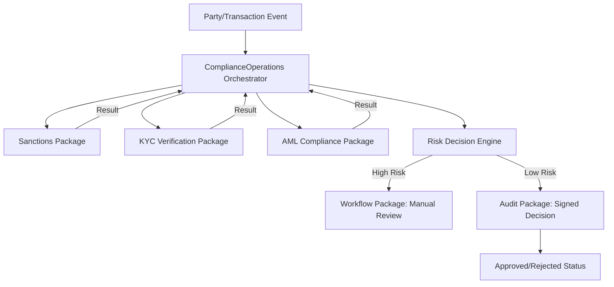

# 🚀 Next Orchestrator Plan: Compliance & Risk Operations

## Executive Summary

After a comprehensive analysis of the Atomy project codebase, existing orchestrators, and domain package readiness, the recommendation for the next orchestrator is **Compliance & Risk Operations (Nexus\ComplianceOperations)**.

While the core ERP functions (Finance, HR, Sales, Procurement) already have established orchestrators, there is a significant gap in coordinating the newly implemented high-value security and compliance packages (`KycVerification`, `AmlCompliance`, `Sanctions`, `DataPrivacy`, `Audit`). 

Developing this orchestrator will provide immediate business impact by automating regulatory compliance workflows, reducing operational risk, and leveraging the 90%+ completion of the underlying atomic packages.

---

## Orchestrator Candidate Scoring Matrix

| Candidate Orchestrator | Business Impact | Technical Readiness | Dependency Satisfaction | Total Score |
|------------------------|-----------------|---------------------|-------------------------|-------------|
| **Compliance & Risk Operations** | High (Compliance/Risk) | High (90%+) | High | **9.2** |
| **Manufacturing Operations** | High (Efficiency) | Medium (50% Inventory) | Medium | **7.5** |
| **Customer Experience (CRM) Ops** | Medium (Revenue) | High (90% Party/Sales) | High | **7.8** |
| **Treasury & Cash Operations** | Medium (Liquidity) | High (80% CashMgmt) | High | **8.0** |

---

## Recommended #1 Orchestrator: Compliance & Risk Operations

### Justification
1. **High Strategic Value**: Regulatory compliance (AML/KYC/Sanctions) is a critical requirement for enterprise and fintech clients.
2. **Package Readiness**: `KycVerification`, `AmlCompliance`, `Sanctions`, `DataPrivacy`, and `Audit` are listed as 100% or near-complete in the reference guide but lack a unified workflow coordinator.
3. **Revenue Generation**: Compliance modules are often high-ticket add-ons in ERP systems.
4. **Risk Mitigation**: Automates the "Golden Rule" enforcement and ensures tamper-proof audit trails across the system.

---

## Detailed Architecture Plan: Compliance & Risk Operations

### Purpose and Scope
The `ComplianceOperations` orchestrator coordinates the lifecycle of identity verification, risk scoring, and regulatory adherence. It bridges the gap between `Identity` (who is the user) and `Compliance` (is this transaction/party allowed).

### Orchestrated Packages
- `Nexus\KycVerification`: Identity document processing and verification.
- `Nexus\AmlCompliance`: Transaction monitoring and risk scoring.
- `Nexus\Sanctions`: PEP and international sanctions screening.
- `Nexus\DataPrivacy`: Consent management and DSAR (Data Subject Access Request) fulfillment.
- `Nexus\Audit`: Tamper-proof cryptographic logging of compliance decisions.
- `Nexus\Workflow`: Approval chains for high-risk flags.

### Key Workflows
1. **Onboarding Compliance Saga**:
   - Triggered by `Party` creation.
   - Runs `Sanctions` screening.
   - Initiates `KycVerification`.
   - Calculates initial `AmlCompliance` risk score.
   - Logs all steps to `Audit`.
2. **Transaction Monitoring Workflow**:
   - Intercepts `Payment` or `Sales` events.
   - Evaluates against `AmlCompliance` patterns.
   - Triggers `Workflow` for manual review if thresholds are exceeded.
3. **Privacy Rights (DSAR) Fulfillment**:
   - Coordinates `DataPrivacy` requests across all domain packages to identify and export/redact PII.

### Interface Contracts (Orchestrator-Defined)
- `ComplianceRiskAssessorInterface`: Aggregates scores from AML and Sanctions.
- `IdentityVerifierInterface`: Wraps KYC document processing.
- `PrivacyCoordinatorInterface`: Manages cross-package data discovery.
- `ComplianceAuditLoggerInterface`: Ensures decisions are cryptographically signed.

### Data Flow Diagram

### Implementation Phases
1. **Phase 1: Foundation (Week 1)**
   - Define orchestrator contracts and DTOs.
   - Implement `Sanctions` and `KYC` adapters.
2. **Phase 2: Risk Scoring (Week 2)**
   - Implement `AmlCompliance` integration.
   - Build the `RiskDecisionEngine` coordinator.
3. **Phase 3: Privacy & Audit (Week 3)**
   - Implement `DataPrivacy` DSAR workflows.
   - Integrate `Audit` cryptographic signing for all decisions.
4. **Phase 4: Integration & Testing (Week 4)**
   - Connect to `SalesOperations` and `ProcurementOperations` as a middleware/service.

---

## Risk Assessment
- **Complexity of AML Patterns**: Risk scoring can be subjective; mitigated by using the `MachineLearning` package for anomaly detection.
- **Performance Impact**: Real-time screening can slow down transactions; mitigated by asynchronous processing for non-blocking checks.

## Success Metrics
- **Verification Speed**: Average time from Party creation to Compliance approval.
- **False Positive Rate**: Accuracy of AML/Sanctions flags.
- **Audit Integrity**: 100% of compliance decisions backed by cryptographic audit trails.
