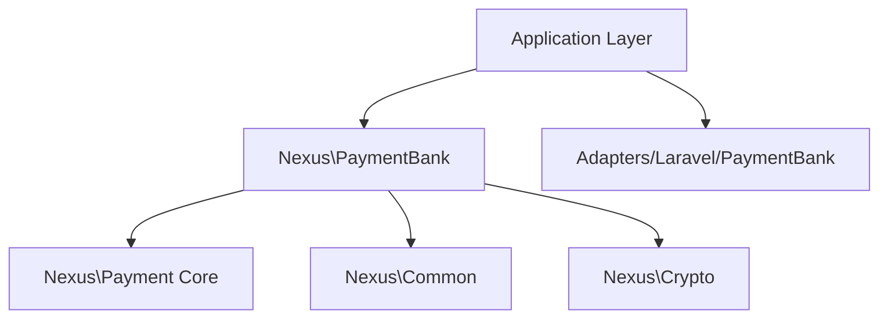

# Nexus\PaymentBank - Bank Connectivity & Open Banking Package

**Version:** 1.0.0  
**Date:** December 26, 2025  
**Status:** Approved Design  
**Type:** Atomic Extension Package  
**Namespace:** `Nexus\PaymentBank`

---

## 1. Executive Summary

`Nexus\PaymentBank` is a **framework-agnostic** PHP package designed to abstract **Bank Connectivity** and **Open Banking** integrations. It serves as the bridge between the Nexus ERP system and external banking networks via aggregators (e.g., Plaid, Yodlee, TrueLayer) or direct Open Banking APIs (PSD2).

### 1.1 Purpose & Scope
This package focuses strictly on **API-based bank interactions**. It is distinct from `Nexus\PaymentRails` (which handles file-based transmissions like NACHA/SWIFT) and `Nexus\PaymentGateway` (which handles card acquiring).

**In Scope:**
- **Account Verification:** Instant Auth (KYC) and Micro-deposits.
- **Data Aggregation:** Real-time balance checks and transaction history fetching.
- **Payment Initiation (PIS):** Pushing payments directly from bank accounts via APIs.
- **Consent Management:** Handling OAuth tokens, consent lifecycles, and re-authentication flows.
- **Institution Discovery:** Listing and searching supported banks.

**Out of Scope:**
- **File Generation:** NACHA/SWIFT files (See `Nexus\PaymentRails`).
- **Card Processing:** Credit/Debit card charges (See `Nexus\PaymentGateway`).
- **Reconciliation Logic:** Matching transactions to ledgers (See `Nexus\CashManagement`).
- **Approval Workflows:** Internal approval of payments (See `Nexus\Workflow`).

### 1.2 Architectural Compliance
- **Atomic:** Focuses solely on bank connectivity domain.
- **Stateless:** Stores no long-term state; delegates persistence to `PaymentBankPersistInterface`.
- **Contract-Driven:** All providers (Plaid, Nordigen, etc.) are implemented behind generic interfaces.
- **Secure:** Enforces encryption for access tokens via `Nexus\Crypto`.

---

## 2. Architecture & Design

### 2.1 Dependency Graph



### 2.2 Core Concepts

#### 2.2.1 The Bank Connection (Linked Account)
Represents a secure link to a user's bank account. It holds the `access_token`, `item_id`, and consent status.
- **Entity:** `BankConnection`
- **Identity:** ULID
- **Security:** Tokens are encrypted at rest using `Nexus\Crypto`.

#### 2.2.2 Verification Strategy
Different methods to verify account ownership:
- **Instant:** Login via provider (e.g., Plaid Link).
- **Micro-Deposit:** Sending small amounts ($0.01) and verifying codes.
- **Document:** Uploading bank statements (metadata only handled here).

#### 2.2.3 Payment Initiation (PIS)
Using Open Banking APIs to initiate a push payment (Credit Transfer) from the user's bank account to a beneficiary, bypassing card networks.

---

## 3. Interfaces & Contracts

### 3.1 Provider Abstraction
The core interface that all adapters (Plaid, TrueLayer, etc.) must implement.

```php
namespace Nexus\PaymentBank\Contracts;

use Nexus\PaymentBank\DTOs\Institution;
use Nexus\PaymentBank\DTOs\ConnectionResult;

interface BankProviderInterface
{
    /**
     * Get the provider identifier (e.g., 'plaid', 'yodlee').
     */
    public function getProviderName(): string;

    /**
     * Exchange a public token (from frontend SDK) for an access token.
     */
    public function exchangeToken(string $publicToken, array $metadata = []): ConnectionResult;

    /**
     * Refresh an expired access token.
     */
    public function refreshToken(string $currentToken): ConnectionResult;
}
```

### 3.2 Data Aggregation
Interfaces for reading data from connected accounts.

```php
namespace Nexus\PaymentBank\Contracts;

use Nexus\Common\ValueObjects\Money;
use Nexus\PaymentBank\DTOs\BankAccountBalance;
use Nexus\PaymentBank\DTOs\BankTransactionList;

interface AccountDataProviderInterface
{
    /**
     * Get real-time balance for a connected account.
     */
    public function getBalance(string $accessToken, string $accountId): BankAccountBalance;

    /**
     * Fetch transactions for a date range.
     */
    public function getTransactions(
        string $accessToken, 
        string $accountId, 
        \DateTimeImmutable $startDate, 
        \DateTimeImmutable $endDate
    ): BankTransactionList;
}
```

### 3.3 Account Verification
Interface for proving ownership.

```php
namespace Nexus\PaymentBank\Contracts;

use Nexus\PaymentBank\Enums\VerificationStatus;

interface AccountVerificationInterface
{
    /**
     * Initiate micro-deposit verification.
     */
    public function initiateMicroDeposits(string $accessToken, string $accountId): string;

    /**
     * Verify micro-deposit amounts.
     */
    public function verifyMicroDeposits(string $verificationId, array $amounts): VerificationStatus;

    /**
     * Get identity data (name, email, phone, address) from the bank for KYC.
     */
    public function getIdentity(string $accessToken, string $accountId): array;
}
```

### 3.4 Payment Initiation (PIS)
Interface for Open Banking payments.

```php
namespace Nexus\PaymentBank\Contracts;

use Nexus\Common\ValueObjects\Money;
use Nexus\PaymentBank\DTOs\PaymentInitiationResult;
use Nexus\PaymentBank\ValueObjects\Beneficiary;

interface PaymentInitiationInterface
{
    /**
     * Create a payment consent/intent.
     */
    public function createPaymentIntent(
        string $accessToken,
        Money $amount,
        Beneficiary $beneficiary,
        string $reference
    ): PaymentInitiationResult;

    /**
     * Get status of an initiated payment.
     */
    public function getPaymentStatus(string $paymentId): string;
}
```

### 3.5 Persistence (CQRS)
The package defines *what* needs saving, the application defines *how*.

```php
namespace Nexus\PaymentBank\Contracts;

use Nexus\PaymentBank\Entities\BankConnectionInterface;

interface BankConnectionPersistInterface
{
    public function save(BankConnectionInterface $connection): void;
    public function delete(string $id): void;
    public function updateStatus(string $id, string $status): void;
}

interface BankConnectionQueryInterface
{
    public function findById(string $id): ?BankConnectionInterface;
    public function findByTenant(string $tenantId): array;
}
```

---

## 4. Data Structures

### 4.1 Enums

```php
namespace Nexus\PaymentBank\Enums;

enum ProviderType: string {
    case PLAID = 'plaid';
    case YODLEE = 'yodlee';
    case TRUELAYER = 'truelayer';
    case NORDIGEN = 'nordigen';
    case GOCARDLESS = 'gocardless';
}

enum VerificationMethod: string {
    case INSTANT = 'instant';
    case MICRO_DEPOSIT = 'micro_deposit';
    case DOCUMENT = 'document';
}

enum ConsentStatus: string {
    case ACTIVE = 'active';
    case EXPIRED = 'expired';
    case REVOKED = 'revoked';
    case PENDING = 'pending';
    case REAUTH_REQUIRED = 'reauth_required';
}

enum AccountType: string {
    case CHECKING = 'checking';
    case SAVINGS = 'savings';
    case CREDIT = 'credit';
    case LOAN = 'loan';
    case INVESTMENT = 'investment';
}
```

### 4.2 Value Objects & DTOs

**`Nexus\PaymentBank\DTOs\BankAccountBalance`**
```php
final readonly class BankAccountBalance
{
    public function __construct(
        public Money $available,
        public Money $current,
        public ?Money $limit = null,
        public string $currencyCode
    ) {}
}
```

**`Nexus\PaymentBank\ValueObjects\Beneficiary`**
```php
final readonly class Beneficiary
{
    public function __construct(
        public string $name,
        public string $iban, // or accountNumber + routingNumber
        public ?string $bic = null,
        public ?string $address = null
    ) {}
}
```

---

## 5. Usage Examples

### 5.1 Linking a Bank Account (Plaid Flow)

```php
use Nexus\PaymentBank\Services\BankConnectionManager;
use Nexus\PaymentBank\DTOs\LinkTokenRequest;

final readonly class BankLinkService
{
    public function __construct(
        private BankConnectionManager $manager,
        private BankConnectionPersistInterface $persist
    ) {}

    // Step 1: Exchange public token from frontend
    public function linkAccount(string $tenantId, string $publicToken, string $provider): void
    {
        // Exchange token via provider (e.g., Plaid)
        $result = $this->manager->connect($provider, $publicToken);

        // Create connection entity
        $connection = new BankConnection(
            id: Ulid::generate(),
            tenantId: $tenantId,
            provider: ProviderType::from($provider),
            accessToken: $result->accessToken, // Encrypted automatically by entity
            itemId: $result->itemId,
            status: ConsentStatus::ACTIVE
        );

        $this->persist->save($connection);
    }
}
```

### 5.2 Verifying Ownership via Micro-Deposits

```php
use Nexus\PaymentBank\Services\VerificationService;

final readonly class AccountVerificationService
{
    public function __construct(
        private VerificationService $verifier
    ) {}

    public function verify(string $connectionId, array $amounts): bool
    {
        $status = $this->verifier->verifyMicroDeposits($connectionId, $amounts);
        
        return $status === VerificationStatus::VERIFIED;
    }
}
```

### 5.3 Initiating a Payment (PIS)

```php
use Nexus\PaymentBank\Services\PaymentInitiationService;
use Nexus\Common\ValueObjects\Money;

final readonly class VendorPaymentService
{
    public function __construct(
        private PaymentInitiationService $pisService
    ) {}

    public function payVendor(string $connectionId, Money $amount, Beneficiary $vendor): string
    {
        // Push payment directly from bank account
        $result = $this->pisService->initiatePayment(
            connectionId: $connectionId,
            amount: $amount,
            beneficiary: $vendor,
            reference: 'INV-2024-001'
        );

        return $result->paymentId; // External ID from bank
    }
}
```

---

## 6. Security & Compliance

### 6.1 Token Encryption
All access tokens and refresh tokens MUST be encrypted at rest.
- The `BankConnection` entity uses `Nexus\Crypto\Contracts\CryptoManagerInterface` to encrypt the `access_token` field in its constructor/setter and decrypt in its getter.
- **NEVER** log access tokens or PII.

### 6.2 PSD2 / SCA
This package supports Strong Customer Authentication (SCA) flows required by PSD2.
- `PaymentInitiationResult` may contain a `redirectUrl` where the user must approve the payment in their banking app.

### 6.3 Data Minimization
- Only fetch data required for the specific business purpose (e.g., balance check).
- Do not store transaction history permanently in this package; pass it to `Nexus\CashManagement` for reconciliation and storage.

---

## 7. Integration Guide

### 7.1 With Nexus\Payment (Core)
`Nexus\PaymentBank` acts as a provider for `PaymentInstrument`.
- When a bank account is linked via `PaymentBank`, it creates a `PaymentInstrument` in `Nexus\Payment` with type `BANK_ACCOUNT` and status `VERIFIED`.

### 7.2 With Nexus\CashManagement
`Nexus\CashManagement` uses `Nexus\PaymentBank` to fetch statement lines.
- `CashManagement` calls `AccountDataProviderInterface::getTransactions()`.
- `CashManagement` performs the reconciliation logic (matching fetched transactions to internal ledger).

---

## 8. Implementation Roadmap

1.  **Phase 1: Core Abstractions**
    - Define all Interfaces and DTOs.
    - Implement `BankConnection` entity with encryption.
    - Create Enums.

2.  **Phase 2: Plaid Adapter (Reference Implementation)**
    - Implement `BankProviderInterface` for Plaid.
    - Implement `AccountVerificationInterface` for Plaid Identity/Auth.

3.  **Phase 3: Data Aggregation Services**
    - Implement `BalanceService` and `TransactionService`.

4.  **Phase 4: Payment Initiation**
    - Implement PIS interfaces.
    - Add support for Open Banking UK/EU standards.

---

## 9. Requirements Traceability

| ID | Requirement | Covered By |
|----|-------------|------------|
| BANK-001 | Connect to external bank accounts | `BankProviderInterface` |
| BANK-002 | Verify account ownership | `AccountVerificationInterface` |
| BANK-003 | Fetch real-time balance | `AccountDataProviderInterface` |
| BANK-004 | Initiate bank-to-bank transfers | `PaymentInitiationInterface` |
| BANK-005 | Encrypt sensitive tokens | `BankConnection` (via Crypto) |
| BANK-006 | Manage consent lifecycle | `ConsentManagerInterface` |

---

**License:** MIT  
**Copyright:** © 2025 Nexus ERP
