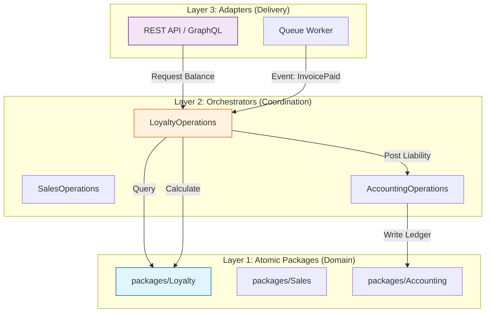

# Architectural Design: Enterprise Loyalty Engagement Engine

**Date:** March 1, 2026
**Status:** Approved for Implementation
**Reference:** `docs/project/research/loyalty-program-erp-capability.md`
**Architect:** Senior Architect Agent (Gemini)

## 1. Executive Summary

### 1.1 Mission Statement
To implement a high-performance, multi-tenant **Loyalty Engagement Engine** within the Atomy (Nexus) ERP. This system will transition loyalty from a simple transactional "add-on" to a core financial and operational capability, integrating deeply with Sales, Accounting (IFRS 15 compliance), and Identity domains. It is designed to be "Headless First" to support omnichannel consumption (Web, Mobile, POS) and extensible for future Web3 tokenization.

### 1.2 Problem Statement
Current ERP capabilities lack a dedicated, centralized engine for managing complex loyalty rules.
*   **Fragmentation**: Reward logic is currently hardcoded or non-existent in Sales modules.
*   **Financial Risk**: Outstanding loyalty points are a financial liability. The current system does not automatically track or age these liabilities in the General Ledger, posing audit risks.
*   **Scalability**: Existing ad-hoc solutions cannot handle high-volume event streams (e.g., "1000 points per minute") or complex multi-tenant isolation requirements.

### 1.3 Enterprise Use Cases
This architecture directly supports the following enterprise operations:
*   **Multi-Brand Conglomerates**: A parent tenant can define a "Coalition Loyalty" program where points earned in Brand A (Retail) can be redeemed in Brand B (Hospitality), with automated cross-charge accounting between business units.
*   **Real-Time Liability Management**: CFOs can view the "Outstanding Loyalty Liability" account in real-time on the Balance Sheet, automated by every point accrual/redemption event.
*   **Omnichannel Consistency**: A customer sees the exact same point balance and tier status on the Mobile App, In-Store POS, and Web Dashboard because all channels query the single source of truth (L1 Package).
*   **Gamified B2B Engagement**: Wholesale distributors can earn tier status based on "On-Time Payments" or "Volume Milestones," incentivizing better B2B behavior beyond just purchasing.

---

## 2. Feasibility Study

### 2.1 Readiness Assessment: **YELLOW (Conditional)**
We are technically ready to implement the core logic, but specific integrations require careful sequencing.

*   **Layer 1 (Core)**: **GREEN**. Pure PHP domain logic is well-understood and easy to scaffold.
*   **Layer 2 (Orchestration)**: **GREEN**. Existing `AccountingOperations` and `SalesOperations` are stable and ready for integration.
*   **Layer 3 (Infrastructure)**: **YELLOW**. High-volume event processing (e.g., "Accrue on Sign-up") requires a robust Event Bus. We must ensure the existing Queue configuration is tuned for priority processing.

### 2.2 Critical Prerequisites
1.  **General Ledger Schema**: The `Accounting` package must support "Deferred Revenue" account types to properly book loyalty liability.
2.  **Identity Service**: `TenantUser` entities must be stable to link Loyalty Profiles.
3.  **Event Bus**: A reliable queue driver (Redis/SQS) is required for asynchronous point accrual to prevent blocking the checkout flow.

### 2.3 Mitigations
*   **Phased Rollout**:
    *   **Phase 1**: Core Accrual/Redemption & GL Integration (Transactional).
    *   **Phase 2**: Tier Management & Expiry Jobs.
    *   **Phase 3**: Gamification & Web3 Adapters.
*   **Performance**: Use "Eventual Consistency" for non-critical updates (e.g., Tier recalculation) to protect the "Checkout" critical path.

---

## 3. Functional Architecture

### 3.1 New Packages (Layer 1 & 2)

| Package / Orchestrator | Layer | Responsibility | Domain Focus |
| :--- | :--- | :--- | :--- |
| **`packages/Loyalty`** | **L1** | **Source of Truth**. Contains pure business rules for Point Calculation, Tier Evaluation, and Expiry Logic. Stateless and immutable. | Core Domain |
| **`orchestrators/LoyaltyOperations`** | **L2** | **Coordination**. Listens for `InvoicePaid` events from Sales, instructs `Loyalty` to calculate points, and instructs `Accounting` to book liability. | Workflow / Integration |

### 3.2 Impact on Existing Packages

| Existing Package | Integration Type | Touch Point Description |
| :--- | :--- | :--- |
| **`packages/Sales`** | Event Source | Publishes `InvoicePaid` event. No direct dependency on Loyalty. |
| **`packages/Accounting`** | Downstream Consumer | Receives commands to post Journal Entries (Debit: Expense, Credit: Liability) for new points. |
| **`packages/Identity`** | Dependency | Provides `UserId` and `TenantId` to link Loyalty Profiles. |
| **`packages/Product`** | Config Source | Products may have metadata (e.g., `loyalty_multiplier`) used by the calculation engine. |

### 3.3 External Communication
*   **Headless API**: The `adapters/Laravel/Loyalty` adapter will expose a REST API.
*   **No 3rd Party Dependency**: Core logic is internal. Optional future Web3 adapter would communicate with Ethereum/Polygon nodes via HTTP.

---

## 4. System Architecture

### 4.1 Component Diagram (Mermaid)

### 4.2 Data Flow: Point Accrual Transaction
1.  **User** completes checkout. `Sales` package finalizes invoice.
2.  **Event** `Sales.InvoicePaid` is fired (L3).
3.  **Listener** triggers `LoyaltyOperations::handleInvoicePaid` (L2).
4.  **Step 4a (Calculation)**: L2 calls `Loyalty\PointCalculationEngine::calculate(amount, rules)`. Returns `100` points.
5.  **Step 4b (Persistence)**: L2 calls `Loyalty\Repository::saveTransaction(+100)`.
6.  **Step 4c (Accounting)**: L2 calculates monetary value ($1.00) and calls `AccountingOperations`.
    *   **GL Entry**: Debit `Marketing Expense` $1.00 / Credit `Loyalty Liability` $1.00.
7.  **Step 4d (Tier Check)**: L2 calls `Loyalty\TierService` to check if User upgrades to Gold.
8.  **Completion**: Transaction committed.

### 4.3 Modularity & Integration
*   **Database**: Shared RDBMS (PostgreSQL/MySQL). `Loyalty` owns `loyalty_*` tables.
*   **Event-Driven**: Strong decoupling. `Sales` does NOT know `Loyalty` exists.
*   **API Design**: JSON:API standard.
    *   `GET /api/v1/loyalty/balance`
    *   `GET /api/v1/loyalty/history`

---

## 5. Non-Functional Design

### 5.1 Testing Plan
*   **Unit Testing (L1)**:
    *   **Coverage Target**: 100% on `PointCalculationEngine`.
    *   **Edge Cases**: Testing multipliers with 0 value, negative invoice amounts (refunds), floating point rounding (must use integer math).
    *   **Framework**: PHPUnit 11+ with Attributes.
*   **Integration Testing (L2)**:
    *   **Focus**: Verifying the "Handshake" between Loyalty and Accounting. Ensure GL entries balance.
    *   **Mocking**: Mock the Database, test the orchestration logic.
*   **End-to-End (L3)**:
    *   **Scenario**: "User buys item -> Invoice Paid -> Points appear in profile -> GL updated."

### 5.2 Performance & Scalability
*   **Complexity**: Point calculation is `O(1)` (simple math). Tier evaluation is `O(n)` where n = number of rules (usually small, <20).
*   **Database Indexing**:
    *   Composite Index on `loyalty_transactions(tenant_id, user_id, created_at)` for fast history retrieval.
    *   Index on `loyalty_balances(tenant_id, user_id)` for instant balance checks.
*   **Caching**: Cache `TierConfig` rules in Redis (per tenant) to avoid DB reads on every calculation.

### 5.3 Security
*   **Tenant Isolation**: **MANDATORY**. All Repositories must apply `where('tenant_id', $context->getTenantId())`.
*   **Fraud Prevention**:
    *   Rate limiting on "Earn" endpoints (if exposed publicly).
    *   Idempotency keys required for all Point Transactions to prevent double-accrual.
*   **PII**: Loyalty Profile linked to `User` via UUID. No PII stored directly in `loyalty_transactions`.

### 5.4 Risk Management
| Risk | Probability | Mitigation |
| :--- | :--- | :--- |
| **Double Spending** | Low | Database unique constraints on `transaction_ref_id` + `tenant_id`. |
| **Liability Bloat** | Medium | Implement automated "Point Expiry" jobs (L3 Scheduler) to write off unused points after X months. |
| **Performance Impact** | Medium | Process Accruals asynchronously via Queues. Balance checks remain synchronous (fast). |

### 5.5 Error Handling
*   **Domain Exceptions**: `InsufficientPointsException`, `LoyaltyProgramDisabledException`.
*   **Resiliency**: If `Accounting` fails to book liability, the `Loyalty` transaction must roll back (Database Transaction) OR be queued for retry (Saga Pattern). *Decision: Database Transaction for Phase 1 (simplicity).*

---
*This document serves as the absolute technical reference for the implementation of the Loyalty Program.*
