# Screen & Functional Specification

**Application:** AtomyQ  
**Version:** 1.0  
**Last Updated:** 2026-03-07  
**Stack:** React + Vite + Supabase (planned frontend) / Symfony API (backend source of truth)  
**Design Direction:** Operational Intelligence Console — professional, data-dense, glanceable, desktop-first (1440px+)  
**Modal Pattern:** All modals are slide-over panels from the right side of the screen, overlaying the current content with smart width (min 25%–30%, scaled to content)

---

## Table of Contents

- [Global Layout Shell](#global-layout-shell)
- [Screen Index](#screen-index)
- [SCR-001: Sign In](#scr-001-sign-in)
- [SCR-002: Dashboard](#scr-002-dashboard)
- [SCR-003: Quote Comparison — New Run](#scr-003-quote-comparison--new-run)
- [SCR-004: Quote Comparison — Results](#scr-004-quote-comparison--results)
- [SCR-005: Approval Queue](#scr-005-approval-queue)
- [SCR-006: Approval Detail](#scr-006-approval-detail)
- [SCR-007: Decision Trail](#scr-007-decision-trail)
- [SCR-008: User Management](#scr-008-user-management)
- [SCR-009: Settings Management](#scr-009-settings-management)
- [SCR-010: Feature Flags](#scr-010-feature-flags)
- [SCR-011: Fiscal Periods](#scr-011-fiscal-periods)
- [SCR-012: Module Registry](#scr-012-module-registry)
- [SCR-013: Tenant Management (Super Admin)](#scr-013-tenant-management-super-admin)
- [SCR-014: Tenant Detail (Super Admin)](#scr-014-tenant-detail-super-admin)
- [MOD-001: Approve / Reject Quote](#mod-001-approve--reject-quote)
- [MOD-002: Create Tenant](#mod-002-create-tenant)
- [MOD-003: Suspend Tenant Confirmation](#mod-003-suspend-tenant-confirmation)
- [MOD-004: Activate Tenant Confirmation](#mod-004-activate-tenant-confirmation)
- [MOD-005: Archive Tenant Confirmation](#mod-005-archive-tenant-confirmation)
- [MOD-006: Delete Tenant Confirmation](#mod-006-delete-tenant-confirmation)
- [MOD-007: Impersonate Tenant](#mod-007-impersonate-tenant)
- [MOD-008: Stop Impersonation Confirmation](#mod-008-stop-impersonation-confirmation)
- [MOD-009: Suspend User Confirmation](#mod-009-suspend-user-confirmation)
- [MOD-010: Activate User Confirmation](#mod-010-activate-user-confirmation)
- [MOD-011: Edit Setting](#mod-011-edit-setting)
- [MOD-012: Bulk Update Settings](#mod-012-bulk-update-settings)
- [MOD-013: Edit Feature Flag](#mod-013-edit-feature-flag)
- [MOD-014: Open Fiscal Period Confirmation](#mod-014-open-fiscal-period-confirmation)
- [MOD-015: Close Fiscal Period Confirmation](#mod-015-close-fiscal-period-confirmation)
- [MOD-016: Session Expired / Re-authenticate](#mod-016-session-expired--re-authenticate)
- [API Gap Analysis](#api-gap-analysis)
- [Global Navigation Flow Diagram](#global-navigation-flow-diagram)
- [Entity State Machine Diagrams](#entity-state-machine-diagrams)

---

## Global Layout Shell

### Sidebar Navigation

| Group | Item | Route | Icon | Roles |
|-------|------|-------|------|-------|
| Core | Dashboard | `/` | `LayoutDashboard` | All |
| Procurement | Quote Comparison | `/quotes/compare` | `GitCompare` | All |
| Procurement | Approval Queue | `/approvals` | `ClipboardCheck` | All |
| Governance | Decision Trail | `/decision-trail` | `ShieldCheck` | All |
| Administration | Users & Access | `/users` | `Users` | ROLE_TENANT_ADMIN, ROLE_ADMIN |
| Administration | Settings | `/settings` | `Settings` | ROLE_TENANT_ADMIN, ROLE_ADMIN |
| Administration | Feature Flags | `/feature-flags` | `Flag` | ROLE_TENANT_ADMIN, ROLE_ADMIN |
| Administration | Fiscal Periods | `/fiscal-periods` | `Calendar` | ROLE_TENANT_ADMIN, ROLE_ADMIN |
| Administration | Modules | `/modules` | `Package` | ROLE_TENANT_ADMIN |
| Super Admin | Tenants | `/tenants` | `Building2` | ROLE_SUPER_ADMIN |

### Header

- Breadcrumb trail (dynamic per screen)
- Quick action buttons: **New Comparison**, **Approval Queue**
- Notification bell (placeholder — see API Gaps)
- AI Agent Assistant trigger button (placeholder — see API Gaps)
- User menu (avatar dropdown): Profile name, email, role badge, Sign Out

### Footer

- Build version tag
- Environment badge (Production / Staging)
- API docs link
- Legal links: Privacy, Terms

### Impersonation Banner

When a Super Admin is impersonating a tenant, a persistent top banner is displayed above the header:

| Element | Description |
|---------|-------------|
| Banner Background | Warning amber / yellow |
| Text | "You are impersonating tenant: {tenantName}" |
| Stop Button | "End Impersonation" — triggers MOD-008 |

---

## Screen Index

| ID | Screen Name | Type | Route |
|----|-------------|------|-------|
| SCR-001 | Sign In | Full Page (no shell) | `/auth/login` |
| SCR-002 | Dashboard | Full Page | `/` |
| SCR-003 | Quote Comparison — New Run | Full Page | `/quotes/compare` |
| SCR-004 | Quote Comparison — Results | Full Page | `/quotes/compare/{runId}` |
| SCR-005 | Approval Queue | Full Page | `/approvals` |
| SCR-006 | Approval Detail | Full Page | `/approvals/{runId}` |
| SCR-007 | Decision Trail | Full Page | `/decision-trail` |
| SCR-008 | User Management | Full Page | `/users` |
| SCR-009 | Settings Management | Full Page | `/settings` |
| SCR-010 | Feature Flags | Full Page | `/feature-flags` |
| SCR-011 | Fiscal Periods | Full Page | `/fiscal-periods` |
| SCR-012 | Module Registry | Full Page | `/modules` |
| SCR-013 | Tenant Management | Full Page | `/tenants` |
| SCR-014 | Tenant Detail | Full Page | `/tenants/{id}` |
| MOD-001 | Approve / Reject Quote | Slide-over Modal (40%) | — |
| MOD-002 | Create Tenant | Slide-over Modal (45%) | — |
| MOD-003 | Suspend Tenant Confirmation | Slide-over Modal (30%) | — |
| MOD-004 | Activate Tenant Confirmation | Slide-over Modal (30%) | — |
| MOD-005 | Archive Tenant Confirmation | Slide-over Modal (30%) | — |
| MOD-006 | Delete Tenant Confirmation | Slide-over Modal (30%) | — |
| MOD-007 | Impersonate Tenant | Slide-over Modal (30%) | — |
| MOD-008 | Stop Impersonation Confirmation | Slide-over Modal (25%) | — |
| MOD-009 | Suspend User Confirmation | Slide-over Modal (30%) | — |
| MOD-010 | Activate User Confirmation | Slide-over Modal (30%) | — |
| MOD-011 | Edit Setting | Slide-over Modal (35%) | — |
| MOD-012 | Bulk Update Settings | Slide-over Modal (50%) | — |
| MOD-013 | Edit Feature Flag | Slide-over Modal (40%) | — |
| MOD-014 | Open Fiscal Period Confirmation | Slide-over Modal (25%) | — |
| MOD-015 | Close Fiscal Period Confirmation | Slide-over Modal (25%) | — |
| MOD-016 | Session Expired / Re-authenticate | Centered Modal Overlay | — |

---

## SCR-001: Sign In

### 1. Screen Overview

| Field | Value |
|-------|-------|
| Screen Name | Sign In |
| Purpose | Authenticate users with email/password credentials and establish a JWT session |
| Core Functions | Login, token acquisition, error feedback, session initialization |
| Screen Type | Full Page (no application shell — standalone centered layout) |
| Layout Structure | Split-screen: left brand panel (60%), right auth form (40%) |
| Active Navigation Item | None |
| Breadcrumb Structure | None |
| Entry Points | Direct URL `/auth/login`, redirect from any protected route when unauthenticated, token expiration redirect |
| Exit Points | Successful login → SCR-002 Dashboard |
| Data Dependencies | None |
| User Roles Allowed | Public (unauthenticated) |
| Screen Permission Requirements | None |

### 2. UI Layout Structure

```
┌─────────────────────────────────────────────────────┐
│  ┌───────────────────────┬─────────────────────────┐ │
│  │                       │                         │ │
│  │   Brand Panel         │    Auth Form Panel      │ │
│  │                       │                         │ │
│  │   - Logo              │    - AtomyQ wordmark    │ │
│  │   - Tagline           │    - Email input        │ │
│  │   - Feature visual    │    - Password input     │ │
│  │                       │    - Sign In button     │ │
│  │                       │    - Error message area  │ │
│  │                       │    - Footer links       │ │
│  │                       │                         │ │
│  └───────────────────────┴─────────────────────────┘ │
└─────────────────────────────────────────────────────┘
```

### 3. UI Elements

| Element Name | Element Type | Description | Default State | Visibility Condition | Permission Requirement |
|-------------|-------------|-------------|---------------|---------------------|----------------------|
| Brand Logo | Image | AtomyQ logo in the brand panel | Visible | Always | None |
| Brand Tagline | Text | "Procurement Intelligence, Automated." | Visible | Always | None |
| Email Input | Form Field (text/email) | User email address input | Empty, focused | Always | None |
| Password Input | Form Field (password) | User password input with show/hide toggle | Empty | Always | None |
| Password Visibility Toggle | Icon Button | Toggles password field between masked and plain text | Masked (eye-off icon) | Always | None |
| Sign In Button | Button (primary) | Submits login credentials | Enabled | Always | None |
| Error Alert | Alert Banner | Displays authentication error messages | Hidden | Shown on login failure | None |
| Forgot Password Link | Link | Placeholder link for password reset | Visible (disabled) | Always | None |
| Privacy Policy Link | Link | Opens privacy policy | Visible | Always | None |
| Terms of Service Link | Link | Opens terms of service | Visible | Always | None |

### 4. Interaction Behavior

#### Action: Submit Login Credentials

| Field | Value |
|-------|-------|
| Action Name | Submit Login |
| Trigger Element | Sign In Button (click) or Enter key in password field |
| Preconditions | Email and password fields are non-empty |
| Validation Rules | Email: required, valid email format. Password: required, min 1 character |
| System Process | 1. Client-side validation of required fields. 2. Show loading spinner on Sign In button, disable all inputs. 3. Send `POST /auth/login` with `{ "email", "password" }`. 4. On 200: store `accessToken`, `refreshToken`, `sessionId`, `userId`, `tenantId`, `roles` in client state (memory + secure storage). 5. Redirect to Dashboard. 6. On 401: display error message from response. 7. On 400: display "Missing credentials" error. |
| API Endpoint Used | `POST /auth/login` |
| Result | Session established or error displayed |
| Next Navigation | Success → SCR-002 Dashboard. Failure → stay on SCR-001 |

#### Action: Toggle Password Visibility

| Field | Value |
|-------|-------|
| Action Name | Toggle Password Visibility |
| Trigger Element | Password Visibility Toggle icon |
| Preconditions | None |
| Validation Rules | None |
| System Process | Toggle input type between `password` and `text`. Toggle icon between eye and eye-off. |
| API Endpoint Used | None |
| Result | Password characters shown/hidden |
| Next Navigation | None |

### 5. Conditional UI / UX Behavior

| Condition | Behavior |
|-----------|----------|
| Login request in flight | Sign In button shows spinner, all inputs disabled, button text changes to "Signing in…" |
| API returns 401 with "Account is locked" | Error banner shows "Your account has been locked. Contact your administrator." |
| API returns 401 with "Account is suspended" | Error banner shows "Your account has been suspended." |
| API returns 401 with generic message | Error banner shows the API-provided message |
| API returns 400 | Error banner shows "Please enter your email and password." |
| Network error / timeout | Error banner shows "Unable to connect to server. Please try again." |
| Redirect from protected route | Show info banner above form: "Your session has expired. Please sign in again." |

### 6. API Endpoint Mapping

| Endpoint | HTTP Method | Purpose | Triggered By | Request Payload | Success Response Behavior | Error Response Behavior |
|----------|-------------|---------|-------------|-----------------|--------------------------|------------------------|
| `/auth/login` | POST | Authenticate user | Sign In Button | `{ "email": string, "password": string }` | Store tokens, redirect to Dashboard | Display error message from response body |

### 7. Navigation Rules

| Action | Destination Screen | Navigation Type |
|--------|-------------------|-----------------|
| Successful login | SCR-002 Dashboard | `router.replace('/')` |
| Failed login | SCR-001 Sign In (stay) | None |
| Forgot Password click | No-op (API GAP) | — |

### 8. Error Handling

| Scenario | API Response | UI Behavior |
|----------|-------------|-------------|
| Invalid credentials | 401 `{ "message": "Invalid credentials" }` | Red error banner: "Invalid email or password." |
| Account locked | 401 `{ "message": "Account is locked" }` | Red error banner with lock icon |
| Account suspended | 401 `{ "message": "..." }` | Red error banner with suspend notice |
| Missing fields (client) | N/A (prevented) | Inline validation markers on empty fields |
| Missing fields (server) | 400 `{ "message": "Missing credentials" }` | Red error banner |
| Network failure | Connection error | Red error banner: "Unable to reach the server." |
| Server error | 500 | Red error banner: "Something went wrong. Please try again later." |

### 9. Screen State Management

| State | Description | Visual Indicator |
|-------|-------------|------------------|
| Idle | Form is ready for input | Default form appearance, Sign In enabled |
| Submitting | Login request in flight | Button spinner, disabled inputs |
| Error | Login failed | Error banner visible, form re-enabled |
| Redirecting | Login successful, navigating | Brief success state, spinner overlay |

### 10. State Transition Table

| Current State | Action | Next State |
|---------------|--------|------------|
| Idle | Click Sign In (valid) | Submitting |
| Submitting | API 200 | Redirecting |
| Submitting | API 401/400/500 | Error |
| Submitting | Network failure | Error |
| Error | Modify any input | Idle (clear error) |
| Error | Click Sign In (valid) | Submitting |

### 11. System Events / Audit Events

| Event | Trigger |
|-------|---------|
| UserAuthenticated | Successful POST /auth/login |
| AuthenticationFailed | Failed POST /auth/login (401) |

### 12. Diagrams

#### Interaction Flow

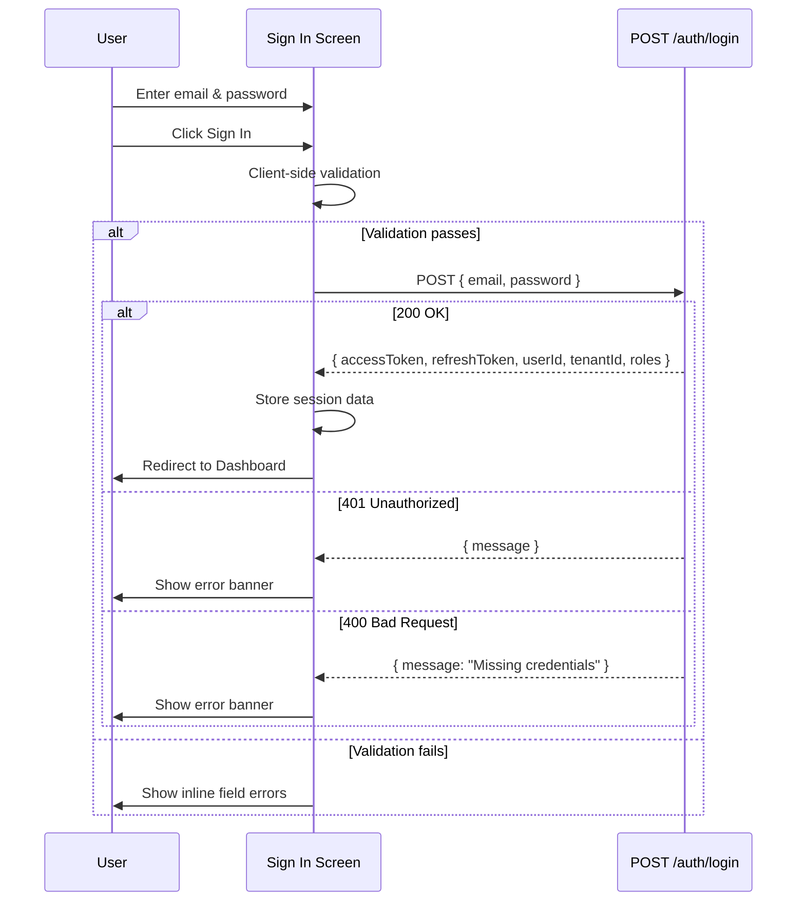

---

## SCR-002: Dashboard

### 1. Screen Overview

| Field | Value |
|-------|-------|
| Screen Name | Dashboard |
| Purpose | Role-aware overview of workload, pending actions, recent comparison runs, and system health indicators |
| Core Functions | Display KPI summaries, pending approval count, recent activity, quick navigation to key workflows |
| Screen Type | Full Page |
| Layout Structure | Header → Sidebar → Content (KPI cards row, activity panels grid) |
| Active Navigation Item | Dashboard |
| Breadcrumb Structure | Home |
| Entry Points | Successful login, sidebar "Dashboard" click, logo click |
| Exit Points | Navigate to any sidebar item or quick action |
| Data Dependencies | `GET /api/users` (user count), `GET /api/settings` (tenant config), `GET /api/fiscal-periods` (current period), `GET /api/feature-flags` (active flags count), `GET /api/modules` (installed modules) |
| User Roles Allowed | ROLE_USER, ROLE_ADMIN, ROLE_TENANT_ADMIN, ROLE_SUPER_ADMIN |
| Screen Permission Requirements | Authenticated (valid JWT) |

### 2. UI Layout Structure

```
┌─────────────────────────────────────────────────────────┐
│ Header (breadcrumb, quick actions, user menu)           │
├──────────┬──────────────────────────────────────────────┤
│          │  Page Title: "Dashboard"                     │
│          │  ┌──────┬──────┬──────┬──────┐              │
│ Sidebar  │  │ KPI  │ KPI  │ KPI  │ KPI  │  KPI Row    │
│          │  └──────┴──────┴──────┴──────┘              │
│          │  ┌───────────────────┬────────────────────┐  │
│          │  │ Recent Comparison │ Pending Approvals  │  │
│          │  │ Runs Panel        │ Quick List         │  │
│          │  │                   │                    │  │
│          │  ├───────────────────┼────────────────────┤  │
│          │  │ System Status     │ Quick Actions      │  │
│          │  │ Panel             │ Panel              │  │
│          │  └───────────────────┴────────────────────┘  │
└──────────┴──────────────────────────────────────────────┘
```

### 3. UI Elements

| Element Name | Element Type | Description | Default State | Visibility Condition | Permission Requirement |
|-------------|-------------|-------------|---------------|---------------------|----------------------|
| KPI: Active Users | Card | Shows count of active users in tenant | Loaded from API | Always | Authenticated |
| KPI: Pending Approvals | Card | Count of quote runs with `pending_approval` status | Loaded from API | Always | Authenticated |
| KPI: Current Fiscal Period | Card | Name and status of the current fiscal period | Loaded from API | Always | Authenticated |
| KPI: Installed Modules | Card | Count of installed modules | Loaded from API | Always | Authenticated |
| Recent Comparisons Panel | Table/List | Last 5 comparison runs with status badges | Loaded from API | Always | Authenticated |
| Pending Approvals List | Table/List | Items requiring approval action, sorted by created date | Loaded from API | Always | Authenticated |
| System Status Panel | Info Panel | Feature flags summary, settings health | Loaded from API | Always | ROLE_TENANT_ADMIN, ROLE_ADMIN |
| Quick Actions Panel | Button Group | Shortcuts: New Comparison, View Approvals, Manage Users | Visible | Always | Authenticated |
| New Comparison Button | Button (primary) | Navigate to SCR-003 | Enabled | Always | Authenticated |
| View All Approvals Link | Link | Navigate to SCR-005 | Enabled | Always | Authenticated |

### 4. Interaction Behavior

#### Action: Navigate to New Comparison

| Field | Value |
|-------|-------|
| Action Name | Start New Comparison |
| Trigger Element | New Comparison Button or Quick Action card |
| Preconditions | Authenticated |
| Validation Rules | None |
| System Process | Navigate to `/quotes/compare` |
| API Endpoint Used | None |
| Result | SCR-003 displayed |
| Next Navigation | SCR-003 |

#### Action: Navigate to Approval Detail

| Field | Value |
|-------|-------|
| Action Name | Open Approval Item |
| Trigger Element | Click on a row in Pending Approvals List |
| Preconditions | Authenticated, item exists |
| Validation Rules | None |
| System Process | Navigate to `/approvals/{runId}` |
| API Endpoint Used | None |
| Result | SCR-006 displayed |
| Next Navigation | SCR-006 |

### 5. Conditional UI / UX Behavior

| Condition | Behavior |
|-----------|----------|
| User role is ROLE_SUPER_ADMIN | Show additional KPI card: "Total Tenants" (from `GET /api/tenants`) |
| User role is ROLE_USER (non-admin) | Hide System Status Panel |
| No pending approvals exist | Pending Approvals panel shows empty state: "No pending approvals" with illustration |
| Current fiscal period is closed | KPI card shows warning badge: "Period Closed" |
| Feature flag `system.maintenance` is enabled | Show maintenance banner below KPI row |

### 6. API Endpoint Mapping

| Endpoint | HTTP Method | Purpose | Triggered By | Request Payload | Success Response Behavior | Error Response Behavior |
|----------|-------------|---------|-------------|-----------------|--------------------------|------------------------|
| `/api/users` | GET | Fetch user count for KPI | Page load | None | Display active user count | Show "—" placeholder |
| `/api/fiscal-periods` | GET | Fetch current period | Page load | None | Display current period name and status | Show "—" placeholder |
| `/api/feature-flags` | GET | Fetch flags summary | Page load | None | Display active flags count | Show "—" placeholder |
| `/api/modules` | GET | Fetch installed module count | Page load | None | Display module count | Show "—" placeholder |
| `/api/tenants` | GET | Fetch tenant count (Super Admin) | Page load | None | Display tenant count | Show "—" placeholder |

### 7. Navigation Rules

| Action | Destination Screen | Navigation Type |
|--------|-------------------|-----------------|
| Click "New Comparison" | SCR-003 | `router.push` |
| Click pending approval row | SCR-006 | `router.push` |
| Click "View All Approvals" | SCR-005 | `router.push` |
| Click "Manage Users" quick action | SCR-008 | `router.push` |

### 8. Error Handling

| Scenario | API Response | UI Behavior |
|----------|-------------|-------------|
| Any KPI endpoint fails | 4xx/5xx | Show "—" in the affected KPI card with a retry icon button |
| Token expired during load | 401 | Redirect to SCR-001 or open MOD-016 |
| Network failure | Connection error | Show error banner: "Unable to load dashboard data. Check your connection." with retry button |

### 9. Screen State Management

| State | Description | Visual Indicator |
|-------|-------------|------------------|
| Loading | Initial data fetch in progress | Skeleton loaders on all KPI cards and panels |
| Loaded | All data fetched successfully | Full KPI values and populated panels |
| Partial Error | Some endpoints failed | Failed cards show "—" with retry icons |
| Error | All endpoints failed | Full-page error state with retry button |
| Empty | Tenant has no data yet (new tenant) | Welcome message with onboarding prompts |

### 10. State Transition Table

| Current State | Action | Next State |
|---------------|--------|------------|
| Loading | All APIs succeed | Loaded |
| Loading | Some APIs fail | Partial Error |
| Loading | All APIs fail | Error |
| Error | Click Retry | Loading |
| Partial Error | Click retry on card | Loading (for that card) |

### 11. System Events / Audit Events

| Event | Trigger |
|-------|---------|
| DashboardViewed | Page load complete |

### 12. Diagrams

#### Navigation Flow

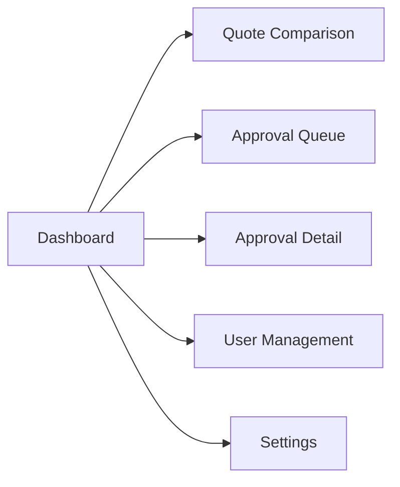

---

## SCR-003: Quote Comparison — New Run

### 1. Screen Overview

| Field | Value |
|-------|-------|
| Screen Name | Quote Comparison — New Run |
| Purpose | Submit vendor quote data for AI-powered comparison, risk assessment, scoring, and approval gate evaluation |
| Core Functions | Configure RFQ ID, add vendors with line items, optional risk overrides, submit for comparison, view results |
| Screen Type | Full Page |
| Layout Structure | Header → Sidebar → Content (Form with dynamic vendor sections) |
| Active Navigation Item | Quote Comparison |
| Breadcrumb Structure | Home > Quote Comparison > New Run |
| Entry Points | Sidebar "Quote Comparison" click, Dashboard "New Comparison" button |
| Exit Points | Successful submission → SCR-004 Results, Cancel → SCR-002 Dashboard |
| Data Dependencies | Authenticated session with `tenantId` |
| User Roles Allowed | ROLE_USER, ROLE_ADMIN, ROLE_TENANT_ADMIN |
| Screen Permission Requirements | Authenticated JWT with tenant context |

### 2. UI Layout Structure

```
┌─────────────────────────────────────────────────────────┐
│ Header (breadcrumb: Home > Quote Comparison > New Run)  │
├──────────┬──────────────────────────────────────────────┤
│          │  Page Title: "New Quote Comparison"           │
│          │  ┌──────────────────────────────────────────┐ │
│          │  │ RFQ Configuration Section                │ │
│          │  │  - RFQ ID input                          │ │
│ Sidebar  │  │  - Idempotency Key input (optional)     │ │
│          │  └──────────────────────────────────────────┘ │
│          │  ┌──────────────────────────────────────────┐ │
│          │  │ Vendor Section (repeatable)              │ │
│          │  │  - Vendor ID input                       │ │
│          │  │  - Line Items table (editable)           │ │
│          │  │  - Risk Overrides (collapsible)          │ │
│          │  │  - Remove Vendor button                  │ │
│          │  └──────────────────────────────────────────┘ │
│          │  [+ Add Vendor] button                        │
│          │  ┌──────────────────────────────────────────┐ │
│          │  │ Sticky Action Bar                        │ │
│          │  │  [Cancel]  [Run Comparison]              │ │
│          │  └──────────────────────────────────────────┘ │
└──────────┴──────────────────────────────────────────────┘
```

### 3. UI Elements

| Element Name | Element Type | Description | Default State | Visibility Condition | Permission Requirement |
|-------------|-------------|-------------|---------------|---------------------|----------------------|
| RFQ ID Input | Form Field (text) | Unique identifier for the Request for Quotation | Empty, required | Always | Authenticated |
| Idempotency Key Input | Form Field (text) | Optional key to prevent duplicate submissions (max 128 chars) | Empty | Always | Authenticated |
| Vendor Section | Dynamic Section | Repeatable container for each vendor's data | One vendor section shown | Always (min 1) | Authenticated |
| Vendor ID Input | Form Field (text) | Unique vendor identifier within each vendor section | Empty, required | Per vendor section | Authenticated |
| Line Items Table | Editable Table | Table of quote line items for the vendor | Empty, min 1 row | Per vendor section | Authenticated |
| Line: RFQ Line ID | Form Field (text) | Line item identifier | Empty, required | Per line row | Authenticated |
| Line: Vendor Description | Form Field (text) | Vendor's description of the item | Empty, required | Per line row | Authenticated |
| Line: Taxonomy Code | Form Field (text) | Classification code | Empty | Per line row | Authenticated |
| Line: Quoted Quantity | Form Field (number) | Vendor quoted quantity | 0.00 | Per line row | Authenticated |
| Line: Quoted Unit | Form Field (text) | Unit of measure | Empty | Per line row | Authenticated |
| Line: Normalized Quantity | Form Field (number) | Normalized quantity for comparison | 0.00 | Per line row | Authenticated |
| Line: Quoted Unit Price | Form Field (number) | Vendor's unit price | 0.00, required | Per line row | Authenticated |
| Line: Normalized Unit Price | Form Field (number) | Normalized unit price | 0.00 | Per line row | Authenticated |
| Line: AI Confidence | Form Field (number) | AI confidence score (0–100) | 0.00 | Per line row | Authenticated |
| Add Line Row Button | Button (secondary) | Adds a new empty row to the line items table | Enabled | Per vendor section | Authenticated |
| Remove Line Row Button | Icon Button (destructive) | Removes a line item row | Enabled | When more than 1 line exists | Authenticated |
| Risk Overrides Section | Collapsible Section | Optional manual risk override entries for this vendor | Collapsed | Per vendor section | Authenticated |
| Risk Override Entry | Key-Value Fields | Risk category and level override | Empty | When section expanded | Authenticated |
| Add Vendor Button | Button (secondary) | Adds a new vendor section to the form | Enabled | Always | Authenticated |
| Remove Vendor Button | Icon Button (destructive) | Removes a vendor section | Enabled | When more than 1 vendor exists | Authenticated |
| Cancel Button | Button (ghost) | Returns to previous screen without submitting | Enabled | Always | Authenticated |
| Run Comparison Button | Button (primary) | Validates and submits comparison request | Enabled when form is valid | Always | Authenticated |

### 4. Interaction Behavior

#### Action: Add Vendor

| Field | Value |
|-------|-------|
| Action Name | Add Vendor Section |
| Trigger Element | Add Vendor Button |
| Preconditions | None |
| Validation Rules | None |
| System Process | Append a new empty vendor section to the form with one empty line row |
| API Endpoint Used | None |
| Result | New vendor section appears with smooth scroll to it |
| Next Navigation | None (stay on screen) |

#### Action: Remove Vendor

| Field | Value |
|-------|-------|
| Action Name | Remove Vendor Section |
| Trigger Element | Remove Vendor Button on a specific vendor section |
| Preconditions | At least 2 vendors exist |
| Validation Rules | Cannot remove if only 1 vendor remains |
| System Process | Remove the vendor section from the form DOM, re-index vendor numbers |
| API Endpoint Used | None |
| Result | Vendor section removed |
| Next Navigation | None |

#### Action: Submit Comparison

| Field | Value |
|-------|-------|
| Action Name | Run Comparison |
| Trigger Element | Run Comparison Button |
| Preconditions | RFQ ID is non-empty, at least 1 vendor with at least 1 line item, all required fields populated |
| Validation Rules | `rfq_id`: required, non-empty string. Per vendor: `vendor_id` required, non-empty. Per line: `rfq_line_id` required. `quoted_unit_price` required, > 0. Idempotency key: max 128 chars if provided. |
| System Process | 1. Client-side validation. 2. Show full-page loading overlay with progress message "Running AI comparison…". 3. Build request payload matching API schema. 4. Send `POST /api/{tenantId}/quotes/compare` with `Idempotency-Key` header if provided. 5. On 201/200: Navigate to SCR-004 with response data. 6. On 400: Display validation errors inline. 7. On 409: Display conflict error toast. |
| API Endpoint Used | `POST /api/{tenantId}/quotes/compare` |
| Result | Comparison run created, results available |
| Next Navigation | Success → SCR-004 Quote Comparison Results |

### 5. Conditional UI / UX Behavior

| Condition | Behavior |
|-----------|----------|
| Only 1 vendor section exists | Remove Vendor button is hidden |
| Only 1 line row in a vendor | Remove Line Row button is hidden for that line |
| Idempotency Key is provided | Show info tooltip: "If a comparison with this key already exists for this RFQ, the cached result will be returned." |
| API returns 200 (idempotent replay) | Show info banner on results: "These results were retrieved from a previous run (idempotent replay)." |
| API returns 409 (duplicate key conflict) | Show error toast: "A comparison with this idempotency key already exists and could not be retrieved." |
| AI Confidence field < 70 on any line | Show warning indicator on that line row: amber dot |
| Form has unsaved data and user clicks Cancel | Show confirmation dialog: "Discard comparison data?" |

### 6. API Endpoint Mapping

| Endpoint | HTTP Method | Purpose | Triggered By | Request Payload | Success Response Behavior | Error Response Behavior |
|----------|-------------|---------|-------------|-----------------|--------------------------|------------------------|
| `/api/{tenantId}/quotes/compare` | POST | Execute quote comparison | Run Comparison Button | `{ "rfq_id": string, "vendors": [{ "vendor_id": string, "lines": [{ "rfq_line_id", "vendor_description", "taxonomy_code", "quoted_quantity", "quoted_unit", "normalized_quantity", "quoted_unit_price", "normalized_unit_price", "ai_confidence" }], "risks"?: array }] }` Headers: `Idempotency-Key: string` (optional) | Navigate to results screen with response payload | Display error message from response, re-enable form |

### 7. Navigation Rules

| Action | Destination Screen | Navigation Type |
|--------|-------------------|-----------------|
| Run Comparison (success) | SCR-004 Results | `router.push('/quotes/compare/{runId}')` with state |
| Cancel | SCR-002 Dashboard | `router.back()` or `router.push('/')` |

### 8. Error Handling

| Scenario | API Response | UI Behavior |
|----------|-------------|-------------|
| Missing vendors | 400 `{ "error": "vendors payload is required." }` | Inline error on vendors section |
| Invalid vendor structure | 400 `{ "error": "vendors[N] must be an object." }` | Highlight affected vendor section |
| Missing vendor_id | 400 `{ "error": "vendors[N].vendor_id is required." }` | Inline error on vendor ID field |
| Missing lines | 400 `{ "error": "vendors[N].lines must be an array..." }` | Inline error on line items section |
| Cross-tenant access | 403 `{ "error": "Forbidden: Cross-tenant access..." }` | Error toast, redirect to Dashboard |
| Tenant not found | 404 `{ "error": "Tenant not found" }` | Error toast, redirect to Dashboard |
| Duplicate idempotency key | 409 `{ "error": "Conflict..." }` | Error toast with conflict message |
| Authentication expired | 401 `{ "error": "Authentication required" }` | Open MOD-016 |
| Server error | 500 | Error toast: "Comparison failed. Please try again." |

### 9. Screen State Management

| State | Description | Visual Indicator |
|-------|-------------|------------------|
| Idle | Form ready for input | Default form with one vendor section |
| Editing | User is modifying form data | Unsaved indicator in header |
| Validating | Client-side validation in progress | Field-level validation markers appearing |
| Submitting | API request in flight | Full-page overlay: "Running AI comparison…" with animated progress |
| Error | Submission failed | Error indicators, form re-enabled |

### 10. State Transition Table

| Current State | Action | Next State |
|---------------|--------|------------|
| Idle | Type in any field | Editing |
| Editing | Click Run Comparison | Validating |
| Validating | Validation passes | Submitting |
| Validating | Validation fails | Editing (with errors) |
| Submitting | API 201/200 | Navigate to SCR-004 |
| Submitting | API 4xx/5xx | Error |
| Error | Modify any field | Editing |
| Editing | Click Cancel (no changes) | Navigate away |
| Editing | Click Cancel (with changes) | Show discard confirmation |

### 11. System Events / Audit Events

| Event | Trigger |
|-------|---------|
| ComparisonRunCreated | Successful POST /api/{tenantId}/quotes/compare (201) |
| ComparisonRunIdempotentReplay | Successful POST with 200 (idempotent) |
| ComparisonRunFailed | Failed POST (4xx/5xx) |

### 12. Diagrams

#### Interaction Flow

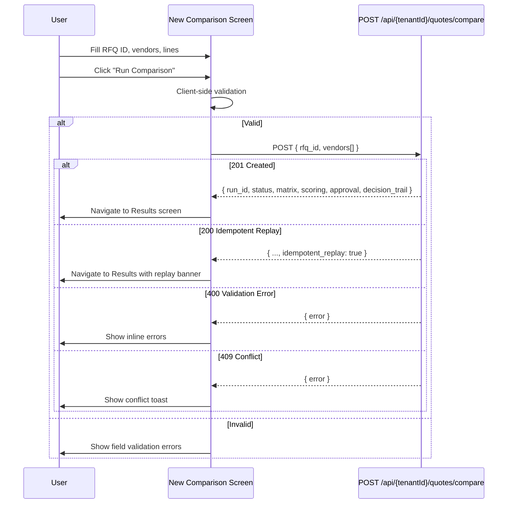

---

## SCR-004: Quote Comparison — Results

### 1. Screen Overview

| Field | Value |
|-------|-------|
| Screen Name | Quote Comparison — Results |
| Purpose | Display the complete output of a quote comparison run including the comparison matrix, vendor scoring, risk assessment, approval status, and decision trail |
| Core Functions | View matrix, view vendor rankings, view risk flags, view approval gate result, navigate to approval action |
| Screen Type | Full Page |
| Layout Structure | Header → Sidebar → Content (Status bar, tabbed panels) |
| Active Navigation Item | Quote Comparison |
| Breadcrumb Structure | Home > Quote Comparison > Results: {rfqId} |
| Entry Points | Redirect from SCR-003 after successful submission |
| Exit Points | Navigate to SCR-005 Approval Queue, trigger MOD-001, navigate to SCR-003 for new run |
| Data Dependencies | Comparison run response payload (passed as route state from SCR-003) |
| User Roles Allowed | ROLE_USER, ROLE_ADMIN, ROLE_TENANT_ADMIN |
| Screen Permission Requirements | Authenticated JWT with matching tenant context |

### 2. UI Layout Structure

```
┌──────────────────────────────────────────────────────────┐
│ Header (breadcrumb: Home > Quote Comparison > Results)   │
├──────────┬───────────────────────────────────────────────┤
│          │  ┌──────────────────────────────────────────┐  │
│          │  │ Run Summary Bar                          │  │
│          │  │  Run ID | RFQ ID | Status Badge |        │  │
│          │  │  Created timestamp | Action buttons      │  │
│          │  └──────────────────────────────────────────┘  │
│ Sidebar  │  ┌──────────────────────────────────────────┐  │
│          │  │ Tab Navigation                           │  │
│          │  │ [Matrix] [Scoring] [Risk] [Approval]     │  │
│          │  │ [Decision Trail]                         │  │
│          │  └──────────────────────────────────────────┘  │
│          │  ┌──────────────────────────────────────────┐  │
│          │  │ Active Tab Content                       │  │
│          │  │  (varies by selected tab)                │  │
│          │  └──────────────────────────────────────────┘  │
└──────────┴───────────────────────────────────────────────┘
```

### 3. UI Elements

| Element Name | Element Type | Description | Default State | Visibility Condition | Permission Requirement |
|-------------|-------------|-------------|---------------|---------------------|----------------------|
| Run ID Display | Text (monospace) | Displays the comparison run UUID | Read-only | Always | Authenticated |
| RFQ ID Display | Text | Displays the RFQ identifier | Read-only | Always | Authenticated |
| Status Badge | Badge | Shows current run status with color coding: `approved` = green, `pending_approval` = amber, `rejected` = red | Populated from response | Always | Authenticated |
| Idempotent Replay Banner | Info Banner | Shows when results are from a cached idempotent replay | Hidden | When `idempotent_replay === true` | Authenticated |
| Approve/Reject Button | Button (primary) | Opens MOD-001 for approval decision | Enabled | When status is `pending_approval` | Authenticated |
| New Comparison Button | Button (secondary) | Navigate to SCR-003 | Enabled | Always | Authenticated |
| Tab: Matrix | Tab | Shows the comparison matrix data | Active (default) | Always | Authenticated |
| Tab: Scoring | Tab | Shows vendor scoring results and rankings | Inactive | Always | Authenticated |
| Tab: Risk | Tab | Shows risk assessment per vendor | Inactive | Always | Authenticated |
| Tab: Approval | Tab | Shows approval gate evaluation results | Inactive | Always | Authenticated |
| Tab: Decision Trail | Tab | Shows hash-chained decision trail entries | Inactive | Always | Authenticated |
| Matrix Table | Data Table | Side-by-side vendor comparison grid with clusters | Read-only | Matrix tab active | Authenticated |
| Scoring Ranking Table | Data Table | Vendor ranking by total score with factor breakdown | Read-only | Scoring tab active | Authenticated |
| Risk Cards | Card List | Per-vendor risk assessment cards with severity indicators | Read-only | Risk tab active | Authenticated |
| Approval Gate Summary | Info Panel | Shows gate result: auto-approved or pending with reasons | Read-only | Approval tab active | Authenticated |
| Decision Trail Timeline | Timeline | Chronological list of trail entries with hashes | Read-only | Decision Trail tab active | Authenticated |

### 4. Interaction Behavior

#### Action: Open Approval Modal

| Field | Value |
|-------|-------|
| Action Name | Open Approval Decision |
| Trigger Element | Approve/Reject Button |
| Preconditions | Run status is `pending_approval` |
| Validation Rules | None |
| System Process | Open MOD-001 slide-over modal with run context |
| API Endpoint Used | None (modal handles API call) |
| Result | MOD-001 displayed |
| Next Navigation | MOD-001 |

#### Action: Switch Tab

| Field | Value |
|-------|-------|
| Action Name | Switch Results Tab |
| Trigger Element | Any tab button (Matrix, Scoring, Risk, Approval, Decision Trail) |
| Preconditions | Data loaded |
| Validation Rules | None |
| System Process | Switch active tab content panel. No API call (data already available from comparison response). |
| API Endpoint Used | None |
| Result | Tab content displayed |
| Next Navigation | None |

### 5. Conditional UI / UX Behavior

| Condition | Behavior |
|-----------|----------|
| Status is `pending_approval` | Approve/Reject Button visible and prominent (primary button). Status badge is amber. Show callout: "This run requires human review." |
| Status is `approved` | Approve/Reject Button hidden. Status badge is green. |
| Status is `rejected` | Approve/Reject Button hidden. Status badge is red. Show rejection reason if available in approval payload. |
| `idempotent_replay` is true | Show blue info banner: "These results were retrieved from a previous run." |
| Any vendor has high-risk level | Risk tab shows a red dot indicator on the tab label |
| Top vendor score < 70 | Scoring tab shows an amber warning indicator on the tab label |
| Approval gate `required_because` present | Approval tab shows list of reasons for manual review |

### 6. API Endpoint Mapping

| Endpoint | HTTP Method | Purpose | Triggered By | Request Payload | Success Response Behavior | Error Response Behavior |
|----------|-------------|---------|-------------|-----------------|--------------------------|------------------------|
| — | — | Data is passed as route state from SCR-003 | Page load | — | Render all tabs from response data | Show error if state is missing, redirect to SCR-003 |

### 7. Navigation Rules

| Action | Destination Screen | Navigation Type |
|--------|-------------------|-----------------|
| Click Approve/Reject | MOD-001 (slide-over) | Modal open |
| Click New Comparison | SCR-003 | `router.push` |
| Click Dashboard breadcrumb | SCR-002 | `router.push` |
| MOD-001 successful approval | Stay on SCR-004, refresh status | Modal close + state update |

### 8. Error Handling

| Scenario | API Response | UI Behavior |
|----------|-------------|-------------|
| No route state available | — | Redirect to SCR-003 with info toast: "Start a new comparison." |
| Token expired | 401 | Open MOD-016 |

### 9. Screen State Management

| State | Description | Visual Indicator |
|-------|-------------|------------------|
| Loading | Route state being parsed | Brief skeleton loader |
| Loaded: Pending Approval | Results displayed, approval action available | Amber status badge, Approve/Reject button visible |
| Loaded: Approved | Results displayed, no action needed | Green status badge |
| Loaded: Rejected | Results displayed with rejection details | Red status badge |
| No Data | Route state missing | Redirect to SCR-003 |

### 10. State Transition Table

| Current State | Action | Next State |
|---------------|--------|------------|
| Loaded: Pending Approval | Click Approve/Reject → MOD-001 → Approve | Loaded: Approved |
| Loaded: Pending Approval | Click Approve/Reject → MOD-001 → Reject | Loaded: Rejected |
| Loaded: Pending Approval | MOD-001 cancelled | Loaded: Pending Approval |

### 11. System Events / Audit Events

| Event | Trigger |
|-------|---------|
| ComparisonResultsViewed | Page load with valid run data |

### 12. Diagrams

#### State Machine — Quote Comparison Run

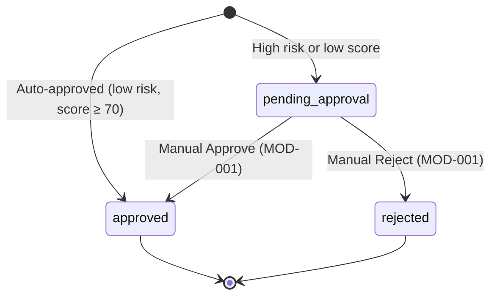

---

## SCR-005: Approval Queue

### 1. Screen Overview

| Field | Value |
|-------|-------|
| Screen Name | Approval Queue |
| Purpose | List all quote comparison runs that require approval action, filtered and sortable for prioritization |
| Core Functions | View pending approval items, filter/sort, navigate to approval detail |
| Screen Type | Full Page |
| Layout Structure | Header → Sidebar → Content (Toolbar with filters, Data Table, Pagination) |
| Active Navigation Item | Approval Queue |
| Breadcrumb Structure | Home > Approvals |
| Entry Points | Sidebar "Approval Queue" click, Dashboard pending approvals link, Header quick action |
| Exit Points | Click row → SCR-006, navigate away via sidebar |
| Data Dependencies | Quote comparison runs with status `pending_approval` — **API GAP: no dedicated list endpoint exists; data must be derived client-side from comparison run responses or a future list endpoint** |
| User Roles Allowed | ROLE_USER, ROLE_ADMIN, ROLE_TENANT_ADMIN |
| Screen Permission Requirements | Authenticated JWT |

### 2. UI Layout Structure

```
┌──────────────────────────────────────────────────────────┐
│ Header (breadcrumb: Home > Approvals)                    │
├──────────┬───────────────────────────────────────────────┤
│          │  Page Title: "Approval Queue"                  │
│          │  ┌──────────────────────────────────────────┐  │
│ Sidebar  │  │ Filter Toolbar                           │  │
│          │  │  Status filter | Date range | Search     │  │
│          │  └──────────────────────────────────────────┘  │
│          │  ┌──────────────────────────────────────────┐  │
│          │  │ Data Table                               │  │
│          │  │  Run ID | RFQ ID | Status | Vendors |    │  │
│          │  │  Top Score | Created | Actions           │  │
│          │  └──────────────────────────────────────────┘  │
│          │  Pagination controls                           │
└──────────┴───────────────────────────────────────────────┘
```

### 3. UI Elements

| Element Name | Element Type | Description | Default State | Visibility Condition | Permission Requirement |
|-------------|-------------|-------------|---------------|---------------------|----------------------|
| Status Filter | Dropdown | Filter by: All, Pending Approval, Approved, Rejected | "Pending Approval" selected | Always | Authenticated |
| Search Input | Form Field (text) | Search by RFQ ID or Run ID | Empty | Always | Authenticated |
| Approval Queue Table | Data Table | Sortable table of comparison runs | Loaded from API/state | Always | Authenticated |
| Column: Run ID | Table Column | Comparison run identifier (truncated, monospace) | — | Always | Authenticated |
| Column: RFQ ID | Table Column | RFQ identifier | — | Always | Authenticated |
| Column: Status | Table Column | Status badge (color-coded) | — | Always | Authenticated |
| Column: Vendors | Table Column | Number of vendors in the comparison | — | Always | Authenticated |
| Column: Top Score | Table Column | Highest vendor score from scoring results | — | Always | Authenticated |
| Column: Created | Table Column | Timestamp of run creation | — | Always | Authenticated |
| Column: Actions | Table Column | "Review" link button | — | Always | Authenticated |
| Review Link | Link Button | Navigate to SCR-006 for the specific run | Enabled | Per row | Authenticated |
| Pagination | Pagination Controls | Page navigation with page size selector | Page 1, 20 per page | When data exceeds page size | Authenticated |

### 4. Interaction Behavior

#### Action: Open Approval Detail

| Field | Value |
|-------|-------|
| Action Name | Navigate to Approval Detail |
| Trigger Element | Row click or Review link |
| Preconditions | Row exists |
| Validation Rules | None |
| System Process | Navigate to `/approvals/{runId}` |
| API Endpoint Used | None |
| Result | SCR-006 displayed |
| Next Navigation | SCR-006 |

#### Action: Filter by Status

| Field | Value |
|-------|-------|
| Action Name | Filter Queue |
| Trigger Element | Status Filter dropdown |
| Preconditions | None |
| Validation Rules | None |
| System Process | Client-side filter of loaded data, or re-query API with filter parameter |
| API Endpoint Used | **API GAP** — no server-side filtering for comparison runs |
| Result | Table filtered to selected status |
| Next Navigation | None |

### 5. Conditional UI / UX Behavior

| Condition | Behavior |
|-----------|----------|
| No pending approvals | Empty state illustration: "All caught up! No pending approvals." |
| Status filter returns no results | Empty filtered state: "No results match your filter." with clear filter button |
| Run has high-risk vendors | Row shows red risk indicator dot |
| Top score < 70 | Score cell shown in amber/warning color |

### 6. API Endpoint Mapping

> **API GAP:** There is no dedicated endpoint to list comparison runs. The approval queue data must be managed client-side from previous comparison results or requires a future `GET /api/{tenantId}/quotes/runs` endpoint.

| Endpoint | HTTP Method | Purpose | Triggered By | Request Payload | Success Response Behavior | Error Response Behavior |
|----------|-------------|---------|-------------|-----------------|--------------------------|------------------------|
| **GAP** | GET | List comparison runs by tenant | Page load | Query params: `status`, `page`, `limit` | Populate table | Show error state |

### 7. Navigation Rules

| Action | Destination Screen | Navigation Type |
|--------|-------------------|-----------------|
| Click row / Review link | SCR-006 | `router.push('/approvals/{runId}')` |
| Breadcrumb "Home" | SCR-002 | `router.push('/')` |

### 8. Error Handling

| Scenario | API Response | UI Behavior |
|----------|-------------|-------------|
| Data fetch fails | 5xx | Error state: "Failed to load approval queue." with retry button |
| Token expired | 401 | Open MOD-016 |
| No data available | Empty response | Empty state with illustration |

### 9. Screen State Management

| State | Description | Visual Indicator |
|-------|-------------|------------------|
| Loading | Fetching run data | Skeleton table rows |
| Loaded | Data available | Populated table |
| Empty | No runs match filters | Empty state illustration |
| Error | Failed to load | Error banner with retry |

### 10. State Transition Table

| Current State | Action | Next State |
|---------------|--------|------------|
| Loading | Data received | Loaded or Empty |
| Loading | Error | Error |
| Error | Retry | Loading |
| Loaded | Change filter | Loading |

### 11. System Events / Audit Events

| Event | Trigger |
|-------|---------|
| ApprovalQueueViewed | Page load |

### 12. Diagrams

#### Navigation Flow

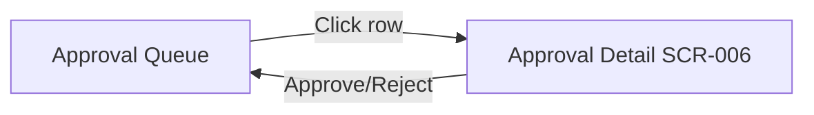

---

## SCR-006: Approval Detail

### 1. Screen Overview

| Field | Value |
|-------|-------|
| Screen Name | Approval Detail |
| Purpose | Display full context for a single comparison run pending approval, enabling the user to make an informed approve/reject decision |
| Core Functions | View comparison summary, scoring, risks, approval gate reasons, trigger approve/reject action |
| Screen Type | Full Page |
| Layout Structure | Header → Sidebar → Content (Summary panel, evidence tabs, action bar) |
| Active Navigation Item | Approval Queue |
| Breadcrumb Structure | Home > Approvals > {runId} |
| Entry Points | SCR-005 row click, SCR-004 Approve/Reject button |
| Exit Points | MOD-001 → approval made → SCR-005, Back to Queue |
| Data Dependencies | Comparison run response payload for the specific `runId` — **API GAP: no GET endpoint for single run; must be passed as state or cached** |
| User Roles Allowed | ROLE_USER, ROLE_ADMIN, ROLE_TENANT_ADMIN |
| Screen Permission Requirements | Authenticated JWT, tenant context matching run's tenantId |

### 2. UI Layout Structure

```
┌──────────────────────────────────────────────────────────┐
│ Header (breadcrumb: Home > Approvals > {runId})          │
├──────────┬───────────────────────────────────────────────┤
│          │  ┌──────────────────────────────────────────┐  │
│          │  │ Summary Header                           │  │
│          │  │  Run ID | RFQ | Status | Created         │  │
│          │  │  Recommended vendor | Score | Risk level  │  │
│          │  └──────────────────────────────────────────┘  │
│ Sidebar  │  ┌──────────────────────────────────────────┐  │
│          │  │ Evidence Tabs                            │  │
│          │  │ [Scoring] [Matrix] [Risk] [Trail]        │  │
│          │  └──────────────────────────────────────────┘  │
│          │  ┌──────────────────────────────────────────┐  │
│          │  │ Tab Content Panel                        │  │
│          │  └──────────────────────────────────────────┘  │
│          │  ┌──────────────────────────────────────────┐  │
│          │  │ Sticky Action Bar                        │  │
│          │  │  [Back to Queue] [Approve] [Reject]      │  │
│          │  └──────────────────────────────────────────┘  │
└──────────┴───────────────────────────────────────────────┘
```

### 3. UI Elements

| Element Name | Element Type | Description | Default State | Visibility Condition | Permission Requirement |
|-------------|-------------|-------------|---------------|---------------------|----------------------|
| Summary Header | Info Panel | Key facts about the run at a glance | Populated | Always | Authenticated |
| Recommended Vendor Card | Highlight Card | Shows top-scoring vendor with score and risk indicators | Populated from scoring ranking[0] | Always | Authenticated |
| Approval Gate Reasons | Alert List | Lists reasons the run requires manual review (e.g., high risk, low score) | Populated from approval payload | When status is `pending_approval` | Authenticated |
| Evidence Tab: Scoring | Tab | Vendor ranking table with score breakdown | Default active | Always | Authenticated |
| Evidence Tab: Matrix | Tab | Comparison matrix data | Inactive | Always | Authenticated |
| Evidence Tab: Risk | Tab | Per-vendor risk assessment | Inactive | Always | Authenticated |
| Evidence Tab: Trail | Tab | Decision trail entries | Inactive | Always | Authenticated |
| Back to Queue Button | Button (ghost) | Navigate to SCR-005 | Enabled | Always | Authenticated |
| Approve Button | Button (success/green) | Opens MOD-001 with decision preset to "approve" | Enabled | Status is `pending_approval` | Authenticated |
| Reject Button | Button (destructive/red) | Opens MOD-001 with decision preset to "reject" | Enabled | Status is `pending_approval` | Authenticated |

### 4. Interaction Behavior

#### Action: Approve Quote Run

| Field | Value |
|-------|-------|
| Action Name | Initiate Approval |
| Trigger Element | Approve Button |
| Preconditions | Run status is `pending_approval` |
| Validation Rules | None at this point (modal handles validation) |
| System Process | Open MOD-001 with `decision` preset to `"approve"` and `runId` context |
| API Endpoint Used | None (deferred to modal) |
| Result | MOD-001 opens |
| Next Navigation | MOD-001 |

#### Action: Reject Quote Run

| Field | Value |
|-------|-------|
| Action Name | Initiate Rejection |
| Trigger Element | Reject Button |
| Preconditions | Run status is `pending_approval` |
| Validation Rules | None at this point |
| System Process | Open MOD-001 with `decision` preset to `"reject"` and `runId` context |
| API Endpoint Used | None (deferred to modal) |
| Result | MOD-001 opens |
| Next Navigation | MOD-001 |

### 5. Conditional UI / UX Behavior

| Condition | Behavior |
|-----------|----------|
| Status is `pending_approval` | Approve/Reject buttons visible. Amber highlight on summary header. |
| Status is `approved` | Buttons hidden. Green status. Show approval details (who, when, reason). |
| Status is `rejected` | Buttons hidden. Red status. Show rejection details (who, when, reason). |
| Any vendor risk level is `high` | Red risk badge on Summary Header. Risk tab shows red dot indicator. |
| Top vendor score < 70 | Amber warning on score display. Callout: "Top vendor score below threshold." |

### 6. API Endpoint Mapping

> **API GAP:** No `GET /api/{tenantId}/quotes/{runId}` endpoint exists. Run data must be loaded from client-side cache/state.

| Endpoint | HTTP Method | Purpose | Triggered By | Request Payload | Success Response Behavior | Error Response Behavior |
|----------|-------------|---------|-------------|-----------------|--------------------------|------------------------|
| **GAP** | GET | Fetch single comparison run | Page load | `runId` path param | Render all panels | Error state |

### 7. Navigation Rules

| Action | Destination Screen | Navigation Type |
|--------|-------------------|-----------------|
| Click Back to Queue | SCR-005 | `router.push('/approvals')` |
| Click Approve | MOD-001 (slide-over) | Modal open |
| Click Reject | MOD-001 (slide-over) | Modal open |
| MOD-001 success | Stay on SCR-006 (status refreshed) | Modal close + state update |

### 8. Error Handling

| Scenario | API Response | UI Behavior |
|----------|-------------|-------------|
| Run data not in state/cache | — | Redirect to SCR-005 with toast: "Please select a run from the queue." |
| Token expired | 401 | Open MOD-016 |

### 9. Screen State Management

| State | Description | Visual Indicator |
|-------|-------------|------------------|
| Loading | Parsing run data from state | Skeleton panels |
| Loaded: Pending | Run loaded, decision pending | Amber status, action buttons visible |
| Loaded: Decided | Run already approved/rejected | Green/red status, action buttons hidden |
| No Data | No run data available | Redirect to SCR-005 |

### 10. State Transition Table

| Current State | Action | Next State |
|---------------|--------|------------|
| Loaded: Pending | Click Approve → MOD-001 → Success | Loaded: Decided (approved) |
| Loaded: Pending | Click Reject → MOD-001 → Success | Loaded: Decided (rejected) |
| Loaded: Pending | Click Back | Navigate to SCR-005 |

### 11. System Events / Audit Events

| Event | Trigger |
|-------|---------|
| ApprovalDetailViewed | Page load with valid run data |

### 12. Diagrams

#### Interaction Flow

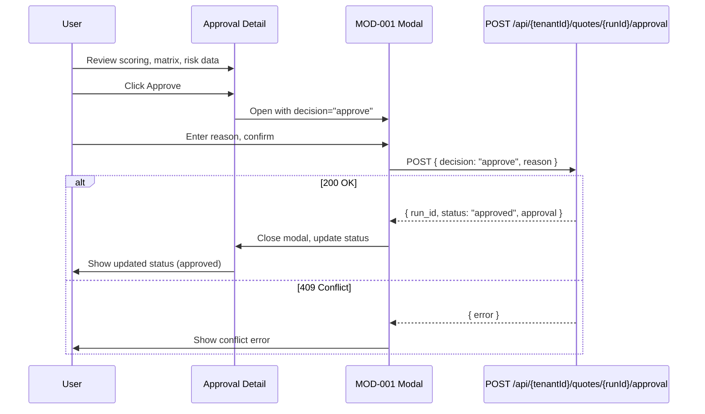

---

## SCR-007: Decision Trail

### 1. Screen Overview

| Field | Value |
|-------|-------|
| Screen Name | Decision Trail |
| Purpose | Display the immutable, hash-chained audit ledger of all decision events across quote comparison runs for governance and compliance |
| Core Functions | View chronological trail entries, verify hash integrity, filter by RFQ/event type |
| Screen Type | Full Page |
| Layout Structure | Header → Sidebar → Content (Filters, Timeline/Table) |
| Active Navigation Item | Decision Trail |
| Breadcrumb Structure | Home > Decision Trail |
| Entry Points | Sidebar "Decision Trail" click, SCR-004 Decision Trail tab deep-link |
| Exit Points | Navigate to SCR-004 for run detail, navigate away via sidebar |
| Data Dependencies | Decision trail entries — **API GAP: no dedicated decision trail list endpoint; entries are embedded in comparison run responses** |
| User Roles Allowed | ROLE_USER, ROLE_ADMIN, ROLE_TENANT_ADMIN |
| Screen Permission Requirements | Authenticated JWT |

### 2. UI Layout Structure

```
┌──────────────────────────────────────────────────────────┐
│ Header (breadcrumb: Home > Decision Trail)               │
├──────────┬───────────────────────────────────────────────┤
│          │  Page Title: "Decision Trail"                  │
│          │  ┌──────────────────────────────────────────┐  │
│ Sidebar  │  │ Filter Bar                               │  │
│          │  │  RFQ ID search | Event type filter       │  │
│          │  └──────────────────────────────────────────┘  │
│          │  ┌──────────────────────────────────────────┐  │
│          │  │ Trail Table                              │  │
│          │  │  Seq | Event | RFQ | Run | Hashes | Time │  │
│          │  └──────────────────────────────────────────┘  │
│          │  Pagination                                    │
└──────────┴───────────────────────────────────────────────┘
```

### 3. UI Elements

| Element Name | Element Type | Description | Default State | Visibility Condition | Permission Requirement |
|-------------|-------------|-------------|---------------|---------------------|----------------------|
| RFQ ID Search | Form Field (text) | Filter trail entries by RFQ ID | Empty | Always | Authenticated |
| Event Type Filter | Dropdown | Filter by: All, matrix_built, scoring_computed, approval_evaluated, approval_override | "All" | Always | Authenticated |
| Trail Table | Data Table | Tabular display of trail entries | Loaded | Always | Authenticated |
| Column: Sequence | Table Column | Sequential order number | — | Always | Authenticated |
| Column: Event Type | Table Column | Event type with icon (matrix, scoring, approval, override) | — | Always | Authenticated |
| Column: RFQ ID | Table Column | Associated RFQ identifier | — | Always | Authenticated |
| Column: Run ID | Table Column | Associated comparison run ID (link to SCR-004) | — | Always | Authenticated |
| Column: Payload Hash | Table Column | Truncated SHA-256 hash of event payload | — | Always | Authenticated |
| Column: Previous Hash | Table Column | Truncated SHA-256 hash of prior entry | — | Always | Authenticated |
| Column: Entry Hash | Table Column | Truncated SHA-256 hash of this entry | — | Always | Authenticated |
| Column: Occurred At | Table Column | Timestamp of the event | — | Always | Authenticated |
| Hash Integrity Indicator | Icon | Green checkmark if chain is valid, red X if broken | Computed client-side | Always | Authenticated |
| View Run Link | Link | Navigate to SCR-004 for the associated run | Enabled | Per row | Authenticated |

### 4. Interaction Behavior

#### Action: Navigate to Run Detail

| Field | Value |
|-------|-------|
| Action Name | View Associated Run |
| Trigger Element | Run ID link in table row |
| Preconditions | Run data available in cache |
| Validation Rules | None |
| System Process | Navigate to SCR-004 with run context |
| API Endpoint Used | None |
| Result | SCR-004 displayed |
| Next Navigation | SCR-004 |

#### Action: Verify Hash Chain Integrity

| Field | Value |
|-------|-------|
| Action Name | Verify Trail Integrity |
| Trigger Element | Automatic on data load (per RFQ group) |
| Preconditions | Trail data loaded |
| Validation Rules | For each entry: `entry_hash` should chain correctly from `previous_hash` |
| System Process | Client-side verification: iterate entries in sequence order, verify each `previous_hash` matches the prior entry's `entry_hash` |
| API Endpoint Used | None |
| Result | Green/red integrity indicators per entry |
| Next Navigation | None |

### 5. Conditional UI / UX Behavior

| Condition | Behavior |
|-----------|----------|
| Hash chain is valid for all entries in an RFQ group | Green "Verified" badge at group level |
| Hash chain is broken (mismatch detected) | Red "Integrity Warning" badge, affected entries highlighted |
| Event type is `approval_override` | Row shown with distinct styling (e.g., left border accent) to highlight human decisions |
| No trail entries exist | Empty state: "No decision trail entries recorded yet." |

### 6. API Endpoint Mapping

> **API GAP:** No dedicated decision trail list endpoint exists. Trail data is embedded within comparison run responses. A future `GET /api/{tenantId}/decision-trail` endpoint is recommended.

### 7. Navigation Rules

| Action | Destination Screen | Navigation Type |
|--------|-------------------|-----------------|
| Click Run ID link | SCR-004 | `router.push` |
| Breadcrumb "Home" | SCR-002 | `router.push` |

### 8. Error Handling

| Scenario | API Response | UI Behavior |
|----------|-------------|-------------|
| No data available | — | Empty state illustration |
| Hash integrity check fails | — | Red warning banner: "Trail integrity issue detected for RFQ {id}." |

### 9. Screen State Management

| State | Description | Visual Indicator |
|-------|-------------|------------------|
| Loading | Fetching trail data | Skeleton table rows |
| Loaded | Data available | Populated table with integrity indicators |
| Empty | No trail entries | Empty state illustration |
| Integrity Warning | Hash chain broken | Red warning banner |

### 10. State Transition Table

| Current State | Action | Next State |
|---------------|--------|------------|
| Loading | Data received | Loaded or Empty |
| Loaded | Filter changed | Loading (filtered) |
| Loaded | Integrity check fails | Integrity Warning |

### 11. System Events / Audit Events

| Event | Trigger |
|-------|---------|
| DecisionTrailViewed | Page load |
| IntegrityCheckPerformed | Automatic on data load |

### 12. Diagrams

#### Decision Trail Entry Types

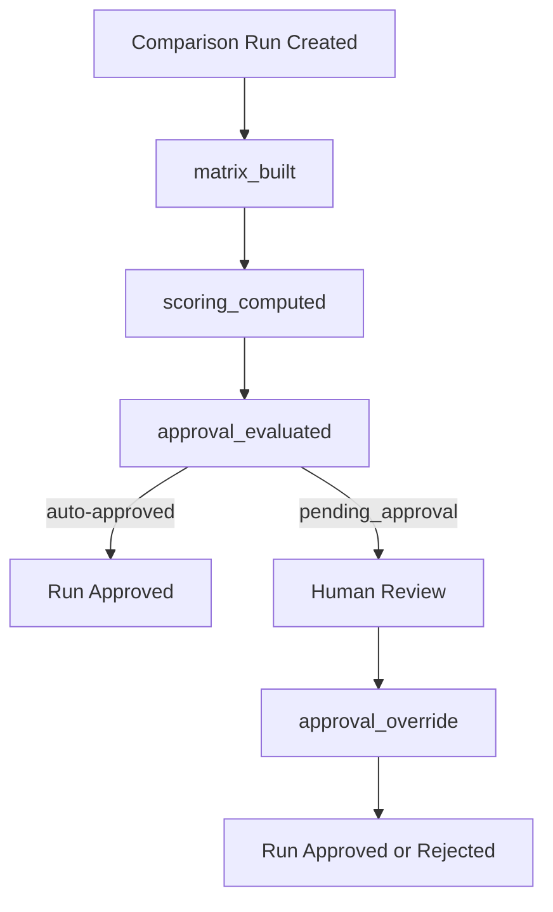

---

## SCR-008: User Management

### 1. Screen Overview

| Field | Value |
|-------|-------|
| Screen Name | User Management |
| Purpose | View and manage users within the current tenant, including suspending and activating user accounts |
| Core Functions | List users, view user details, suspend user, activate user |
| Screen Type | Full Page |
| Layout Structure | Header → Sidebar → Content (Toolbar, User Table, Pagination) |
| Active Navigation Item | Users & Access |
| Breadcrumb Structure | Home > Users & Access |
| Entry Points | Sidebar "Users & Access" click, Dashboard quick action |
| Exit Points | Navigate away via sidebar |
| Data Dependencies | `GET /api/users` |
| User Roles Allowed | ROLE_TENANT_ADMIN, ROLE_ADMIN |
| Screen Permission Requirements | Authenticated JWT, admin role |

### 2. UI Layout Structure

```
┌──────────────────────────────────────────────────────────┐
│ Header (breadcrumb: Home > Users & Access)               │
├──────────┬───────────────────────────────────────────────┤
│          │  Page Title: "Users & Access"                  │
│          │  ┌──────────────────────────────────────────┐  │
│ Sidebar  │  │ Toolbar                                  │  │
│          │  │  Search | Status filter | Role filter    │  │
│          │  └──────────────────────────────────────────┘  │
│          │  ┌──────────────────────────────────────────┐  │
│          │  │ User Table                               │  │
│          │  │  Name | Email | Status | Roles |         │  │
│          │  │  Created | Actions                       │  │
│          │  └──────────────────────────────────────────┘  │
│          │  Pagination                                    │
└──────────┴───────────────────────────────────────────────┘
```

### 3. UI Elements

| Element Name | Element Type | Description | Default State | Visibility Condition | Permission Requirement |
|-------------|-------------|-------------|---------------|---------------------|----------------------|
| Search Input | Form Field (text) | Search by name or email | Empty | Always | Admin role |
| Status Filter | Dropdown | Filter by: All, Active, Inactive, Suspended, Locked, Pending Activation | "All" | Always | Admin role |
| Role Filter | Dropdown | Filter by: All, User, Admin, Tenant Admin | "All" | Always | Admin role |
| User Table | Data Table | Sortable table of tenant users | Loaded from `GET /api/users` | Always | Admin role |
| Column: Name | Table Column | User display name | — | Always | Admin role |
| Column: Email | Table Column | User email address | — | Always | Admin role |
| Column: Status | Table Column | Status badge: Active (green), Suspended (red), Pending (amber), Locked (grey), Inactive (grey) | — | Always | Admin role |
| Column: Roles | Table Column | Role chips | — | Always | Admin role |
| Column: Created At | Table Column | Account creation timestamp | — | Always | Admin role |
| Column: Actions | Table Column | Context menu with lifecycle actions | — | Always | Admin role |
| Suspend Action | Menu Item (destructive) | Opens MOD-009 | Enabled | User status is `active` | Admin role |
| Activate Action | Menu Item | Opens MOD-010 | Enabled | User status is `suspended` | Admin role |

### 4. Interaction Behavior

#### Action: Suspend User

| Field | Value |
|-------|-------|
| Action Name | Suspend User |
| Trigger Element | Suspend Action in row context menu |
| Preconditions | User status is `active` |
| Validation Rules | Cannot suspend self |
| System Process | Open MOD-009 with user context |
| API Endpoint Used | Deferred to MOD-009 |
| Result | MOD-009 opens |
| Next Navigation | MOD-009 |

#### Action: Activate User

| Field | Value |
|-------|-------|
| Action Name | Activate User |
| Trigger Element | Activate Action in row context menu |
| Preconditions | User status is `suspended` |
| Validation Rules | None |
| System Process | Open MOD-010 with user context |
| API Endpoint Used | Deferred to MOD-010 |
| Result | MOD-010 opens |
| Next Navigation | MOD-010 |

### 5. Conditional UI / UX Behavior

| Condition | Behavior |
|-----------|----------|
| User is current logged-in user | Actions menu shows only "View Profile" (cannot suspend self) |
| User status is `locked` | No lifecycle actions available (system-controlled) |
| User status is `pending_activation` | No lifecycle actions available |
| No users match filter | Empty state: "No users match your criteria." |

### 6. API Endpoint Mapping

| Endpoint | HTTP Method | Purpose | Triggered By | Request Payload | Success Response Behavior | Error Response Behavior |
|----------|-------------|---------|-------------|-----------------|--------------------------|------------------------|
| `/api/users` | GET | Fetch tenant user list | Page load | None | Populate user table | Error state |

### 7. Navigation Rules

| Action | Destination Screen | Navigation Type |
|--------|-------------------|-----------------|
| Click Suspend action | MOD-009 (slide-over) | Modal open |
| Click Activate action | MOD-010 (slide-over) | Modal open |
| MOD-009/010 success | Stay on SCR-008, refresh table | Modal close + refetch |

### 8. Error Handling

| Scenario | API Response | UI Behavior |
|----------|-------------|-------------|
| User list fetch fails | 5xx | Error state: "Failed to load users." with retry |
| Token expired | 401 | Open MOD-016 |

### 9. Screen State Management

| State | Description | Visual Indicator |
|-------|-------------|------------------|
| Loading | Fetching users | Skeleton table rows |
| Loaded | Users displayed | Populated table |
| Empty | No users (unlikely) | Empty state |
| Error | Fetch failed | Error banner with retry |
| Filtered Empty | Filters match nothing | Filtered empty state |

### 10. State Transition Table

| Current State | Action | Next State |
|---------------|--------|------------|
| Loading | API success | Loaded |
| Loading | API error | Error |
| Loaded | Change filter | Loading (re-filter) |
| Loaded | Suspend/Activate success (from modal) | Loading (refetch) |

### 11. System Events / Audit Events

| Event | Trigger |
|-------|---------|
| UserListViewed | Page load |

### 12. Diagrams

#### User Status State Machine

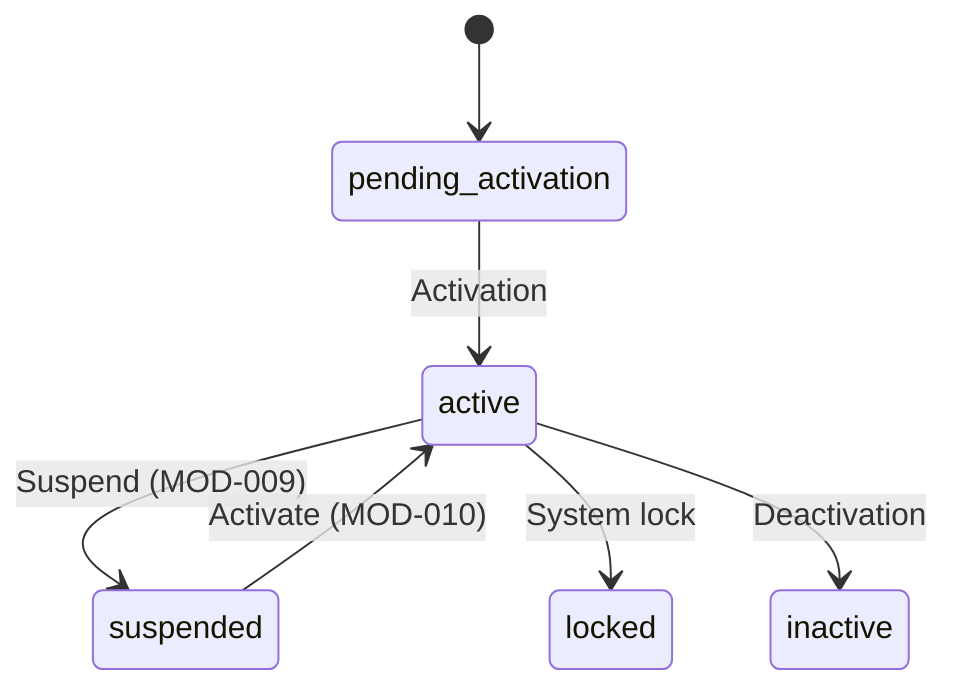

---

## SCR-009: Settings Management

### 1. Screen Overview

| Field | Value |
|-------|-------|
| Screen Name | Settings Management |
| Purpose | View and manage tenant-scoped application settings |
| Core Functions | List settings, edit individual settings, bulk update settings |
| Screen Type | Full Page |
| Layout Structure | Header → Sidebar → Content (Settings table with grouped categories) |
| Active Navigation Item | Settings |
| Breadcrumb Structure | Home > Settings |
| Entry Points | Sidebar "Settings" click |
| Exit Points | Navigate away via sidebar |
| Data Dependencies | `GET /api/settings` |
| User Roles Allowed | ROLE_TENANT_ADMIN, ROLE_ADMIN |
| Screen Permission Requirements | Authenticated JWT, admin role |

### 2. UI Layout Structure

```
┌──────────────────────────────────────────────────────────┐
│ Header (breadcrumb: Home > Settings)                     │
├──────────┬───────────────────────────────────────────────┤
│          │  Page Title: "Settings"                        │
│          │  Toolbar: [Bulk Update] [Refresh]              │
│          │  ┌──────────────────────────────────────────┐  │
│ Sidebar  │  │ Settings Table                           │  │
│          │  │  Key | Value | Type | Scope |             │  │
│          │  │  Read-Only | Encrypted | Actions          │  │
│          │  └──────────────────────────────────────────┘  │
└──────────┴───────────────────────────────────────────────┘
```

### 3. UI Elements

| Element Name | Element Type | Description | Default State | Visibility Condition | Permission Requirement |
|-------------|-------------|-------------|---------------|---------------------|----------------------|
| Search Input | Form Field (text) | Search by setting key | Empty | Always | Admin role |
| Scope Filter | Dropdown | Filter by scope: All, Tenant, Global | "All" | Always | Admin role |
| Bulk Update Button | Button (secondary) | Opens MOD-012 | Enabled | Always | Admin role |
| Refresh Button | Icon Button | Re-fetches settings from API | Enabled | Always | Admin role |
| Settings Table | Data Table | All tenant settings | Loaded from API | Always | Admin role |
| Column: Key | Table Column | Setting key identifier (monospace) | — | Always | Admin role |
| Column: Value | Table Column | Current value (masked if encrypted) | — | Always | Admin role |
| Column: Type | Table Column | Data type badge (string, int, float, bool) | — | Always | Admin role |
| Column: Scope | Table Column | Setting scope (tenant/global) | — | Always | Admin role |
| Column: Read-Only | Table Column | Lock icon if read-only | — | Always | Admin role |
| Column: Encrypted | Table Column | Shield icon if encrypted | — | Always | Admin role |
| Edit Action | Icon Button | Opens MOD-011 for the setting | Enabled | Setting is not read-only | Admin role |

### 4. Interaction Behavior

#### Action: Edit Setting

| Field | Value |
|-------|-------|
| Action Name | Edit Setting |
| Trigger Element | Edit Action icon button on a row |
| Preconditions | Setting is not read-only |
| Validation Rules | None at this level |
| System Process | Open MOD-011 with setting key and current value |
| API Endpoint Used | Deferred to MOD-011 |
| Result | MOD-011 opens |
| Next Navigation | MOD-011 |

#### Action: Bulk Update

| Field | Value |
|-------|-------|
| Action Name | Bulk Update Settings |
| Trigger Element | Bulk Update Button |
| Preconditions | None |
| Validation Rules | None at this level |
| System Process | Open MOD-012 |
| API Endpoint Used | Deferred to MOD-012 |
| Result | MOD-012 opens |
| Next Navigation | MOD-012 |

### 5. Conditional UI / UX Behavior

| Condition | Behavior |
|-----------|----------|
| Setting is read-only | Edit action disabled, lock icon shown, row has subtle grey background |
| Setting is encrypted | Value column shows "••••••" with "Encrypted" label |
| Setting type is `bool` | Value shows toggle-style badge (On/Off) |

### 6. API Endpoint Mapping

| Endpoint | HTTP Method | Purpose | Triggered By | Request Payload | Success Response Behavior | Error Response Behavior |
|----------|-------------|---------|-------------|-----------------|--------------------------|------------------------|
| `/api/settings` | GET | Fetch all settings | Page load, Refresh button | None | Populate settings table | Error state |

### 7. Navigation Rules

| Action | Destination Screen | Navigation Type |
|--------|-------------------|-----------------|
| Click Edit | MOD-011 (slide-over) | Modal open |
| Click Bulk Update | MOD-012 (slide-over) | Modal open |
| MOD-011/012 success | Stay on SCR-009, refresh table | Modal close + refetch |

### 8. Error Handling

| Scenario | API Response | UI Behavior |
|----------|-------------|-------------|
| Settings fetch fails | 5xx | Error state with retry |
| Token expired | 401 | Open MOD-016 |

### 9. Screen State Management

| State | Description | Visual Indicator |
|-------|-------------|------------------|
| Loading | Fetching settings | Skeleton rows |
| Loaded | Settings displayed | Populated table |
| Error | Fetch failed | Error banner with retry |

### 10. State Transition Table

| Current State | Action | Next State |
|---------------|--------|------------|
| Loading | API success | Loaded |
| Loaded | Edit/Bulk success | Loading (refetch) |
| Loaded | Click Refresh | Loading |

### 11. System Events / Audit Events

| Event | Trigger |
|-------|---------|
| SettingsViewed | Page load |

### 12. Diagrams

No additional diagrams required for this screen.

---

## SCR-010: Feature Flags

### 1. Screen Overview

| Field | Value |
|-------|-------|
| Screen Name | Feature Flags |
| Purpose | View and manage feature flags for the current tenant, including enabling/disabling flags and modifying values |
| Core Functions | List feature flags, toggle flags, edit flag configuration |
| Screen Type | Full Page |
| Layout Structure | Header → Sidebar → Content (Flags table) |
| Active Navigation Item | Feature Flags |
| Breadcrumb Structure | Home > Feature Flags |
| Entry Points | Sidebar "Feature Flags" click |
| Exit Points | Navigate away via sidebar |
| Data Dependencies | `GET /api/feature-flags` |
| User Roles Allowed | ROLE_TENANT_ADMIN, ROLE_ADMIN |
| Screen Permission Requirements | Authenticated JWT, admin role |

### 2. UI Layout Structure

```
┌──────────────────────────────────────────────────────────┐
│ Header (breadcrumb: Home > Feature Flags)                │
├──────────┬───────────────────────────────────────────────┤
│          │  Page Title: "Feature Flags"                   │
│          │  ┌──────────────────────────────────────────┐  │
│ Sidebar  │  │ Flags Table                              │  │
│          │  │  Name | Enabled | Strategy | Value |      │  │
│          │  │  Override | Scope | Actions               │  │
│          │  └──────────────────────────────────────────┘  │
└──────────┴───────────────────────────────────────────────┘
```

### 3. UI Elements

| Element Name | Element Type | Description | Default State | Visibility Condition | Permission Requirement |
|-------------|-------------|-------------|---------------|---------------------|----------------------|
| Search Input | Form Field (text) | Search by flag name | Empty | Always | Admin role |
| Strategy Filter | Dropdown | Filter by: All, system_wide, percentage_rollout, tenant_list, user_list, custom | "All" | Always | Admin role |
| Flags Table | Data Table | All tenant feature flags | Loaded from API | Always | Admin role |
| Column: Name | Table Column | Flag name (monospace, dot-notation) | — | Always | Admin role |
| Column: Enabled | Table Column | Toggle switch showing enabled/disabled state | Current state | Always | Admin role |
| Column: Strategy | Table Column | Strategy badge | — | Always | Admin role |
| Column: Value | Table Column | Current value (JSON formatted) | — | Always | Admin role |
| Column: Override | Table Column | Override badge: FORCE_ON (green), FORCE_OFF (red), None (grey) | — | Always | Admin role |
| Column: Scope | Table Column | Scope label | — | Always | Admin role |
| Edit Action | Icon Button | Opens MOD-013 for the flag | Enabled | Always | Admin role |
| Quick Toggle | Toggle Switch | Directly toggles enabled/disabled via PATCH | Current state | Always | Admin role |

### 4. Interaction Behavior

#### Action: Quick Toggle Flag

| Field | Value |
|-------|-------|
| Action Name | Quick Toggle Feature Flag |
| Trigger Element | Toggle switch in Enabled column |
| Preconditions | None |
| Validation Rules | None |
| System Process | 1. Optimistically toggle UI. 2. Send `PATCH /api/feature-flags/{name}` with `{ "name": flagName, "enabled": newState }`. 3. On success: confirm toggle. 4. On error: revert toggle, show error toast. |
| API Endpoint Used | `PATCH /api/feature-flags/{name}` |
| Result | Flag enabled/disabled state updated |
| Next Navigation | None |

#### Action: Edit Flag

| Field | Value |
|-------|-------|
| Action Name | Edit Feature Flag |
| Trigger Element | Edit Action icon button |
| Preconditions | None |
| Validation Rules | None at this level |
| System Process | Open MOD-013 with flag context |
| API Endpoint Used | Deferred to MOD-013 |
| Result | MOD-013 opens |
| Next Navigation | MOD-013 |

### 5. Conditional UI / UX Behavior

| Condition | Behavior |
|-----------|----------|
| Flag has FORCE_ON override | Toggle switch disabled (override controls state), green "FORCE ON" badge |
| Flag has FORCE_OFF override | Toggle switch disabled, red "FORCE OFF" badge |
| Strategy is `percentage_rollout` | Value column shows percentage bar visualization |
| Flag is `system.maintenance` and enabled | Warning banner: "System maintenance mode is active." |

### 6. API Endpoint Mapping

| Endpoint | HTTP Method | Purpose | Triggered By | Request Payload | Success Response Behavior | Error Response Behavior |
|----------|-------------|---------|-------------|-----------------|--------------------------|------------------------|
| `/api/feature-flags` | GET | Fetch all flags | Page load | None | Populate table | Error state |
| `/api/feature-flags/{name}` | PATCH | Toggle flag | Quick Toggle | `{ "name": string, "enabled": bool }` | Update row | Revert toggle, error toast |

### 7. Navigation Rules

| Action | Destination Screen | Navigation Type |
|--------|-------------------|-----------------|
| Click Edit | MOD-013 (slide-over) | Modal open |
| MOD-013 success | Stay on SCR-010, refresh table | Modal close + refetch |

### 8. Error Handling

| Scenario | API Response | UI Behavior |
|----------|-------------|-------------|
| Flags fetch fails | 5xx | Error state with retry |
| Toggle PATCH fails | 4xx/5xx | Revert toggle, error toast |
| Token expired | 401 | Open MOD-016 |

### 9. Screen State Management

| State | Description | Visual Indicator |
|-------|-------------|------------------|
| Loading | Fetching flags | Skeleton rows |
| Loaded | Flags displayed | Populated table with toggles |
| Error | Fetch failed | Error banner with retry |

### 10. State Transition Table

| Current State | Action | Next State |
|---------------|--------|------------|
| Loading | API success | Loaded |
| Loaded | Quick Toggle | Loaded (optimistic update) |
| Loaded | Edit success | Loading (refetch) |

### 11. System Events / Audit Events

| Event | Trigger |
|-------|---------|
| FeatureFlagsViewed | Page load |
| FeatureFlagToggled | Quick Toggle success |

### 12. Diagrams

No additional diagrams required for this screen.

---

## SCR-011: Fiscal Periods

### 1. Screen Overview

| Field | Value |
|-------|-------|
| Screen Name | Fiscal Periods |
| Purpose | View and manage fiscal periods including opening and closing periods |
| Core Functions | List fiscal periods, view current period, open/close periods |
| Screen Type | Full Page |
| Layout Structure | Header → Sidebar → Content (Period cards or table) |
| Active Navigation Item | Fiscal Periods |
| Breadcrumb Structure | Home > Fiscal Periods |
| Entry Points | Sidebar "Fiscal Periods" click |
| Exit Points | Navigate away via sidebar |
| Data Dependencies | `GET /api/fiscal-periods` |
| User Roles Allowed | ROLE_TENANT_ADMIN, ROLE_ADMIN |
| Screen Permission Requirements | Authenticated JWT, admin role |

### 2. UI Layout Structure

```
┌──────────────────────────────────────────────────────────┐
│ Header (breadcrumb: Home > Fiscal Periods)               │
├──────────┬───────────────────────────────────────────────┤
│          │  Page Title: "Fiscal Periods"                  │
│          │  ┌──────────────────────────────────────────┐  │
│          │  │ Current Period Highlight Card             │  │
│ Sidebar  │  │  Period name | Date range | Status       │  │
│          │  └──────────────────────────────────────────┘  │
│          │  ┌──────────────────────────────────────────┐  │
│          │  │ Periods Table                            │  │
│          │  │  Name | Start | End | Status | Current | │  │
│          │  │  Actions                                 │  │
│          │  └──────────────────────────────────────────┘  │
└──────────┴───────────────────────────────────────────────┘
```

### 3. UI Elements

| Element Name | Element Type | Description | Default State | Visibility Condition | Permission Requirement |
|-------------|-------------|-------------|---------------|---------------------|----------------------|
| Current Period Card | Highlight Card | Prominent display of the current fiscal period | Populated from API (isCurrent === true) | When a current period exists | Admin role |
| Periods Table | Data Table | All fiscal periods | Loaded from API | Always | Admin role |
| Column: Name | Table Column | Period name | — | Always | Admin role |
| Column: Start Date | Table Column | Period start date | — | Always | Admin role |
| Column: End Date | Table Column | Period end date | — | Always | Admin role |
| Column: Status | Table Column | Status badge (open/closed) | — | Always | Admin role |
| Column: Current | Table Column | Star icon if this is the current period | — | Always | Admin role |
| Open Period Action | Button (secondary) | Opens MOD-014 | Enabled | Period status is "closed" | Admin role |
| Close Period Action | Button (secondary) | Opens MOD-015 | Enabled | Period status is "open" | Admin role |

### 4. Interaction Behavior

#### Action: Open Fiscal Period

| Field | Value |
|-------|-------|
| Action Name | Open Fiscal Period |
| Trigger Element | Open Period Action button |
| Preconditions | Period status is "closed" |
| Validation Rules | None at this level |
| System Process | Open MOD-014 with period context |
| API Endpoint Used | Deferred to MOD-014 |
| Result | MOD-014 opens |
| Next Navigation | MOD-014 |

#### Action: Close Fiscal Period

| Field | Value |
|-------|-------|
| Action Name | Close Fiscal Period |
| Trigger Element | Close Period Action button |
| Preconditions | Period status is "open" |
| Validation Rules | None at this level |
| System Process | Open MOD-015 with period context |
| API Endpoint Used | Deferred to MOD-015 |
| Result | MOD-015 opens |
| Next Navigation | MOD-015 |

### 5. Conditional UI / UX Behavior

| Condition | Behavior |
|-----------|----------|
| Period is current and open | Highlighted row with green accent, "Current" star icon |
| Period is closed | Muted row styling, only Open action available |
| No current period exists | Warning banner: "No active fiscal period. Please open a period." |

### 6. API Endpoint Mapping

| Endpoint | HTTP Method | Purpose | Triggered By | Request Payload | Success Response Behavior | Error Response Behavior |
|----------|-------------|---------|-------------|-----------------|--------------------------|------------------------|
| `/api/fiscal-periods` | GET | Fetch all fiscal periods | Page load | None | Populate table and current period card | Error state |

### 7. Navigation Rules

| Action | Destination Screen | Navigation Type |
|--------|-------------------|-----------------|
| Open action | MOD-014 (slide-over) | Modal open |
| Close action | MOD-015 (slide-over) | Modal open |
| MOD-014/015 success | Stay on SCR-011, refresh | Modal close + refetch |

### 8. Error Handling

| Scenario | API Response | UI Behavior |
|----------|-------------|-------------|
| Periods fetch fails | 5xx | Error state with retry |
| Token expired | 401 | Open MOD-016 |

### 9. Screen State Management

| State | Description | Visual Indicator |
|-------|-------------|------------------|
| Loading | Fetching periods | Skeleton rows |
| Loaded | Periods displayed | Populated table |
| Error | Fetch failed | Error banner with retry |

### 10. State Transition Table

| Current State | Action | Next State |
|---------------|--------|------------|
| Loading | API success | Loaded |
| Loaded | Open/Close success | Loading (refetch) |

### 11. System Events / Audit Events

| Event | Trigger |
|-------|---------|
| FiscalPeriodsViewed | Page load |

### 12. Diagrams

No additional diagrams required for this screen.

---

## SCR-012: Module Registry

### 1. Screen Overview

| Field | Value |
|-------|-------|
| Screen Name | Module Registry |
| Purpose | View the list of available and installed modules within the system |
| Core Functions | List modules, view module details, check installation status |
| Screen Type | Full Page |
| Layout Structure | Header → Sidebar → Content (Module cards/table) |
| Active Navigation Item | Modules |
| Breadcrumb Structure | Home > Modules |
| Entry Points | Sidebar "Modules" click |
| Exit Points | Navigate away via sidebar |
| Data Dependencies | `GET /api/modules` |
| User Roles Allowed | ROLE_TENANT_ADMIN |
| Screen Permission Requirements | Authenticated JWT, tenant admin role |

### 2. UI Layout Structure

```
┌──────────────────────────────────────────────────────────┐
│ Header (breadcrumb: Home > Modules)                      │
├──────────┬───────────────────────────────────────────────┤
│          │  Page Title: "Module Registry"                 │
│          │  ┌──────────────────────────────────────────┐  │
│ Sidebar  │  │ Module Cards Grid (or Table)             │  │
│          │  │  ┌────────┐ ┌────────┐ ┌────────┐       │  │
│          │  │  │Module 1│ │Module 2│ │Module 3│       │  │
│          │  │  │        │ │        │ │        │       │  │
│          │  │  └────────┘ └────────┘ └────────┘       │  │
│          │  └──────────────────────────────────────────┘  │
└──────────┴───────────────────────────────────────────────┘
```

### 3. UI Elements

| Element Name | Element Type | Description | Default State | Visibility Condition | Permission Requirement |
|-------------|-------------|-------------|---------------|---------------------|----------------------|
| Module Card | Card | Displays module info: name, description, version, installation status | Populated | Per module | ROLE_TENANT_ADMIN |
| Module Name | Text | Module display name | — | Per card | ROLE_TENANT_ADMIN |
| Module Description | Text | Brief description | — | Per card | ROLE_TENANT_ADMIN |
| Module Version | Badge | Semantic version number | — | Per card | ROLE_TENANT_ADMIN |
| Installation Badge | Badge | "Installed" (green) or "Not Installed" (grey) | From `isInstalled` | Per card | ROLE_TENANT_ADMIN |
| Installed At | Text (small) | Installation timestamp | — | When `isInstalled === true` | ROLE_TENANT_ADMIN |
| Installed By | Text (small) | User who installed | — | When `isInstalled === true` | ROLE_TENANT_ADMIN |
| Install Button | Button (primary, small) | Install the module for the current tenant | Enabled | When `isInstalled === false` | ROLE_ADMIN |
| Uninstall Button | Button (destructive, small) | Uninstall the module | Enabled | When `isInstalled === true` | ROLE_ADMIN |

### 4. Interaction Behavior

#### Action: View Module Detail

| Field | Value |
|-------|-------|
| Action Name | View Module Detail |
| Trigger Element | Click on module card |
| Preconditions | Module exists |
| Validation Rules | None |
| System Process | Fetch `GET /api/modules/{moduleId}` and display expanded detail (inline expansion or slide-over) |
| API Endpoint Used | `GET /api/modules/{moduleId}` |
| Result | Module detail shown |
| Next Navigation | None (inline detail) |

#### Action: Install Module

| Field | Value |
|-------|-------|
| Action Name | Install Module |
| Trigger Element | Install Button on module card |
| Preconditions | Module is not installed (`isInstalled === false`) |
| Validation Rules | None |
| System Process | 1. Show confirmation prompt: "Install {moduleName}?". 2. Send `POST /api/modules/{moduleId}/install`. 3. On success: success toast "Module installed.", refresh card. 4. On error: error toast with message. |
| API Endpoint Used | `POST /api/modules/{moduleId}/install` |
| Result | Module installed for tenant |
| Next Navigation | None (refresh card state) |

#### Action: Uninstall Module

| Field | Value |
|-------|-------|
| Action Name | Uninstall Module |
| Trigger Element | Uninstall Button on module card |
| Preconditions | Module is installed (`isInstalled === true`) |
| Validation Rules | Confirmation required: "Are you sure you want to uninstall {moduleName}?" |
| System Process | 1. Show destructive confirmation prompt. 2. Send `DELETE /api/modules/{id}` (using the installed module record ID). 3. On success: success toast, refresh card. 4. On error: error toast. |
| API Endpoint Used | `DELETE /api/modules/{id}` |
| Result | Module uninstalled |
| Next Navigation | None (refresh card state) |

### 5. Conditional UI / UX Behavior

| Condition | Behavior |
|-----------|----------|
| Module is installed | Green "Installed" badge, show installed date/user, show Uninstall button, hide Install button |
| Module is not installed | Grey "Available" badge, installation metadata hidden, show Install button, hide Uninstall button |
| No modules available | Empty state: "No modules registered." |
| Install/Uninstall in progress | Button shows spinner, disabled |

### 6. API Endpoint Mapping

| Endpoint | HTTP Method | Purpose | Triggered By | Request Payload | Success Response Behavior | Error Response Behavior |
|----------|-------------|---------|-------------|-----------------|--------------------------|------------------------|
| `/api/modules` | GET | Fetch all modules | Page load | None | Render module cards | Error state |
| `/api/modules/{moduleId}` | GET | Fetch module detail | Card click | None | Show expanded detail | Error toast |
| `/api/modules/{moduleId}/install` | POST | Install module | Install Button | None | Success toast, refresh card | Error toast |
| `/api/modules/{id}` | DELETE | Uninstall module | Uninstall Button | None | Success toast, refresh card | Error toast |

### 7. Navigation Rules

| Action | Destination Screen | Navigation Type |
|--------|-------------------|-----------------|
| Click module card | Inline detail expansion | No navigation |

### 8. Error Handling

| Scenario | API Response | UI Behavior |
|----------|-------------|-------------|
| Modules fetch fails | 5xx | Error state with retry |
| Module detail fails | 404/5xx | Error toast |

### 9. Screen State Management

| State | Description | Visual Indicator |
|-------|-------------|------------------|
| Loading | Fetching modules | Skeleton cards |
| Loaded | Modules displayed | Card grid |
| Empty | No modules | Empty state illustration |
| Error | Fetch failed | Error banner |

### 10. State Transition Table

| Current State | Action | Next State |
|---------------|--------|------------|
| Loading | API success | Loaded or Empty |
| Loaded | Click card | Loaded (detail expanded) |

### 11. System Events / Audit Events

| Event | Trigger |
|-------|---------|
| ModulesViewed | Page load |

### 12. Diagrams

No additional diagrams required for this screen.

---

## SCR-013: Tenant Management (Super Admin)

### 1. Screen Overview

| Field | Value |
|-------|-------|
| Screen Name | Tenant Management |
| Purpose | Super Admin interface for managing all tenants: listing, creating, lifecycle management (suspend, activate, archive, delete), and impersonation |
| Core Functions | List tenants, create tenant, suspend/activate/archive/delete tenants, impersonate tenant |
| Screen Type | Full Page |
| Layout Structure | Header → Sidebar → Content (Toolbar, Tenant Table, Pagination) |
| Active Navigation Item | Tenants |
| Breadcrumb Structure | Home > Tenants |
| Entry Points | Sidebar "Tenants" click (visible only to ROLE_SUPER_ADMIN) |
| Exit Points | Click row → SCR-014 Tenant Detail, navigate away via sidebar |
| Data Dependencies | `GET /api/tenants` |
| User Roles Allowed | ROLE_SUPER_ADMIN |
| Screen Permission Requirements | Authenticated JWT with ROLE_SUPER_ADMIN |

### 2. UI Layout Structure

```
┌──────────────────────────────────────────────────────────┐
│ Header (breadcrumb: Home > Tenants)                      │
├──────────┬───────────────────────────────────────────────┤
│          │  Page Title: "Tenant Management"               │
│          │  Toolbar: [+ New Tenant] [Refresh]             │
│          │  ┌──────────────────────────────────────────┐  │
│ Sidebar  │  │ Filter Bar                               │  │
│          │  │  Search | Status filter | Plan filter    │  │
│          │  └──────────────────────────────────────────┘  │
│          │  ┌──────────────────────────────────────────┐  │
│          │  │ Tenant Table                             │  │
│          │  │  Name | Code | Status | Plan | Domain |  │  │
│          │  │  Created | Actions                       │  │
│          │  └──────────────────────────────────────────┘  │
│          │  Pagination                                    │
└──────────┴───────────────────────────────────────────────┘
```

### 3. UI Elements

| Element Name | Element Type | Description | Default State | Visibility Condition | Permission Requirement |
|-------------|-------------|-------------|---------------|---------------------|----------------------|
| New Tenant Button | Button (primary) | Opens MOD-002 | Enabled | Always | ROLE_SUPER_ADMIN |
| Refresh Button | Icon Button | Re-fetches tenant list | Enabled | Always | ROLE_SUPER_ADMIN |
| Search Input | Form Field (text) | Search by name or code | Empty | Always | ROLE_SUPER_ADMIN |
| Status Filter | Dropdown | Filter: All, Pending, Active, Suspended, Archived, Trial | "All" | Always | ROLE_SUPER_ADMIN |
| Plan Filter | Dropdown | Filter: All, Starter, Professional, Enterprise | "All" | Always | ROLE_SUPER_ADMIN |
| Tenant Table | Data Table | Sortable table of all tenants | Loaded from API | Always | ROLE_SUPER_ADMIN |
| Column: Name | Table Column | Tenant name | — | Always | ROLE_SUPER_ADMIN |
| Column: Code | Table Column | Tenant code (monospace) | — | Always | ROLE_SUPER_ADMIN |
| Column: Status | Table Column | Status badge: Pending (grey), Active (green), Suspended (red), Archived (dark grey), Trial (blue) | — | Always | ROLE_SUPER_ADMIN |
| Column: Plan | Table Column | Plan badge | — | Always | ROLE_SUPER_ADMIN |
| Column: Domain | Table Column | Custom domain if configured | — | Always | ROLE_SUPER_ADMIN |
| Column: Created At | Table Column | Tenant creation timestamp | — | Always | ROLE_SUPER_ADMIN |
| Column: Actions | Table Column | Context menu with lifecycle actions | — | Always | ROLE_SUPER_ADMIN |
| View Detail Action | Menu Item | Navigate to SCR-014 | Enabled | Always | ROLE_SUPER_ADMIN |
| Suspend Action | Menu Item (warning) | Opens MOD-003 | Enabled | Status is `active` or `trial` | ROLE_SUPER_ADMIN |
| Activate Action | Menu Item | Opens MOD-004 | Enabled | Status is `suspended` or `pending` or `trial` | ROLE_SUPER_ADMIN |
| Archive Action | Menu Item (warning) | Opens MOD-005 | Enabled | Status is not `archived` | ROLE_SUPER_ADMIN |
| Delete Action | Menu Item (destructive) | Opens MOD-006 | Enabled | Always | ROLE_SUPER_ADMIN |
| Impersonate Action | Menu Item | Opens MOD-007 | Enabled | Status is `active` | ROLE_SUPER_ADMIN |

### 4. Interaction Behavior

#### Action: Create Tenant

| Field | Value |
|-------|-------|
| Action Name | Create New Tenant |
| Trigger Element | New Tenant Button |
| Preconditions | None |
| Validation Rules | None at this level |
| System Process | Open MOD-002 |
| API Endpoint Used | Deferred to MOD-002 |
| Result | MOD-002 opens |
| Next Navigation | MOD-002 |

#### Action: Navigate to Tenant Detail

| Field | Value |
|-------|-------|
| Action Name | View Tenant Detail |
| Trigger Element | Row click or View Detail menu item |
| Preconditions | Tenant exists |
| Validation Rules | None |
| System Process | Navigate to `/tenants/{id}` |
| API Endpoint Used | None |
| Result | SCR-014 displayed |
| Next Navigation | SCR-014 |

#### Action: Suspend Tenant

| Field | Value |
|-------|-------|
| Action Name | Suspend Tenant |
| Trigger Element | Suspend Action menu item |
| Preconditions | Tenant status is `active` or `trial` |
| Validation Rules | None at this level |
| System Process | Open MOD-003 with tenant context |
| API Endpoint Used | Deferred to MOD-003 |
| Result | MOD-003 opens |
| Next Navigation | MOD-003 |

#### Action: Impersonate Tenant

| Field | Value |
|-------|-------|
| Action Name | Impersonate Tenant |
| Trigger Element | Impersonate Action menu item |
| Preconditions | Tenant status is `active` |
| Validation Rules | None at this level |
| System Process | Open MOD-007 with tenant context |
| API Endpoint Used | Deferred to MOD-007 |
| Result | MOD-007 opens |
| Next Navigation | MOD-007 |

### 5. Conditional UI / UX Behavior

| Condition | Behavior |
|-----------|----------|
| Tenant is archived | Row has muted styling. Only Delete action available. |
| Tenant is suspended | Row has warning styling. Only Activate, Archive, Delete actions available. |
| Tenant is pending | Only Activate, Archive, Delete actions available. |
| Tenant is on trial and trial expired (`trialEndsAt` < now) | Row shows "Trial Expired" warning badge. |
| Currently impersonating a tenant | Global impersonation banner visible (see Global Layout Shell). |

### 6. API Endpoint Mapping

| Endpoint | HTTP Method | Purpose | Triggered By | Request Payload | Success Response Behavior | Error Response Behavior |
|----------|-------------|---------|-------------|-----------------|--------------------------|------------------------|
| `/api/tenants` | GET | Fetch all tenants | Page load, Refresh | None | Populate table | Error state |

### 7. Navigation Rules

| Action | Destination Screen | Navigation Type |
|--------|-------------------|-----------------|
| Click row / View Detail | SCR-014 | `router.push('/tenants/{id}')` |
| Click New Tenant | MOD-002 (slide-over) | Modal open |
| Click Suspend | MOD-003 (slide-over) | Modal open |
| Click Activate | MOD-004 (slide-over) | Modal open |
| Click Archive | MOD-005 (slide-over) | Modal open |
| Click Delete | MOD-006 (slide-over) | Modal open |
| Click Impersonate | MOD-007 (slide-over) | Modal open |
| Any modal success | Stay on SCR-013, refresh table | Modal close + refetch |

### 8. Error Handling

| Scenario | API Response | UI Behavior |
|----------|-------------|-------------|
| Tenant list fetch fails | 5xx | Error state with retry |
| Token expired | 401 | Open MOD-016 |
| Unauthorized (non-super admin) | 403 | Redirect to SCR-002 with error toast |

### 9. Screen State Management

| State | Description | Visual Indicator |
|-------|-------------|------------------|
| Loading | Fetching tenants | Skeleton rows |
| Loaded | Tenants displayed | Populated table |
| Empty | No tenants | Empty state (unlikely for Super Admin) |
| Error | Fetch failed | Error banner |

### 10. State Transition Table

| Current State | Action | Next State |
|---------------|--------|------------|
| Loading | API success | Loaded |
| Loaded | Lifecycle action success | Loading (refetch) |
| Loaded | Create success | Loading (refetch) |

### 11. System Events / Audit Events

| Event | Trigger |
|-------|---------|
| TenantListViewed | Page load |

### 12. Diagrams

#### Tenant Status State Machine

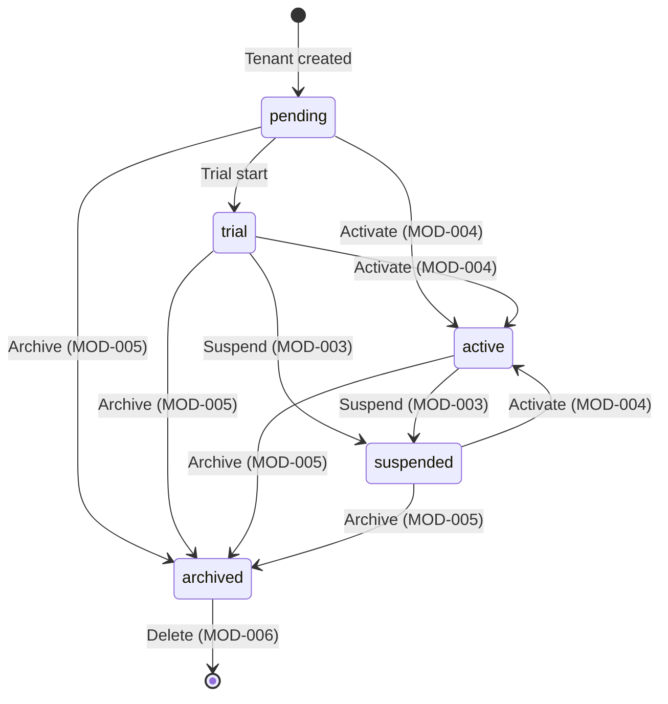

---

## SCR-014: Tenant Detail (Super Admin)

### 1. Screen Overview

| Field | Value |
|-------|-------|
| Screen Name | Tenant Detail |
| Purpose | View comprehensive information about a specific tenant including configuration, status, and metadata |
| Core Functions | View tenant info, trigger lifecycle actions, impersonate |
| Screen Type | Full Page |
| Layout Structure | Header → Sidebar → Content (Summary card, detail tabs) |
| Active Navigation Item | Tenants |
| Breadcrumb Structure | Home > Tenants > {tenantName} |
| Entry Points | SCR-013 row click |
| Exit Points | Back to tenant list, lifecycle modals |
| Data Dependencies | `GET /api/tenants/{id}` |
| User Roles Allowed | ROLE_SUPER_ADMIN |
| Screen Permission Requirements | Authenticated JWT with ROLE_SUPER_ADMIN, user must match tenant access rules |

### 2. UI Layout Structure

```
┌──────────────────────────────────────────────────────────┐
│ Header (breadcrumb: Home > Tenants > {tenantName})       │
├──────────┬───────────────────────────────────────────────┤
│          │  ┌──────────────────────────────────────────┐  │
│          │  │ Tenant Summary Card                      │  │
│          │  │  Name | Code | Status | Plan | Domain    │  │
│          │  │  Action buttons: Suspend/Activate/       │  │
│ Sidebar  │  │  Archive/Delete/Impersonate              │  │
│          │  └──────────────────────────────────────────┘  │
│          │  ┌──────────────────────────────────────────┐  │
│          │  │ Detail Tabs                              │  │
│          │  │ [Configuration] [Metadata] [Usage]       │  │
│          │  └──────────────────────────────────────────┘  │
│          │  ┌──────────────────────────────────────────┐  │
│          │  │ Active Tab Content                       │  │
│          │  └──────────────────────────────────────────┘  │
└──────────┴───────────────────────────────────────────────┘
```

### 3. UI Elements

| Element Name | Element Type | Description | Default State | Visibility Condition | Permission Requirement |
|-------------|-------------|-------------|---------------|---------------------|----------------------|
| Tenant Name | Text (heading) | Tenant display name | Read-only | Always | ROLE_SUPER_ADMIN |
| Tenant Code | Text (monospace) | Tenant code | Read-only | Always | ROLE_SUPER_ADMIN |
| Status Badge | Badge | Current status | Read-only | Always | ROLE_SUPER_ADMIN |
| Plan Badge | Badge | Tenant plan tier | Read-only | Always | ROLE_SUPER_ADMIN |
| Domain | Text | Custom domain | Read-only | When configured | ROLE_SUPER_ADMIN |
| Timezone | Text | Tenant timezone | Read-only | Always | ROLE_SUPER_ADMIN |
| Locale | Text | Tenant locale | Read-only | Always | ROLE_SUPER_ADMIN |
| Currency | Text | Tenant currency | Read-only | Always | ROLE_SUPER_ADMIN |
| Created At | Text | Creation timestamp | Read-only | Always | ROLE_SUPER_ADMIN |
| Trial Ends At | Text | Trial expiration date | Read-only | When on trial plan | ROLE_SUPER_ADMIN |
| Storage Quota | Progress Bar | Used/total storage | Read-only | When quota is set | ROLE_SUPER_ADMIN |
| Max Users | Text | Maximum allowed users | Read-only | When limit is set | ROLE_SUPER_ADMIN |
| Onboarding Progress | Progress Bar | Onboarding completion percentage | Read-only | Always | ROLE_SUPER_ADMIN |
| Suspend Button | Button (warning) | Opens MOD-003 | Enabled | Status is `active`/`trial` | ROLE_SUPER_ADMIN |
| Activate Button | Button (success) | Opens MOD-004 | Enabled | Status is `suspended`/`pending`/`trial` | ROLE_SUPER_ADMIN |
| Archive Button | Button (warning) | Opens MOD-005 | Enabled | Status is not `archived` | ROLE_SUPER_ADMIN |
| Delete Button | Button (destructive) | Opens MOD-006 | Enabled | Always | ROLE_SUPER_ADMIN |
| Impersonate Button | Button (secondary) | Opens MOD-007 | Enabled | Status is `active` | ROLE_SUPER_ADMIN |
| Back Button | Button (ghost) | Navigate to SCR-013 | Enabled | Always | ROLE_SUPER_ADMIN |
| Tab: Configuration | Tab | Shows timezone, locale, currency, date/time formats | Default active | Always | ROLE_SUPER_ADMIN |
| Tab: Metadata | Tab | Shows JSON metadata, billing info | Inactive | Always | ROLE_SUPER_ADMIN |
| Tab: Usage | Tab | Shows storage usage, user count, rate limits | Inactive | Always | ROLE_SUPER_ADMIN |

### 4. Interaction Behavior

All lifecycle actions (Suspend, Activate, Archive, Delete, Impersonate) follow the same pattern as SCR-013 — they open the respective modal (MOD-003 through MOD-007) with the tenant context pre-populated.

### 5. Conditional UI / UX Behavior

| Condition | Behavior |
|-----------|----------|
| Tenant is archived | Only Delete button available, muted styling on summary |
| Tenant trial expired | Warning callout: "Trial has expired on {date}." |
| Storage used > 80% quota | Storage bar turns amber |
| Storage used > 95% quota | Storage bar turns red with warning text |
| Read-only tenant | Info banner: "This tenant is in read-only mode." |

### 6. API Endpoint Mapping

| Endpoint | HTTP Method | Purpose | Triggered By | Request Payload | Success Response Behavior | Error Response Behavior |
|----------|-------------|---------|-------------|-----------------|--------------------------|------------------------|
| `/api/tenants/{id}` | GET | Fetch tenant detail | Page load | None | Render all panels | Error state or 404 redirect |

### 7. Navigation Rules

| Action | Destination Screen | Navigation Type |
|--------|-------------------|-----------------|
| Click Back | SCR-013 | `router.push('/tenants')` |
| Lifecycle modal success | Stay on SCR-014, refresh | Modal close + refetch |

### 8. Error Handling

| Scenario | API Response | UI Behavior |
|----------|-------------|-------------|
| Tenant not found | 404 | Redirect to SCR-013 with toast: "Tenant not found." |
| Fetch fails | 5xx | Error state with retry |
| Token expired | 401 | Open MOD-016 |

### 9. Screen State Management

| State | Description | Visual Indicator |
|-------|-------------|------------------|
| Loading | Fetching tenant detail | Skeleton panels |
| Loaded | Tenant data displayed | Full detail view |
| Error | Fetch failed | Error state with retry |
| Not Found | Tenant doesn't exist | Redirect |

### 10. State Transition Table

| Current State | Action | Next State |
|---------------|--------|------------|
| Loading | API success | Loaded |
| Loading | 404 | Not Found |
| Loaded | Lifecycle action success | Loading (refetch) |

### 11. System Events / Audit Events

| Event | Trigger |
|-------|---------|
| TenantDetailViewed | Page load |

### 12. Diagrams

No additional diagrams beyond the Tenant State Machine in SCR-013.

---

## MOD-001: Approve / Reject Quote

### 1. Screen Overview

| Field | Value |
|-------|-------|
| Screen Name | Approve / Reject Quote |
| Purpose | Capture the approval or rejection decision for a quote comparison run pending manual review, with a mandatory reason for audit trail |
| Core Functions | Select decision (approve/reject), provide reason, submit decision |
| Screen Type | Slide-over Modal (40% width from right) |
| Layout Structure | Modal header, decision summary, form fields, action bar |
| Active Navigation Item | N/A (modal overlay) |
| Breadcrumb Structure | N/A |
| Entry Points | SCR-004 "Approve/Reject" button, SCR-006 "Approve" or "Reject" button |
| Exit Points | Submit → close modal and update parent, Cancel → close modal |
| Data Dependencies | `runId`, `tenantId`, `rfqId` from parent screen context; pre-set `decision` from trigger button |
| User Roles Allowed | ROLE_USER, ROLE_ADMIN, ROLE_TENANT_ADMIN |
| Screen Permission Requirements | Authenticated JWT, tenant context matching run's tenant |

### 2. UI Layout Structure

```
┌────────────────────────────────┐
│ Modal Header                   │
│  "Approve Quote Run" or        │
│  "Reject Quote Run"            │
│  [X Close]                     │
├────────────────────────────────┤
│ Run Summary                    │
│  Run ID: {runId}               │
│  RFQ: {rfqId}                  │
│  Current Status: pending       │
│  Top Vendor: {vendorId}        │
│  Top Score: {score}            │
├────────────────────────────────┤
│ Decision Section               │
│  Decision: [Approve] [Reject]  │
│  (pre-selected from trigger)   │
│                                │
│  Reason *:                     │
│  [Textarea - required]         │
│                                │
├────────────────────────────────┤
│ Action Bar                     │
│  [Cancel]  [Confirm Decision]  │
└────────────────────────────────┘
```

### 3. UI Elements

| Element Name | Element Type | Description | Default State | Visibility Condition | Permission Requirement |
|-------------|-------------|-------------|---------------|---------------------|----------------------|
| Modal Title | Text (heading) | "Approve Quote Run" or "Reject Quote Run" based on preset decision | Dynamic | Always | Authenticated |
| Close Button | Icon Button (X) | Closes modal without action | Enabled | Always | Authenticated |
| Run Summary | Info Display | Read-only summary of the run being decided | Populated from context | Always | Authenticated |
| Decision Selector | Toggle/Segment | Toggle between "Approve" and "Reject" | Pre-selected based on trigger | Always | Authenticated |
| Reason Textarea | Form Field (textarea) | Mandatory reason for the decision (min 1 char) | Empty, required | Always | Authenticated |
| Cancel Button | Button (ghost) | Closes modal without action | Enabled | Always | Authenticated |
| Confirm Decision Button | Button (primary: green for approve, red for reject) | Submits the decision | Disabled until reason is provided | Always | Authenticated |

### 4. Interaction Behavior

#### Action: Submit Decision

| Field | Value |
|-------|-------|
| Action Name | Confirm Approval/Rejection |
| Trigger Element | Confirm Decision Button |
| Preconditions | Decision is selected, reason is non-empty |
| Validation Rules | `decision`: must be "approve" or "reject". `reason`: required, non-empty string after trim. |
| System Process | 1. Disable form inputs and show spinner on button. 2. Send `POST /api/{tenantId}/quotes/{runId}/approval` with `{ "decision": string, "reason": string }`. 3. On 200: show success toast, close modal, trigger parent screen status refresh. 4. On 400: show validation error in modal. 5. On 404: show "Run not found" error. 6. On 409: show conflict error (already decided). |
| API Endpoint Used | `POST /api/{tenantId}/quotes/{runId}/approval` |
| Result | Decision recorded, run status updated |
| Next Navigation | Close modal → parent screen refreshed |

### 5. Conditional UI / UX Behavior

| Condition | Behavior |
|-----------|----------|
| Decision is "approve" | Confirm button is green with text "Confirm Approval". Modal title: "Approve Quote Run". |
| Decision is "reject" | Confirm button is red with text "Confirm Rejection". Modal title: "Reject Quote Run". |
| User switches decision in modal | Button color and text update accordingly |
| Reason field is empty | Confirm button remains disabled |
| API returns 409 (already decided) | Show error: "This run has already been decided by another user." Close button remains available. |

### 6. API Endpoint Mapping

| Endpoint | HTTP Method | Purpose | Triggered By | Request Payload | Success Response Behavior | Error Response Behavior |
|----------|-------------|---------|-------------|-----------------|--------------------------|------------------------|
| `/api/{tenantId}/quotes/{runId}/approval` | POST | Submit approval decision | Confirm Decision Button | `{ "decision": "approve"\|"reject", "reason": string }` | Close modal, success toast, refresh parent | Display error in modal |

### 7. Navigation Rules

| Action | Destination Screen | Navigation Type |
|--------|-------------------|-----------------|
| Confirm (success) | Close modal → parent screen refreshed | Modal close |
| Cancel | Close modal → parent screen unchanged | Modal close |
| Close (X) | Close modal → parent screen unchanged | Modal close |

### 8. Error Handling

| Scenario | API Response | UI Behavior |
|----------|-------------|-------------|
| Invalid decision value | 400 `{ "error": "..." }` | Inline error message in modal |
| Empty reason | 400 `{ "error": "..." }` | Inline error on reason field |
| Run not found | 404 `{ "error": "Quote comparison run not found" }` | Error banner in modal, only close action available |
| Run not pending | 409 `{ "error": "Quote comparison run is not pending approval" }` | Error banner: "This run is no longer pending." |
| Concurrency conflict | 409 `{ "error": "Approval conflict: this run was already decided" }` | Error banner: "Already decided by another user." |
| Auth expired | 401 | Close modal, open MOD-016 |

### 9. Screen State Management

| State | Description | Visual Indicator |
|-------|-------------|------------------|
| Idle | Form ready for input | Decision pre-selected, reason empty |
| Valid | Reason provided | Confirm button enabled |
| Submitting | API request in flight | Button spinner, inputs disabled |
| Error | Submission failed | Error message displayed |
| Success | Decision accepted | Success toast, modal closing |

### 10. State Transition Table

| Current State | Action | Next State |
|---------------|--------|------------|
| Idle | Enter reason text | Valid |
| Valid | Clear reason | Idle |
| Valid | Click Confirm | Submitting |
| Submitting | API 200 | Success (close) |
| Submitting | API 4xx | Error |
| Error | Edit reason | Valid |
| Any | Click Cancel/Close | Modal closed |

### 11. System Events / Audit Events

| Event | Trigger |
|-------|---------|
| QuoteApproved | Successful approval decision (200) |
| QuoteRejected | Successful rejection decision (200) |
| ApprovalOverrideRecorded | Decision trail entry created (approval_override) |

### 12. Diagrams

#### Interaction Flow

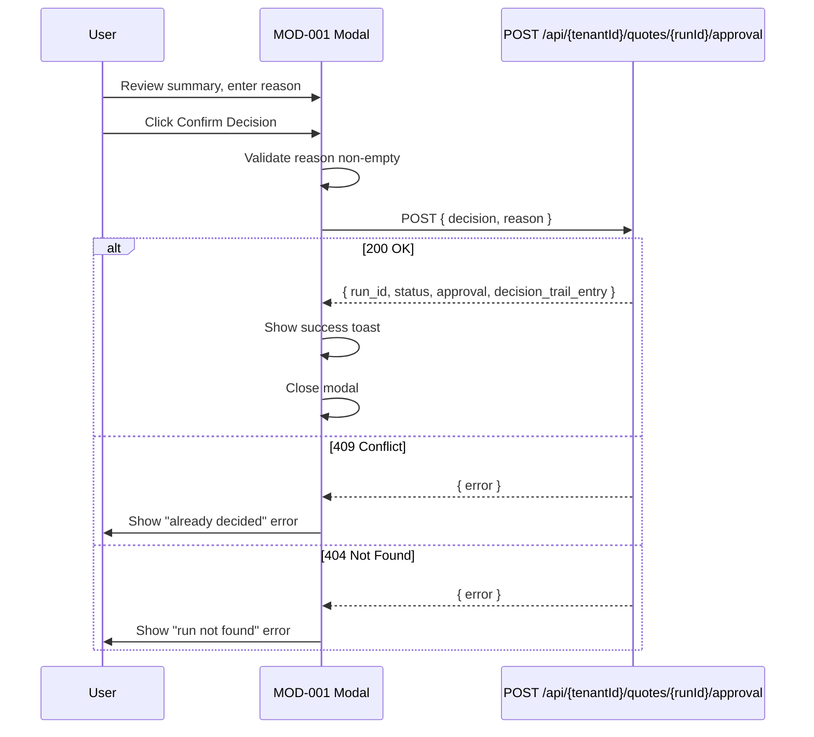

---

## MOD-002: Create Tenant

### 1. Screen Overview

| Field | Value |
|-------|-------|
| Screen Name | Create Tenant |
| Purpose | Onboard a new tenant with organization details and initial admin account |
| Core Functions | Enter tenant details, admin credentials, select plan, submit for creation |
| Screen Type | Slide-over Modal (45% width from right) |
| Layout Structure | Modal header, form sections, action bar |
| Active Navigation Item | N/A |
| Breadcrumb Structure | N/A |
| Entry Points | SCR-013 "New Tenant" button |
| Exit Points | Submit → close modal and refresh parent, Cancel → close modal |
| Data Dependencies | None |
| User Roles Allowed | ROLE_SUPER_ADMIN |
| Screen Permission Requirements | Authenticated JWT with ROLE_SUPER_ADMIN |

### 2. UI Layout Structure

```
┌────────────────────────────────────┐
│ Modal Header                       │
│  "Create New Tenant" [X Close]     │
├────────────────────────────────────┤
│ Organization Details               │
│  Name *: [input]                   │
│  Code *: [input]                   │
│  Domain: [input]                   │
│  Plan: [Starter ▾]                 │
├────────────────────────────────────┤
│ Admin Account                      │
│  Admin Name *: [input]             │
│  Admin Email *: [input]            │
│  Admin Password *: [input]         │
├────────────────────────────────────┤
│ Action Bar                         │
│  [Cancel]  [Create Tenant]         │
└────────────────────────────────────┘
```

### 3. UI Elements

| Element Name | Element Type | Description | Default State | Visibility Condition | Permission Requirement |
|-------------|-------------|-------------|---------------|---------------------|----------------------|
| Tenant Name Input | Form Field (text) | Organization name | Empty, required | Always | ROLE_SUPER_ADMIN |
| Tenant Code Input | Form Field (text) | Unique tenant code (max 50 chars, alphanumeric) | Empty, required | Always | ROLE_SUPER_ADMIN |
| Domain Input | Form Field (text) | Optional custom domain | Empty | Always | ROLE_SUPER_ADMIN |
| Plan Selector | Dropdown | Tenant plan: Starter, Professional, Enterprise | Starter | Always | ROLE_SUPER_ADMIN |
| Admin Name Input | Form Field (text) | Initial admin user name | Empty, required | Always | ROLE_SUPER_ADMIN |
| Admin Email Input | Form Field (email) | Initial admin email | Empty, required | Always | ROLE_SUPER_ADMIN |
| Admin Password Input | Form Field (password) | Initial admin password | Empty, required | Always | ROLE_SUPER_ADMIN |
| Cancel Button | Button (ghost) | Close without creating | Enabled | Always | ROLE_SUPER_ADMIN |
| Create Tenant Button | Button (primary) | Submit tenant creation | Disabled until all required fields valid | Always | ROLE_SUPER_ADMIN |

### 4. Interaction Behavior

#### Action: Create Tenant

| Field | Value |
|-------|-------|
| Action Name | Submit Tenant Creation |
| Trigger Element | Create Tenant Button |
| Preconditions | All required fields populated and valid |
| Validation Rules | `name`: required, non-empty. `code`: required, max 50 chars, unique. `adminEmail`: required, valid email. `adminPassword`: required. `adminName`: required. |
| System Process | 1. Client-side validation. 2. Disable form, show spinner. 3. Send `POST /api/tenants` with `{ name, code, domain, adminEmail, adminName, adminPassword, plan }`. 4. On 201: success toast "Tenant created successfully", close modal, refresh SCR-013. 5. On 400: show validation errors inline. |
| API Endpoint Used | `POST /api/tenants` |
| Result | Tenant created with initial admin user |
| Next Navigation | Close modal → SCR-013 refreshed |

### 5. Conditional UI / UX Behavior

| Condition | Behavior |
|-----------|----------|
| Code field loses focus | Auto-validate format (alphanumeric, max 50) |
| Email field loses focus | Validate email format |
| All required fields filled | Create button becomes enabled |
| API returns duplicate code error | Inline error on code field: "This code is already in use." |

### 6. API Endpoint Mapping

| Endpoint | HTTP Method | Purpose | Triggered By | Request Payload | Success Response Behavior | Error Response Behavior |
|----------|-------------|---------|-------------|-----------------|--------------------------|------------------------|
| `/api/tenants` | POST | Create tenant | Create Tenant Button | `{ "name": string, "code": string, "domain"?: string, "adminEmail": string, "adminName": string, "adminPassword": string, "plan"?: "starter"\|"professional"\|"enterprise" }` | Success toast, close modal, refresh list | Inline errors |

### 7. Navigation Rules

| Action | Destination Screen | Navigation Type |
|--------|-------------------|-----------------|
| Create (success) | Close modal → SCR-013 refreshed | Modal close |
| Cancel / Close (X) | Close modal | Modal close |

### 8. Error Handling

| Scenario | API Response | UI Behavior |
|----------|-------------|-------------|
| Missing required fields | 400 | Inline field errors |
| Duplicate tenant code | 400 | Inline error on code field |
| Missing admin password | 400 `{ "message": "Admin password is required..." }` | Inline error on password field |
| Onboarding fails | 400 | Error banner in modal with message |
| Token expired | 401 | Close modal, open MOD-016 |

### 9. Screen State Management

| State | Description | Visual Indicator |
|-------|-------------|------------------|
| Idle | Empty form | All fields empty |
| Editing | User filling form | Fields populated |
| Submitting | Creation in progress | Spinner, disabled fields |
| Error | Creation failed | Error messages shown |
| Success | Tenant created | Toast, modal closing |

### 10. State Transition Table

| Current State | Action | Next State |
|---------------|--------|------------|
| Idle | Type in field | Editing |
| Editing | Click Create (valid) | Submitting |
| Submitting | API 201 | Success (close) |
| Submitting | API 400 | Error |
| Error | Edit field | Editing |

### 11. System Events / Audit Events

| Event | Trigger |
|-------|---------|
| TenantCreated | Successful POST /api/tenants (201) |
| AdminUserCreated | Part of tenant onboarding (server-side) |

### 12. Diagrams

No additional diagrams required for this modal.

---

## MOD-003: Suspend Tenant Confirmation

### 1. Screen Overview

| Field | Value |
|-------|-------|
| Screen Name | Suspend Tenant Confirmation |
| Purpose | Confirm the suspension of an active tenant, which disables all tenant users |
| Core Functions | Display impact warning, confirm suspension |
| Screen Type | Slide-over Modal (30% width from right) |
| Layout Structure | Modal header, warning, tenant info, action bar |
| Active Navigation Item | N/A |
| Breadcrumb Structure | N/A |
| Entry Points | SCR-013 or SCR-014 Suspend action |
| Exit Points | Confirm → close and refresh, Cancel → close |
| Data Dependencies | Tenant ID, name, current status from parent context |
| User Roles Allowed | ROLE_SUPER_ADMIN (or ROLE_TENANT_ADMIN for own tenant) |
| Screen Permission Requirements | Authenticated JWT, appropriate role |

### 2. UI Layout Structure

```
┌──────────────────────────────┐
│ Modal Header                 │
│  "Suspend Tenant" [X]        │
├──────────────────────────────┤
│ ⚠ Warning Banner             │
│  "Suspending this tenant     │
│   will disable all users     │
│   and block access."         │
├──────────────────────────────┤
│ Tenant: {tenantName}         │
│ Code: {tenantCode}           │
│ Current Status: {status}     │
├──────────────────────────────┤
│ [Cancel]  [Suspend Tenant]   │
└──────────────────────────────┘
```

### 3. UI Elements

| Element Name | Element Type | Description | Default State | Visibility Condition | Permission Requirement |
|-------------|-------------|-------------|---------------|---------------------|----------------------|
| Warning Banner | Alert (warning) | Explains impact of suspension | Visible | Always | Appropriate role |
| Tenant Info | Text Display | Name, code, current status | Read-only | Always | Appropriate role |
| Cancel Button | Button (ghost) | Close without action | Enabled | Always | Appropriate role |
| Suspend Tenant Button | Button (destructive/warning) | Confirm suspension | Enabled | Always | Appropriate role |

### 4. Interaction Behavior

#### Action: Confirm Suspension

| Field | Value |
|-------|-------|
| Action Name | Confirm Tenant Suspension |
| Trigger Element | Suspend Tenant Button |
| Preconditions | Tenant status is `active` or `trial` |
| Validation Rules | None (confirmation modal) |
| System Process | 1. Disable button, show spinner. 2. Send `POST /api/tenants/{id}/suspend`. 3. On 200: success toast, close modal, refresh parent. 4. On error: show error in modal. |
| API Endpoint Used | `POST /api/tenants/{id}/suspend` |
| Result | Tenant suspended, all users disabled |
| Next Navigation | Close modal → parent refreshed |

### 5. Conditional UI / UX Behavior

| Condition | Behavior |
|-----------|----------|
| Tenant is own tenant (Tenant Admin) | Additional warning: "You will lose access to this tenant." |

### 6. API Endpoint Mapping

| Endpoint | HTTP Method | Purpose | Triggered By | Request Payload | Success Response Behavior | Error Response Behavior |
|----------|-------------|---------|-------------|-----------------|--------------------------|------------------------|
| `/api/tenants/{id}/suspend` | POST | Suspend tenant | Suspend Button | None | Success toast, close modal | Error banner in modal |

### 7. Navigation Rules

| Action | Destination Screen | Navigation Type |
|--------|-------------------|-----------------|
| Confirm (success) | Close modal → parent refreshed | Modal close |
| Cancel / Close | Close modal | Modal close |

### 8. Error Handling

| Scenario | API Response | UI Behavior |
|----------|-------------|-------------|
| Tenant not found | 404 | Error: "Tenant not found." |
| Already suspended | 400 | Error: "Tenant is already suspended." |
| Unauthorized | 403 | Error: "You do not have permission." |

### 9. Screen State Management

| State | Description | Visual Indicator |
|-------|-------------|------------------|
| Idle | Confirmation ready | Warning visible |
| Submitting | Request in flight | Spinner |
| Error | Failed | Error message |
| Success | Suspended | Toast, closing |

### 10. State Transition Table

| Current State | Action | Next State |
|---------------|--------|------------|
| Idle | Click Suspend | Submitting |
| Submitting | 200 | Success (close) |
| Submitting | Error | Error |

### 11. System Events / Audit Events

| Event | Trigger |
|-------|---------|
| TenantSuspended | Successful POST (200) |
| TenantUsersDisabled | Server-side (all tenant users suspended) |

### 12. Diagrams

No additional diagrams required.

---

## MOD-004: Activate Tenant Confirmation

### 1. Screen Overview

| Field | Value |
|-------|-------|
| Screen Name | Activate Tenant Confirmation |
| Purpose | Confirm the activation of a suspended, pending, or trial tenant |
| Core Functions | Display activation info, confirm activation |
| Screen Type | Slide-over Modal (30% width from right) |
| Layout Structure | Modal header, info panel, action bar |
| Active Navigation Item | N/A |
| Breadcrumb Structure | N/A |
| Entry Points | SCR-013 or SCR-014 Activate action |
| Exit Points | Confirm → close and refresh, Cancel → close |
| Data Dependencies | Tenant ID, name, current status from parent context |
| User Roles Allowed | ROLE_SUPER_ADMIN |
| Screen Permission Requirements | Authenticated JWT with ROLE_SUPER_ADMIN |

### 2. UI Layout Structure

```
┌──────────────────────────────┐
│ Modal Header                 │
│  "Activate Tenant" [X]       │
├──────────────────────────────┤
│ ✓ Info Banner                │
│  "Activating this tenant     │
│   will re-enable user        │
│   access."                   │
├──────────────────────────────┤
│ Tenant: {tenantName}         │
│ Current Status: {status}     │
├──────────────────────────────┤
│ [Cancel]  [Activate Tenant]  │
└──────────────────────────────┘
```

### 3. UI Elements

| Element Name | Element Type | Description | Default State | Visibility Condition | Permission Requirement |
|-------------|-------------|-------------|---------------|---------------------|----------------------|
| Info Banner | Alert (info) | Explains activation impact | Visible | Always | ROLE_SUPER_ADMIN |
| Tenant Info | Text Display | Name, current status | Read-only | Always | ROLE_SUPER_ADMIN |
| Cancel Button | Button (ghost) | Close without action | Enabled | Always | ROLE_SUPER_ADMIN |
| Activate Tenant Button | Button (success/green) | Confirm activation | Enabled | Always | ROLE_SUPER_ADMIN |

### 4. Interaction Behavior

#### Action: Confirm Activation

| Field | Value |
|-------|-------|
| Action Name | Confirm Tenant Activation |
| Trigger Element | Activate Tenant Button |
| Preconditions | Tenant status is `suspended`, `pending`, or `trial` |
| Validation Rules | None |
| System Process | 1. Disable button, show spinner. 2. Send `POST /api/tenants/{id}/activate`. 3. On 200: success toast, close modal, refresh parent. |
| API Endpoint Used | `POST /api/tenants/{id}/activate` |
| Result | Tenant activated |
| Next Navigation | Close modal → parent refreshed |

### 5. Conditional UI / UX Behavior

| Condition | Behavior |
|-----------|----------|
| Tenant was suspended | Banner mentions: "Users will be re-enabled." |
| Tenant was pending | Banner mentions: "Tenant will become fully operational." |

### 6. API Endpoint Mapping

| Endpoint | HTTP Method | Purpose | Triggered By | Request Payload | Success Response Behavior | Error Response Behavior |
|----------|-------------|---------|-------------|-----------------|--------------------------|------------------------|
| `/api/tenants/{id}/activate` | POST | Activate tenant | Activate Button | None | Success toast, close modal | Error banner |

### 7. Navigation Rules

| Action | Destination Screen | Navigation Type |
|--------|-------------------|-----------------|
| Confirm (success) | Close modal → parent refreshed | Modal close |
| Cancel / Close | Close modal | Modal close |

### 8. Error Handling

| Scenario | API Response | UI Behavior |
|----------|-------------|-------------|
| Tenant not found | 404 | Error in modal |
| Already active | 400 | Error: "Tenant is already active." |
| Unauthorized | 403 | Error message |

### 9–12. (Follow same pattern as MOD-003)

System Event: `TenantActivated` on successful POST (200).

---

## MOD-005: Archive Tenant Confirmation

### 1. Screen Overview

| Field | Value |
|-------|-------|
| Screen Name | Archive Tenant Confirmation |
| Purpose | Confirm archival of a tenant (irreversible — cannot be reactivated, only deleted) |
| Screen Type | Slide-over Modal (30% width from right) |
| Entry Points | SCR-013 or SCR-014 Archive action |
| User Roles Allowed | ROLE_SUPER_ADMIN |

### 2–3. UI Layout & Elements

Same pattern as MOD-003 with the following differences:
- **Warning Banner**: "Archiving this tenant is irreversible. The tenant cannot be reactivated, only deleted."
- **Action Button**: "Archive Tenant" (amber/warning styling)

### 4. Interaction Behavior — Confirm Archive

| Field | Value |
|-------|-------|
| API Endpoint Used | `POST /api/tenants/{id}/archive` |
| Result | Tenant archived permanently |

### 6. API Endpoint Mapping

| Endpoint | HTTP Method | Purpose | Triggered By | Request Payload | Success Response Behavior | Error Response Behavior |
|----------|-------------|---------|-------------|-----------------|--------------------------|------------------------|
| `/api/tenants/{id}/archive` | POST | Archive tenant | Archive Button | None | Success toast, close | Error banner |

System Event: `TenantArchived` on successful POST (200).

---

## MOD-006: Delete Tenant Confirmation

### 1. Screen Overview

| Field | Value |
|-------|-------|
| Screen Name | Delete Tenant Confirmation |
| Purpose | Permanently delete a tenant and all associated data (destructive, irreversible) |
| Screen Type | Slide-over Modal (30% width from right) |
| Entry Points | SCR-013 or SCR-014 Delete action |
| User Roles Allowed | ROLE_SUPER_ADMIN |

### 2–3. UI Layout & Elements

Same pattern as MOD-003 with:
- **Critical Warning Banner** (red): "This will permanently delete the tenant and ALL associated data. This action cannot be undone."
- **Confirmation Input**: User must type the tenant code to confirm deletion
- **Delete Button** (destructive/red): Disabled until confirmation code matches

### 4. Interaction Behavior — Confirm Delete

| Field | Value |
|-------|-------|
| Action Name | Confirm Tenant Deletion |
| Trigger Element | Delete Tenant Button |
| Preconditions | Confirmation code matches tenant code |
| Validation Rules | Typed code must exactly match tenant code |
| API Endpoint Used | `DELETE /api/tenants/{id}` |
| Result | Tenant permanently deleted |
| Next Navigation | Close modal → SCR-013 refreshed |

### 5. Conditional UI / UX Behavior

| Condition | Behavior |
|-----------|----------|
| Confirmation code does not match | Delete button remains disabled |
| Confirmation code matches | Delete button becomes enabled |

### 6. API Endpoint Mapping

| Endpoint | HTTP Method | Purpose | Triggered By | Request Payload | Success Response Behavior | Error Response Behavior |
|----------|-------------|---------|-------------|-----------------|--------------------------|------------------------|
| `/api/tenants/{id}` | DELETE | Delete tenant | Delete Button | None | Success toast, close, redirect to list | Error banner |

### 8. Error Handling

| Scenario | API Response | UI Behavior |
|----------|-------------|-------------|
| Not super admin | 403 `AccessDeniedHttpException` | Error: "Only Super Admins can delete tenants." |
| Deletion fails | 400 | Error banner with message |

System Event: `TenantDeleted` on successful DELETE.

---

## MOD-007: Impersonate Tenant

### 1. Screen Overview

| Field | Value |
|-------|-------|
| Screen Name | Impersonate Tenant |
| Purpose | Allow Super Admin to impersonate a tenant for support and debugging purposes |
| Screen Type | Slide-over Modal (30% width from right) |
| Entry Points | SCR-013 or SCR-014 Impersonate action |
| User Roles Allowed | ROLE_SUPER_ADMIN |

### 2–3. UI Layout & Elements

```
┌──────────────────────────────┐
│ "Impersonate Tenant" [X]     │
├──────────────────────────────┤
│ ⚠ Info Banner                │
│  "You will act as this       │
│   tenant. All actions will   │
│   be logged."                │
├──────────────────────────────┤
│ Tenant: {tenantName}         │
│ Reason: [input - optional]   │
├──────────────────────────────┤
│ [Cancel] [Start Impersonation] │
└──────────────────────────────┘
```

| Element Name | Element Type | Description | Default State |
|-------------|-------------|-------------|---------------|
| Info Banner | Alert (info/warning) | Explains impersonation scope | Visible |
| Tenant Info | Text Display | Tenant name and code | Read-only |
| Reason Input | Form Field (text) | Optional reason for impersonation | Empty, default: "Support activity" |
| Start Impersonation Button | Button (primary) | Initiates impersonation | Enabled |

### 4. Interaction Behavior

#### Action: Start Impersonation

| Field | Value |
|-------|-------|
| API Endpoint Used | `POST /api/tenants/{id}/impersonate` with query param `reason` |
| System Process | 1. Send POST. 2. On success: store impersonation token and session ID. 3. Show global impersonation banner. 4. Reload application with tenant context. |
| Result | Super Admin now operates within the impersonated tenant context |
| Next Navigation | Close modal → SCR-002 Dashboard (in impersonated tenant context) |

### 6. API Endpoint Mapping

| Endpoint | HTTP Method | Purpose | Triggered By | Request Payload | Success Response Behavior | Error Response Behavior |
|----------|-------------|---------|-------------|-----------------|--------------------------|------------------------|
| `/api/tenants/{id}/impersonate` | POST | Start impersonation | Start Button | Query: `?reason=string` | Store token, reload in tenant context | Error banner |

### 8. Error Handling

| Scenario | API Response | UI Behavior |
|----------|-------------|-------------|
| Tenant not active | 400 | Error: "Can only impersonate active tenants." |
| Not super admin | 403 | Error: "Insufficient permissions." |

System Event: `ImpersonationStarted` on successful POST.

---

## MOD-008: Stop Impersonation Confirmation

### 1. Screen Overview

| Field | Value |
|-------|-------|
| Screen Name | Stop Impersonation Confirmation |
| Purpose | End the current tenant impersonation session |
| Screen Type | Slide-over Modal (25% width from right) |
| Entry Points | Global impersonation banner "End Impersonation" button |
| User Roles Allowed | ROLE_USER (any authenticated, since impersonating) |

### 3. UI Elements

| Element Name | Element Type | Description | Default State |
|-------------|-------------|-------------|---------------|
| Reason Input | Form Field (text) | Optional reason for ending | "Session ended" |
| Stop Button | Button (primary) | Confirm end impersonation | Enabled |

### 4. Interaction Behavior

| Field | Value |
|-------|-------|
| API Endpoint Used | `POST /api/tenants/{id}/stop-impersonate` with header `X-Impersonation-Session-ID` and query `?reason=string` |
| System Process | 1. Send POST. 2. Clear impersonation token/session. 3. Reload with original Super Admin context. |
| Result | Impersonation ended, returned to Super Admin context |
| Next Navigation | SCR-013 Tenant Management |

### 6. API Endpoint Mapping

| Endpoint | HTTP Method | Purpose | Triggered By | Request Payload | Success Response Behavior | Error Response Behavior |
|----------|-------------|---------|-------------|-----------------|--------------------------|------------------------|
| `/api/tenants/{id}/stop-impersonate` | POST | Stop impersonation | Stop Button | Headers: `X-Impersonation-Session-ID`. Query: `?reason=string` | Restore admin context, redirect | Error banner |

System Event: `ImpersonationStopped` on successful POST.

---

## MOD-009: Suspend User Confirmation

### 1. Screen Overview

| Field | Value |
|-------|-------|
| Screen Name | Suspend User Confirmation |
| Purpose | Confirm suspension of an active user account |
| Screen Type | Slide-over Modal (30% width from right) |
| Entry Points | SCR-008 Suspend action |
| User Roles Allowed | ROLE_TENANT_ADMIN, ROLE_ADMIN |

### 2–3. UI Layout & Elements

```
┌──────────────────────────────┐
│ "Suspend User" [X]           │
├──────────────────────────────┤
│ ⚠ Warning                    │
│  "User will lose access      │
│   immediately."              │
├──────────────────────────────┤
│ User: {name} ({email})       │
│ Current Status: active       │
│ Reason: [textarea - optional]│
├──────────────────────────────┤
│ [Cancel]  [Suspend User]     │
└──────────────────────────────┘
```

### 4. Interaction Behavior

| Field | Value |
|-------|-------|
| API Endpoint Used | `POST /users/{id}/suspend` |
| Request Payload | `{ "reason"?: string }` |
| Result | User suspended, loses access immediately |

### 6. API Endpoint Mapping

| Endpoint | HTTP Method | Purpose | Triggered By | Request Payload | Success Response Behavior | Error Response Behavior |
|----------|-------------|---------|-------------|-----------------|--------------------------|------------------------|
| `/users/{id}/suspend` | POST | Suspend user | Suspend Button | `{ "reason"?: string }` (default: "Suspended by admin") | Success toast, close modal, refresh SCR-008 | Error banner |

### 8. Error Handling

| Scenario | API Response | UI Behavior |
|----------|-------------|-------------|
| User not found | 400 | Error message |
| Already suspended | 400 | Error: "User is already suspended." |

System Event: `UserSuspended` on successful POST (200).

---

## MOD-010: Activate User Confirmation

### 1. Screen Overview

| Field | Value |
|-------|-------|
| Screen Name | Activate User Confirmation |
| Purpose | Confirm activation of a suspended user account |
| Screen Type | Slide-over Modal (30% width from right) |
| Entry Points | SCR-008 Activate action |
| User Roles Allowed | ROLE_TENANT_ADMIN, ROLE_ADMIN |

### 2–3. UI Layout & Elements

Same pattern as MOD-009 with:
- **Info Banner** (positive): "User will regain access to the system."
- **Action Button**: "Activate User" (green/success)

### 4. Interaction Behavior

| Field | Value |
|-------|-------|
| API Endpoint Used | `POST /users/{id}/activate` |
| Request Payload | None |
| Result | User activated, access restored |

### 6. API Endpoint Mapping

| Endpoint | HTTP Method | Purpose | Triggered By | Request Payload | Success Response Behavior | Error Response Behavior |
|----------|-------------|---------|-------------|-----------------|--------------------------|------------------------|
| `/users/{id}/activate` | POST | Activate user | Activate Button | None | Success toast, close modal, refresh SCR-008 | Error banner |

System Event: `UserActivated` on successful POST (200).

---

## MOD-011: Edit Setting

### 1. Screen Overview

| Field | Value |
|-------|-------|
| Screen Name | Edit Setting |
| Purpose | Modify the value of a single application setting |
| Screen Type | Slide-over Modal (35% width from right) |
| Entry Points | SCR-009 Edit action on a setting row |
| User Roles Allowed | ROLE_TENANT_ADMIN, ROLE_ADMIN |

### 2–3. UI Layout & Elements

```
┌──────────────────────────────────┐
│ "Edit Setting" [X]               │
├──────────────────────────────────┤
│ Setting Key: {key} (read-only)   │
│ Type: {type}                     │
│ Scope: {scope}                   │
├──────────────────────────────────┤
│ Value *:                         │
│  [input - type depends on        │
│   setting type]                  │
│                                  │
│ Current: {currentValue}          │
├──────────────────────────────────┤
│ [Cancel]  [Save Setting]         │
└──────────────────────────────────┘
```

| Element Name | Element Type | Description | Default State | Visibility Condition | Permission Requirement |
|-------------|-------------|-------------|---------------|---------------------|----------------------|
| Setting Key Display | Text (monospace, read-only) | The setting key | Pre-populated | Always | Admin role |
| Type Badge | Badge | Setting data type | Pre-populated | Always | Admin role |
| Scope Badge | Badge | Setting scope | Pre-populated | Always | Admin role |
| Value Input | Dynamic Form Field | Input type matches setting type: text for string, number for int/float, toggle for bool | Pre-populated with current value | Always | Admin role |
| Current Value Display | Text (muted) | Shows the previous value for reference | Pre-populated | Always | Admin role |
| Cancel Button | Button (ghost) | Close without saving | Enabled | Always | Admin role |
| Save Setting Button | Button (primary) | Submit the updated value | Enabled when value changed | Always | Admin role |

### 4. Interaction Behavior

#### Action: Save Setting

| Field | Value |
|-------|-------|
| Action Name | Save Setting Value |
| Trigger Element | Save Setting Button |
| Preconditions | Value has been modified |
| Validation Rules | Value must be valid for the setting type |
| System Process | 1. Send `PATCH /api/settings/{key}` with `{ "key": key, "value": newValue }`. 2. On success: toast, close, refresh SCR-009. |
| API Endpoint Used | `PATCH /api/settings/{key}` |
| Result | Setting value updated |

### 5. Conditional UI / UX Behavior

| Condition | Behavior |
|-----------|----------|
| Setting type is `bool` | Value input is a toggle switch |
| Setting type is `int` or `float` | Value input is a number field |
| Setting type is `string` | Value input is a text field |
| Setting is encrypted | Current value shown as "••••••" |
| Value unchanged from current | Save button disabled |

### 6. API Endpoint Mapping

| Endpoint | HTTP Method | Purpose | Triggered By | Request Payload | Success Response Behavior | Error Response Behavior |
|----------|-------------|---------|-------------|-----------------|--------------------------|------------------------|
| `/api/settings/{key}` | PATCH | Update setting | Save Button | `{ "key": string, "value": mixed }` | Success toast, close modal | Error banner |

System Event: `SettingUpdated` on successful PATCH.

---

## MOD-012: Bulk Update Settings

### 1. Screen Overview

| Field | Value |
|-------|-------|
| Screen Name | Bulk Update Settings |
| Purpose | Update multiple settings at once |
| Screen Type | Slide-over Modal (50% width from right) |
| Entry Points | SCR-009 "Bulk Update" button |
| User Roles Allowed | ROLE_TENANT_ADMIN, ROLE_ADMIN |

### 2–3. UI Layout & Elements

```
┌────────────────────────────────────────┐
│ "Bulk Update Settings" [X]             │
├────────────────────────────────────────┤
│ Editable Settings Table                │
│  Key (read-only) | Current | New Value │
│  {key1}          | {val1}  | [input]   │
│  {key2}          | {val2}  | [input]   │
│  {key3}          | {val3}  | [input]   │
│  ...                                   │
├────────────────────────────────────────┤
│ Changed: {count} settings              │
│ [Cancel]  [Update All]                 │
└────────────────────────────────────────┘
```

| Element Name | Element Type | Description | Default State |
|-------------|-------------|-------------|---------------|
| Settings Edit Table | Editable Table | All non-read-only settings with editable value column | Populated with current values |
| Changed Count | Text | Shows how many settings have been modified | "0 settings changed" |
| Update All Button | Button (primary) | Submits all changed settings | Disabled until at least 1 change |

### 4. Interaction Behavior

#### Action: Bulk Update

| Field | Value |
|-------|-------|
| API Endpoint Used | `POST /api/settings/bulk-update` |
| Request Payload | `[{ "key": string, "value": mixed }, ...]` (only changed settings) |
| Result | All changed settings updated atomically |

### 6. API Endpoint Mapping

| Endpoint | HTTP Method | Purpose | Triggered By | Request Payload | Success Response Behavior | Error Response Behavior |
|----------|-------------|---------|-------------|-----------------|--------------------------|------------------------|
| `/api/settings/bulk-update` | POST | Bulk update settings | Update All Button | `[{ "key": string, "value": mixed }, ...]` | Success toast, close modal, refresh SCR-009 | Error banner with failed keys |

System Event: `SettingsBulkUpdated` on successful POST.

---

## MOD-013: Edit Feature Flag

### 1. Screen Overview

| Field | Value |
|-------|-------|
| Screen Name | Edit Feature Flag |
| Purpose | Modify a feature flag's enabled state, value, and view its configuration |
| Screen Type | Slide-over Modal (40% width from right) |
| Entry Points | SCR-010 Edit action on a flag row |
| User Roles Allowed | ROLE_TENANT_ADMIN, ROLE_ADMIN |

### 2–3. UI Layout & Elements

```
┌──────────────────────────────────────┐
│ "Edit Feature Flag" [X]              │
├──────────────────────────────────────┤
│ Flag: {name} (read-only, monospace)  │
│ Strategy: {strategy} (read-only)     │
│ Scope: {scope}                       │
│ Override: {override or "None"}       │
│ Metadata: {JSON display}            │
├──────────────────────────────────────┤
│ Enabled: [Toggle]                    │
│ Value:   [JSON editor / input]       │
├──────────────────────────────────────┤
│ [Cancel]  [Save Flag]               │
└──────────────────────────────────────┘
```

| Element Name | Element Type | Description | Default State |
|-------------|-------------|-------------|---------------|
| Flag Name | Text (monospace, read-only) | Flag identifier | Pre-populated |
| Strategy Display | Badge (read-only) | Flag strategy | Pre-populated |
| Override Display | Badge (read-only) | Force on/off if set | Pre-populated |
| Enabled Toggle | Toggle Switch | Enable/disable the flag | Current state |
| Value Input | JSON Editor / Text | Flag value (varies by strategy) | Current value |
| Save Flag Button | Button (primary) | Submit changes | Enabled when value changed |

### 4. Interaction Behavior

#### Action: Save Feature Flag

| Field | Value |
|-------|-------|
| API Endpoint Used | `PATCH /api/feature-flags/{name}` |
| Request Payload | `{ "name": string, "enabled": bool, "value": mixed }` |
| Result | Flag updated |

### 5. Conditional UI / UX Behavior

| Condition | Behavior |
|-----------|----------|
| Override is FORCE_ON | Toggle disabled, info text: "Overridden to always ON" |
| Override is FORCE_OFF | Toggle disabled, info text: "Overridden to always OFF" |
| Strategy is `percentage_rollout` | Value input shows percentage slider |
| Strategy is `tenant_list` or `user_list` | Value input shows list editor |

### 6. API Endpoint Mapping

| Endpoint | HTTP Method | Purpose | Triggered By | Request Payload | Success Response Behavior | Error Response Behavior |
|----------|-------------|---------|-------------|-----------------|--------------------------|------------------------|
| `/api/feature-flags/{name}` | PATCH | Update flag | Save Flag Button | `{ "name": string, "enabled": bool, "value": mixed }` | Success toast, close modal, refresh SCR-010 | Error banner |

System Event: `FeatureFlagUpdated` on successful PATCH.

---

## MOD-014: Open Fiscal Period Confirmation

### 1. Screen Overview

| Field | Value |
|-------|-------|
| Screen Name | Open Fiscal Period Confirmation |
| Purpose | Confirm opening of a closed fiscal period |
| Screen Type | Slide-over Modal (25% width from right) |
| Entry Points | SCR-011 Open action |
| User Roles Allowed | ROLE_TENANT_ADMIN, ROLE_ADMIN |

### 3. UI Elements

```
┌──────────────────────────────┐
│ "Open Fiscal Period" [X]     │
├──────────────────────────────┤
│ Period: {name}               │
│ Date Range: {start} - {end}  │
│ Current Status: closed       │
├──────────────────────────────┤
│ [Cancel]  [Open Period]      │
└──────────────────────────────┘
```

### 4. Interaction Behavior

| Field | Value |
|-------|-------|
| API Endpoint Used | `POST /api/fiscal-periods/{id}/open` |
| Result | Period status changed to open |

### 6. API Endpoint Mapping

| Endpoint | HTTP Method | Purpose | Triggered By | Request Payload | Success Response Behavior | Error Response Behavior |
|----------|-------------|---------|-------------|-----------------|--------------------------|------------------------|
| `/api/fiscal-periods/{id}/open` | POST | Open period | Open Button | None | Success toast, close modal, refresh SCR-011 | Error banner |

System Event: `FiscalPeriodOpened` on successful POST.

---

## MOD-015: Close Fiscal Period Confirmation

### 1. Screen Overview

| Field | Value |
|-------|-------|
| Screen Name | Close Fiscal Period Confirmation |
| Purpose | Confirm closing of an open fiscal period (prevents further transactions) |
| Screen Type | Slide-over Modal (25% width from right) |
| Entry Points | SCR-011 Close action |
| User Roles Allowed | ROLE_TENANT_ADMIN, ROLE_ADMIN |

### 3. UI Elements

```
┌──────────────────────────────┐
│ "Close Fiscal Period" [X]    │
├──────────────────────────────┤
│ ⚠ Warning                    │
│  "Closing this period will   │
│   prevent new transactions." │
├──────────────────────────────┤
│ Period: {name}               │
│ Date Range: {start} - {end}  │
│ Current Status: open         │
├──────────────────────────────┤
│ [Cancel]  [Close Period]     │
└──────────────────────────────┘
```

### 4. Interaction Behavior

| Field | Value |
|-------|-------|
| API Endpoint Used | `POST /api/fiscal-periods/{id}/close` |
| Result | Period status changed to closed |

### 6. API Endpoint Mapping

| Endpoint | HTTP Method | Purpose | Triggered By | Request Payload | Success Response Behavior | Error Response Behavior |
|----------|-------------|---------|-------------|-----------------|--------------------------|------------------------|
| `/api/fiscal-periods/{id}/close` | POST | Close period | Close Button | None | `{ "message": "Fiscal period closed successfully" }` — toast, close, refresh | `{ "error": "..." }` — error banner |

### 8. Error Handling

| Scenario | API Response | UI Behavior |
|----------|-------------|-------------|
| Period not found | 404 | Error: "Period not found." |
| Close fails | 400 `{ "error": "..." }` | Error banner with message |
| No tenant context | 400 | Error: "Tenant context required." |

System Event: `FiscalPeriodClosed` on successful POST.

---

## MOD-016: Session Expired / Re-authenticate

### 1. Screen Overview

| Field | Value |
|-------|-------|
| Screen Name | Session Expired / Re-authenticate |
| Purpose | Handle expired JWT tokens by attempting silent refresh or prompting re-authentication |
| Screen Type | Centered Modal Overlay (not slide-over — centered dialog with backdrop) |
| Entry Points | Any API call returning 401 |
| Exit Points | Successful refresh → resume operation, Re-login → SCR-001 |
| User Roles Allowed | Any authenticated user (with expired token) |

### 2. UI Layout Structure

```
┌──────────────────────────────────┐
│         Session Expired          │
│                                  │
│  Your session has expired.       │
│                                  │
│  [Attempting to reconnect...]    │
│         or                       │
│  [Sign In Again]                 │
│                                  │
└──────────────────────────────────┘
```

### 3. UI Elements

| Element Name | Element Type | Description | Default State |
|-------------|-------------|-------------|---------------|
| Title | Text | "Session Expired" | Visible |
| Message | Text | Context-appropriate message | "Your session has expired." |
| Refresh Spinner | Loading Indicator | Shown during token refresh attempt | Visible during refresh |
| Sign In Again Button | Button (primary) | Navigate to SCR-001 | Visible after refresh fails |

### 4. Interaction Behavior

#### Action: Silent Token Refresh

| Field | Value |
|-------|-------|
| Trigger | 401 response intercepted by HTTP client |
| System Process | 1. Show modal with spinner. 2. Attempt `POST /auth/refresh` with stored `refreshToken`. 3. On 200: store new `accessToken`, close modal, retry original request. 4. On 401: show "Sign In Again" button. |
| API Endpoint Used | `POST /auth/refresh` |

#### Action: Sign In Again

| Field | Value |
|-------|-------|
| Trigger Element | Sign In Again Button |
| System Process | 1. Clear all session data. 2. Navigate to SCR-001. |
| Next Navigation | SCR-001 |

### 6. API Endpoint Mapping

| Endpoint | HTTP Method | Purpose | Triggered By | Request Payload | Success Response Behavior | Error Response Behavior |
|----------|-------------|---------|-------------|-----------------|--------------------------|------------------------|
| `/auth/refresh` | POST | Refresh access token | Automatic on 401 | `{ "refreshToken": string }` | Store new token, retry request | Show Sign In Again button |

---

## API Gap Analysis

The following features referenced in the existing frontend blueprint (`QUOTE_COMPARISON_FRONTEND_SCREEN_BLUEPRINT.md`) do **not** have corresponding API endpoints in `apps/canary-atomy-api`. These are documented here for future development planning.

| Feature Area | Missing Capability | Suggested API Endpoint |
|-------------|-------------------|----------------------|
| **Quote Comparison Run List** | No endpoint to list comparison runs by tenant | `GET /api/{tenantId}/quotes/runs?status=&page=&limit=` |
| **Single Run Retrieval** | No endpoint to fetch a single comparison run by ID | `GET /api/{tenantId}/quotes/{runId}` |
| **Decision Trail List** | No dedicated endpoint to list decision trail entries | `GET /api/{tenantId}/decision-trail?rfqId=&eventType=&page=&limit=` |
| **RFQ Management** | No CRUD endpoints for Requests for Quotation | `GET/POST/PATCH/DELETE /api/{tenantId}/rfqs` |
| **Quote Intake / Upload** | No file upload or document parsing endpoints | `POST /api/{tenantId}/quotes/intake` |
| **Quote Normalization** | No normalization/mapping endpoints | `POST /api/{tenantId}/quotes/normalize` |
| **Scoring Model Configuration** | No endpoints to configure scoring weights/criteria | `GET/PATCH /api/{tenantId}/scoring-models` |
| **Scenario Simulation** | No scenario management endpoints | `POST /api/{tenantId}/scenarios` |
| **Negotiation Workspace** | No negotiation round endpoints | `POST /api/{tenantId}/negotiations` |
| **Award Decision** | No award finalization endpoints | `POST /api/{tenantId}/awards` |
| **PO/Contract Handoff** | No integration handoff endpoints | `POST /api/{tenantId}/handoffs` |
| **Vendor Management** | No vendor profile/performance endpoints | `GET/POST /api/{tenantId}/vendors` |
| **Documents / Evidence Vault** | No document storage endpoints | `GET/POST /api/{tenantId}/documents` |
| **Reports & Analytics** | No reporting/export endpoints | `GET /api/{tenantId}/reports` |
| **Notifications** | No notification endpoints | `GET /api/{tenantId}/notifications` |
| **User CRUD** | No create/update/delete user endpoints (only list and lifecycle) | `POST/PATCH/DELETE /api/users` |
| **Password Reset** | No password reset flow endpoints | `POST /auth/forgot-password`, `POST /auth/reset-password` |
| **MFA Setup** | No MFA enrollment/verification endpoints | `POST /auth/mfa/setup`, `POST /auth/mfa/verify` |
| **Module Install/Uninstall UI** | API endpoints exist (`POST /api/modules/{moduleId}/install`, `DELETE /api/modules/{id}`) but no dedicated UI screens were designed for them yet | Add install/uninstall buttons to SCR-012 Module Registry |
| **Fiscal Period CRUD** | No create/update/delete endpoints for fiscal periods (only list, open, close) | `POST/PATCH/DELETE /api/fiscal-periods` |
| **Tenant Update** | No PATCH endpoint for updating tenant details | `PATCH /api/tenants/{id}` |
| **User Profile / Preferences** | No user self-service endpoints | `GET/PATCH /api/me` |
| **Audit Log** | No general audit log endpoints (only decision trail for quotes) | `GET /api/{tenantId}/audit-logs` |

---

## Global Navigation Flow Diagram

```mermaid
flowchart TD
    LOGIN[SCR-001: Sign In] -->|Login Success| DASH[SCR-002: Dashboard]
    
    DASH --> QC[SCR-003: New Comparison]
    DASH --> AQ[SCR-005: Approval Queue]
    DASH --> UM[SCR-008: User Management]
    
    QC -->|Submit| QR[SCR-004: Results]
    QR -->|Approve/Reject| MOD1[MOD-001: Approve/Reject]
    MOD1 -->|Success| QR
    
    AQ -->|Click Row| AD[SCR-006: Approval Detail]
    AD -->|Approve| MOD1
    AD -->|Reject| MOD1
    
    DASH --> DT[SCR-007: Decision Trail]
    DT -->|Click Run| QR
    
    UM -->|Suspend| MOD9[MOD-009: Suspend User]
    UM -->|Activate| MOD10[MOD-010: Activate User]
    
    DASH --> SET[SCR-009: Settings]
    SET -->|Edit| MOD11[MOD-011: Edit Setting]
    SET -->|Bulk| MOD12[MOD-012: Bulk Update]
    
    DASH --> FF[SCR-010: Feature Flags]
    FF -->|Edit| MOD13[MOD-013: Edit Flag]
    
    DASH --> FP[SCR-011: Fiscal Periods]
    FP -->|Open| MOD14[MOD-014: Open Period]
    FP -->|Close| MOD15[MOD-015: Close Period]
    
    DASH --> MOD[SCR-012: Modules]
    
    DASH -->|Super Admin| TM[SCR-013: Tenant Management]
    TM -->|View| TD[SCR-014: Tenant Detail]
    TM -->|Create| MOD2[MOD-002: Create Tenant]
    TM -->|Suspend| MOD3[MOD-003: Suspend Tenant]
    TM -->|Activate| MOD4[MOD-004: Activate Tenant]
    TM -->|Archive| MOD5[MOD-005: Archive Tenant]
    TM -->|Delete| MOD6[MOD-006: Delete Tenant]
    TM -->|Impersonate| MOD7[MOD-007: Impersonate]
    
    MOD7 -->|Start| DASH
    
    style LOGIN fill:#f5f5f5,stroke:#333
    style DASH fill:#e3f2fd,stroke:#1565c0
    style QC fill:#e8f5e9,stroke:#2e7d32
    style QR fill:#e8f5e9,stroke:#2e7d32
    style AQ fill:#fff3e0,stroke:#e65100
    style AD fill:#fff3e0,stroke:#e65100
    style TM fill:#fce4ec,stroke:#c62828
```

---

## Entity State Machine Diagrams

### Quote Comparison Run States

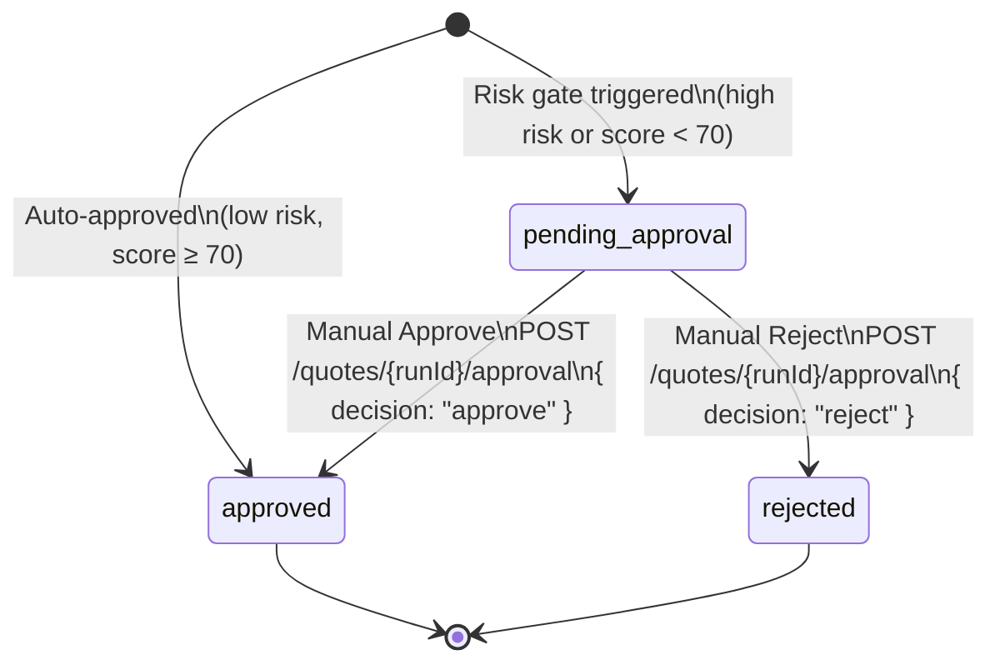

### Tenant Lifecycle States

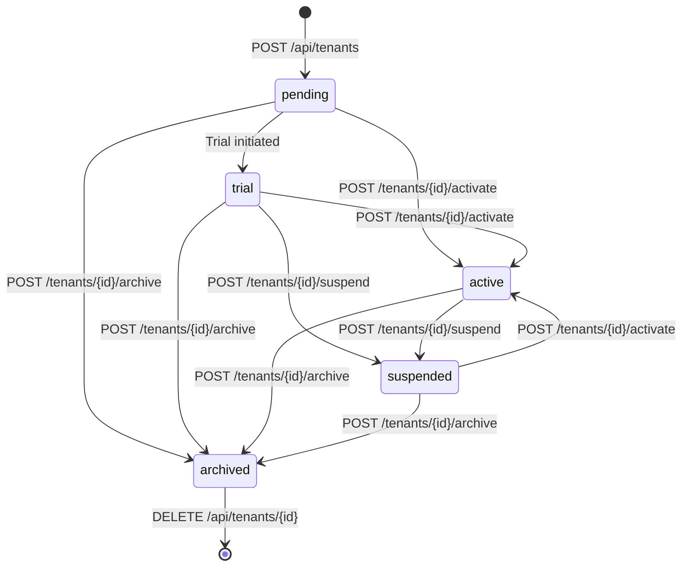

### User Lifecycle States

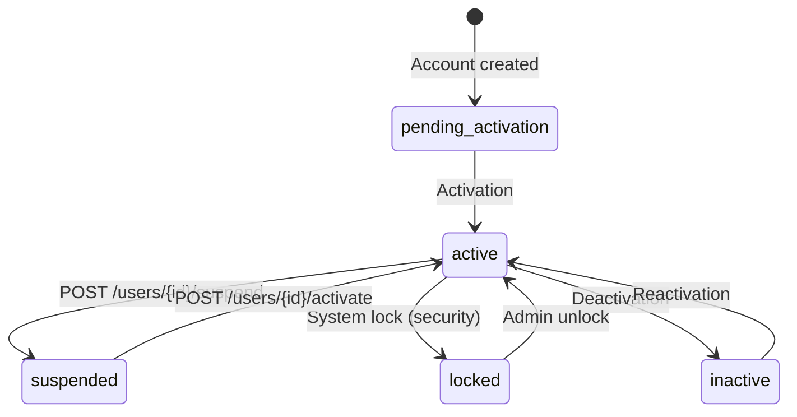

### Decision Trail Event Flow

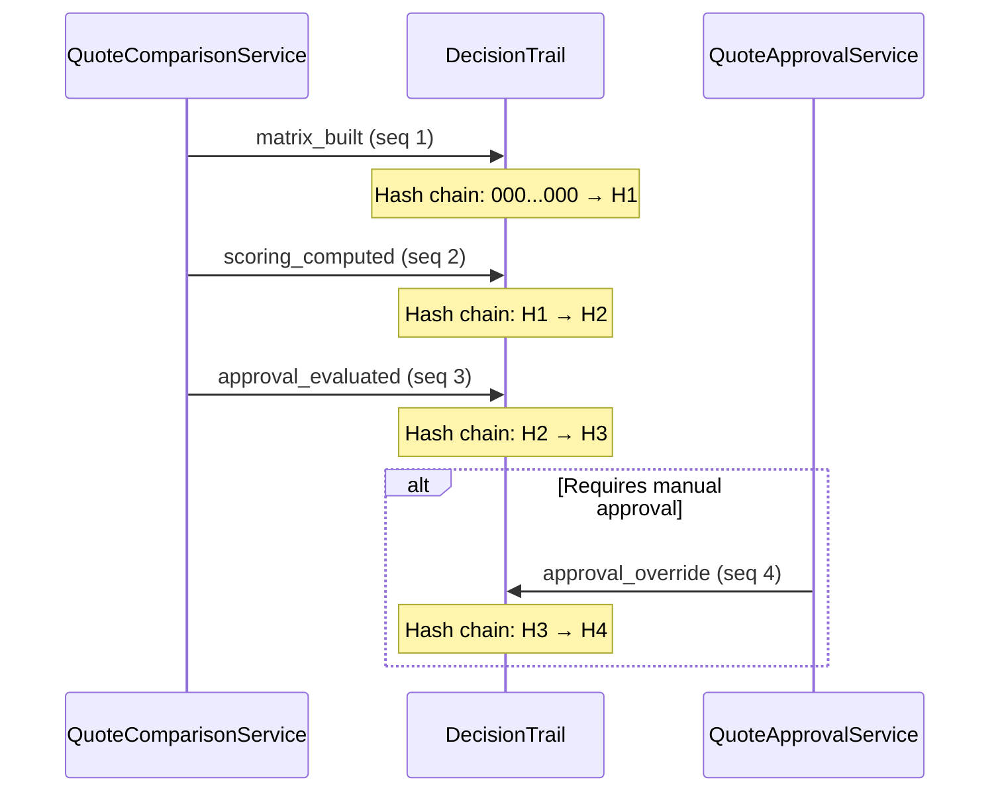

---

## Appendix A: Role Permission Matrix

| Screen / Action | ROLE_USER | ROLE_ADMIN | ROLE_TENANT_ADMIN | ROLE_SUPER_ADMIN |
|----------------|-----------|------------|-------------------|-----------------|
| SCR-001 Sign In | Public | Public | Public | Public |
| SCR-002 Dashboard | ✅ | ✅ | ✅ | ✅ |
| SCR-003 New Comparison | ✅ | ✅ | ✅ | ✅ |
| SCR-004 Results | ✅ | ✅ | ✅ | ✅ |
| SCR-005 Approval Queue | ✅ | ✅ | ✅ | ✅ |
| SCR-006 Approval Detail | ✅ | ✅ | ✅ | ✅ |
| SCR-007 Decision Trail | ✅ | ✅ | ✅ | ✅ |
| SCR-008 User Management | ❌ | ✅ | ✅ | ✅ |
| SCR-009 Settings | ❌ | ✅ | ✅ | ✅ |
| SCR-010 Feature Flags | ❌ | ✅ | ✅ | ✅ |
| SCR-011 Fiscal Periods | ❌ | ✅ | ✅ | ✅ |
| SCR-012 Module Registry | ❌ | ❌ | ✅ | ✅ |
| SCR-013 Tenant Management | ❌ | ❌ | ❌ | ✅ |
| SCR-014 Tenant Detail | ❌ | ❌ | ❌ | ✅ |
| MOD-001 Approve/Reject | ✅ | ✅ | ✅ | ✅ |
| MOD-002 Create Tenant | ❌ | ❌ | ❌ | ✅ |
| MOD-003 Suspend Tenant | ❌ | ❌ | ✅ (own) | ✅ |
| MOD-004 Activate Tenant | ❌ | ❌ | ❌ | ✅ |
| MOD-005 Archive Tenant | ❌ | ❌ | ❌ | ✅ |
| MOD-006 Delete Tenant | ❌ | ❌ | ❌ | ✅ |
| MOD-007 Impersonate | ❌ | ❌ | ❌ | ✅ |
| MOD-008 Stop Impersonate | ✅ (when impersonating) | ✅ | ✅ | ✅ |
| MOD-009 Suspend User | ❌ | ✅ | ✅ | ✅ |
| MOD-010 Activate User | ❌ | ✅ | ✅ | ✅ |
| MOD-011 Edit Setting | ❌ | ✅ | ✅ | ✅ |
| MOD-012 Bulk Update Settings | ❌ | ✅ | ✅ | ✅ |
| MOD-013 Edit Feature Flag | ❌ | ✅ | ✅ | ✅ |
| MOD-014 Open Period | ❌ | ✅ | ✅ | ✅ |
| MOD-015 Close Period | ❌ | ✅ | ✅ | ✅ |

---

## Appendix B: API Endpoint Reference (Verified)

All endpoints below have been verified against the Symfony API project at `apps/canary-atomy-api`.

### Authentication (Public)

| # | Method | Path | Purpose |
|---|--------|------|---------|
| 1 | POST | `/auth/login` | Authenticate user, return JWT tokens |
| 2 | POST | `/auth/refresh` | Refresh access token |
| 3 | POST | `/auth/logout` | Invalidate session |

### Quote Comparison (JWT Required, Tenant-Scoped)

| # | Method | Path | Purpose |
|---|--------|------|---------|
| 4 | POST | `/api/{tenantId}/quotes/compare` | Run quote comparison |
| 5 | POST | `/api/{tenantId}/quotes/{runId}/approval` | Approve/reject comparison run |

### Tenants (JWT Required)

| # | Method | Path | Purpose | Role |
|---|--------|------|---------|------|
| 6 | GET | `/api/tenants` | List tenants | ROLE_USER |
| 7 | GET | `/api/tenants/{id}` | Get tenant detail | ROLE_USER (own tenant) |
| 8 | POST | `/api/tenants` | Create tenant (onboarding) | ROLE_SUPER_ADMIN |
| 9 | POST | `/api/tenants/{id}/suspend` | Suspend tenant | ROLE_SUPER_ADMIN or ROLE_TENANT_ADMIN (own) |
| 10 | POST | `/api/tenants/{id}/activate` | Activate tenant | ROLE_SUPER_ADMIN |
| 11 | POST | `/api/tenants/{id}/archive` | Archive tenant | ROLE_SUPER_ADMIN |
| 12 | DELETE | `/api/tenants/{id}` | Delete tenant | ROLE_SUPER_ADMIN |
| 13 | POST | `/api/tenants/{id}/impersonate` | Start impersonation | ROLE_SUPER_ADMIN |
| 14 | POST | `/api/tenants/{id}/stop-impersonate` | Stop impersonation | ROLE_USER |

### Users (JWT Required)

> **Note:** User lifecycle endpoints (`/users/{id}/suspend`, `/users/{id}/activate`) are registered outside the `/api` prefix. This is the current API design.

| # | Method | Path | Purpose |
|---|--------|------|---------|
| 15 | GET | `/api/users` | List tenant users |
| 16 | POST | `/users/{id}/suspend` | Suspend user |
| 17 | POST | `/users/{id}/activate` | Activate user |

### Settings (JWT Required)

| # | Method | Path | Purpose |
|---|--------|------|---------|
| 18 | GET | `/api/settings` | List settings |
| 19 | GET | `/api/settings/{key}` | Get setting by key |
| 20 | PATCH | `/api/settings/{key}` | Update setting |
| 21 | POST | `/api/settings/bulk-update` | Bulk update settings |

### Feature Flags (JWT Required)

| # | Method | Path | Purpose |
|---|--------|------|---------|
| 22 | GET | `/api/feature-flags` | List feature flags |
| 23 | GET | `/api/feature-flags/{name}` | Get flag by name |
| 24 | PATCH | `/api/feature-flags/{name}` | Update flag |

### Modules (JWT Required)

| # | Method | Path | Purpose | Role |
|---|--------|------|---------|------|
| 25 | GET | `/api/modules` | List modules | Authenticated |
| 26 | GET | `/api/modules/{moduleId}` | Get module detail | Authenticated |
| 27 | POST | `/api/modules/{moduleId}/install` | Install module for tenant | ROLE_ADMIN |
| 28 | DELETE | `/api/modules/{id}` | Uninstall module (by installed record ID) | ROLE_ADMIN |

### Fiscal Periods (JWT Required)

| # | Method | Path | Purpose |
|---|--------|------|---------|
| 29 | GET | `/api/fiscal-periods` | List fiscal periods |
| 30 | GET | `/api/fiscal-periods/{id}` | Get period detail |
| 31 | POST | `/api/fiscal-periods/{id}/open` | Open fiscal period |
| 32 | POST | `/api/fiscal-periods/{id}/close` | Close fiscal period |

---

*End of Screen & Functional Specification*
