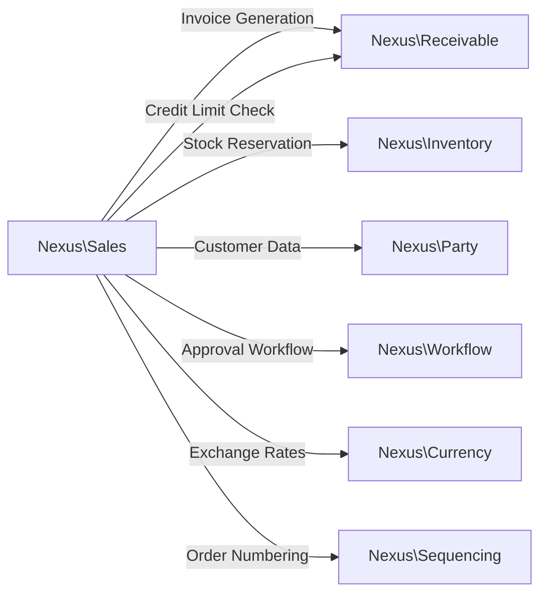
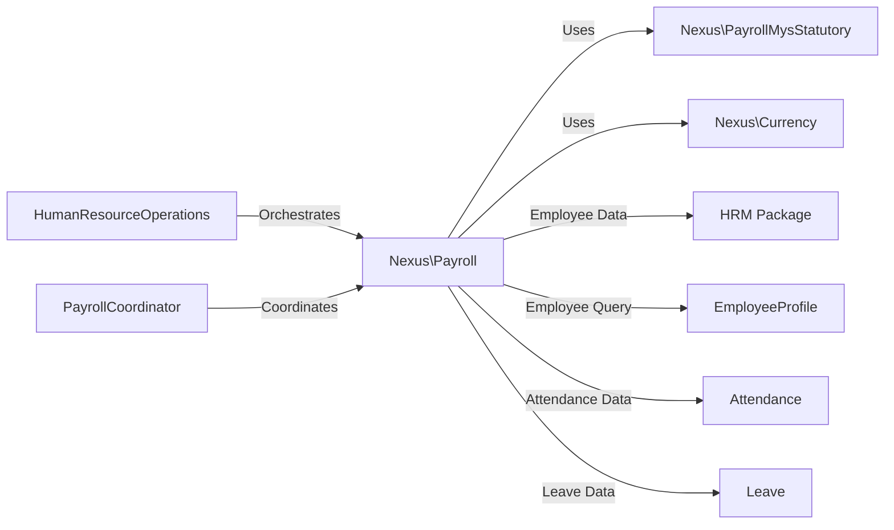
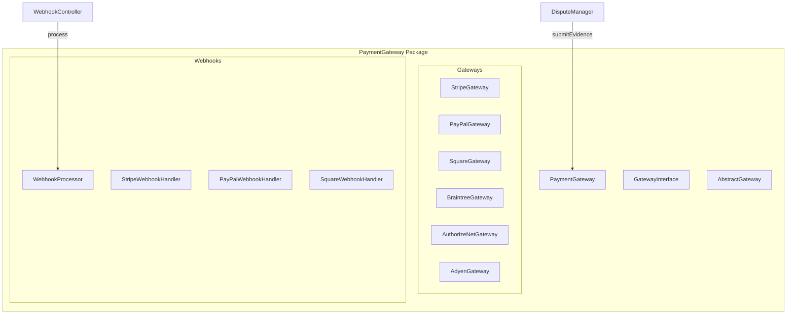
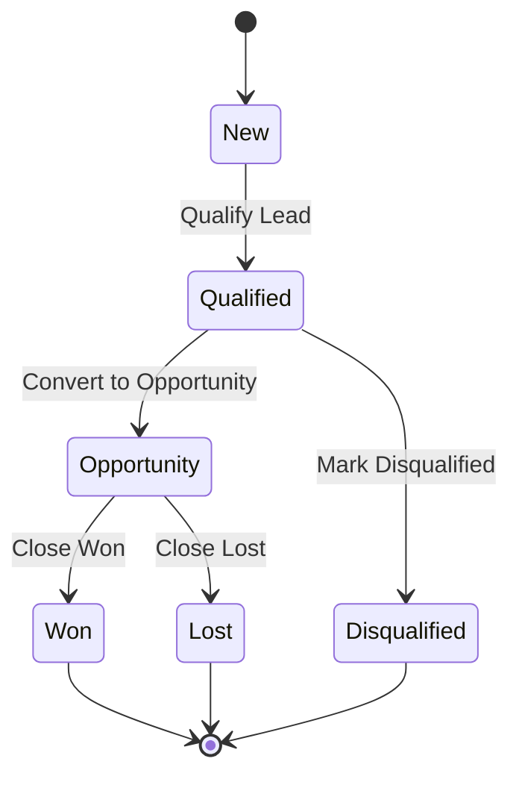
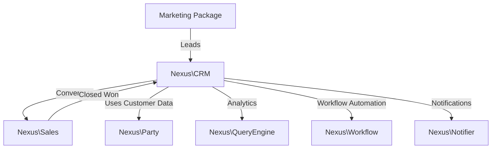
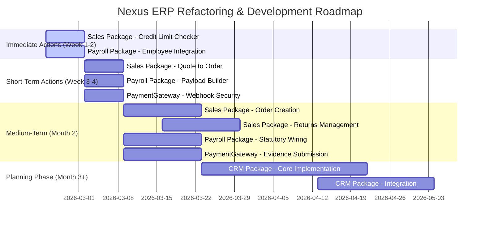
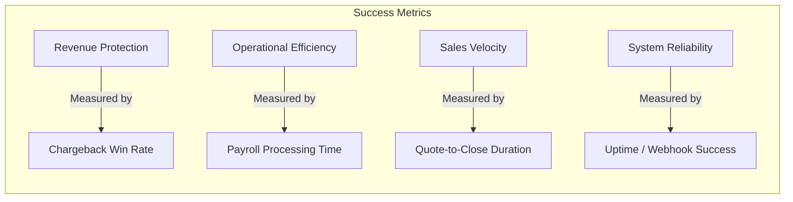

# Executive Summary & Roadmap

**Document Version:** 1.0  
**Date:** 2026-02-19  
**Classification:** Internal - Executive Leadership  

---

## 1. Executive Overview

This document provides a consolidated view of the Nexus ERP refactoring and development initiative. Our comprehensive codebase analysis has identified **102 placeholder instances** distributed across **80+ packages**. These placeholders represent unimplemented features, stub implementations, and areas requiring architectural improvements.

### Key Findings Summary

| Metric | Value |
|--------|-------|
| Total Packages Analyzed | 80+ |
| Placeholder Instances Identified | 102 |
| High-Priority Packages Requiring Immediate Action | 3 |
| New Package Recommendations | 1 |
| Estimated Total Effort (Story Points) | ~340 |

---

## 2. TOP 3 Packages for Refactoring/Development

### 2.1 Sales Package — HIGH PRIORITY

**Package:** `Nexus\Sales`  
**Priority Level:** 🔴 HIGH  
**Current Status:** 4 critical unimplemented features blocking end-to-end sales order processing

#### Critical Issues

| Issue | File | Exception | Business Impact |
|-------|------|-----------|-----------------|
| Sales Returns Unimplemented | `StubSalesReturnManager.php` | `BadMethodCallException` | Returns/RMA workflow completely blocked |
| No Credit Validation | `NoOpCreditLimitChecker.php` | Always returns `TRUE` | No credit risk management—potential revenue leakage |
| Quote-to-Order Conversion | `QuoteToOrderConverter.php:79` | `RuntimeException` | Cannot convert quotes to orders—sales pipeline bottleneck |
| Order Creation Incomplete | `SalesOrderManager.php:68` | `RuntimeException` | Cannot create sales orders—core function disabled |

#### Business Value

- **Revenue Protection:** Implementing credit limit checks prevents bad debt write-offs
- **Sales Velocity:** Quote-to-order conversion enables faster revenue recognition
- **Customer Satisfaction:** Sales returns processing improves post-sales experience
- **Operational Efficiency:** Full order creation workflow reduces manual intervention

#### Integration Requirements

#### Estimated Effort

| Phase | Activities | Complexity |
|-------|------------|------------|
| Phase 1 | Credit Limit Checker Implementation | Medium |
| Phase 2 | Quote-to-Order Converter | Medium-High |
| Phase 3 | Order Creation Workflow | High |
| Phase 4 | Sales Returns Management | Medium |

---

### 2.2 Payroll Package — HIGH PRIORITY

**Package:** `Nexus\Payroll`  
**Priority Level:** 🔴 HIGH  
**Current Status:** 2 critical unimplemented features blocking end-to-end payroll processing

#### Critical Issues

| Issue | File | Line | Exception | Business Impact |
|-------|------|------|-----------|-----------------|
| Payload Building Unimplemented | `PayrollEngine.php` | 214 | `RuntimeException` | Statutory calculations completely blocked—no tax/EPF/SOCSO processing |
| Employee Fetching Unimplemented | `PayrollEngine.php` | 233 | `RuntimeException` | Cannot get active employees—payroll cannot run |

#### Business Value

- **Statutory Compliance:** Malaysian payroll requires precise EPF, SOCSO, EIS, and tax calculations
- **Employee Satisfaction:** Accurate and timely payroll builds trust
- **Regulatory Reporting:** Proper payload enables LHDN submissions
- **HR Integration:** Connects HRM data to payroll processing

#### Integration Requirements

#### Estimated Effort

| Phase | Activities | Complexity |
|-------|------------|------------|
| Phase 1 | Employee Data Integration (HRM) | Medium |
| Phase 2 | Payload Builder Implementation | High |
| Phase 3 | Statutory Calculation Wiring | High |
| Phase 4 | Payroll Slip Generation | Medium |

---

### 2.3 PaymentGateway Package — MEDIUM-HIGH PRIORITY

**Package:** `Nexus\PaymentGateway`  
**Priority Level:** 🟠 MEDIUM-HIGH  
**Current Status:** Evidence submission and webhook verification incomplete across all gateways

#### Critical Issues

| Issue | File | Exception | Business Impact |
|-------|------|-----------|-----------------|
| Evidence Submission Unimplemented | `StripeGateway.php:222` | `GatewayException` | Cannot contest chargebacks—potential revenue loss |
| Evidence Submission Unimplemented | `PayPalGateway.php:250` | `GatewayException` | Cannot contest chargebacks |
| Evidence Submission Unimplemented | `SquareGateway.php:224` | `GatewayException` | Cannot contest chargebacks |
| Evidence Submission Unimplemented | `BraintreeGateway.php:268` | `GatewayException` | Cannot contest chargebacks |
| Evidence Submission Unimplemented | `AuthorizeNetGateway.php:223` | `GatewayException` | Cannot contest chargebacks |
| Evidence Submission Unimplemented | `AdyenGateway.php:236` | `GatewayException` | Cannot contest chargebacks |
| Webhook Verification Incomplete | `PayPalWebhookHandler.php:69` | Returns `false` | FAILS CLOSED—Production blocked |
| Webhook Verification Incomplete | `SquareWebhookHandler.php:71` | Returns `false` | FAILS CLOSED—Production blocked |
| Webhook Verification Placeholder | `StripeWebhookHandler.php:20` | Commented code | Not verified in production |

#### Business Value

- **Dispute Management:** Evidence submission enables chargeback contesting—revenue protection
- **Payment Automation:** Webhook verification enables real-time payment processing
- **Security:** Proper signature verification prevents fraudulent payments
- **Multi-Gateway Support:** Consistent behavior across all payment providers

#### Integration Architecture

#### Estimated Effort

| Phase | Activities | Complexity |
|-------|------------|------------|
| Phase 1 | Stripe Webhook Verification | Medium |
| Phase 2 | PayPal & Square Webhook Verification | Medium |
| Phase 3 | Evidence Submission (Stripe, PayPal) | High |
| Phase 4 | Evidence Submission (Remaining Gateways) | High |

---

## 3. NEW Package Recommendation: CRM Package

**Package:** `Nexus\CRM`  
**Priority Level:** 🔴 HIGH (New Development)  
**Strategic Importance:** CRITICAL

### Why CRM is the Highest Impact New Package

| Factor | Impact Level | Rationale |
|--------|--------------|------------|
| Revenue Impact | CRITICAL | Drives sales pipeline management, lead tracking, and opportunity forecasting |
| Integration Value | HIGH | Connects Sales, Marketing, Party, and Analytics packages |
| Customer 360 View | HIGH | Provides unified customer data across all touchpoints |
| Competitive Necessity | CRITICAL | Modern ERPs (SAP, Oracle, Microsoft Dynamics) all include CRM |

### Package Overview

The CRM package is designed as a framework-agnostic PHP library following Nexus atomic package patterns:

- **Namespace:** `Nexus\CRM`
- **PHP Version:** ^8.3
- **Architecture:** CQRS with immutable services, interface segregation
- **Dependencies:** Party, Sales, Analytics, Workflow, Notifier packages

### Core Features

| Feature | Description |
|---------|-------------|
| Lead Management | Lead capture, qualification, scoring, and conversion |
| Opportunity Tracking | Pipeline management, stage progression, win/loss analysis |
| Pipeline Management | Custom pipelines, stage configuration, automation triggers |
| Activity Tracking | Call logging, meeting scheduling, task management |
| Lead Scoring | Automated scoring based on engagement and demographic factors |

### Integration Value

### Estimated Effort

| Phase | Deliverables | Complexity |
|-------|--------------|------------|
| Phase 1 | Core interfaces, Lead management | High |
| Phase 2 | Opportunity & Pipeline management | High |
| Phase 3 | Activity tracking & Lead scoring | Medium-High |
| Phase 4 | Integration with Sales & Marketing | Medium |

---

## 4. Implementation Roadmap

### Timeline Overview

### Detailed Phase Breakdown

#### Week 1-2: Immediate Actions

| Package | Deliverable | Owner | Dependencies |
|---------|-------------|-------|--------------|
| Sales | Credit Limit Checker Implementation | TBD | Nexus\Receivable |
| Payroll | Employee Data Integration (HRM) | TBD | HRM Package |
| PaymentGateway | Stripe Webhook Verification | TBD | None |

#### Week 3-4: Short-Term Actions

| Package | Deliverable | Owner | Dependencies |
|---------|-------------|-------|--------------|
| Sales | Quote-to-Order Converter | TBD | Nexus\Sequencing, Party |
| Payroll | Payload Builder Implementation | TBD | Nexus\PayrollMysStatutory |
| PaymentGateway | PayPal & Square Webhook Verification | TBD | None |

#### Month 2: Medium-Term Actions

| Package | Deliverable | Owner | Dependencies |
|---------|-------------|-------|--------------|
| Sales | Complete Order Creation Workflow | TBD | Nexus\Inventory, Receivable |
| Sales | Sales Returns Management | TBD | Nexus\Workflow |
| Payroll | Statutory Calculation Wiring | TBD | PayrollMysStatutory |
| PaymentGateway | Evidence Submission (All Gateways) | TBD | None |

#### Month 3+: Planning Phase

| Package | Deliverable | Owner | Dependencies |
|---------|-------------|-------|--------------|
| CRM | Core Package Implementation | TBD | Party, Sales, Analytics |
| CRM | Integration Layer | TBD | Marketing, Workflow, Notifier |

---

## 5. Investment Summary

### Effort Estimates by Package

| Package | Refactoring/Development | Testing | Documentation | Total |
|---------|------------------------|---------|---------------|-------|
| Sales Package | 40 SP | 15 SP | 5 SP | 60 SP |
| Payroll Package | 35 SP | 12 SP | 5 SP | 52 SP |
| PaymentGateway Package | 30 SP | 10 SP | 3 SP | 43 SP |
| CRM Package (New) | 60 SP | 20 SP | 10 SP | 90 SP |
| **TOTAL** | **165 SP** | **57 SP** | **23 SP** | **245 SP** |

*SP = Story Points*

### Resource Requirements

| Role | Immediate (Week 1-2) | Short-Term (Week 3-4) | Medium-Term (Month 2) | Planning (Month 3+) |
|------|----------------------|----------------------|----------------------|---------------------|
| Senior PHP Developer | 2 | 2 | 3 | 3 |
| Technical Architect | 0.5 | 0.5 | 0.5 | 1 |
| QA Engineer | 0 | 1 | 2 | 2 |
| Technical Writer | 0 | 0 | 0.5 | 1 |

---

## 6. Success Metrics

### Definition of Done

| Metric | Target | Measurement |
|--------|--------|-------------|
| Placeholder Reduction | -80% (102 → 20) | Code audit scan |
| Package Functionality | All critical features implemented | Functional testing |
| Integration Tests | 80%+ pass rate | CI/CD pipeline |
| Documentation Coverage | 100% of new code | Doc coverage tools |

### Key Performance Indicators

| KPI | Baseline | Target | Timeline |
|-----|----------|--------|----------|
| Chargeback Win Rate | N/A | 60% | Month 3 |
| Payroll Processing Time | Manual | <4 hours | Month 2 |
| Quote-to-Close Duration | 14 days | 7 days | Month 2 |
| Webhook Success Rate | 0% | 99.5% | Month 1 |
| Sales Returns Processing | Blocked | 24-hour SLA | Month 2 |

---

## 7. Next Steps

### Immediate Action Items

- [ ] **Assign Technical Lead** for Sales Package refactoring
- [ ] **Assign Technical Lead** for Payroll Package refactoring  
- [ ] **Schedule kickoff meeting** with stakeholders for CRM implementation
- [ ] **Create JIRA epics** for each package refactoring initiative
- [ ] **Set up CI/CD pipelines** for automated testing
- [ ] **Establish code review gates** requiring 2 approvals

### Decision Points Requiring Executive Input

1. **Resource Allocation:** Confirm developer headcount for each phase
2. **Timeline Commitment:** Approve or adjust roadmap dates
3. **Scope Prioritization:** Confirm if CRM implementation starts Month 3 or is deferred
4. **Risk Tolerance:** Decide on phased vs. big-bang deployment strategy

### Recommended First Steps

1. **Week 1:** Begin Sales Package credit limit checker implementation
2. **Week 1:** Begin Payroll Package HRM integration spike
3. **Week 2:** Complete proof-of-concept for PaymentGateway webhook verification

---

## Appendix: Related Documents

| Document | Location |
|----------|----------|
| Sales Package Refactoring Plan | [`plans/SALES_PACKAGE_REFACTORING_PLAN.md`](SALES_PACKAGE_REFACTORING_PLAN.md) |
| Payroll Package Refactoring Plan | [`plans/PAYROLL_PACKAGE_REFACTORING_PLAN.md`](PAYROLL_PACKAGE_REFACTORING_PLAN.md) |
| PaymentGateway Refactoring Plan | [`plans/PAYMENT_GATEWAY_PACKAGE_REFACTORING_PLAN.md`](PAYMENT_GATEWAY_PACKAGE_REFACTORING_PLAN.md) |
| CRM Package Implementation Plan | [`plans/CRM_PACKAGE_IMPLEMENTATION_PLAN.md`](CRM_PACKAGE_IMPLEMENTATION_PLAN.md) |
| Architecture Reference | [`ARCHITECTURE.md`](ARCHITECTURE.md) |
| Orchestrator Interface Segregation | [`docs/ORCHESTRATOR_INTERFACE_SEGREGATION.md`](../docs/ORCHESTRATOR_INTERFACE_SEGREGATION.md) |

---

*Document Prepared: 2026-02-19*  
*Next Review Date: 2026-03-05*  
*Document Owner: Architecture Team*
