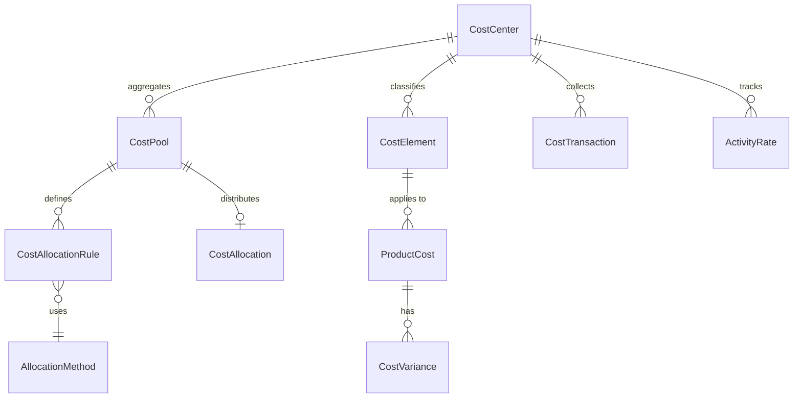
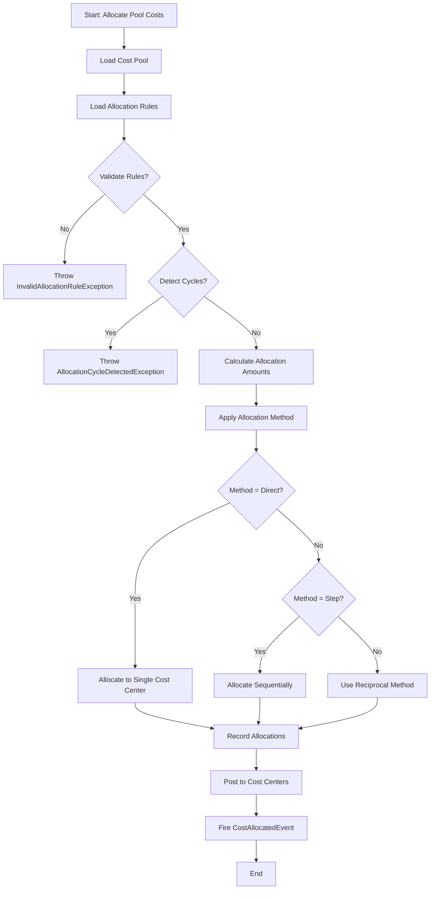
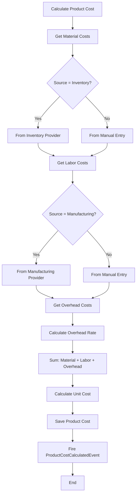
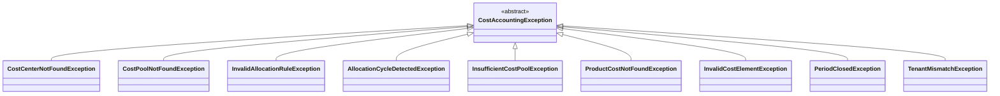

# CostAccounting Package Architecture

## 1. Package Overview

### Purpose

The **Nexus\CostAccounting** package provides comprehensive cost management capabilities for the Nexus ERP system. It serves as the **cost control layer** that enables organizations to track, allocate, and analyze costs across their operational units using both traditional costing and Activity-Based Costing (ABC) methodologies.

### Scope

This package handles all cost management functions distinct from general finance:

- **Cost Center Management**: Hierarchical organizational units for cost collection and responsibility tracking
- **Cost Pool Aggregation**: Indirect cost pooling for overhead allocation
- **Cost Element Classification**: Material, Labor, and Overhead categorization
- **Product Cost Calculation**: Multi-level cost rollup with standard and actual cost tracking
- **Cost Allocation**: Multiple allocation methods (Direct, Step-Down, Reciprocal) with ABC support
- **Variance Analysis**: Tracking and reporting of actual versus standard cost variances

### Namespace

```
Nexus\CostAccounting
```

### Position in Architecture

| Layer | Role |
|-------|------|
| Layer 1 (Atomic) | Pure business logic, framework-agnostic |
| Domain | Financial Management |
| Dependencies | Common, PSR interfaces only |
| Dependents | Orchestrators (AccountingOperations), Adapters |

---

## 2. Architecture Principles

This package adheres strictly to the Layer 1 (Atomic Package) requirements as defined in the root [`ARCHITECTURE.md`](../../ARCHITECTURE.md).

### 2.1 Framework Agnosticism

The package contains **zero framework dependencies**:

- ✅ No Laravel, Symfony, or other framework imports in `/src`
- ✅ All external dependencies expressed via interfaces in `Contracts/`
- ✅ Pure PHP 8.3+ with strict typing
- ✅ PSR-3 logging and PSR-14 event dispatching support

### 2.2 Dependency Injection

All dependencies are injected via constructors:

```php
final readonly class ProductCostCalculator
{
    public function __construct(
        private ProductCostQueryInterface $productCostQuery,
        private ProductCostPersistInterface $productCostPersist,
        private InventoryDataProviderInterface $inventoryProvider,
        private ManufacturingDataProviderInterface $manufacturingProvider,
    ) {}
}
```

### 2.3 CQRS Repository Pattern

Following the repository design pattern from ARCHITECTURE.md:

- `{Entity}QueryInterface`: Side-effect-free read operations
- `{Entity}PersistInterface`: Write operations with validation

### 2.4 Immutability

- **Service Classes**: `final readonly class` with constructor property promotion
- **Value Objects**: All properties are `readonly`
- **Entities**: Use immutable design patterns where possible

### 2.5 Single Responsibility

The package follows the atomicity principle - it addresses ONE business domain:

- ❌ Does NOT handle General Ledger (Finance package)
- ❌ Does NOT handle Budget management (Budget package)
- ❌ Does NOT handle Financial statements (Accounting package)
- ✅ Focuses ONLY on cost tracking, allocation, and product costing

---

## 3. Directory Structure

```
packages/CostAccounting/
├── src/
│   ├── Contracts/
│   │   ├── CostAccountingManagerInterface.php     # Primary facade
│   │   ├── CostCenterManagerInterface.php        # Cost center management
│   │   ├── CostCenterQueryInterface.php           # CQRS: Read operations
│   │   ├── CostCenterPersistInterface.php         # CQRS: Write operations
│   │   ├── CostPoolInterface.php                  # Cost pool entity
│   │   ├── CostElementInterface.php               # Cost element entity
│   │   ├── ProductCostCalculatorInterface.php    # Product costing
│   │   ├── ProductCostQueryInterface.php          # Product cost queries
│   │   ├── ProductCostPersistInterface.php        # Product cost writes
│   │   ├── CostAllocationEngineInterface.php      # Allocation execution
│   │   ├── CostAllocationRuleInterface.php        # Allocation rules
│   │   ├── CostTransactionInterface.php           # Cost transactions
│   │   ├── CostVarianceInterface.php               # Variance tracking
│   │   ├── StandardCostInterface.php               # Standard costs
│   │   ├── CostRevaluationInterface.php             # Cost revaluation
│   │   ├── ActivityRateInterface.php               # ABC activity rates
│   │   ├── CostReportInterface.php                 # Reporting
│   │   ├── CostAuditInterface.php                  # Audit trail
│   │   │
│   │   └── Integration/                            # External package contracts
│   │       ├── InventoryDataProviderInterface.php  # Nexus\Inventory
│   │       ├── ManufacturingDataProviderInterface.php # Nexus\Manufacturing
│   │       ├── ChartOfAccountProviderInterface.php # Nexus\ChartOfAccount
│   │       ├── BudgetDataProviderInterface.php     # Nexus\Budget
│   │       ├── FinancePostingInterface.php         # Nexus\Finance
│   │       ├── PeriodValidationInterface.php       # Nexus\Period
│   │       ├── TenantContextInterface.php          # Nexus\Tenant
│   │       └── CurrencyConversionInterface.php     # Nexus\Currency
│   │
│   ├── Entities/                                    # Domain entities
│   │   ├── CostCenter.php                          # Organizational unit
│   │   ├── CostPool.php                            # Indirect cost aggregation
│   │   ├── CostElement.php                         # Material/Labor/Overhead
│   │   ├── ProductCost.php                         # Calculated product cost
│   │   ├── CostAllocationRule.php                  # Allocation rule definition
│   │   ├── CostTransaction.php                     # Actual cost transaction
│   │   ├── CostVariance.php                        # Variance record
│   │   └── ActivityRate.php                        # ABC activity rate
│   │
│   ├── Enums/                                      # Native PHP 8.3 enums
│   │   ├── CostElementType.php                    # Material, Labor, Overhead
│   │   ├── AllocationMethod.php                    # Direct, Step, Reciprocal
│   │   ├── CostCenterStatus.php                    # Active, Inactive, Pending
│   │   └── CostTransactionType.php                 # Actual, Standard, Variance
│   │
│   ├── Services/                                    # Business logic services
│   │   ├── CostAccountingManager.php               # Primary facade
│   │   ├── CostCenterManager.php                   # Cost center CRUD
│   │   ├── ProductCostCalculator.php               # Product costing
│   │   ├── CostAllocationEngine.php                # Allocation execution
│   │   ├── CostVarianceCalculator.php              # Variance calculation
│   │   └── CostRollupEngine.php                    # Multi-level rollup
│   │
│   ├── ValueObjects/                               # Immutable value objects
│   │   ├── CostAmount.php                          # Monetary value
│   │   ├── CostAllocationRatio.php                 # Allocation percentage
│   │   ├── ActivityDriver.php                      # ABC driver
│   │   ├── CostCenterHierarchy.php                 # Tree structure
│   │   ├── ProductCostSnapshot.php                 # Point-in-time cost
│   │   └── CostVarianceBreakdown.php               # Variance breakdown
│   │
│   ├── Exceptions/                                 # Domain exceptions
│   │   ├── CostAccountingException.php             # Base exception
│   │   ├── CostCenterNotFoundException.php
│   │   ├── CostPoolNotFoundException.php
│   │   ├── InvalidAllocationRuleException.php
│   │   ├── AllocationCycleDetectedException.php
│   │   ├── InsufficientCostPoolException.php
│   │   ├── ProductCostNotFoundException.php
│   │   ├── InvalidCostElementException.php
│   │   ├── PeriodClosedException.php
│   │   └── TenantMismatchException.php
│   │
│   └── Events/                                     # Domain events (PSR-14)
│       ├── CostCenterCreatedEvent.php
│       ├── CostPoolUpdatedEvent.php
│       ├── CostAllocatedEvent.php
│       ├── ProductCostCalculatedEvent.php
│       ├── CostVarianceDetectedEvent.php
│       └── CostRevaluationExecutedEvent.php
│
├── tests/
│   ├── Unit/
│   │   ├── Services/
│   │   ├── ValueObjects/
│   │   └── Entities/
│   └── Integration/
│
├── composer.json
├── REQUIREMENTS.md
└── ARCHITECTURE.md
```

### Directory Responsibilities

| Directory | Responsibility |
|-----------|---------------|
| `Contracts/` | All interface definitions (the API contract) |
| `Entities/` | Domain objects with business logic |
| `Enums/` | Type-safe PHP 8.3 enums |
| `Services/` | Orchestration and business logic |
| `ValueObjects/` | Immutable domain value types |
| `Exceptions/` | Domain-specific exception hierarchy |
| `Events/` | PSR-14 compliant domain events |

---

## 4. Domain Model

### 4.1 Entity Relationships



### 4.2 Domain Entities

#### CostCenter

Represents an organizational unit for cost collection and responsibility tracking.

- **Attributes**: ID, Code, Name, Description, ParentCostCenterId, Status, TenantId, CostCenterType, BudgetId, ResponsiblePersonId
- **Relationships**: Parent/Child hierarchy, CostPools, CostElements, Transactions
- **Constraints**: Must belong to a Tenant, Must have valid parent for hierarchy

#### CostPool

Aggregates indirect costs for allocation to receiving cost centers.

- **Attributes**: ID, Code, Name, Description, CostCenterId, TotalAmount, AllocationMethod, Status, PeriodId
- **Relationships**: SourceCostCenter, AllocationRules, Allocations
- **Constraints**: Total allocation ratios must equal 100%

#### CostElement

Categorizes costs by type for tracking and allocation.

- **Attributes**: ID, Code, Name, Type (Material/Labor/Overhead), CostCenterId, GLAccountId
- **Relationships**: CostCenter, ProductCosts
- **Constraints**: Type must be valid CostElementType enum

#### ProductCost

Stores calculated product costs with cost rollup information.

- **Attributes**: ID, ProductId, CostCenterId, PeriodId, MaterialCost, LaborCost, OverheadCost, TotalCost, UnitCost, CostType (Actual/Standard)
- **Relationships**: Product, CostElements, CostVariances
- **Constraints**: Total = Material + Labor + Overhead

#### CostAllocationRule

Defines how costs are allocated from source to receiving cost centers.

- **Attributes**: ID, CostPoolId, ReceivingCostCenterId, AllocationRatio, AllocationMethod, ActivityDriverId, Priority
- **Relationships**: SourceCostPool, ReceivingCostCenter, ActivityDriver
- **Constraints**: Ratios must sum to 1.0, No circular dependencies allowed

### 4.3 Boundaries

The CostAccounting domain is bounded to handle:

| Within Boundary | Outside Boundary (Other Packages) |
|-----------------|-----------------------------------|
| Cost center hierarchy | General Ledger (Finance) |
| Cost pool aggregation | Budget management (Budget) |
| Cost allocation rules | Financial statements (Accounting) |
| Product cost calculation | Tax calculations (Tax) |
| Variance tracking | Fixed assets (Assets) |

---

## 5. Interface Design

### 5.1 Primary Facade Interface

**CostAccountingManagerInterface** - Single entry point for cost accounting operations

```php
interface CostAccountingManagerInterface
{
    // Cost Center Operations
    public function createCostCenter(CreateCostCenterCommand $command): CostCenter;
    public function updateCostCenter(UpdateCostCenterCommand $command): CostCenter;
    public function getCostCenterHierarchy(string $rootCostCenterId): CostCenterHierarchy;
    
    // Cost Pool Operations
    public function createCostPool(CreateCostPoolCommand $command): CostPool;
    public function allocatePoolCosts(string $poolId, string $periodId): CostAllocationResult;
    
    // Product Cost Operations
    public function calculateProductCost(CalculateProductCostCommand $command): ProductCost;
    public function performCostRollup(string $productId, string $periodId): ProductCostRollupResult;
    
    // Variance Operations
    public function calculateVariances(string $productId, string $periodId): CostVarianceBreakdown;
}
```

### 5.2 CQRS Split Interfaces

Following the repository design pattern for query/persist separation:

#### Cost Center Query/Persist

```php
interface CostCenterQueryInterface
{
    public function findById(string $id): ?CostCenter;
    public function findByCode(string $code): ?CostCenter;
    public function findChildren(string $parentId): array;
    public function findByTenant(string $tenantId): array;
    public function getHierarchy(string $rootId): CostCenterHierarchy;
}

interface CostCenterPersistInterface
{
    public function save(CostCenter $costCenter): void;
    public function delete(string $id): void;
    public function updateStatus(string $id, CostCenterStatus $status): void;
}
```

#### Product Cost Query/Persist

```php
interface ProductCostQueryInterface
{
    public function findByProduct(string $productId, string $periodId): ?ProductCost;
    public function findByCostCenter(string $costCenterId, string $periodId): array;
    public function getCostHistory(string $productId, DateRange $range): array;
}

interface ProductCostPersistInterface
{
    public function save(ProductCost $productCost): void;
    public function update(ProductCost $productCost): void;
    public function delete(string $id): void;
}
```

### 5.3 Key Service Interfaces

#### ProductCostCalculatorInterface

```php
interface ProductCostCalculatorInterface
{
    public function calculate(CalculateProductCostCommand $command): ProductCost;
    public function calculateStandardCost(string $productId, string $periodId): ProductCost;
    public function calculateActualCost(string $productId, string $periodId): ProductCost;
    public function rollup(string $productId, string $periodId): ProductCostRollupResult;
}
```

#### CostAllocationEngineInterface

```php
interface CostAllocationEngineInterface
{
    public function allocate(CostPool $pool, string $periodId): CostAllocationResult;
    public function validateAllocationRules(CostPool $pool): ValidationResult;
    public function detectCircularDependencies(CostAllocationRule $rule): bool;
    public function calculateActivityRates(string $costCenterId, string $periodId): array;
}
```

### 5.4 Integration Interfaces

All external dependencies are defined as interfaces in `Contracts/Integration/`:

| Interface | Purpose | Integration Package |
|-----------|---------|---------------------|
| `InventoryDataProviderInterface` | Material cost data | Nexus\Inventory |
| `ManufacturingDataProviderInterface` | Production data, work orders | Nexus\Manufacturing |
| `ChartOfAccountProviderInterface` | GL account mapping | Nexus\ChartOfAccount |
| `BudgetDataProviderInterface` | Cost center budgets | Nexus\Budget |
| `FinancePostingInterface` | Cost posting to GL | Nexus\Finance |
| `PeriodValidationInterface` | Fiscal period validation | Nexus\Period |
| `TenantContextInterface` | Multi-entity context | Nexus\Tenant |
| `CurrencyConversionInterface` | Multi-currency support | Nexus\Currency |

---

## 6. Dependency Graph

### 6.1 External Dependencies (Via Interfaces Only)

```mermaid
graph TD
    CA[Nexus\CostAccounting]
    
    %% External packages (interfaces only)
    INV[Nexus\Inventory<br/>InventoryDataProviderInterface]
    MFG[Nexus\Manufacturing<br/>ManufacturingDataProviderInterface]
    COA[Nexus\ChartOfAccount<br/>ChartOfAccountProviderInterface]
    BUD[Nexus\Budget<br/>BudgetDataProviderInterface]
    FIN[Nexus\Finance<br/>FinancePostingInterface]
    PRD[Nexus\Period<br/>PeriodValidationInterface]
    TEN[Nexus\Tenant<br/>TenantContextInterface]
    CUR[Nexus\Currency<br/>CurrencyConversionInterface]
    COM[Nexus\Common]
    
    %% Dependencies
    CA -->|depends via| INV
    CA -->|depends via| MFG
    CA -->|depends via| COA
    CA -->|depends via| BUD
    CA -->|depends via| FIN
    CA -->|depends via| PRD
    CA -->|depends via| TEN
    CA -->|depends via| CUR
    CA -->|depends via| COM
    
    %% PSR
    CA -.->|uses| PSR3[PSR-3 Logger]
    CA -.->|uses| PSR14[PSR-14 Events]
```



### 6.2 Dependency Rules

| Can Depend On | Cannot Depend On |
|--------------|------------------|
| Nexus\Common | Other atomic packages |
| PSR interfaces | Orchestrators |
| Self | Adapters |
| | Frameworks (Laravel, Symfony) |

---

## 7. Data Flow

### 7.1 Cost Allocation Flow



### 7.2 Product Cost Calculation Flow



### 7.3 Key Data Transformations

| Input | Transformation | Output |
|-------|---------------|--------|
| Raw material costs | Aggregate by cost element | MaterialCost |
| Labor hours × rates | Calculate | LaborCost |
| Pool costs ÷ drivers | Allocate | OverheadCost |
| Material + Labor + Overhead | Sum | TotalProductCost |
| Actual - Standard | Calculate | CostVariance |

---

## 8. State Management

### 8.1 Immutability Principles

All service classes use `final readonly class` to ensure immutability:

```php
final readonly class CostAllocationEngine
{
    public function __construct(
        private CostPoolQueryInterface $poolQuery,
        private CostAllocationRuleQueryInterface $ruleQuery,
        private CostAllocationPersistInterface $allocationPersist,
    ) {}
}
```

### 8.2 Value Objects

Value objects are inherently immutable:

```php
final class CostAmount
{
    public function __construct(
        public readonly float $amount,
        public readonly string $currency,
    ) {}
    
    public function add(CostAmount $other): self
    {
        return new self(
            $this->amount + $other->amount,
            $this->currency,
        );
    }
}
```

### 8.3 Entity State

Entities use readonly properties where possible and follow these patterns:

- **State transitions** are explicit (e.g., `CostCenter::activate()`)
- **Validation** occurs before state changes
- **Events** are fired on state transitions for auditability

---

## 9. Error Handling Strategy

### 9.1 Exception Hierarchy



### 9.2 Exception Usage

| Exception | When Thrown |
|-----------|-------------|
| `CostCenterNotFoundException` | Cost center ID not found |
| `CostPoolNotFoundException` | Cost pool ID not found |
| `InvalidAllocationRuleException` | Rule validation fails |
| `AllocationCycleDetectedException` | Circular dependency in allocation |
| `InsufficientCostPoolException` | Pool balance insufficient |
| `ProductCostNotFoundException` | Product cost missing |
| `InvalidCostElementException` | Invalid cost element type |
| `PeriodClosedException` | Period is closed for posting |
| `TenantMismatchException` | Cross-tenant operation attempted |

### 9.3 Error Handling Principles

1. **Never throw generic `\Exception`** - Always use domain-specific exceptions
2. **Fail fast** - Validate early, throw immediately on invalid state
3. **Provide context** - Include relevant data in exception messages
4. **Use "Throw in Expressions"** - For cleaner null-coalescing handlers

```php
$costCenter = $this->query->findById($id)
    ?? throw new CostCenterNotFoundException("Cost center {$id} not found");
```

---

## 10. Testing Strategy

### 10.1 Unit Testing Approach

All public methods MUST have unit tests following the testing requirements.

#### Test Structure

```text
tests/
├── Unit/
│   ├── Services/
│   │   ├── CostAccountingManagerTest.php
│   │   ├── CostCenterManagerTest.php
│   │   ├── ProductCostCalculatorTest.php
│   │   └── CostAllocationEngineTest.php
│   ├── ValueObjects/
│   │   ├── CostAmountTest.php
│   │   ├── CostAllocationRatioTest.php
│   │   └── CostVarianceBreakdownTest.php
│   └── Entities/
│       ├── CostCenterTest.php
│       ├── CostPoolTest.php
│       └── ProductCostTest.php
└── Integration/
    ├── CostAllocationIntegrationTest.php
    └── ProductCostRollupIntegrationTest.php
```

### 10.2 Test Patterns

#### Mocking External Dependencies

All integration interfaces are mocked in unit tests:

```php
private function createMockInventoryProvider(): InventoryDataProviderInterface
{
    return new class implements InventoryDataProviderInterface {
        public function getMaterialCost(string $productId, string $periodId): CostAmount { ... }
    };
}
```

#### Deterministic Calculations

Tests verify deterministic behavior:

```php
public function test_standard_cost_calculation_is_deterministic(): void
{
    $result1 = $calculator->calculate($command);
    $result2 = $calculator->calculate($command);
    
    $this->assertEquals($result1->getTotalCost(), $result2->getTotalCost());
}
```

### 10.3 Performance Testing

| Operation | Target | Test Threshold |
|-----------|--------|----------------|
| Cost allocation | < 10 seconds | 12 seconds |
| Product cost calculation | < 5 seconds | 6 seconds |
| Hierarchy query | Recursive CTE | O(log n) |

---

## 11. Integration Points

### 11.1 How Other Packages Integrate

Other packages integrate with CostAccounting through the defined interfaces:

| Integrating Package | Interface Used | Integration Pattern |
|--------------------|----------------|-------------------|
| Nexus\Inventory | `InventoryDataProviderInterface` | Provides material costs |
| Nexus\Manufacturing | `ManufacturingDataProviderInterface` | Provides labor/overhead data |
| Nexus\ChartOfAccount | `ChartOfAccountProviderInterface` | Maps to GL accounts |
| Nexus\Budget | `BudgetDataProviderInterface` | Reads cost center budgets |
| Nexus\Finance | `FinancePostingInterface` | Posts allocated costs to GL |
| Nexus\Period | `PeriodValidationInterface` | Validates fiscal periods |
| Nexus\Tenant | `TenantContextInterface` | Enforces tenant isolation |
| Nexus\Currency | `CurrencyConversionInterface` | Converts currencies |

### 11.2 Adapter Implementation

The `adapters/` layer implements these interfaces:

```php
// adapters/CostAccounting/src/EloquentCostCenterRepository.php
class EloquentCostCenterRepository implements CostCenterQueryInterface, CostCenterPersistInterface
{
    public function __construct(
        private CostCenterModel $model,
        private TenantContextInterface $tenantContext,
    ) {}
}
```

### 11.3 Event Integration

The package publishes domain events for external consumption:

| Event | Published When |
|-------|---------------|
| `CostCenterCreatedEvent` | New cost center created |
| `CostPoolUpdatedEvent` | Pool totals recalculated |
| `CostAllocatedEvent` | Allocation completed |
| `ProductCostCalculatedEvent` | Cost calculation finished |
| `CostVarianceDetectedEvent` | Variance threshold exceeded |

### 11.4 Orchestrator Usage

Orchestrators like AccountingOperations use this package via its interfaces:

```php
// orchestrators/AccountingOperations/src/Coordinators/PeriodCloseCoordinator.php
class PeriodCloseCoordinator
{
    public function __construct(
        private CostAccountingManagerInterface $costAccounting,
        private FinanceManagerInterface $finance,
        private PeriodManagerInterface $period,
    ) {}
}
```

---

## Summary

The **Nexus\CostAccounting** package is a Layer 1 (Atomic) package that:

1. ✅ Follows strict framework-agnostic principles (pure PHP 8.3+)
2. ✅ Uses interface-driven design for all external dependencies
3. ✅ Implements CQRS pattern with split Query/Persist interfaces
4. ✅ Maintains immutability with `final readonly class` for services
5. ✅ Provides comprehensive domain exceptions
6. ✅ Publishes PSR-14 domain events
7. ✅ Supports multi-tenant and multi-currency scenarios
8. ✅ Enables both traditional costing and Activity-Based Costing (ABC)

This package is designed to be independently publishable and testable, with all business logic contained within the package and framework-specific implementations delegated to the adapters layer.

---

**Related Documents:**

- [REQUIREMENTS.md](./REQUIREMENTS.md) - Complete requirements specification
- [ARCHITECTURE.md](../../ARCHITECTURE.md) - Nexus system-wide architecture
- [CODING_GUIDELINES.md](../../CODING_GUIDELINES.md) - PHP coding standards

---

*Last Updated: 2026-02-20*
