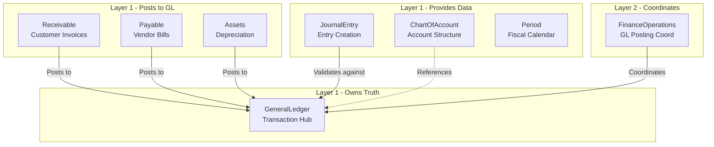
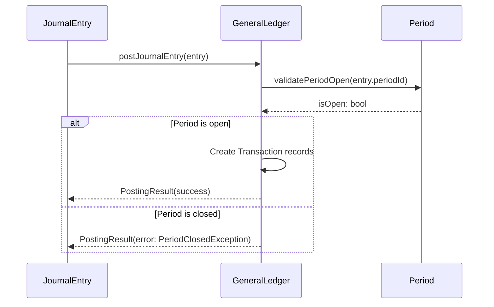
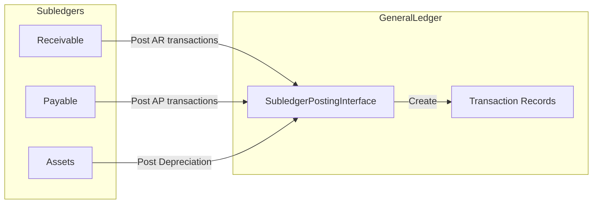

# GeneralLedger Package Architecture

## 1. Package Overview

### Purpose

The **Nexus\GeneralLedger** package is a Layer-1 atomic package that serves as the **central transaction hub** for all financial entries in the Nexus ERP system. The General Ledger (GL) is the core of any financial system - all journal entries from subledgers (Receivables, Payables, Assets, etc.) must ultimately be posted to the GL to ensure accounting accuracy and generate financial statements.

This package was identified as a **CRITICAL GAP** in the package analysis findings report (`plans/PACKAGE_ANALYSIS_FINDINGS.md`). Without a dedicated GeneralLedger package, the Accounting package lacks a central transaction hub, and all financial operations lack a unified source of truth for account balances.

### Position in Architecture

| Layer | Role |
|-------|------|
| Layer 1 (Atomic Package) | Pure business logic, framework-agnostic |
| Domain | Financial Management |
| Namespace | `Nexus\GeneralLedger` |
| Dependencies | Own interfaces only, PSR interfaces, Common package |

### Scope

The GeneralLedger package manages these core capabilities:

| Capability | Description |
|-----------|-------------|
| **Ledger Account Management** | Maintains the chart of accounts structure within the GL context |
| **Transaction Recording** | Records all debit/credit transactions posted from journal entries |
| **Balance Calculation** | Computes running balances, period balances, and trial balances |
| **Subledger Integration** | Provides interfaces for Receivable, Payable, and Assets subledgers to post to GL |
| **Period Validation** | Ensures transactions are posted only to open accounting periods |
| **Trial Balance** | Generates trial balance reports for all accounts |

---

## 2. Core Responsibilities

### What GeneralLedger Owns

The GeneralLedger package has **sole ownership** over:

1. **GL Account Master Data** - Account-level metadata specific to the ledger (not the chart of accounts structure)
2. **Transaction Records** - All posted debit/credit line items with running balances
3. **Account Balance Calculation** - Computing balances as of any date
4. **Trial Balance Generation** - Producing trial balance reports
5. **Subledger-to-GL Posting Interface** - The contract for subledgers to post transactions

### What Other Packages Own

| Package | Responsibility |
|---------|----------------|
| **ChartOfAccount** | Account master structure, account types, hierarchy |
| **JournalEntry** | Journal entry creation, validation, approval workflow |
| **Period** | Fiscal period definitions, open/close status |
| **Tenant** | Multi-entity context and isolation |
| **Accounting** | Financial statement generation (Balance Sheet, P&L) |
| **Receivable** | Customer invoices, credit memos, AR aging |
| **Payable** | Vendor bills, debit memos, AP aging |
| **Assets** | Asset register, depreciation calculations |

### Ownership Boundary



---

## 3. Domain Model

### Key Entities

#### Ledger

Represents the general ledger for a tenant. Each tenant may have multiple ledgers (e.g., statutory ledger, management ledger).

```php
// src/Entities/Ledger.php
final readonly class Ledger
{
    public function __construct(
        public string $id,           // ULID
        public string $tenantId,      // Tenant ULID
        public string $name,          // e.g., "Statutory Ledger"
        public string $currency,       // ISO currency code
        public LedgerType $type,       // STATUTORY, MANAGEMENT
        public LedgerStatus $status,   // ACTIVE, CLOSED, ARCHIVED
        public DateTimeImmutable $createdAt,
    ) {}
}
```

#### LedgerAccount

Represents an account within the ledger, referencing a ChartOfAccount account but adding GL-specific attributes.

```php
// src/Entities/LedgerAccount.php
final readonly class LedgerAccount
{
    public function __construct(
        public string $id,                    // ULID
        public string $ledgerId,             // Ledger ULID
        public string $accountId,             // ChartOfAccount account ULID
        public string $accountCode,           // e.g., "1000-0000"
        public AccountType $accountType,       // ASSET, LIABILITY, EQUITY, REVENUE, EXPENSE
        public bool $allowPosting,            // Can transactions be posted?
        public bool $isBankAccount,            // Is this a bank/cash account?
        public string|null $costCenterId,      // Optional cost center
    ) {}
}
```

#### Transaction

Represents a single debit or credit line posted to an account.

```php
// src/Entities/Transaction.php
final readonly class Transaction
{
    public function __construct(
        public string $id,                    // ULID
        public string $ledgerAccountId,      // LedgerAccount ULID
        public string $journalEntryLineId,    // Source journal entry line
        public TransactionType $type,         // DEBIT, CREDIT
        public Money $amount,                 // Transaction amount
        public Money $runningBalance,         // Balance after this transaction
        public string $periodId,              // Period ULID
        public DateTimeImmutable $postingDate,
        public DateTimeImmutable $createdAt,
    ) {}
}
```

#### TrialBalance

Represents a snapshot of all account balances at a point in time.

```php
// src/Entities/TrialBalance.php
final readonly class TrialBalance
{
    public function __construct(
        public string $id,
        public string $ledgerId,
        public string $periodId,
        public DateTimeImmutable $asOfDate,
        public array $lines,                  // TrialBalanceLine[]
        public Money $totalDebits,
        public Money $totalCredits,
        public bool $isBalanced,              // Debits = Credits
    ) {}
}
```

### Value Objects

| Value Object | Purpose |
|--------------|---------|
| `AccountBalance` | Represents balance (debit/credit nature, amount) |
| `TransactionDetail` | Complete transaction with source reference |
| `TrialBalanceSummary` | Aggregated trial balance data |
| `PostingResult` | Result of a posting operation |

### Enums

| Enum | Values |
|------|--------|
| `LedgerType` | STATUTORY, MANAGEMENT |
| `LedgerStatus` | ACTIVE, CLOSED, ARCHIVED |
| `TransactionType` | DEBIT, CREDIT |
| `BalanceType` | DEBIT, CREDIT, NONE |

---

## 4. Key Interfaces

### 4.1 Core Management Interfaces

#### GeneralLedgerManagerInterface

Main entry point for GL operations.

```php
interface GeneralLedgerManagerInterface
{
    // Ledger operations
    public function createLedger(CreateLedgerDTO $data): Ledger;
    public function getLedger(string $ledgerId): Ledger;
    public function closeLedger(string $ledgerId): void;
    
    // Account operations
    public function registerAccount(RegisterAccountDTO $data): LedgerAccount;
    public function getAccount(string $accountId): LedgerAccount;
    public function getAccountsForLedger(string $ledgerId): array;
    
    // Posting operations
    public function postTransaction(PostTransactionDTO $data): Transaction;
    public function postBatch(array $transactions): array;
    public function reverseTransaction(string $transactionId, string $reason): Transaction;
    
    // Reporting
    public function generateTrialBalance(string $ledgerId, string $periodId): TrialBalance;
}
```

#### LedgerQueryInterface

Read-only operations for querying ledger data.

```php
interface LedgerQueryInterface
{
    public function getAccountBalance(string $accountId, DateTimeImmutable $asOfDate): Money;
    public function getAccountBalanceForRange(
        string $accountId,
        DateTimeImmutable $fromDate,
        DateTimeImmutable $toDate
    ): Money;
    
    public function getAllAccountBalances(
        DateTimeImmutable $asOfDate,
        array $filters = []
    ): array;
    
    public function getAccountTransactions(
        string $accountId,
        ?DateTimeImmutable $fromDate = null,
        ?DateTimeImmutable $toDate = null
    ): array;
    
    public function getAccountLedgerWithRunningBalance(
        string $accountId,
        DateTimeImmutable $fromDate,
        DateTimeImmutable $toDate
    ): array;
    
    public function accountHasTransactions(string $accountId): bool;
    
    public function getAccountTotals(
        string $accountId,
        DateTimeImmutable $fromDate,
        DateTimeImmutable $toDate
    ): array;
}
```

### 4.2 Repository Interfaces (CQRS Pattern)

Following the repository design from ARCHITECTURE.md, split into Query and Persist interfaces.

#### LedgerRepositoryInterface

```php
interface LedgerRepositoryInterface extends LedgerQueryInterface, LedgerPersistInterface {}
```

#### LedgerQueryInterface (Repository)

```php
interface LedgerQueryInterface
{
    public function findById(string $id): ?Ledger;
    public function findByTenant(string $tenantId): array;
    public function findActiveByTenant(string $tenantId): array;
}
```

#### LedgerPersistInterface

```php
interface LedgerPersistInterface
{
    public function save(Ledger $ledger): void;
    public function delete(string $id): void;
}
```

#### LedgerAccountRepositoryInterface

```php
interface LedgerAccountRepositoryInterface extends LedgerAccountQueryInterface, LedgerAccountPersistInterface {}

// Query
interface LedgerAccountQueryInterface
{
    public function findById(string $id): ?LedgerAccount;
    public function findByLedger(string $ledgerId): array;
    public function findByAccountCode(string $ledgerId, string $code): ?LedgerAccount;
}

// Persist
interface LedgerAccountPersistInterface
{
    public function save(LedgerAccount $account): void;
    public function delete(string $id): void;
}
```

#### TransactionRepositoryInterface

```php
interface TransactionRepositoryInterface extends TransactionQueryInterface, TransactionPersistInterface {}

// Query
interface TransactionQueryInterface
{
    public function findById(string $id): ?Transaction;
    public function findByAccount(string $accountId): array;
    public function findByPeriod(string $ledgerId, string $periodId): array;
    public function findByJournalEntryLine(string $journalEntryLineId): ?Transaction;
}

// Persist
interface TransactionPersistInterface
{
    public function save(Transaction $transaction): void;
    public function saveBatch(array $transactions): void;
    public function delete(string $id): void;
}
```

### 4.3 Integration Interfaces

These interfaces define how other packages interact with GeneralLedger.

#### SubledgerPostingInterface

For Receivable, Payable, Assets to post to GL.

```php
interface SubledgerPostingInterface
{
    public function postToLedger(SubledgerPostingRequest $request): SubledgerPostingResult;
    public function validatePosting(SubledgerPostingRequest $request): ValidationResult;
    public function getPostedAmounts(string $subledgerId, string $periodId): array;
}
```

#### JournalEntryPostingInterface

For JournalEntry package to post validated entries to GL.

```php
interface JournalEntryPostingInterface
{
    public function postJournalEntry(JournalEntry $entry): PostingResult;
    public function canPost(JournalEntry $entry): bool;
    public function getPostingErrors(JournalEntry $entry): array;
}
```

---

## 5. Integration Points

### 5.1 ChartOfAccount Integration

The GL depends on ChartOfAccount for account structure but maintains its own ledger-specific account data.

```php
// Integration: ChartOfAccount -> GeneralLedger
interface ChartOfAccountIntegrationInterface
{
    // Called when ChartOfAccount account is created/updated
    public function onAccountCreated(Account $account): void;
    public function onAccountUpdated(Account $account): void;
    public function onAccountDeactivated(Account $account): void;
    
    // Query ChartOfAccount for account details
    public function getAccountDetails(string $accountId): Account;
    public function validateAccountCode(string $code): bool;
}
```

### 5.2 JournalEntry Integration

JournalEntry creates entries, validates them, and posts to GL through GeneralLedger.



### 5.3 Period Integration

GeneralLedger validates that transactions can only be posted to open periods.

```php
interface PeriodValidationInterface
{
    public function isPeriodOpen(string $periodId): bool;
    public function getPeriodForDate(DateTimeImmutable $date): Period;
    public function validatePostingDate(DateTimeImmutable $date): ValidationResult;
}
```

### 5.4 Subledger Integration

Receivable, Payable, and Assets packages post to GL through the SubledgerPostingInterface.



### 5.5 FinanceOperations Coordination

The FinanceOperations orchestrator coordinates GL posting workflows.

| Orchestrator Interface | GL Responsibility |
|----------------------|-------------------|
| `LedgerQueryInterface` | Provide account balances, transactions |
| `GLPostingCoordinatorInterface` | Execute posting workflow |
| `GLReconciliationProviderInterface` | Reconcile GL with subledgers |

---

## 6. Directory Structure

Following the pattern from the Treasury package:

```
packages/GeneralLedger/
├── composer.json
├── phpunit.xml
├── README.md
├── REQUIREMENTS.md
├── ARCHITECTURAL.md
├── src/
│   ├── Contracts/
│   │   ├── GeneralLedgerManagerInterface.php
│   │   ├── LedgerRepositoryInterface.php
│   │   ├── LedgerQueryInterface.php
│   │   ├── LedgerPersistInterface.php
│   │   ├── LedgerAccountRepositoryInterface.php
│   │   ├── LedgerAccountQueryInterface.php
│   │   ├── LedgerAccountPersistInterface.php
│   │   ├── TransactionRepositoryInterface.php
│   │   ├── TransactionQueryInterface.php
│   │   ├── TransactionPersistInterface.php
│   │   ├── SubledgerPostingInterface.php
│   │   ├── JournalEntryPostingInterface.php
│   │   └── Integration/
│   │       ├── ChartOfAccountIntegrationInterface.php
│   │       ├── PeriodValidationInterface.php
│   │       ├── TenantContextInterface.php
│   │       └── SequenceGeneratorInterface.php
│   │
│   ├── Entities/
│   │   ├── Ledger.php
│   │   ├── LedgerAccount.php
│   │   ├── Transaction.php
│   │   └── TrialBalance.php
│   │
│   ├── Enums/
│   │   ├── LedgerType.php
│   │   ├── LedgerStatus.php
│   │   ├── TransactionType.php
│   │   └── BalanceType.php
│   │
│   ├── Exceptions/
│   │   ├── GeneralLedgerException.php
│   │   ├── LedgerNotFoundException.php
│   │   ├── LedgerClosedException.php
│   │   ├── AccountNotFoundException.php
│   │   ├── AccountInactiveException.php
│   │   ├── PostingNotAllowedException.php
│   │   ├── PeriodClosedException.php
│   │   ├── DuplicateTransactionException.php
│   │   └── InvalidPostingAmountException.php
│   │
│   ├── Services/
│   │   ├── GeneralLedgerManager.php
│   │   ├── LedgerService.php
│   │   ├── TransactionPostingService.php
│   │   ├── TrialBalanceService.php
│   │   ├── BalanceCalculationService.php
│   │   └── SubledgerPostingService.php
│   │
│   ├── ValueObjects/
│   │   ├── AccountBalance.php
│   │   ├── TransactionDetail.php
│   │   ├── TrialBalanceSummary.php
│   │   ├── PostingResult.php
│   │   ├── SubledgerPostingRequest.php
│   │   └── SubledgerPostingResult.php
│   │
│   └── Support/
│       └── BalanceCalculator.php
│
└── tests/
    └── Unit/
        ├── Services/
        │   ├── GeneralLedgerManagerTest.php
        │   ├── TransactionPostingServiceTest.php
        │   └── TrialBalanceServiceTest.php
        └── ValueObjects/
            └── AccountBalanceTest.php
```

---

## 7. Compliance with ARCHITECTURE.md Rules

### 7.1 Framework Agnosticism

The GeneralLedger package follows all Layer 1 requirements:

- ✅ **Pure PHP 8.3+** - No framework dependencies
- ✅ **Zero framework imports** - No `Illuminate\*` or `Symfony\*`
- ✅ **Interface-driven** - All external dependencies via contracts
- ✅ **Strict types** - `declare(strict_types=1);` in every file

### 7.2 Coding Standards

Following Section 6 of ARCHITECTURE.md:

```php
<?php

declare(strict_types=1);

namespace Nexus\GeneralLedger\Services;

use Nexus\GeneralLedger\Contracts\GeneralLedgerManagerInterface;
use Nexus\Common\ValueObjects\Money;

/**
 * General Ledger Manager.
 *
 * Manages ledger operations including account registration,
 * transaction posting, and trial balance generation.
 */
final readonly class GeneralLedgerManager implements GeneralLedgerManagerInterface
{
    public function __construct(
        private LedgerRepositoryInterface $ledgerRepository,
        private TransactionPostingService $postingService,
    ) {}

    public function postTransaction(PostTransactionDTO $data): Transaction
    {
        // Implementation
    }
}
```

### 7.3 Repository Design (CQRS)

Following Section 6.2 of ARCHITECTURE.md:

All repositories split into Query and Persist interfaces:

```php
// Query interface - read-only operations
interface LedgerQueryInterface
{
    public function findById(string $id): ?Ledger;
}

// Persist interface - write operations
interface LedgerPersistInterface
{
    public function save(Ledger $ledger): void;
}

// Combined repository
interface LedgerRepositoryInterface extends LedgerQueryInterface, LedgerPersistInterface {}
```

### 7.4 Constructor Property Promotion

All service classes use:

```php
final readonly class GeneralLedgerManager implements GeneralLedgerManagerInterface
{
    public function __construct(
        private LedgerRepositoryInterface $ledgerRepository,
        private TransactionPostingService $postingService,
    ) {}
}
```

### 7.5 Native PHP Enums

All enums use PHP 8.1+ native enums:

```php
enum LedgerType: string
{
    case STATUTORY = 'statutory';
    case MANAGEMENT = 'management';
}

enum TransactionType: string
{
    case DEBIT = 'debit';
    case CREDIT = 'credit';
}
```

### 7.6 Domain-Specific Exceptions

Following Section 6.3 of ARCHITECTURE.md:

```php
// Base exception
class GeneralLedgerException extends \Exception {}

// Specific exceptions
class LedgerNotFoundException extends GeneralLedgerException {}
class PeriodClosedException extends GeneralLedgerException {}
class PostingNotAllowedException extends GeneralLedgerException {}
```

---

## 8. Progressive Disclosure

Following the architectural principle from the custom instructions, the package design considers three tiers of users:

### Tier 1: Small Organizations

- Single ledger per tenant
- Simple chart of accounts
- Basic posting workflow
- Manual period close

### Tier 2: Mid-Tier Organizations

- Multiple ledgers (statutory + management)
- Multiple currencies
- Cost center tracking
- Automated subledger posting

### Tier 3: Large Corporations

- Complex multi-entity structures
- Intercompany transactions
- Advanced consolidation
- Real-time budget integration
- Detailed audit trails

---

## 9. Dependencies

### Required Packages

| Package | Purpose |
|---------|---------|
| `Nexus\Common` | Money value object, common utilities |
| `Nexus\ChartOfAccount` | Account structure reference |
| `Nexus\JournalEntry` | Journal entry source |
| `Nexus\Period` | Fiscal period validation |
| `Nexus\Tenant` | Multi-tenant context |

### PSR Interfaces

| Interface | Purpose |
|-----------|---------|
| `Psr\Log\LoggerInterface` | Logging |
| `Psr\EventDispatcher\EventDispatcherInterface` | Event publishing |

---

## 10. Summary

The GeneralLedger package is the **central transaction hub** for the Nexus ERP financial system. It:

1. **Owns** transaction recording and balance computation
2. **Integrates** with ChartOfAccount for structure, JournalEntry for entries, and Period for validation
3. **Serves** subledgers (Receivable, Payable, Assets) via posting interfaces
4. **Coordinates** with FinanceOperations orchestrator for complex workflows
5. **Follows** all Layer 1 atomic package requirements from ARCHITECTURE.md

This package fills the critical gap identified in the package analysis and enables the full financial management capability of the Nexus ERP system.
