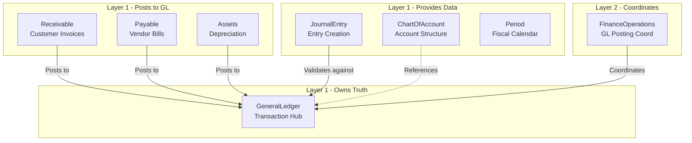

# GeneralLedger Package

Central transaction hub for all financial entries in the Nexus ERP system.

## Purpose

The **Nexus\GeneralLedger** package is a Layer-1 atomic package that serves as the **central transaction hub** for all financial entries in the Nexus ERP system. The General Ledger (GL) is the core of any financial system - all journal entries from subledgers (Receivables, Payables, Assets, etc.) must ultimately be posted to the GL to ensure accounting accuracy and generate financial statements.

## Key Features

- **Ledger Master Data Management**: Create, update, and manage multiple ledgers per tenant (statutory and management ledgers)
- **Ledger Account Management**: Register and manage accounts within the ledger, integrating with ChartOfAccount
- **Journal Entry Posting**: Post validated journal entries to the general ledger with full audit trail
- **Account Balance Calculation**: Real-time calculation of debit/credit balances as of any date
- **Trial Balance Generation**: Generate comprehensive trial balance reports for all accounts
- **Multi-Entity Support**: Support for multiple entities (tenants) with isolated ledger data
- **Multi-Currency Support**: Handle transactions in multiple currencies with proper conversion
- **Subledger Integration**: Interfaces for AR, AP, and Assets subledgers to post transactions to GL
- **Fiscal Period Validation**: Enforce posting only to open accounting periods
- **Transaction Reversal**: Reverse posted transactions with full audit trail

## Installation

```bash
composer require nexus/general-ledger
```

### Requirements

- PHP ^8.3
- nexus/common ^1.0
- nexus/chart-of-account ^1.0
- nexus/journal-entry ^1.0
- nexus/period ^1.0

## Usage

### Creating a Ledger

```php
use Nexus\GeneralLedger\Services\GeneralLedgerManager;
use Nexus\GeneralLedger\ValueObjects\CreateLedgerData;

$ledgerData = CreateLedgerData::fromArray([
    'tenant_id' => 'tenant-123',
    'name' => 'Statutory Ledger',
    'currency' => 'USD',
    'type' => 'STATUTORY',
]);

$ledger = $generalLedgerManager->createLedger($ledgerData);
echo $ledger->id; // ULID
```

### Creating Ledger Accounts

```php
use Nexus\GeneralLedger\ValueObjects\RegisterAccountData;

$accountData = RegisterAccountData::fromArray([
    'ledger_id' => $ledger->id,
    'account_id' => 'coa-account-456', // From ChartOfAccount
    'account_code' => '1000-0000',
    'account_type' => 'ASSET',
    'allow_posting' => true,
    'is_bank_account' => false,
]);

$account = $generalLedgerManager->registerAccount($accountData);
echo $account->id; // ULID
```

### Posting Journal Entries

```php
use Nexus\GeneralLedger\ValueObjects\PostTransactionData;

$transactionData = PostTransactionData::fromArray([
    'ledger_account_id' => $account->id,
    'journal_entry_line_id' => 'jel-789',
    'type' => 'DEBIT',
    'amount' => 5000.00,
    'currency' => 'USD',
    'period_id' => 'period-2024-01',
    'posting_date' => new DateTimeImmutable('2024-01-15'),
]);

$transaction = $generalLedgerManager->postTransaction($transactionData);
echo $transaction->runningBalance->amount; // 5000.00
```

### Calculating Account Balances

```php
use Nexus\GeneralLedger\Services\LedgerQueryService;

$balance = $ledgerQueryService->getAccountBalance(
    $account->id,
    new DateTimeImmutable('2024-01-31')
);

echo $balance->amount; // Account balance as of date
echo $balance->type; // DEBIT or CREDIT
```

### Generating Trial Balance

```php
$trialBalance = $generalLedgerManager->generateTrialBalance(
    $ledger->id,
    'period-2024-01'
);

echo $trialBalance->totalDebits->amount;
echo $trialBalance->totalCredits->amount;
echo $trialBalance->isBalanced; // true if debits = credits

foreach ($trialBalance->lines as $line) {
    echo $line->accountCode . ': ' . $line->balance->amount;
}
```

### Subledger Integration

```php
use Nexus\GeneralLedger\Contracts\SubledgerPostingInterface;
use Nexus\GeneralLedger\ValueObjects\SubledgerPostingRequest;

// AR, AP, or Assets subledgers can post to GL
$postingRequest = SubledgerPostingRequest::fromArray([
    'subledger_id' => 'ar-invoice-123',
    'subledger_type' => 'RECEIVABLE',
    'ledger_id' => $ledger->id,
    'entries' => [
        [
            'account_code' => '1200-0000',
            'type' => 'DEBIT',
            'amount' => 1000.00,
            'currency' => 'USD',
        ],
        [
            'account_code' => '4000-0000',
            'type' => 'CREDIT',
            'amount' => 1000.00,
            'currency' => 'USD',
        ],
    ],
    'period_id' => 'period-2024-01',
    'posting_date' => new DateTimeImmutable('2024-01-15'),
]);

$result = $subledgerPosting->postToLedger($postingRequest);
echo $result->isSuccess();
```

## Interfaces

### Core Interfaces

| Interface | Description |
|-----------|-------------|
| [`GeneralLedgerManagerInterface`](src/Contracts/GeneralLedgerManagerInterface.php) | Main orchestrator for ledger operations |
| [`LedgerQueryInterface`](src/Contracts/LedgerQueryInterface.php) | Read-only operations for querying ledger data |
| [`LedgerPersistInterface`](src/Contracts/LedgerPersistInterface.php) | Write operations for ledger persistence |
| [`SubledgerPostingInterface`](src/Contracts/SubledgerPostingInterface.php) | Interface for subledgers to post to GL |
| [`JournalEntryPostingInterface`](src/Contracts/JournalEntryPostingInterface.php) | Interface for JournalEntry package to post to GL |

### Repository Interfaces

| Interface | Description |
|-----------|-------------|
| [`LedgerRepositoryInterface`](src/Contracts/LedgerRepositoryInterface.php) | Combined repository for ledger persistence |
| [`LedgerAccountRepositoryInterface`](src/Contracts/LedgerAccountRepositoryInterface.php) | Combined repository for account persistence |
| [`TransactionRepositoryInterface`](src/Contracts/TransactionRepositoryInterface.php) | Combined repository for transaction persistence |

### Integration Interfaces

| Interface | Description |
|-----------|-------------|
| [`ChartOfAccountIntegrationInterface`](src/Contracts/Integration/ChartOfAccountIntegrationInterface.php) | Integration with ChartOfAccount |
| [`PeriodValidationInterface`](src/Contracts/Integration/PeriodValidationInterface.php) | Integration with Period for fiscal validation |

## Models

| Model | Description |
|-------|-------------|
| [`Ledger`](src/Models/Ledger.php) | Immutable ledger entity representing a general ledger |
| [`LedgerAccount`](src/Models/LedgerAccount.php) | Immutable ledger account entity |
| [`Transaction`](src/Models/Transaction.php) | Immutable transaction entity for debit/credit entries |
| [`TrialBalance`](src/Models/TrialBalance.php) | Immutable trial balance report entity |

## Value Objects

| Value Object | Description |
|--------------|-------------|
| [`AccountBalance`](src/ValueObjects/AccountBalance.php) | Represents account balance with debit/credit type |
| [`CreateLedgerData`](src/ValueObjects/CreateLedgerData.php) | Data transfer object for ledger creation |
| [`RegisterAccountData`](src/ValueObjects/RegisterAccountData.php) | Data transfer object for account registration |
| [`PostTransactionData`](src/ValueObjects/PostTransactionData.php) | Data transfer object for posting transactions |
| [`SubledgerPostingRequest`](src/ValueObjects/SubledgerPostingRequest.php) | Request object for subledger postings |
| [`SubledgerPostingResult`](src/ValueObjects/SubledgerPostingResult.php) | Result object for subledger posting operations |

## Enums

| Enum | Cases | Description |
|------|-------|-------------|
| [`LedgerType`](src/Enums/LedgerType.php) | STATUTORY, MANAGEMENT | Type of ledger |
| [`LedgerStatus`](src/Enums/LedgerStatus.php) | ACTIVE, CLOSED, ARCHIVED | Status of ledger |
| [`TransactionType`](src/Enums/TransactionType.php) | DEBIT, CREDIT | Type of transaction |
| [`BalanceType`](src/Enums/BalanceType.php) | DEBIT, CREDIT, NONE | Type of account balance |
| [`PostingStatus`](src/Enums/PostingStatus.php) | PENDING, POSTED, REVERSED, FAILED | Status of posting operation |

## Exceptions

| Exception | Description |
|-----------|-------------|
| [`GeneralLedgerException`](src/Exceptions/GeneralLedgerException.php) | Base exception for general ledger operations |
| [`LedgerNotFoundException`](src/Exceptions/LedgerNotFoundException.php) | Thrown when ledger is not found |
| [`LedgerAccountNotFoundException`](src/Exceptions/LedgerAccountNotFoundException.php) | Thrown when ledger account is not found |
| [`PeriodClosedException`](src/Exceptions/PeriodClosedException.php) | Thrown when posting to closed period |
| [`TransactionNotFoundException`](src/Exceptions/TransactionNotFoundException.php) | Thrown when transaction is not found |
| [`InvalidPostingException`](src/Exceptions/InvalidPostingException.php) | Thrown when posting is invalid |

## Architecture

This package follows the Atomic Architecture pattern:

- **Contracts**: Interface definitions for domain contracts and integrations
- **Models**: Immutable entity implementations (Ledger, LedgerAccount, Transaction, TrialBalance)
- **ValueObjects**: Data transfer objects for operations
- **Services**: Business logic and orchestration
- **Repositories**: In-memory implementations for testing
- **Enums**: Type-safe enumerations
- **Exceptions**: Domain-specific exceptions

### Integration Architecture



## Testing

```bash
# Run tests
./vendor/bin/phpunit

# Run with coverage
./vendor/bin/phpunit --coverage-html coverage
```

## License

MIT License
