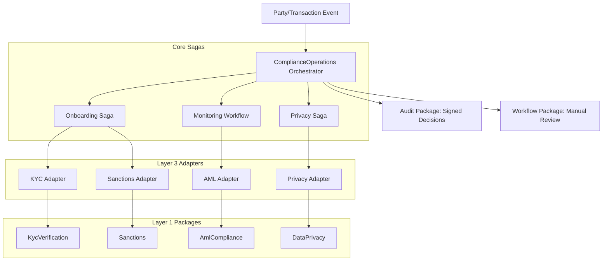

# Compliance & Risk Operations Orchestrator Design

## 1. Overview
The `ComplianceOperations` orchestrator coordinates the lifecycle of identity verification, risk scoring, and regulatory adherence. It bridges the gap between `Identity` (who is the user) and `Compliance` (is this transaction/party allowed).

## 2. Core Workflows (Sagas)

### 2.1 Onboarding Compliance Saga
Coordinates the initial verification of a new party (Customer, Vendor, or Employee).
- **Steps**:
    1. **Sanctions Screening**: Check against international watchlists.
    2. **KYC Verification**: Process and verify identity documents.
    3. **Initial Risk Scoring**: Calculate baseline AML risk.
    4. **Audit Logging**: Cryptographically sign the onboarding decision.
- **Compensation**: Mark party as "Verification Failed", notify compliance officer, and restrict account access.

### 2.2 Transaction Monitoring Workflow
Real-time or near-real-time evaluation of financial activities.
- **Steps**:
    1. **Pattern Matching**: Check transaction against AML red flags.
    2. **Velocity Check**: Evaluate transaction frequency and volume.
    3. **Sanctions Re-screening**: Ensure counterparty is not sanctioned.
    4. **Workflow Trigger**: If high risk, initiate a manual review workflow.

### 2.3 Periodic Review Saga
Automated re-verification of existing parties based on their risk profile.
- **Steps**:
    1. **Data Refresh**: Request updated KYC documents if expired.
    2. **Risk Re-assessment**: Update risk score based on recent behavior.
    3. **Status Update**: Renew or suspend compliance status.

### 2.4 Privacy Rights (DSAR) Fulfillment
Coordinates Data Subject Access Requests across the ecosystem.
- **Steps**:
    1. **Data Discovery**: Query all domain packages for PII related to the subject.
    2. **Redaction/Export**: Execute data portability or "right to be forgotten" actions.
    3. **Compliance Certificate**: Issue a signed audit record of the fulfillment.

## 3. Package Integration (Layer 1 Coordination)
The orchestrator will coordinate the following atomic packages:

| Package | Role in Orchestration |
|---------|-----------------------|
| `KycVerification` | Identity document processing and biometric verification. |
| `AmlCompliance` | Transaction monitoring, risk scoring, and SAR reporting. |
| `Sanctions` | PEP (Politically Exposed Persons) and global watchlist screening. |
| `DataPrivacy` | Consent management and PII tracking. |
| `Audit` | Immutable, cryptographically signed logging of all compliance events. |
| `Workflow` | Human-in-the-loop approval chains for high-risk flags. |

## 4. Interface Design

### 4.1 Main Orchestrator Interface
```php
namespace Nexus\ComplianceOperations\Contracts;

interface ComplianceOperationsInterface
{
    public function onboardParty(PartyContext $context): ComplianceResult;
    
    public function monitorTransaction(TransactionContext $context): RiskAssessment;
    
    public function fulfillPrivacyRequest(DsarContext $context): DsarResult;
    
    public function getRiskProfile(string $partyId): RiskProfile;
}
```

### 4.2 Orchestrator-Defined Service Interfaces (ISP)
Following the project's pattern, the orchestrator defines what it needs from adapters:

- `IdentityVerifierInterface`: Wraps KYC document processing.
- `RiskScorerInterface`: Aggregates scores from AML and Sanctions.
- `PrivacyCoordinatorInterface`: Manages cross-package data discovery.
- `ComplianceAuditLoggerInterface`: Ensures decisions are cryptographically signed.

## 5. Implementation Phases

### Phase 1: Foundation
- Define Orchestrator DTOs and Contracts.
- Implement `Audit` and `Workflow` adapters.
- Setup the basic Saga execution engine for Compliance.

### Phase 2: Core Workflows
- Implement `Onboarding Compliance Saga`.
- Integrate `Sanctions` and `KycVerification` packages via adapters.
- Implement basic `RiskDecisionEngine`.

### Phase 3: Advanced Monitoring
- Implement `Transaction Monitoring Workflow`.
- Integrate `AmlCompliance` for pattern detection.
- Connect to `MachineLearning` package for anomaly detection.

### Phase 4: Privacy & Governance
- Implement `DSAR Fulfillment` workflow.
- Integrate `DataPrivacy` package.
- Final end-to-end integration testing with `Sales` and `Procurement` orchestrators.

## 6. System Architecture (Mermaid)


