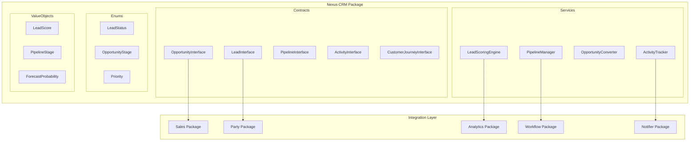
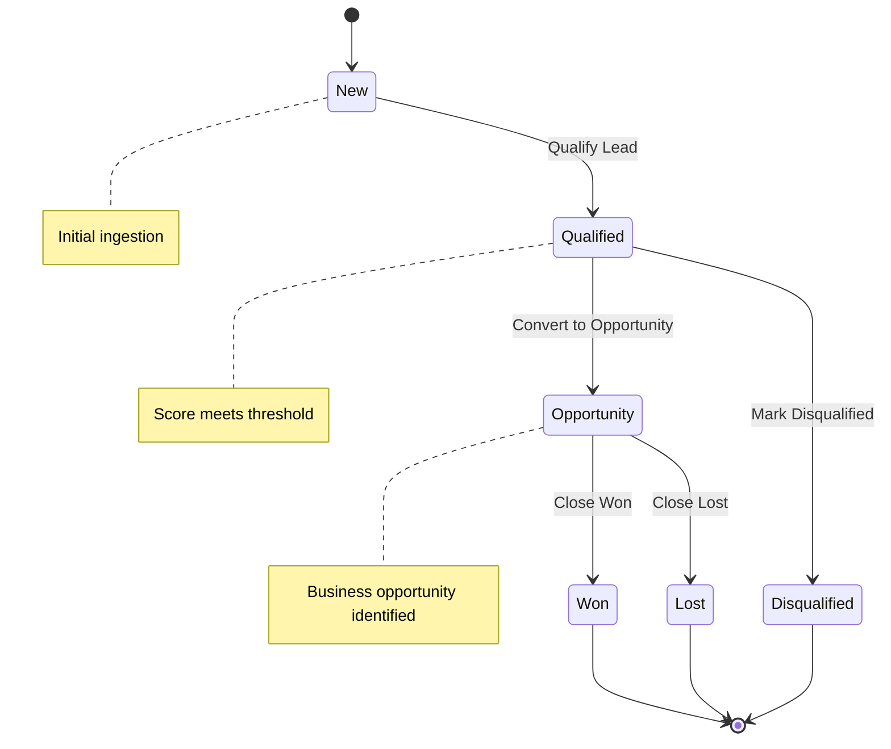
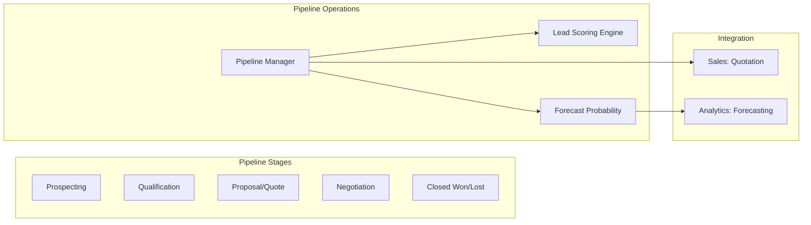
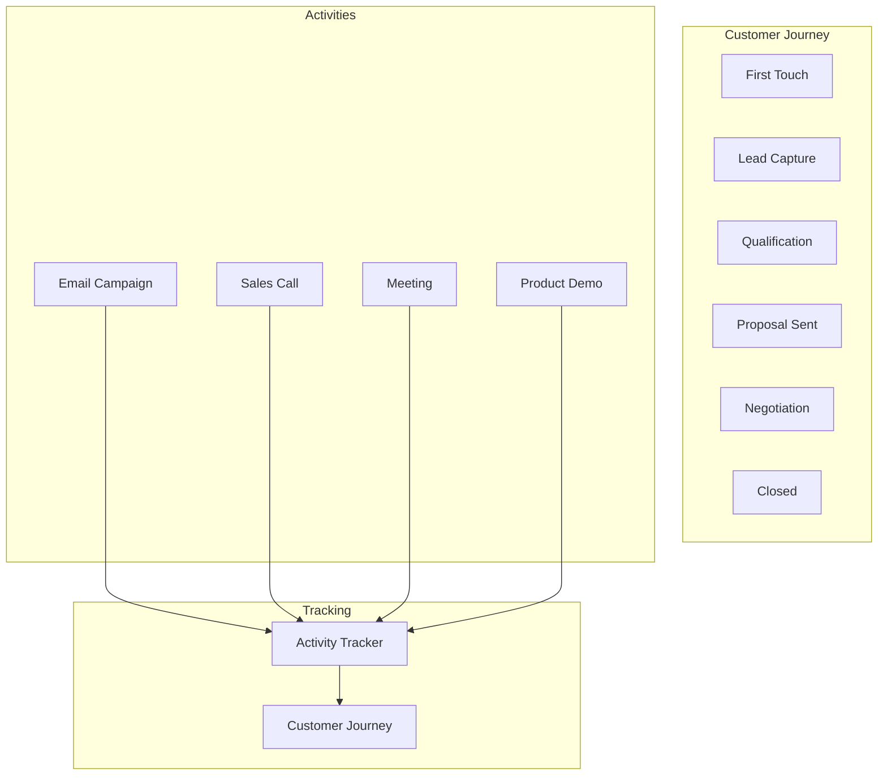
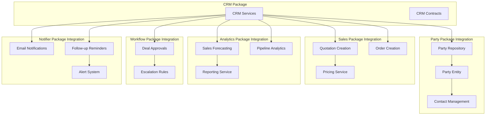
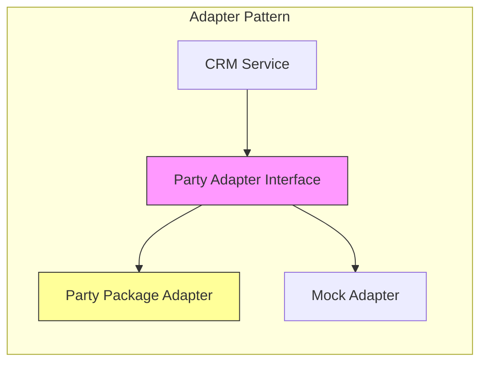

# CRM Package Implementation Plan

**Document Version:** 1.0  
**Date:** 2026-02-19  
**Status:** HIGH PRIORITY  
**Architecture Reference:** `ARCHITECTURE.md`, `packages/Sales/`, `packages/Party/`, `packages/Analytics/`

---

## Executive Summary

This document outlines a comprehensive implementation plan for the **Nexus\CRM** package - the highest-impact new atomic package for this ERP project. The CRM package provides essential customer relationship management functionality including lead management, opportunity tracking, pipeline management, and activity tracking.

### Strategic Importance

| Factor | Impact Level | Rationale |
|--------|--------------|------------|
| Revenue Impact | CRITICAL | Drives sales pipeline management, lead tracking, and opportunity forecasting |
| Integration Value | HIGH | Connects Sales, Marketing, Party, and Analytics packages |
| Customer 360 View | HIGH | Provides unified customer data across all touchpoints |
| Competitive Necessity | CRITICAL | Modern ERPs (SAP, Oracle, Microsoft Dynamics) all include CRM |

### Package Overview

The CRM package is designed as a framework-agnostic PHP library following Nexus atomic package patterns:
- **Namespace:** `Nexus\CRM`
- **PHP Version:** ^8.3
- **Architecture:** CQRS with immutable services, interface segregation
- **Dependencies:** Party, Sales, Analytics, Workflow, Notifier packages

---

## 1. System Architecture

### 1.1 Package Architecture Overview



### 1.2 Lead Management Flow



### 1.3 Pipeline Management Architecture



### 1.4 Customer Journey Tracking



---

## 2. Proposed Package Structure

```
packages/CRM/
├── composer.json
├── LICENSE
├── README.md
├── phpunit.xml
├── src/
│   ├── Contracts/
│   │   ├── LeadInterface.php
│   │   ├── LeadRepositoryInterface.php
│   │   ├── OpportunityInterface.php
│   │   ├── OpportunityRepositoryInterface.php
│   │   ├── PipelineInterface.php
│   │   ├── PipelineRepositoryInterface.php
│   │   ├── ActivityInterface.php
│   │   ├── ActivityRepositoryInterface.php
│   │   ├── CustomerJourneyInterface.php
│   │   ├── CustomerJourneyRepositoryInterface.php
│   │   ├── LeadScoringServiceInterface.php
│   │   ├── PipelineManagerInterface.php
│   │   ├── OpportunityConverterInterface.php
│   │   └── ActivityTrackerInterface.php
│   ├── Enums/
│   │   ├── LeadStatus.php
│   │   ├── LeadSource.php
│   │   ├── OpportunityStage.php
│   │   ├── OpportunityType.php
│   │   ├── Priority.php
│   │   ├── ActivityType.php
│   │   └── ActivityOutcome.php
│   ├── Services/
│   │   ├── LeadScoringEngine.php
│   │   ├── PipelineManager.php
│   │   ├── OpportunityConverter.php
│   │   ├── ActivityTracker.php
│   │   └── CustomerJourneyService.php
│   ├── ValueObjects/
│   │   ├── LeadScore.php
│   │   ├── PipelineStage.php
│   │   ├── ForecastProbability.php
│   │   ├── ActivityNote.php
│   │   └── JourneyStep.php
│   ├── Exceptions/
│   │   ├── LeadNotFoundException.php
│   │   ├── OpportunityNotFoundException.php
│   │   ├── InvalidLeadStatusTransitionException.php
│   │   ├── InvalidOpportunityStageTransitionException.php
│   │   ├── PipelineStageException.php
│   │   └── ScoringException.php
│   ├── Events/
│   │   ├── LeadCreated.php
│   │   ├── LeadQualified.php
│   │   ├── LeadConvertedToOpportunity.php
│   │   ├── OpportunityStageChanged.php
│   │   ├── OpportunityWon.php
│   │   ├── OpportunityLost.php
│   │   ├── ActivityLogged.php
│   │   └── JourneyMilestoneReached.php
│   └── DTOs/
│       ├── CreateLeadRequest.php
│       ├── UpdateLeadRequest.php
│       ├── CreateOpportunityRequest.php
│       ├── UpdateOpportunityRequest.php
│       ├── LogActivityRequest.php
│       ├── PipelineForecastData.php
│       └── LeadScoreResult.php
└── tests/
    ├── Unit/
    │   ├── Services/
    │   ├── ValueObjects/
    │   └── Enums/
    └── Integration/
        ├── LeadRepositoryTest.php
        ├── OpportunityRepositoryTest.php
        └── PipelineManagerTest.php
```

---

## 3. Interface Contracts

### 3.1 LeadInterface

```php
<?php

declare(strict_types=1);

namespace Nexus\CRM\Contracts;

use DateTimeImmutable;
use Nexus\CRM\Enums\LeadStatus;
use Nexus\CRM\Enums\LeadSource;
use Nexus\CRM\ValueObjects\LeadScore;

/**
 * Lead entity contract representing a prospective customer.
 */
interface LeadInterface
{
    public function getId(): string;
    
    public function getTenantId(): string;
    
    public function getLeadNumber(): string;
    
    public function getPartyId(): string;
    
    public function getContactId(): ?string;
    
    public function getStatus(): LeadStatus;
    
    public function getSource(): LeadSource;
    
    public function getScore(): LeadScore;
    
    public function getAssignedTo(): ?string;
    
    public function getConvertedToOpportunityId(): ?string;
    
    public function getQualifiedAt(): ?DateTimeImmutable;
    
    public function getConvertedAt(): ?DateTimeImmutable;
    
    public function getDisqualifiedAt(): ?DateTimeImmutable;
    
    public function getDisqualificationReason(): ?string;
    
    public function getNotes(): ?string;
    
    public function getCampaignId(): ?string;
    
    public function getCreatedAt(): DateTimeImmutable;
    
    public function getUpdatedAt(): DateTimeImmutable;
    
    public function toArray(): array;
}
```

### 3.2 OpportunityInterface

```php
<?php

declare(strict_types=1);

namespace Nexus\CRM\Contracts;

use DateTimeImmutable;
use Nexus\CRM\Enums\OpportunityStage;
use Nexus\CRM\Enums\OpportunityType;
use Nexus\CRM\Enums\Priority;
use Nexus\CRM\ValueObjects\ForecastProbability;

/**
 * Sales opportunity entity contract.
 */
interface OpportunityInterface
{
    public function getId(): string;
    
    public function getTenantId(): string;
    
    public function getOpportunityNumber(): string;
    
    public function getLeadId(): ?string;
    
    public function getPartyId(): string;
    
    public function getContactId(): ?string;
    
    public function getName(): string;
    
    public function getDescription(): ?string;
    
    public function getStage(): OpportunityStage;
    
    public function getType(): OpportunityType;
    
    public function getPriority(): Priority;
    
    public function getProbability(): ForecastProbability;
    
    public function getExpectedRevenue(): float;
    
    public function getWeightedRevenue(): float;
    
    public function getCurrencyCode(): string;
    
    public function getExpectedCloseDate(): ?DateTimeImmutable;
    
    public function getActualCloseDate(): ?DateTimeImmutable;
    
    public function getAssignedTo(): string;
    
    public function getConvertedToQuoteId(): ?string;
    
    public function getConvertedToOrderId(): ?string;
    
    public function getLostReason(): ?string;
    
    public function getNotes(): ?string;
    
    public function getCreatedAt(): DateTimeImmutable;
    
    public function getUpdatedAt(): DateTimeImmutable;
    
    public function toArray(): array;
}
```

### 3.3 PipelineInterface

```php
<?php

declare(strict_types=1);

namespace Nexus\CRM\Contracts;

use Nexus\CRM\ValueObjects\PipelineStage;

/**
 * Sales pipeline entity contract.
 */
interface PipelineInterface
{
    public function getId(): string;
    
    public function getTenantId(): string;
    
    public function getName(): string;
    
    public function getDescription(): ?string;
    
    /**
     * @return PipelineStage[]
     */
    public function getStages(): array;
    
    public function isDefault(): bool;
    
    public function getCreatedAt(): \DateTimeImmutable;
    
    public function getUpdatedAt(): \DateTimeImmutable;
    
    public function toArray(): array;
}
```

### 3.4 ActivityInterface

```php
<?php

declare(strict_types=1);

namespace Nexus\CRM\Contracts;

use DateTimeImmutable;
use Nexus\CRM\Enums\ActivityType;
use Nexus\CRM\Enums\ActivityOutcome;

/**
 * Activity entity for tracking customer interactions.
 */
interface ActivityInterface
{
    public function getId(): string;
    
    public function getTenantId(): string;
    
    public function getRelatedEntityType(): string;
    
    public function getRelatedEntityId(): string;
    
    public function getActivityType(): ActivityType;
    
    public function getSubject(): string;
    
    public function getDescription(): ?string;
    
    public function getOutcome(): ?ActivityOutcome;
    
    public function getDueDate(): ?DateTimeImmutable;
    
    public function getCompletedAt(): ?DateTimeImmutable;
    
    public function getCompletedBy(): ?string;
    
    public function getAssignedTo(): ?string;
    
    public function getCreatedBy(): string;
    
    public function getCreatedAt(): DateTimeImmutable;
    
    public function getUpdatedAt(): DateTimeImmutable;
    
    public function toArray(): array;
}
```

### 3.5 CustomerJourneyInterface

```php
<?php

declare(strict_types=1);

namespace Nexus\CRM\Contracts;

use DateTimeImmutable;
use Nexus\CRM\ValueObjects\JourneyStep;

/**
 * Customer journey tracking entity.
 */
interface CustomerJourneyInterface
{
    public function getId(): string;
    
    public function getTenantId(): string;
    
    public function getPartyId(): string;
    
    public function getJourneyName(): string;
    
    /**
     * @return JourneyStep[]
     */
    public function getSteps(): array;
    
    public function getCurrentStep(): ?JourneyStep;
    
    public function getStartedAt(): DateTimeImmutable;
    
    public function getCompletedAt(): ?DateTimeImmutable;
    
    public function getAbandonedAt(): ?DateTimeImmutable;
    
    public function getAbandonmentReason(): ?string;
    
    public function getCreatedAt(): DateTimeImmutable;
    
    public function getUpdatedAt(): DateTimeImmutable;
    
    public function toArray(): array;
}
```

### 3.6 LeadScoringServiceInterface

```php
<?php

declare(strict_types=1);

namespace Nexus\CRM\Contracts;

use Nexus\CRM\ValueObjects\LeadScore;
use Nexus\CRM\DTOs\LeadScoreResult;

/**
 * Lead scoring service contract.
 */
interface LeadScoringServiceInterface
{
    /**
     * Calculate lead score based on various factors.
     */
    public function calculateScore(LeadInterface $lead): LeadScore;
    
    /**
     * Get detailed scoring breakdown.
     */
    public function getScoreBreakdown(LeadInterface $lead): LeadScoreResult;
    
    /**
     * Check if lead meets qualification threshold.
     */
    public function isQualified(LeadInterface $lead, float $threshold = 70.0): bool;
    
    /**
     * Update scoring weights.
     */
    public function updateWeights(array $weights): void;
    
    /**
     * Get current scoring configuration.
     */
    public function getConfiguration(): array;
}
```

### 3.7 PipelineManagerInterface

```php
<?php

declare(strict_types=1);

namespace Nexus\CRM\Contracts;

use Nexus\CRM\Enums\OpportunityStage;
use Nexus\CRM\DTOs\PipelineForecastData;

/**
 * Pipeline management service contract.
 */
interface PipelineManagerInterface
{
    /**
     * Move opportunity to a new stage.
     */
    public function moveToStage(OpportunityInterface $opportunity, OpportunityStage $newStage): void;
    
    /**
     * Get pipeline analytics.
     */
    public function getPipelineAnalytics(string $pipelineId, array $filters = []): array;
    
    /**
     * Generate forecast data.
     */
    public function generateForecast(string $pipelineId, \DateTimeImmutable $forecastDate): PipelineForecastData;
    
    /**
     * Get opportunities by stage.
     */
    public function getOpportunitiesByStage(string $pipelineId, OpportunityStage $stage): array;
    
    /**
     * Calculate conversion rates.
     */
    public function getConversionRates(string $pipelineId): array;
    
    /**
     * Get weighted pipeline value.
     */
    public function getWeightedPipelineValue(string $pipelineId): float;
}
```

### 3.8 OpportunityConverterInterface

```php
<?php

declare(strict_types=1);

namespace Nexus\CRM\Contracts;

use Nexus\CRM\DTOs\CreateOpportunityRequest;

/**
 * Opportunity conversion service contract.
 */
interface OpportunityConverterInterface
{
    /**
     * Convert lead to opportunity.
     */
    public function convertLeadToOpportunity(
        LeadInterface $lead,
        CreateOpportunityRequest $request
    ): OpportunityInterface;
    
    /**
     * Convert opportunity to sales quotation.
     */
    public function convertToQuotation(OpportunityInterface $opportunity): string;
    
    /**
     * Convert opportunity to sales order.
     */
    public function convertToOrder(OpportunityInterface $opportunity): string;
    
    /**
     * Close opportunity as won.
     */
    public function closeWon(OpportunityInterface $opportunity, array $notes = []): void;
    
    /**
     * Close opportunity as lost.
     */
    public function closeLost(OpportunityInterface $opportunity, string $reason): void;
}
```

---

## 4. Enums Definition

### 4.1 LeadStatus

```php
<?php

declare(strict_types=1);

namespace Nexus\CRM\Enums;

/**
 * Lead status lifecycle enum.
 */
enum LeadStatus: string
{
    case NEW = 'new';
    case CONTACTED = 'contacted';
    case QUALIFIED = 'qualified';
    case DISQUALIFIED = 'disqualified';
    case CONVERTED_TO_OPPORTUNITY = 'converted_to_opportunity';
    
    public function canTransitionTo(LeadStatus $newStatus): bool
    {
        return match ($this) {
            self::NEW => in_array($newStatus, [self::CONTACTED, self::QUALIFIED, self::DISQUALIFIED], true),
            self::CONTACTED => in_array($newStatus, [self::QUALIFIED, self::DISQUALIFIED], true),
            self::QUALIFIED => $newStatus === self::CONVERTED_TO_OPPORTUNITY,
            self::DISQUALIFIED, self::CONVERTED_TO_OPPORTUNITY => false,
        };
    }
    
    public function isActive(): bool
    {
        return in_array($this, [self::NEW, self::CONTACTED, self::QUALIFIED], true);
    }
}
```

### 4.2 OpportunityStage

```php
<?php

declare(strict_types=1);

namespace Nexus\CRM\Enums;

/**
 * Opportunity sales stage enum.
 */
enum OpportunityStage: string
{
    case PROSPECTING = 'prospecting';
    case QUALIFICATION = 'qualification';
    case PROPOSAL = 'proposal';
    case NEGOTIATION = 'negotiation';
    case CLOSED_WON = 'closed_won';
    case CLOSED_LOST = 'closed_lost';
    
    public function getProbability(): float
    {
        return match ($this) {
            self::PROSPECTING => 10.0,
            self::QUALIFICATION => 25.0,
            self::PROPOSAL => 50.0,
            self::NEGOTIATION => 75.0,
            self::CLOSED_WON => 100.0,
            self::CLOSED_LOST => 0.0,
        };
    }
    
    public function canTransitionTo(OpportunityStage $newStage): bool
    {
        return match ($this) {
            self::PROSPECTING => in_array($newStage, [self::QUALIFICATION, self::CLOSED_LOST], true),
            self::QUALIFICATION => in_array($newStage, [self::PROPOSAL, self::CLOSED_LOST], true),
            self::PROPOSAL => in_array($newStage, [self::NEGOTIATION, self::CLOSED_LOST], true),
            self::NEGOTIATION => in_array($newStage, [self::CLOSED_WON, self::CLOSED_LOST], true),
            self::CLOSED_WON, self::CLOSED_LOST => false,
        };
    }
    
    public function isOpen(): bool
    {
        return !$this->isClosed();
    }
    
    public function isClosed(): bool
    {
        return in_array($this, [self::CLOSED_WON, self::CLOSED_LOST], true);
    }
}
```

### 4.3 ActivityType

```php
<?php

declare(strict_types=1);

namespace Nexus\CRM\Enums;

/**
 * Activity type enum for customer interactions.
 */
enum ActivityType: string
{
    case CALL = 'call';
    case EMAIL = 'email';
    case MEETING = 'meeting';
    case DEMO = 'demo';
    case PROPOSAL = 'proposal';
    case CONTRACT = 'contract';
    case FOLLOW_UP = 'follow_up';
    case TASK = 'task';
    case NOTE = 'note';
    
    public function requiresDueDate(): bool
    {
        return in_array($this, [self::FOLLOW_UP, self::TASK], true);
    }
    
    public function isInteraction(): bool
    {
        return in_array($this, [self::CALL, self::EMAIL, self::MEETING, self::DEMO], true);
    }
}
```

---

## 5. Value Objects

### 5.1 LeadScore

```php
<?php

declare(strict_types=1);

namespace Nexus\CRM\ValueObjects;

/**
 * Lead score value object with breakdown.
 */
final class LeadScore
{
    public function __construct(
        public readonly float $totalScore,
        public readonly float $demographicScore,
        public readonly float $behavioralScore,
        public readonly float $engagementScore,
        public readonly float $firmographicScore,
    ) {}
    
    public function isQualified(float $threshold = 70.0): bool
    {
        return $this->totalScore >= $threshold;
    }
    
    public function getGrade(): string
    {
        return match (true) {
            $this->totalScore >= 90 => 'A',
            $this->totalScore >= 75 => 'B',
            $this->totalScore >= 60 => 'C',
            $this->totalScore >= 40 => 'D',
            default => 'F',
        };
    }
    
    public function toArray(): array
    {
        return [
            'total_score' => $this->totalScore,
            'demographic_score' => $this->demographicScore,
            'behavioral_score' => $this->behavioralScore,
            'engagement_score' => $this->engagementScore,
            'firmographic_score' => $this->firmographicScore,
            'grade' => $this->getGrade(),
            'is_qualified' => $this->isQualified(),
        ];
    }
}
```

### 5.2 PipelineStage

```php
<?php

declare(strict_types=1);

namespace Nexus\CRM\ValueObjects;

/**
 * Pipeline stage value object.
 */
final class PipelineStage
{
    public function __construct(
        public readonly string $id,
        public readonly string $name,
        public readonly string $displayName,
        public readonly int $displayOrder,
        public readonly float $probability,
        public readonly bool $isClosed,
    ) {}
    
    public function toArray(): array
    {
        return [
            'id' => $this->id,
            'name' => $this->name,
            'display_name' => $this->displayName,
            'display_order' => $this->displayOrder,
            'probability' => $this->probability,
            'is_closed' => $this->isClosed,
        ];
    }
}
```

### 5.3 ForecastProbability

```php
<?php

declare(strict_types=1);

namespace Nexus\CRM\ValueObjects;

/**
 * Forecast probability value object.
 */
final class ForecastProbability
{
    public function __construct(
        public readonly float $percentage,
        public readonly ?\DateTimeImmutable $adjustedAt = null,
    ) {
        if ($percentage < 0 || $percentage > 100) {
            throw new \InvalidArgumentException('Probability must be between 0 and 100');
        }
    }
    
    public function calculateWeightedValue(float $revenue): float
    {
        return $revenue * ($this->percentage / 100);
    }
    
    public function toArray(): array
    {
        return [
            'percentage' => $this->percentage,
            'adjusted_at' => $this->adjustedAt?->format(\DateTimeInterface::ISO8601),
        ];
    }
}
```

---

## 6. Database Schema Design

### 6.1 Core Tables

```sql
-- CRM Leads table
CREATE TABLE crm_leads (
    id UUID PRIMARY KEY DEFAULT gen_random_uuid(),
    tenant_id UUID NOT NULL REFERENCES tenants(id) ON DELETE CASCADE,
    lead_number VARCHAR(50) NOT NULL UNIQUE,
    party_id UUID NOT NULL REFERENCES party_parties(id) ON DELETE RESTRICT,
    contact_id UUID REFERENCES party_contacts(id) ON DELETE SET NULL,
    status VARCHAR(50) NOT NULL DEFAULT 'new',
    source VARCHAR(50) NOT NULL,
    score_total DECIMAL(5,2) DEFAULT 0,
    score_demographic DECIMAL(5,2) DEFAULT 0,
    score_behavioral DECIMAL(5,2) DEFAULT 0,
    score_engagement DECIMAL(5,2) DEFAULT 0,
    score_firmographic DECIMAL(5,2) DEFAULT 0,
    assigned_to UUID REFERENCES users(id) ON DELETE SET NULL,
    converted_to_opportunity_id UUID REFERENCES crm_opportunities(id) ON DELETE SET NULL,
    qualified_at TIMESTAMP WITH TIME ZONE,
    converted_at TIMESTAMP WITH TIME ZONE,
    disqualified_at TIMESTAMP WITH TIME ZONE,
    disqualification_reason TEXT,
    notes TEXT,
    campaign_id UUID,
    created_at TIMESTAMP WITH TIME ZONE DEFAULT NOW(),
    updated_at TIMESTAMP WITH TIME ZONE DEFAULT NOW()
);

CREATE INDEX idx_crm_leads_tenant ON crm_leads(tenant_id);
CREATE INDEX idx_crm_leads_status ON crm_leads(status);
CREATE INDEX idx_crm_leads_assigned ON crm_leads(assigned_to);
CREATE INDEX idx_crm_leads_score ON crm_leads(score_total);

-- CRM Opportunities table
CREATE TABLE crm_opportunities (
    id UUID PRIMARY KEY DEFAULT gen_random_uuid(),
    tenant_id UUID NOT NULL REFERENCES tenants(id) ON DELETE CASCADE,
    opportunity_number VARCHAR(50) NOT NULL UNIQUE,
    lead_id UUID REFERENCES crm_leads(id) ON DELETE SET NULL,
    party_id UUID NOT NULL REFERENCES party_parties(id) ON DELETE RESTRICT,
    contact_id UUID REFERENCES party_contacts(id) ON DELETE SET NULL,
    name VARCHAR(255) NOT NULL,
    description TEXT,
    stage VARCHAR(50) NOT NULL DEFAULT 'prospecting',
    type VARCHAR(50) NOT NULL DEFAULT 'new_business',
    priority VARCHAR(20) NOT NULL DEFAULT 'medium',
    probability DECIMAL(5,2) NOT NULL DEFAULT 10,
    expected_revenue DECIMAL(15,2) NOT NULL DEFAULT 0,
    weighted_revenue DECIMAL(15,2) NOT NULL DEFAULT 0,
    currency_code VARCHAR(3) NOT NULL DEFAULT 'USD',
    expected_close_date DATE,
    actual_close_date DATE,
    assigned_to UUID NOT NULL REFERENCES users(id) ON DELETE RESTRICT,
    converted_to_quote_id UUID REFERENCES sales_quotations(id) ON DELETE SET NULL,
    converted_to_order_id UUID REFERENCES sales_orders(id) ON DELETE SET NULL,
    lost_reason TEXT,
    notes TEXT,
    created_at TIMESTAMP WITH TIME ZONE DEFAULT NOW(),
    updated_at TIMESTAMP WITH TIME ZONE DEFAULT NOW()
);

CREATE INDEX idx_crm_opportunities_tenant ON crm_opportunities(tenant_id);
CREATE INDEX idx_crm_opportunities_stage ON crm_opportunities(stage);
CREATE INDEX idx_crm_opportunities_assigned ON crm_opportunities(assigned_to);
CREATE INDEX idx_crm_opportunities_party ON crm_opportunities(party_id);
CREATE INDEX idx_crm_opportunities_expected_close ON crm_opportunities(expected_close_date);

-- CRM Pipelines table
CREATE TABLE crm_pipelines (
    id UUID PRIMARY KEY DEFAULT gen_random_uuid(),
    tenant_id UUID NOT NULL REFERENCES tenants(id) ON DELETE CASCADE,
    name VARCHAR(100) NOT NULL,
    description TEXT,
    is_default BOOLEAN DEFAULT FALSE,
    created_at TIMESTAMP WITH TIME ZONE DEFAULT NOW(),
    updated_at TIMESTAMP WITH TIME ZONE DEFAULT NOW(),
    UNIQUE(tenant_id, name)
);

-- CRM Pipeline Stages table
CREATE TABLE crm_pipeline_stages (
    id UUID PRIMARY KEY DEFAULT gen_random_uuid(),
    pipeline_id UUID NOT NULL REFERENCES crm_pipelines(id) ON DELETE CASCADE,
    name VARCHAR(50) NOT NULL,
    display_name VARCHAR(100) NOT NULL,
    display_order INTEGER NOT NULL,
    probability DECIMAL(5,2) NOT NULL DEFAULT 0,
    is_closed BOOLEAN DEFAULT FALSE,
    created_at TIMESTAMP WITH TIME ZONE DEFAULT NOW(),
    UNIQUE(pipeline_id, name),
    UNIQUE(pipeline_id, display_order)
);
```

### 6.2 Activity Tables

```sql
-- CRM Activities table
CREATE TABLE crm_activities (
    id UUID PRIMARY KEY DEFAULT gen_random_uuid(),
    tenant_id UUID NOT NULL REFERENCES tenants(id) ON DELETE CASCADE,
    related_entity_type VARCHAR(50) NOT NULL,
    related_entity_id UUID NOT NULL,
    activity_type VARCHAR(50) NOT NULL,
    subject VARCHAR(255) NOT NULL,
    description TEXT,
    outcome VARCHAR(50),
    due_date TIMESTAMP WITH TIME ZONE,
    completed_at TIMESTAMP WITH TIME ZONE,
    completed_by UUID REFERENCES users(id) ON DELETE SET NULL,
    assigned_to UUID REFERENCES users(id) ON DELETE SET NULL,
    created_by UUID NOT NULL REFERENCES users(id) ON DELETE RESTRICT,
    created_at TIMESTAMP WITH TIME ZONE DEFAULT NOW(),
    updated_at TIMESTAMP WITH TIME ZONE DEFAULT NOW()
);

CREATE INDEX idx_crm_activities_tenant ON crm_activities(tenant_id);
CREATE INDEX idx_crm_activities_entity ON crm_activities(related_entity_type, related_entity_id);
CREATE INDEX idx_crm_activities_due ON crm_activities(due_date);
CREATE INDEX idx_crm_activities_assigned ON crm_activities(assigned_to);

-- CRM Customer Journeys table
CREATE TABLE crm_customer_journeys (
    id UUID PRIMARY KEY DEFAULT gen_random_uuid(),
    tenant_id UUID NOT NULL REFERENCES tenants(id) ON DELETE CASCADE,
    party_id UUID NOT NULL REFERENCES party_parties(id) ON DELETE CASCADE,
    journey_name VARCHAR(100) NOT NULL,
    current_step INTEGER DEFAULT 0,
    started_at TIMESTAMP WITH TIME ZONE DEFAULT NOW(),
    completed_at TIMESTAMP WITH TIME ZONE,
    abandoned_at TIMESTAMP WITH TIME ZONE,
    abandonment_reason TEXT,
    created_at TIMESTAMP WITH TIME ZONE DEFAULT NOW(),
    updated_at TIMESTAMP WITH TIME ZONE DEFAULT NOW(),
    UNIQUE(tenant_id, party_id, journey_name)
);

-- CRM Journey Steps table
CREATE TABLE crm_journey_steps (
    id UUID PRIMARY KEY DEFAULT gen_random_uuid(),
    journey_id UUID NOT NULL REFERENCES crm_customer_journeys(id) ON DELETE CASCADE,
    step_order INTEGER NOT NULL,
    step_name VARCHAR(100) NOT NULL,
    step_type VARCHAR(50) NOT NULL,
    entity_type VARCHAR(50),
    entity_id UUID,
    entered_at TIMESTAMP WITH TIME ZONE DEFAULT NOW(),
    exited_at TIMESTAMP WITH TIME ZONE,
    UNIQUE(journey_id, step_order)
);
```

### 6.3 Lead Scoring Configuration

```sql
-- Lead Scoring Weights table
CREATE TABLE crm_lead_scoring_weights (
    id UUID PRIMARY KEY DEFAULT gen_random_uuid(),
    tenant_id UUID NOT NULL REFERENCES tenants(id) ON DELETE CASCADE,
    category VARCHAR(50) NOT NULL,
    factor VARCHAR(100) NOT NULL,
    weight DECIMAL(5,2) NOT NULL,
    is_active BOOLEAN DEFAULT TRUE,
    created_at TIMESTAMP WITH TIME ZONE DEFAULT NOW(),
    updated_at TIMESTAMP WITH TIME ZONE DEFAULT NOW(),
    UNIQUE(tenant_id, category, factor)
);

-- Lead Scoring Rules table
CREATE TABLE crm_lead_scoring_rules (
    id UUID PRIMARY KEY DEFAULT gen_random_uuid(),
    tenant_id UUID NOT NULL REFERENCES tenants(id) ON DELETE CASCADE,
    category VARCHAR(50) NOT NULL,
    factor VARCHAR(100) NOT NULL,
    condition JSONB NOT NULL,
    points DECIMAL(5,2) NOT NULL,
    is_active BOOLEAN DEFAULT TRUE,
    created_at TIMESTAMP WITH TIME ZONE DEFAULT NOW(),
    updated_at TIMESTAMP WITH TIME ZONE DEFAULT NOW()
);
```

---

## 7. Integration Patterns

### 7.1 Integration Architecture



### 7.2 Party Package Integration

```php
<?php

namespace Nexus\CRM\Services;

use Nexus\Party\Contracts\PartyRepositoryInterface;
use Nexus\Party\Contracts\ContactRepositoryInterface;
use Nexus\CRM\Contracts\LeadInterface;

/**
 * Party integration service for CRM.
 */
class PartyIntegrationService
{
    public function __construct(
        private PartyRepositoryInterface $partyRepository,
        private ContactRepositoryInterface $contactRepository,
    ) {}
    
    /**
     * Get or create party from lead data.
     */
    public function resolveParty(LeadInterface $lead): PartyInterface
    {
        $party = $this->partyRepository->findById($lead->getPartyId());
        
        if (!$party) {
            throw new \RuntimeException('Party not found for lead');
        }
        
        return $party;
    }
    
    /**
     * Get primary contact for opportunity.
     */
    public function getPrimaryContact(string $partyId): ?ContactInterface
    {
        $contacts = $this->contactRepository->findByPartyId($partyId);
        
        return $contacts->firstWhere('is_primary', true) ?? $contacts->first();
    }
}
```

### 7.3 Sales Package Integration

```php
<?php

namespace Nexus\CRM\Services;

use Nexus\Sales\Contracts\QuotationRepositoryInterface;
use Nexus\Sales\Contracts\SalesOrderRepositoryInterface;
use Nexus\CRM\Contracts\OpportunityInterface;

/**
 * Sales integration service for CRM.
 */
class SalesIntegrationService
{
    public function __construct(
        private QuotationRepositoryInterface $quotationRepository,
        private SalesOrderRepositoryInterface $orderRepository,
    ) {}
    
    /**
     * Convert opportunity to sales quotation.
     */
    public function createQuotationFromOpportunity(OpportunityInterface $opportunity): QuotationInterface
    {
        $quotationData = [
            'customer_id' => $opportunity->getPartyId(),
            'quote_date' => new \DateTimeImmutable(),
            'valid_until' => $opportunity->getExpectedCloseDate(),
            'currency_code' => $opportunity->getCurrencyCode(),
            'notes' => $opportunity->getNotes(),
            'source_opportunity_id' => $opportunity->getId(),
        ];
        
        return $this->quotationRepository->create($quotationData);
    }
    
    /**
     * Convert opportunity to sales order.
     */
    public function createOrderFromOpportunity(OpportunityInterface $opportunity): SalesOrderInterface
    {
        $orderData = [
            'customer_id' => $opportunity->getPartyId(),
            'order_date' => new \DateTimeImmutable(),
            'currency_code' => $opportunity->getCurrencyCode(),
            'source_opportunity_id' => $opportunity->getId(),
        ];
        
        return $this->orderRepository->create($orderData);
    }
}
```

### 7.4 Analytics Package Integration

```php
<?php

namespace Nexus\CRM\Services;

use Nexus\Analytics\Contracts\ForecastServiceInterface;
use Nexus\CRM\Contracts\OpportunityInterface;

/**
 * Analytics integration service for CRM.
 */
class AnalyticsIntegrationService
{
    public function __construct(
        private ForecastServiceInterface $forecastService,
    ) {}
    
    /**
     * Generate pipeline forecast.
     */
    public function generatePipelineForecast(
        array $opportunities,
        \DateTimeImmutable $forecastDate
    ): array
    {
        $forecastData = [];
        
        foreach ($opportunities as $opportunity) {
            $forecastData[] = [
                'opportunity_id' => $opportunity->getId(),
                'expected_revenue' => $opportunity->getExpectedRevenue(),
                'probability' => $opportunity->getProbability()->percentage,
                'weighted_value' => $opportunity->getWeightedRevenue(),
                'expected_close_date' => $opportunity->getExpectedCloseDate(),
            ];
        }
        
        return $this->forecastService->calculate($forecastData, $forecastDate);
    }
}
```

### 7.5 Workflow Package Integration

```php
<?php

namespace Nexus\CRM\Services;

use Nexus\Workflow\Contracts\WorkflowEngineInterface;
use Nexus\CRM\Contracts\OpportunityInterface;

/**
 * Workflow integration service for CRM deal approvals.
 */
class WorkflowIntegrationService
{
    public function __construct(
        private WorkflowEngineInterface $workflowEngine,
    ) {}
    
    /**
     * Initiate deal approval workflow.
     */
    public function initiateDealApproval(OpportunityInterface $opportunity): void
    {
        $context = [
            'entity_type' => 'opportunity',
            'entity_id' => $opportunity->getId(),
            'amount' => $opportunity->getExpectedRevenue(),
            'currency' => $opportunity->getCurrencyCode(),
            'stage' => $opportunity->getStage()->value,
        ];
        
        $this->workflowEngine->startWorkflow('deal_approval', $context);
    }
    
    /**
     * Check if deal requires approval.
     */
    public function requiresApproval(OpportunityInterface $opportunity): bool
    {
        $threshold = $this->getApprovalThreshold($opportunity->getCurrencyCode());
        return $opportunity->getExpectedRevenue() >= $threshold;
    }
}
```

---

## 8. Implementation Phases

### Phase 1: Core Foundation (Week 1-2)

| Task | Deliverables | Dependencies |
|------|--------------|--------------|
| Create package structure | `composer.json`, directory structure | None |
| Define enums | LeadStatus, OpportunityStage, ActivityType, Priority | None |
| Define value objects | LeadScore, PipelineStage, ForecastProbability | None |
| Create base interfaces | LeadInterface, OpportunityInterface | None |
| Setup unit test framework | phpunit.xml, base test classes | None |

### Phase 2: Entity Implementation (Week 2-3)

| Task | Deliverables | Dependencies |
|------|--------------|--------------|
| Implement Lead entity | Lead class implementing LeadInterface | Phase 1 |
| Implement Opportunity entity | Opportunity class | Phase 1 |
| Implement Pipeline entity | Pipeline class | Phase 1 |
| Implement Activity entity | Activity class | Phase 1 |
| Implement repositories | Repository interfaces and implementations | Phase 1, Database schema |
| Unit tests for entities | Entity test cases | Phase 2 |

### Phase 3: Services Implementation (Week 3-4)

| Task | Deliverables | Dependencies |
|------|--------------|--------------|
| LeadScoringEngine | Lead scoring service with configurable weights | Phase 2 |
| PipelineManager | Stage management, analytics | Phase 2 |
| OpportunityConverter | Lead-to-opportunity, quote/order conversion | Phase 2, Sales integration |
| ActivityTracker | Activity logging and tracking | Phase 2, Notifier integration |
| CustomerJourneyService | Journey tracking and milestones | Phase 2 |

### Phase 4: Integration Implementation (Week 4-5)

| Task | Deliverables | Dependencies |
|------|--------------|--------------|
| Party integration | Customer/contact resolution | Phase 3, Party package |
| Sales integration | Quotation/order creation | Phase 3, Sales package |
| Analytics integration | Forecasting and reporting | Phase 3, Analytics package |
| Workflow integration | Deal approval workflows | Phase 3, Workflow package |
| Notifier integration | Follow-up reminders | Phase 3, Notifier package |

### Phase 5: Events and Handlers (Week 5-6)

| Task | Deliverables | Dependencies |
|------|--------------|--------------|
| Define CRM events | LeadCreated, OpportunityStageChanged, etc. | Phase 3 |
| Implement event listeners | Automatic workflow triggers | Phase 4 |
| Implement event subscribers | Activity logging, notifications | Phase 4 |
| Event-driven automation | Stage-based automation rules | Phase 4 |

### Phase 6: Testing and Documentation (Week 6-7)

| Task | Deliverables | Dependencies |
|------|--------------|--------------|
| Integration tests | Repository, service integration tests | Phase 4 |
| API contract tests | Interface compliance tests | All phases |
| Performance tests | Load testing for large datasets | Phase 5 |
| Documentation | README, API documentation | All phases |
| Code coverage | >80% coverage target | All phases |

### Phase 7: Deployment Preparation (Week 7-8)

| Task | Deliverables | Dependencies |
|------|--------------|--------------|
| Migration scripts | Database migration files | Phase 1 |
| Configuration | Package configuration handling | Phase 3 |
| Logging | Structured logging implementation | Phase 3 |
| Error handling | Exception hierarchy, error responses | Phase 3 |
| Performance optimization | Query optimization, caching | Phase 5 |

---

## 9. Test Coverage Requirements

### 9.1 Unit Test Coverage Goals

| Component | Minimum Coverage | Target Coverage |
|-----------|-----------------|-----------------|
| Enums | 100% | 100% |
| Value Objects | 90% | 95% |
| Services | 80% | 85% |
| Entities | 85% | 90% |
| Repositories (unit) | 75% | 80% |
| **Overall** | **80%** | **85%** |

### 9.2 Integration Test Requirements

| Test Suite | Description | Priority |
|------------|-------------|----------|
| LeadLifecycleTest | Lead creation through conversion | HIGH |
| OpportunityLifecycleTest | Full opportunity lifecycle | HIGH |
| PipelineAnalyticsTest | Pipeline calculations and forecasts | MEDIUM |
| LeadScoringTest | Scoring calculations and thresholds | HIGH |
| ActivityTrackingTest | Activity creation and completion | MEDIUM |
| PartyIntegrationTest | Party/contact resolution | HIGH |
| SalesConversionTest | Quote/order creation from opportunity | HIGH |
| WorkflowTriggerTest | Approval workflow triggers | MEDIUM |

### 9.3 Test Categories

```php
<?php

namespace Nexus\CRM\Tests\Unit\Services;

use PHPUnit\Framework\TestCase;

/**
 * Example test structure for LeadScoringEngine.
 */
class LeadScoringEngineTest extends TestCase
{
    public function testCalculateScoreReturnsValidScore(): void
    {
        // Arrange
        $lead = $this->createMockLead([
            'company_size' => 'enterprise',
            'industry' => 'technology',
            'engagement_score' => 80,
        ]);
        
        $engine = new LeadScoringEngine($this->createConfig());
        
        // Act
        $score = $engine->calculateScore($lead);
        
        // Assert
        $this->assertInstanceOf(LeadScore::class, $score);
        $this->assertGreaterThanOrEqual(0, $score->totalScore);
        $this->assertLessThanOrEqual(100, $score->totalScore);
    }
    
    public function testIsQualifiedReturnsTrueWhenAboveThreshold(): void
    {
        // Arrange
        $lead = $this->createMockLead(['score_total' => 85]);
        $engine = new LeadScoringEngine($this->createConfig());
        
        // Act & Assert
        $this->assertTrue($engine->isQualified($lead, 70.0));
    }
    
    public function testScoreBreakdownProvidesDetailedAnalysis(): void
    {
        // Arrange
        $lead = $this->createMockLead();
        $engine = new LeadScoringEngine($this->createConfig());
        
        // Act
        $result = $engine->getScoreBreakdown($lead);
        
        // Assert
        $this->assertInstanceOf(LeadScoreResult::class, $result);
        $this->assertArrayHasKey('demographic', $result->toArray());
        $this->assertArrayHasKey('behavioral', $result->toArray());
        $this->assertArrayHasKey('engagement', $result->toArray());
        $this->assertArrayHasKey('firmographic', $result->toArray());
    }
}
```

---

## 10. Risk Assessment and Mitigation

### 10.1 Risk Matrix

| Risk ID | Risk Description | Probability | Impact | Severity | Mitigation Strategy |
|---------|-----------------|-------------|--------|----------|---------------------|
| R1 | Integration complexity with Party package | HIGH | HIGH | CRITICAL | Create adapter pattern, define clear contracts early |
| R2 | Lead scoring algorithm accuracy | MEDIUM | HIGH | HIGH | Implement configurable weights, start with simple scoring |
| R3 | Pipeline analytics performance | MEDIUM | MEDIUM | MEDIUM | Implement caching, optimize queries, use aggregates |
| R4 | Circular dependencies with Sales | MEDIUM | MEDIUM | MEDIUM | Use dependency inversion, interface-only dependencies |
| R5 | Data migration from legacy CRM | LOW | HIGH | MEDIUM | Design migration utilities, support import/export |
| R6 | Real-time forecasting accuracy | MEDIUM | MEDIUM | MEDIUM | Start with simple weighted averages, add ML later |
| R7 | Workflow integration complexity | HIGH | MEDIUM | HIGH | Use existing Workflow patterns, minimal custom logic |
| R8 | Multi-tenancy data isolation | HIGH | HIGH | CRITICAL | Enforce tenant_id in all queries, implement row-level security |

### 10.2 Mitigation Strategies

#### R1: Integration Complexity Mitigation



1. Create `PartyAdapterInterface` in CRM package
2. Implement `NexusPartyAdapter` consuming Party package
3. Create `MockPartyAdapter` for testing
4. Use dependency injection for adapter selection

#### R2: Lead Scoring Mitigation

1. **Phase 1:** Implement rule-based scoring with fixed weights
2. **Phase 2:** Make weights configurable per tenant
3. **Phase 3:** Add ML-based scoring using Analytics package
4. **Continuous:** A/B test scoring models, collect feedback

#### R8: Multi-tenancy Mitigation

1. Enforce `tenant_id` on all repository queries
2. Implement base repository with tenant filtering
3. Add database-level row security policies
4. Include tenant checks in all service methods
5. Unit tests must verify tenant isolation

---

## 11. composer.json Dependencies

```json
{
    "name": "nexus/crm",
    "description": "Framework-agnostic CRM package for lead management, opportunity tracking, and pipeline analytics",
    "type": "library",
    "license": "MIT",
    "authors": [
        {
            "name": "Nexus Development Team",
            "email": "dev@nexus-erp.com"
        }
    ],
    "require": {
        "php": "^8.3",
        "nexus/party": "*@dev",
        "nexus/analytics": "*@dev",
        "nexus/workflow": "*@dev",
        "nexus/notifier": "*@dev",
        "nexus/sequencing": "*@dev",
        "nexus/period": "*@dev",
        "psr/log": "^3.0"
    },
    "suggest": {
        "nexus/sales": "For opportunity to quotation/order conversion"
    },
    "autoload": {
        "psr-4": {
            "Nexus\\CRM\\": "src/"
        }
    },
    "autoload-dev": {
        "psr-4": {
            "Nexus\\CRM\\Tests\\": "tests/"
        }
    },
    "minimum-stability": "dev",
    "prefer-stable": true
}
```

---

## 12. Implementation Checklist

- [ ] Create package directory structure
- [ ] Setup composer.json with dependencies
- [ ] Implement all enum classes
- [ ] Implement all value object classes
- [ ] Define all contract interfaces
- [ ] Implement entity classes
- [ ] Implement repository classes
- [ ] Implement service classes
- [ ] Create database migration scripts
- [ ] Implement Party package integration
- [ ] Implement Sales package integration
- [ ] Implement Analytics package integration
- [ ] Implement Workflow package integration
- [ ] Implement Notifier package integration
- [ ] Write unit tests (80%+ coverage)
- [ ] Write integration tests
- [ ] Create README documentation
- [ ] Perform code review
- [ ] Execute migration and deployment

---

## Appendix A: Related Documents

- [ARCHITECTURE.md](../ARCHITECTURE.md) - Overall system architecture
- [packages/Sales/](../packages/Sales/) - Sales package reference
- [packages/Party/](../packages/Party/) - Party package reference
- [packages/Analytics/](../packages/Analytics/) - Analytics package reference
- [packages/Workflow/](../packages/Workflow/) - Workflow package reference
- [packages/Notifier/](../packages/Notifier/) - Notifier package reference

---

**Document Prepared By:** Architecture Team  
**Last Updated:** 2026-02-19  
**Next Review:** Prior to Phase 2 implementation
