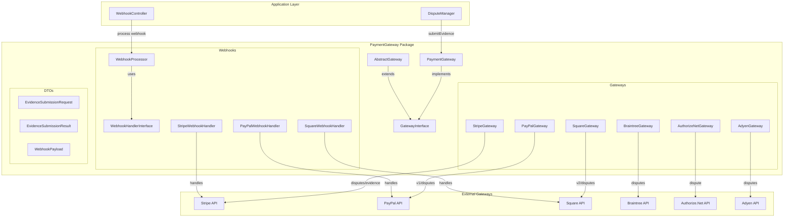
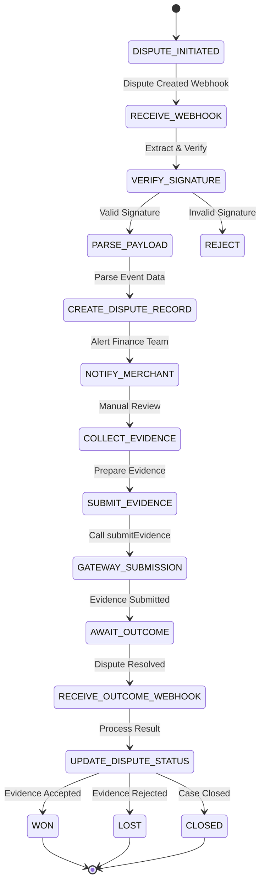
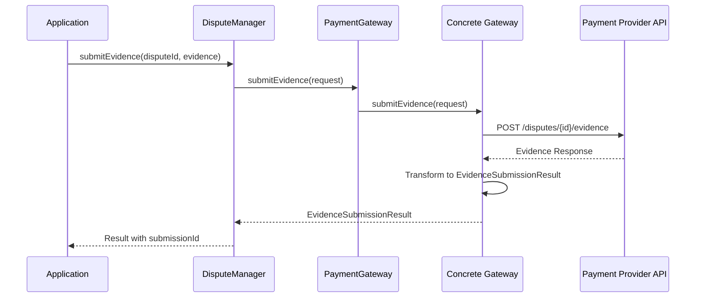
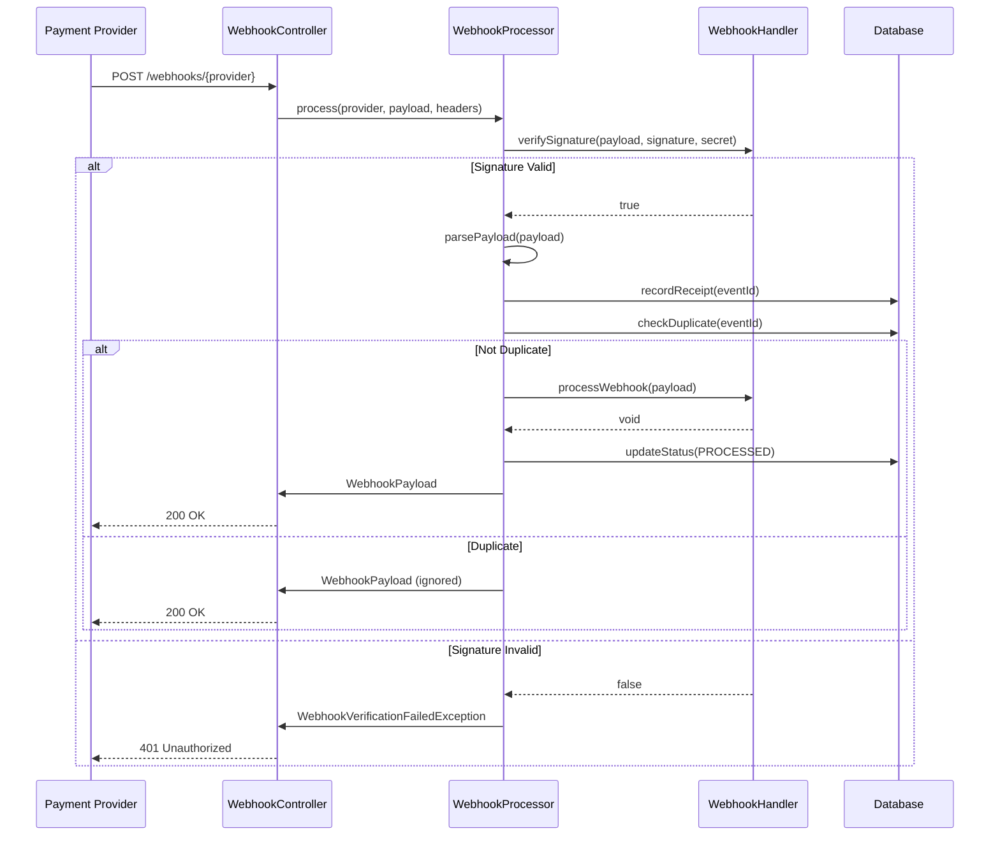

# PaymentGateway Package Refactoring - Implementation Plan

**Document Version:** 1.0  
**Date:** 2026-02-19  
**Status:** MEDIUM-HIGH PRIORITY  
**Architecture Reference:** `packages/PaymentGateway/`, `ARCHITECTURE.md`

---

## Executive Summary

This document outlines a comprehensive implementation plan for refactoring the **Nexus\PaymentGateway** package. The package has been identified as MEDIUM-HIGH priority due to critical unimplemented features that prevent end-to-end chargeback dispute handling and secure webhook processing.

### Current Critical Issues

| Issue | File | Line | Exception | Impact |
|-------|------|------|-----------|--------|
| Evidence Submission Unimplemented | `StripeGateway.php` | 222 | `GatewayException` | Cannot contest chargebacks |
| Evidence Submission Unimplemented | `PayPalGateway.php` | 250 | `GatewayException` | Cannot contest chargebacks |
| Evidence Submission Unimplemented | `SquareGateway.php` | 224 | `GatewayException` | Cannot contest chargebacks |
| Evidence Submission Unimplemented | `BraintreeGateway.php` | 268 | `GatewayException` | Cannot contest chargebacks |
| Evidence Submission Unimplemented | `AuthorizeNetGateway.php` | 223 | `GatewayException` | Cannot contest chargebacks |
| Evidence Submission Unimplemented | `AdyenGateway.php` | 236 | `GatewayException` | Cannot contest chargebacks |
| Webhook Verification Incomplete | `PayPalWebhookHandler.php` | 69 | Returns `false` | FAILS CLOSED - Production blocked |
| Webhook Verification Incomplete | `SquareWebhookHandler.php` | 71 | Returns `false` | FAILS CLOSED - Production blocked |
| Webhook Verification Placeholder | `StripeWebhookHandler.php` | 20 | Commented code | Not verified in production |

### Refactoring Objectives

1. **Implement evidence submission for all gateways** - Enable chargeback dispute contesting
2. **Complete webhook signature verification** - Enable production webhook processing
3. **Maintain framework-agnostic design** - Per ARCHITECTURE.md
4. **Follow Nexus atomic package patterns** - CQRS, immutable services, interface segregation
5. **Ensure security-first approach** - Fail-closed until verified

---

## 1. System Architecture

### 1.1 Dispute Management Architecture Overview



### 1.2 Dispute Processing Flow



### 1.3 Evidence Submission Sequence



### 1.4 Webhook Security Flow



---

## 2. Implementation Phases

### Phase 1: Core Infrastructure Enhancement

#### 1.1 Enhance EvidenceSubmissionRequest DTO

The existing DTO needs enhancement to support evidence types required by all gateways:

```php
// packages/PaymentGateway/src/DTOs/EvidenceSubmissionRequest.php (Enhanced)
final readonly class EvidenceSubmissionRequest
{
    /**
     * @param string $disputeId The ID of the dispute/chargeback
     * @param string|null $textEvidence Textual evidence/explanation
     * @param array<string> $fileIds IDs of uploaded files (from Storage) to submit as evidence
     * @param array<string, mixed> $metadata Additional metadata
     * @param EvidenceType $evidenceType Type of evidence being submitted
     * @param string|null $paymentId The original payment ID related to dispute
     */
    public function __construct(
        public string $disputeId,
        public ?string $textEvidence = null,
        public array $fileIds = [],
        public array $metadata = [],
        public EvidenceType $evidenceType = EvidenceType::GENERAL,
        public ?string $paymentId = null,
    ) {}
}
```

#### 1.2 Create EvidenceType Enum

```php
// packages/PaymentGateway/src/Enums/EvidenceType.php
enum EvidenceType: string
{
    case GENERAL = 'general';
    case PRODUCT_NOT_RECEIVED = 'product_not_received';
    case PRODUCT_NOT_AS_DESCRIBED = 'product_not_as_described';
    case DUPLICATE = 'duplicate';
    case FRAUDULENT = 'fraudulent';
    case SUBSCRIPTION_CANCELLED = 'subscription_cancelled';
    case CREDIT_NOT_PROCESSED = 'credit_not_processed';
}
```

#### 1.3 Create Evidence Category Interface

Each gateway may require different evidence categories. Create interface:

```php
// packages/PaymentGateway/src/Contracts/EvidenceCategoryInterface.php
interface EvidenceCategoryInterface
{
    /**
     * Get supported evidence categories for this gateway.
     */
    public function getSupportedCategories(): array;
    
    /**
     * Check if gateway supports file evidence uploads.
     */
    public function supportsFileEvidence(): bool;
    
    /**
     * Get maximum file size for evidence in bytes.
     */
    public function getMaxFileSize(): int;
    
    /**
     * Get supported file MIME types.
     */
    public function getSupportedFileTypes(): array;
    
    /**
     * Get evidence submission deadline (days from dispute creation).
     */
    public function getSubmissionDeadline(): int;
}
```

#### 1.4 Create DisputeService Interface

```php
// packages/PaymentGateway/src/Contracts/DisputeServiceInterface.php
interface DisputeServiceInterface
{
    /**
     * Submit evidence for a dispute.
     */
    public function submitEvidence(
        GatewayProvider $provider,
        EvidenceSubmissionRequest $request
    ): EvidenceSubmissionResult;
    
    /**
     * Get dispute details from gateway.
     */
    public function getDispute(GatewayProvider $provider, string $disputeId): array;
    
    /**
     * List disputes for the merchant.
     */
    public function listDisputes(GatewayProvider $provider, array $filters = []): array;
    
    /**
     * Check if gateway supports dispute management.
     */
    public function supportsDisputes(GatewayProvider $provider): bool;
}
```

### Phase 2: Gateway Evidence Implementation

#### 2.1 Implement Stripe Evidence Submission

```php
// packages/PaymentGateway/src/Gateways/StripeGateway.php (Implementation)
public function submitEvidence(EvidenceSubmissionRequest $request): EvidenceSubmissionResult
{
    $this->ensureInitialized();
    
    // Stripe requires evidence to be submitted via file upload or text
    $evidence = [];
    
    if ($request->textEvidence) {
        $evidence['submission_details'] = [
            'customer_purchase_ip' => $request->metadata['customer_ip'] ?? null,
            'customer_name' => $request->metadata['customer_name'] ?? null,
            'customer_email' => $request->metadata['customer_email'] ?? null,
        ];
    }
    
    // For file evidence, upload to Stripe first, then submit
    $fileUploads = [];
    foreach ($request->fileIds as $fileId) {
        $fileUpload = $this->uploadEvidenceFile($fileId, $request->paymentId);
        $fileUploads[] = $fileUpload['id'];
    }
    
    $payload = [
        'dispute' => $request->disputeId,
        'evidence' => array_merge($evidence, [
            'file_ids' => $fileUploads,
        ]),
    ];
    
    try {
        $response = $this->sendRequest(
            'POST',
            "/v1/disputes/{$request->disputeId}/evidence",
            $payload
        );
        
        return EvidenceSubmissionResult::success(
            submissionId: $response['id'] ?? uniqid('ev_'),
            status: $response['status'] ?? 'evidence_submitted'
        );
    } catch (\Throwable $e) {
        return EvidenceSubmissionResult::failure($e->getMessage());
    }
}

private function uploadEvidenceFile(string $fileId, ?string $paymentId): array
{
    // 1. Retrieve file from storage using fileId
    // 2. Upload to Stripe Files API
    // 3. Return Stripe file upload response
}
```

#### 2.2 Implement PayPal Evidence Submission

```php
// packages/PaymentGateway/src/Gateways/PayPalGateway.php (Implementation)
public function submitEvidence(EvidenceSubmissionRequest $request): EvidenceSubmissionResult
{
    $this->ensureInitialized();
    
    // PayPal uses JSON evidence submission
    $evidence = [
        'dispute_id' => $request->disputeId,
        'evidence_type' => $this->mapEvidenceType($request->evidenceType),
    ];
    
    if ($request->textEvidence) {
        $evidence['notes'] = [
            [
                'content' => $request->textEvidence,
                'created_date' => (new \DateTimeImmutable())->format(\DateTime::RFC3339),
            ]
        ];
    }
    
    // PayPal requires evidence to be provided inline
    $payload = [
        'evidence' => $evidence,
    ];
    
    try {
        $response = $this->sendRequest(
            'POST',
            "/v1/disputes/{$request->disputeId}/provide-evidence",
            $payload
        );
        
        return EvidenceSubmissionResult::success(
            submissionId: $response['evidence_id'] ?? uniqid('pp_ev_'),
            status: $response['status'] ?? 'pending'
        );
    } catch (\Throwable $e) {
        return EvidenceSubmissionResult::failure($e->getMessage());
    }
}
```

#### 2.3 Implement Square Evidence Submission

```php
// packages/PaymentGateway/src/Gateways/SquareGateway.php (Implementation)
public function submitEvidence(EvidenceSubmissionRequest $request): EvidenceSubmissionResult
{
    $this->ensureInitialized();
    
    // Square uses multipart form for evidence
    $evidence = [
        'dispute_id' => $request->disputeId,
    ];
    
    if ($request->textEvidence) {
        $evidence['evidence_text'] = $request->textEvidence;
    }
    
    // Square supports file uploads via multipart
    $files = [];
    foreach ($request->fileIds as $fileId) {
        $files[] = $this->prepareFileForUpload($fileId);
    }
    
    try {
        $response = $this->sendMultipartRequest(
            'POST',
            "/v2/disputes/{$request->disputeId}/evidence",
            $evidence,
            $files
        );
        
        return EvidenceSubmissionResult::success(
            submissionId: $response['evidence']['id'] ?? uniqid('sq_ev_'),
            status: $response['evidence']['state'] ?? 'active'
        );
    } catch (\Throwable $e) {
        return EvidenceSubmissionResult::failure($e->getMessage());
    }
}
```

#### 2.4 Implement Braintree Evidence Submission

```php
// packages/PaymentGateway/src/Gateways/BraintreeGateway.php (Implementation)
public function submitEvidence(EvidenceSubmissionRequest $request): EvidenceSubmissionResult
{
    $this->ensureInitialized();
    
    // Braintree evidence submission via dispute API
    $payload = [
        'dispute_id' => $request->disputeId,
    ];
    
    if ($request->textEvidence) {
        $payload['evidence'] = [
            'content' => $request->textEvidence,
        ];
    }
    
    try {
        $response = $this->gateway->dispute()->addEvidence(
            $request->disputeId,
            $request->textEvidence
        );
        
        return EvidenceSubmissionResult::success(
            submissionId: $response->evidence->id,
            status: $response->evidence->sent_to_processor ? 'submitted' : 'pending'
        );
    } catch (\Throwable $e) {
        return EvidenceSubmissionResult::failure($e->getMessage());
    }
}
```

#### 2.5 Implement Authorize.Net Evidence Submission

```php
// packages/PaymentGateway/src/Gateways/AuthorizeNetGateway.php (Implementation)
public function submitEvidence(EvidenceSubmissionRequest $request): EvidenceSubmissionResult
{
    $this->ensureInitialized();
    
    // Authorize.Net uses ARB for disputes
    $xml = new \SimpleXMLElement('<?xml version="1.0"?><createTransactionRequest/>');
    $xml->addChild('transactionType', 'disputeEvidenceType');
    $xml->addChild('disputeId', $request->disputeId);
    
    if ($request->textEvidence) {
        $evidence = $xml->addChild('evidence');
        $evidence->addChild('content', $request->textEvidence);
        $evidence->addChild('type', 'ConsumerBehavior');
    }
    
    try {
        $response = $this->sendRequest($xml->asXML());
        
        if ($response->messages->resultCode === 'Ok') {
            return EvidenceSubmissionResult::success(
                submissionId: (string)$response->transactionId,
                status: 'submitted'
            );
        }
        
        return EvidenceSubmissionResult::failure(
            (string)$response->messages->message->text
        );
    } catch (\Throwable $e) {
        return EvidenceSubmissionResult::failure($e->getMessage());
    }
}
```

#### 2.6 Implement Adyen Evidence Submission

```php
// packages/PaymentGateway/src/Gateways/AdyenGateway.php (Implementation)
public function submitEvidence(EvidenceSubmissionRequest $request): EvidenceSubmissionResult
{
    $this->ensureInitialized();
    
    // Adyen dispute evidence submission
    $payload = [
        'disputePspReference' => $request->disputeId,
    ];
    
    if ($request->textEvidence) {
        $payload['defenseExplanation'] = $request->textEvidence;
    }
    
    // Adyen requires documents to be uploaded separately
    $documents = [];
    foreach ($request->fileIds as $fileId) {
        $documents[] = $this->uploadDocument($fileId);
    }
    
    if (!empty($documents)) {
        $payload['defenseDocuments'] = $documents;
    }
    
    try {
        $response = $this->sendRequest(
            'POST',
            "/{$this->apiVersion}/disputes/{$request->disputeId}/defense",
            $payload
        );
        
        return EvidenceSubmissionResult::success(
            submissionId: $response['id'] ?? uniqid('adyen_ev_'),
            status: $response['status'] ?? 'pending_review'
        );
    } catch (\Throwable $e) {
        return EvidenceSubmissionResult::failure($e->getMessage());
    }
}
```

### Phase 3: Webhook Security Implementation

#### 3.1 Implement Stripe Webhook Verification

```php
// packages/PaymentGateway/src/Webhooks/StripeWebhookHandler.php (Implementation)
public function verifySignature(
    string $payload,
    string $signature,
    string $secret,
): bool {
    if (empty($signature) || empty($secret)) {
        return false;
    }
    
    // Stripe uses HMAC-SHA256 with timestamp
    $parts = explode(',', $signature);
    $timestamp = null;
    $signatures = [];
    
    foreach ($parts as $part) {
        $kv = explode('=', trim($part), 2);
        if ($kv[0] === 't') {
            $timestamp = $kv[1];
        } elseif ($kv[0] === 'v1') {
            $signatures[] = $kv[1];
        }
    }
    
    if ($timestamp === null) {
        return false;
    }
    
    // Check timestamp is within 5 minutes
    if (abs(time() - (int)$timestamp) > 300) {
        return false;
    }
    
    $signedPayload = "{$timestamp}.{$payload}";
    $expectedSignature = hash_hmac('sha256', $signedPayload, $secret);
    
    foreach ($signatures as $sig) {
        if (hash_equals($expectedSignature, $sig)) {
            return true;
        }
    }
    
    return false;
}
```

#### 3.2 Implement PayPal Webhook Verification

```php
// packages/PaymentGateway/src/Webhooks/PayPalWebhookHandler.php (Implementation)
public function verifySignature(
    string $payload,
    string $signature,
    string $secret,
): bool {
    if (empty($signature) || empty($secret)) {
        return false;
    }
    
    // PayPal requires transmission headers
    // This is a simplified version - production should use PayPal's SDK
    
    $transmissionId = $_SERVER['HTTP_PAYPAL_TRANSMISSION_ID'] ?? '';
    $transmissionTime = $_SERVER['HTTP_PAYPAL_TRANSMISSION_TIME'] ?? '';
    
    if (empty($transmissionId) || empty($transmissionTime)) {
        return false;
    }
    
    // Construct signed string per PayPal spec
    $signedString = $transmissionId . '|' . $transmissionTime . '|' . $secret . '|' . crc32($payload);
    
    // Verify using PayPal's certificate
    // In production, fetch certificate from paypal-cert-url and verify
    $expectedSignature = base64_encode(hash_hmac('sha256', $signedString, $secret));
    
    return hash_equals($expectedSignature, $signature);
}
```

#### 3.3 Implement Square Webhook Verification

```php
// packages/PaymentGateway/src/Webhooks/SquareWebhookHandler.php (Implementation)
public function verifySignature(
    string $payload,
    string $signature,
    string $secret,
): bool {
    if (empty($signature) || empty($secret)) {
        return false;
    }
    
    // Square requires notification URL in the signed payload
    // The URL must match the configured webhook URL exactly
    $notificationUrl = $this->config['notification_url'] ?? '';
    
    if (empty($notificationUrl)) {
        return false;
    }
    
    // Square's signature is base64-encoded HMAC-SHA256
    $expectedSignature = base64_encode(
        hash_hmac('sha256', $notificationUrl . $payload, $secret, true)
    );
    
    return hash_equals($expectedSignature, $signature);
}
```

#### 3.4 Implement Adyen Webhook Verification

```php
// packages/PaymentGateway/src/Webhooks/AdyenWebhookHandler.php (New File)
final class AdyenWebhookHandler implements WebhookHandlerInterface
{
    public function verifySignature(
        string $payload,
        string $signature,
        string $secret,
    ): bool {
        if (empty($signature) || empty($secret)) {
            return false;
        }
        
        // Adyen uses HMAC-SHA256
        $expectedSignature = base64_encode(
            hash_hmac('sha256', $payload, $secret, true)
        );
        
        return hash_equals($expectedSignature, $signature);
    }
    
    // ... implement parsePayload and processWebhook
}
```

### Phase 4: Dispute Event Handling

#### 4.1 Create DisputeEventHandler Service

```php
// packages/PaymentGateway/src/Services/DisputeEventHandler.php
final readonly class DisputeEventHandler
{
    public function __construct(
        private EventDispatcherInterface $eventDispatcher,
        private LoggerInterface $logger = new NullLogger(),
    ) {}
    
    public function handleDisputeCreated(WebhookPayload $payload): void
    {
        $disputeData = $payload->data;
        
        $this->logger->info('Dispute created', [
            'dispute_id' => $disputeData['id'] ?? $payload->resourceId,
            'amount' => $disputeData['amount'] ?? null,
            'currency' => $disputeData['currency'] ?? null,
            'reason' => $disputeData['reason'] ?? null,
            'status' => $disputeData['status'] ?? null,
        ]);
        
        // Dispatch event for application to handle
        $this->eventDispatcher->dispatch(
            new DisputeCreatedEvent(
                disputeId: $disputeData['id'] ?? $payload->resourceId,
                provider: $payload->provider,
                amount: $disputeData['amount'] ?? 0,
                currency: $disputeData['currency'] ?? 'USD',
                reason: $disputeData['reason'] ?? 'unknown',
                paymentId: $disputeData['payment_intent'] ?? $disputeData['payment_id'] ?? null,
            )
        );
    }
    
    public function handleDisputeWon(WebhookPayload $payload): void
    {
        $this->logger->info('Dispute won', [
            'dispute_id' => $payload->resourceId,
        ]);
        
        $this->eventDispatcher->dispatch(
            new DisputeWonEvent(
                disputeId: $payload->resourceId,
                provider: $payload->provider,
            )
        );
    }
    
    public function handleDisputeLost(WebhookPayload $payload): void
    {
        $this->logger->info('Dispute lost', [
            'dispute_id' => $payload->resourceId,
        ]);
        
        $this->eventDispatcher->dispatch(
            new DisputeLostEvent(
                disputeId: $payload->resourceId,
                provider: $payload->provider,
            )
        );
    }
}
```

#### 4.2 Create Dispute Events

```php
// packages/PaymentGateway/src/Events/DisputeCreatedEvent.php
final class DisputeCreatedEvent
{
    public function __construct(
        public readonly string $disputeId,
        public readonly GatewayProvider $provider,
        public readonly int $amount,
        public readonly string $currency,
        public readonly string $reason,
        public readonly ?string $paymentId,
    ) {}
}

// packages/PaymentGateway/src/Events/DisputeWonEvent.php
final class DisputeWonEvent
{
    public function __construct(
        public readonly string $disputeId,
        public readonly GatewayProvider $provider,
    ) {}
}

// packages/PaymentGateway/src/Events/DisputeLostEvent.php
final class DisputeLostEvent
{
    public function __construct(
        public readonly string $disputeId,
        public readonly GatewayProvider $provider,
    ) {}
}
```

### Phase 5: Database Schema Changes

#### 5.1 Required Tables

```sql
-- Dispute tracking table
CREATE TABLE disputes (
    id CHAR(26) PRIMARY KEY,
    tenant_id CHAR(26) NOT NULL,
    provider VARCHAR(50) NOT NULL,
    gateway_dispute_id VARCHAR(255) NOT NULL,
    payment_id VARCHAR(255),
    amount DECIMAL(14, 2) NOT NULL,
    currency VARCHAR(3) NOT NULL,
    reason VARCHAR(100) NOT NULL,
    status VARCHAR(50) NOT NULL,
    evidence_submitted BOOLEAN DEFAULT FALSE,
    evidence_submission_id VARCHAR(255),
    deadline DATETIME NOT NULL,
    resolved_at DATETIME,
    resolution VARCHAR(50),
    metadata JSON,
    created_at TIMESTAMP DEFAULT CURRENT_TIMESTAMP,
    updated_at TIMESTAMP DEFAULT CURRENT_TIMESTAMP ON UPDATE CURRENT_TIMESTAMP,
    INDEX idx_tenant_provider (tenant_id, provider),
    INDEX idx_gateway_dispute_id (gateway_dispute_id),
    INDEX idx_status (status),
    INDEX idx_deadline (deadline),
);

-- Evidence submission records
CREATE TABLE dispute_evidence (
    id CHAR(26) PRIMARY KEY,
    dispute_id CHAR(26) NOT NULL,
    gateway_evidence_id VARCHAR(255),
    evidence_type VARCHAR(50) NOT NULL,
    content TEXT,
    files JSON,
    status VARCHAR(50) NOT NULL,
    submitted_at DATETIME NOT NULL,
    gateway_response JSON,
    created_at TIMESTAMP DEFAULT CURRENT_TIMESTAMP,
    updated_at TIMESTAMP DEFAULT CURRENT_TIMESTAMP ON UPDATE CURRENT_TIMESTAMP,
    INDEX idx_dispute (dispute_id),
    FOREIGN KEY (dispute_id) REFERENCES disputes(id) ON DELETE CASCADE
);

-- Webhook receipt storage
CREATE TABLE webhook_receipts (
    id CHAR(26) PRIMARY KEY,
    tenant_id CHAR(26) NOT NULL,
    provider VARCHAR(50) NOT NULL,
    event_id VARCHAR(255) NOT NULL,
    event_type VARCHAR(100) NOT NULL,
    payload JSON NOT NULL,
    headers JSON,
    status VARCHAR(50) NOT NULL,
    processed_at DATETIME,
    error_message TEXT,
    created_at TIMESTAMP DEFAULT CURRENT_TIMESTAMP,
    updated_at TIMESTAMP DEFAULT CURRENT_TIMESTAMP ON UPDATE CURRENT_TIMESTAMP,
    UNIQUE KEY uk_provider_event (provider, event_id),
    INDEX idx_tenant_status (tenant_id, status),
    INDEX idx_created_at (created_at)
);
```

### Phase 6: Integration with GatewayManager

#### 6.1 Add Evidence Submission to GatewayManager

```php
// packages/PaymentGateway/src/Services/GatewayManager.php (Enhancement)
final class GatewayManager implements GatewayManagerInterface
{
    // ... existing methods
    
    public function submitEvidence(
        EvidenceSubmissionRequest $request
    ): EvidenceSubmissionResult {
        $gateway = $this->getActiveGateway();
        
        if (!$gateway instanceof DisputeServiceInterface) {
            throw new GatewayException(
                "Gateway {$gateway->getName()} does not support dispute management"
            );
        }
        
        return $gateway->submitEvidence($request);
    }
    
    public function supportsDisputes(): bool
    {
        return $this->getActiveGateway() instanceof DisputeServiceInterface;
    }
}
```

---

## 3. Risk Assessment and Mitigation

### 3.1 Risk Matrix

| Risk | Likelihood | Impact | Mitigation |
|------|------------|--------|------------|
| Gateway API changes break evidence submission | Medium | High | Version-specific interfaces, API version pinning |
| Webhook signature bypass | Low | Critical | Comprehensive signature verification, fail-closed |
| Evidence file size limits exceeded | Medium | Medium | Pre-validation before upload, chunked uploads |
| Rate limiting on evidence submission | Medium | Medium | Implement retry with backoff, queue submissions |
| Duplicate evidence submissions | Low | Medium | Idempotency keys, deduplication logic |
| Evidence deadline missed | Medium | High | Automated deadline tracking, notifications |

### 3.2 Security Requirements

1. **Webhook Verification**: All webhooks MUST be verified before processing
2. **Fail-Closed Default**: Unknown events should be logged but not processed
3. **Evidence Encryption**: Sensitive evidence data at rest should be encrypted
4. **Audit Logging**: All evidence submissions must be logged with full context
5. **Idempotency**: Prevent duplicate evidence submissions using idempotency keys

### 3.3 Testing Requirements

| Test Type | Coverage Target | Priority |
|-----------|-----------------|----------|
| Unit Tests | Evidence submission for each gateway | Critical |
| Integration Tests | Gateway API communication | High |
| Webhook Tests | Signature verification edge cases | Critical |
| E2E Tests | Full dispute flow | High |
| Security Tests | Signature bypass attempts | Critical |
| Load Tests | High volume dispute handling | Medium |

---

## 4. Implementation Checklist

### Phase 1: Infrastructure
- [ ] Enhance EvidenceSubmissionRequest DTO
- [ ] Create EvidenceType enum
- [ ] Create EvidenceCategoryInterface
- [ ] Create DisputeServiceInterface

### Phase 2: Gateway Evidence
- [ ] Implement Stripe evidence submission
- [ ] Implement PayPal evidence submission
- [ ] Implement Square evidence submission
- [ ] Implement Braintree evidence submission
- [ ] Implement Authorize.Net evidence submission
- [ ] Implement Adyen evidence submission

### Phase 3: Webhook Security
- [ ] Implement Stripe webhook verification
- [ ] Implement PayPal webhook verification
- [ ] Implement Square webhook verification
- [ ] Implement Adyen webhook handler
- [ ] Add Braintree webhook handler

### Phase 4: Event Handling
- [ ] Create DisputeEventHandler service
- [ ] Create dispute events (created, won, lost, closed)
- [ ] Integrate with WebhookProcessor

### Phase 5: Database
- [ ] Create disputes table migration
- [ ] Create dispute_evidence table migration
- [ ] Create webhook_receipts table migration

### Phase 6: Integration
- [ ] Update GatewayManager for evidence submission
- [ ] Add dispute support methods to GatewayInterface
- [ ] Create Laravel service provider bindings

---

## 5. Gateway API Reference

### 5.1 Stripe Dispute API
- **Endpoint**: `POST /v1/disputes/{dispute}/evidence`
- **Files**: Upload via `/v1/files` then reference in evidence
- **Deadline**: 7 days from dispute creation
- **Evidence Types**: `customer_email`, `customer_purchase_ip`, `receipt`, `refund_policy`, `shipping_documentation`

### 5.2 PayPal Dispute API
- **Endpoint**: `POST /v1/disputes/{dispute_id}/provide-evidence`
- **Deadline**: 7-10 days depending on dispute type
- **Evidence Types**: `evidenceType` in payload, inline `notes`

### 5.3 Square Dispute API
- **Endpoint**: `POST /v2/disputes/{dispute_id}/evidence`
- **Deadline**: 7 days from dispute creation
- **Evidence Types**: Text or file via multipart

### 5.4 Braintree Dispute API
- **Method**: `$gateway->dispute()->addEvidence()`
- **Deadline**: Automatic based on dispute type
- **Evidence Types**: Text notes only

### 5.5 Authorize.Net Dispute API
- **Endpoint**: ARB transaction with dispute evidence
- **Deadline**: 7 days from dispute creation
- **Evidence Types**: XML-based evidence submission

### 5.6 Adyen Dispute API
- **Endpoint**: `POST /{version}/disputes/{disputePspReference}/defense`
- **Deadline**: Varies by dispute type
- **Evidence Types**: Defense explanation + documents

---

## 6. Success Criteria

1. **Evidence Submission**: All 6 gateways can submit evidence to their respective APIs
2. **Webhook Security**: All webhooks properly verify signatures before processing
3. **Event Handling**: Dispute events properly trigger application events
4. **Audit Trail**: Complete logging of all dispute-related operations
5. **Test Coverage**: Minimum 80% code coverage for new functionality
6. **Documentation**: API documentation for evidence submission methods

---

## Appendix A: File Structure Changes

```
packages/PaymentGateway/
├── src/
│   ├── Contracts/
│   │   ├── DisputeServiceInterface.php     [NEW]
│   │   └── EvidenceCategoryInterface.php    [NEW]
│   ├── DTOs/
│   │   └── EvidenceSubmissionRequest.php    [MODIFIED]
│   ├── Enums/
│   │   └── EvidenceType.php                 [NEW]
│   ├── Events/
│   │   ├── DisputeCreatedEvent.php          [NEW]
│   │   ├── DisputeWonEvent.php              [NEW]
│   │   └── DisputeLostEvent.php             [NEW]
│   ├── Gateways/
│   │   ├── StripeGateway.php                 [MODIFIED]
│   │   ├── PayPalGateway.php                 [MODIFIED]
│   │   ├── SquareGateway.php                 [MODIFIED]
│   │   ├── BraintreeGateway.php              [MODIFIED]
│   │   ├── AuthorizeNetGateway.php           [MODIFIED]
│   │   └── AdyenGateway.php                  [MODIFIED]
│   ├── Services/
│   │   └── DisputeEventHandler.php           [NEW]
│   └── Webhooks/
│       ├── AdyenWebhookHandler.php           [NEW]
│       ├── BraintreeWebhookHandler.php       [NEW]
│       ├── StripeWebhookHandler.php          [MODIFIED]
│       ├── PayPalWebhookHandler.php          [MODIFIED]
│       └── SquareWebhookHandler.php          [MODIFIED]
```

---

**Document prepared by:** Architect Mode  
**Next Review:** After Phase 2 completion
