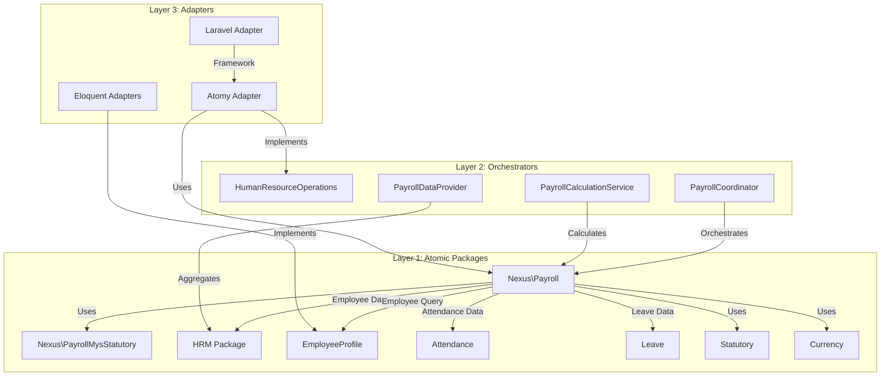
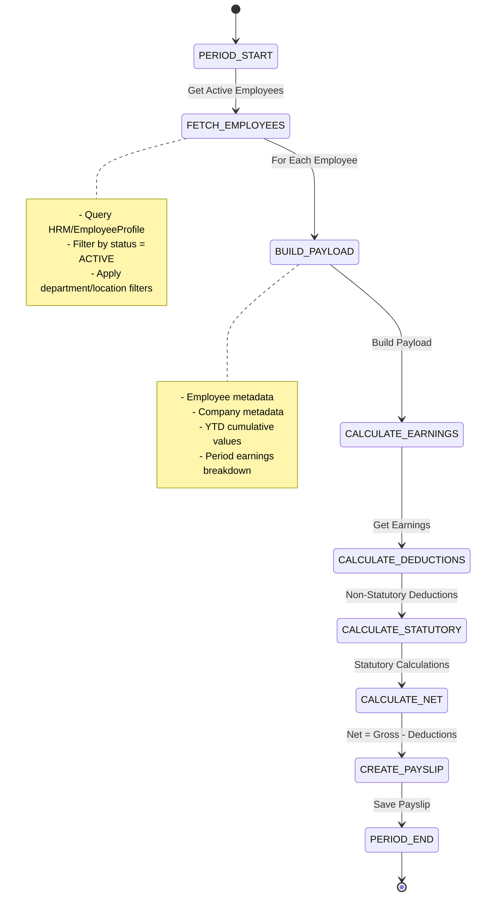
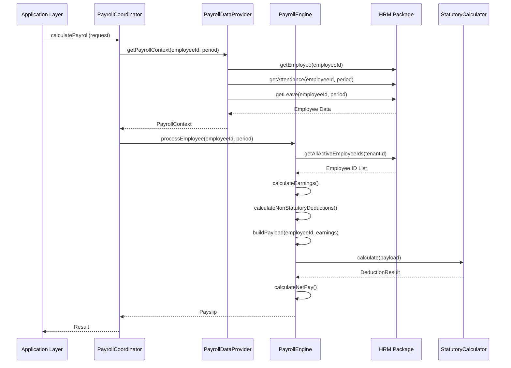
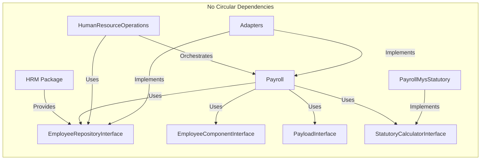

# Payroll Package Refactoring - Implementation Plan

**Document Version:** 1.0  
**Date:** 2026-02-19  
**Status:** HIGH PRIORITY  
**Architecture Reference:** `ARCHITECTURE.md`, `docs/ORCHESTRATOR_INTERFACE_SEGREGATION.md`

---

## Executive Summary

This document outlines a comprehensive implementation plan for refactoring the **Nexus\Payroll** package. The package has been identified as HIGH priority due to two critical unimplemented features that throw runtime exceptions, preventing end-to-end payroll processing.

### Current Critical Issues

| Issue | File | Line | Exception | Impact |
|-------|------|------|-----------|--------|
| Payload Building Unimplemented | `PayrollEngine.php` | 214 | `RuntimeException` | Statutory calculations blocked |
| Employee Fetching Unimplemented | `PayrollEngine.php` | 233 | `RuntimeException` | Cannot get active employees |

### Refactoring Objectives

1. **Implement employee data integration** - Connect PayrollEngine to HRM package for employee data
2. **Implement payload builders** - Create payload builders for statutory calculations
3. **Integrate with existing orchestrator** - Connect with HumanResourceOperations PayrollCoordinator
4. **Maintain framework-agnostic design** - Per ARCHITECTURE.md
5. **Follow Nexus atomic package patterns** - CQRS, immutable services, interface segregation

---

## 1. System Architecture

### 1.1 Integration Architecture Overview



### 1.2 Payroll Processing Flow



### 1.3 Data Flow Diagram



---

## 2. Implementation Phases

### Phase 1: Core Interface Definitions

#### 1.1 Create Employee Data Fetching Interface

Create new interface in `packages/Payroll/src/Contracts/`:

```php
// EmployeeDataProviderInterface.php
interface EmployeeDataProviderInterface
{
    /**
     * Get all active employee IDs for a tenant.
     */
    public function getAllActiveEmployeeIds(string $tenantId, array $filters = []): array;
    
    /**
     * Get employee data by ID.
     */
    public function getEmployeeById(string $employeeId): ?EmployeeDataInterface;
    
    /**
     * Get employees by IDs.
     */
    public function getEmployeesByIds(array $employeeIds): array;
}
```

#### 1.2 Create Employee Data Value Object

```php
// EmployeeDataInterface.php
interface EmployeeDataInterface
{
    public function getId(): string;
    public function getTenantId(): string;
    public function getTaxNumber(): ?string;
    public function getSocialSecurityNumber(): ?string;
    public function getCitizenshipStatus(): string;
    public function getEmploymentType(): string;
    public function getDepartmentId(): ?string;
    public function getBaseSalary(): float;
    public function getPayFrequency(): string;
    public function getMetadata(): array;
}
```

#### 1.3 Create Payload Builder Interface

```php
// PayloadBuilderInterface.php
interface PayloadBuilderInterface
{
    /**
     * Build payload for statutory calculator.
     */
    public function build(
        string $employeeId,
        array $earnings,
        float $grossPay,
        DateTimeInterface $periodStart,
        DateTimeInterface $periodEnd
    ): PayloadInterface;
    
    /**
     * Get year-to-date values for progressive calculations.
     */
    public function getYtdValues(string $employeeId, int $year): YtdValuesInterface;
}
```

#### 1.4 Create YTD Values Interface

```php
// YtdValuesInterface.php
interface YtdValuesInterface
{
    public function getGrossPay(): float;
    public function getTaxPaid(): float;
    public function getEpfContributions(): float;
    public function getSocsoContributions(): float;
}
```

### Phase 2: Implementation Classes

#### 2.1 Implement HRM Employee Data Provider

Create in `packages/Payroll/src/Services/Employee/`:

```php
// HrmEmployeeDataProvider.php
final readonly class HrmEmployeeDataProvider implements EmployeeDataProviderInterface
{
    public function __construct(
        private EmployeeRepositoryInterface $employeeRepository,
        private EmployeeComponentQueryInterface $employeeComponentQuery,
    ) {}
    
    public function getAllActiveEmployeeIds(string $tenantId, array $filters = []): array
    {
        // Implementation: Query EmployeeRepository for active employees
        // Apply filters: department_id, location_id, employment_type
    }
    
    public function getEmployeeById(string $employeeId): ?EmployeeDataInterface
    {
        // Implementation: Get employee and transform to EmployeeDataInterface
    }
    
    public function getEmployeesByIds(array $employeeIds): array
    {
        // Implementation: Batch fetch employees
    }
}
```

#### 2.2 Implement Default Payload Builder

Create in `packages/Payroll/src/Services/Payload/`:

```php
// DefaultPayloadBuilder.php
final readonly class DefaultPayloadBuilder implements PayloadBuilderInterface
{
    public function __construct(
        private EmployeeDataProviderInterface $employeeDataProvider,
        private CompanyDataProviderInterface $companyDataProvider,
        private YtdCalculationServiceInterface $ytdService,
    ) {}
    
    public function build(
        string $employeeId,
        array $earnings,
        float $grossPay,
        DateTimeInterface $periodStart,
        DateTimeInterface $periodEnd
    ): PayloadInterface {
        $employee = $this->employeeDataProvider->getEmployeeById($employeeId);
        $company = $this->companyDataProvider->getCompanyForEmployee($employeeId);
        $ytd = $this->ytdService->getYtdValues($employeeId, (int)$periodStart->format('Y'));
        
        return new PayrollPayload(
            employeeId: $employeeId,
            employeeMetadata: $this->extractEmployeeMetadata($employee),
            companyMetadata: $this->extractCompanyMetadata($company),
            grossPay: $grossPay,
            taxableIncome: $this->calculateTaxableIncome($earnings, $grossPay),
            basicSalary: $this->extractBasicSalary($earnings),
            earningsBreakdown: $earnings,
            periodStart: $periodStart,
            periodEnd: $periodEnd,
            ytdGrossPay: $ytd->getGrossPay(),
            ytdTaxPaid: $ytd->getTaxPaid(),
            metadata: [],
        );
    }
    
    public function getYtdValues(string $employeeId, int $year): YtdValuesInterface
    {
        // Calculate YTD from previous payslips
    }
}
```

#### 2.3 Implement PayrollPayload Value Object

Create in `packages/Payroll/src/ValueObjects/`:

```php
// PayrollPayload.php
final class PayrollPayload implements PayloadInterface
{
    public function __construct(
        private string $employeeId,
        private array $employeeMetadata,
        private array $companyMetadata,
        private float $grossPay,
        private float $taxableIncome,
        private float $basicSalary,
        private array $earningsBreakdown,
        private DateTimeInterface $periodStart,
        private DateTimeInterface $periodEnd,
        private float $ytdGrossPay,
        private float $ytdTaxPaid,
        private array $metadata,
    ) {}
    
    // Implement all PayloadInterface methods
}
```

### Phase 3: Integrate with PayrollEngine

#### 3.1 Modify PayrollEngine Constructor

```php
public function __construct(
    private PayslipQueryInterface $payslipQuery,
    private PayslipPersistInterface $payslipPersist,
    private ComponentQueryInterface $componentQuery,
    private EmployeeComponentQueryInterface $employeeComponentQuery,
    private StatutoryCalculatorInterface $statutoryCalculator,
    private EmployeeDataProviderInterface $employeeDataProvider,  // NEW
    private PayloadBuilderInterface $payloadBuilder,              // NEW
) {}
```

#### 3.2 Implement getAllActiveEmployeeIds()

```php
private function getAllActiveEmployeeIds(string $tenantId, array $filters): array
{
    return $this->employeeDataProvider->getAllActiveEmployeeIds($tenantId, $filters);
}
```

#### 3.3 Implement buildPayload()

```php
private function buildPayload(
    string $employeeId,
    array $earnings,
    float $grossPay,
    DateTimeInterface $periodStart,
    DateTimeInterface $periodEnd
): PayloadInterface {
    return $this->payloadBuilder->build(
        $employeeId,
        $earnings,
        $grossPay,
        $periodStart,
        $periodEnd
    );
}
```

### Phase 4: Orchestrator Integration

#### 4.1 Update PayrollCoordinator

```php
final readonly class PayrollCoordinator
{
    public function __construct(
        private PayrollDataProvider $dataProvider,
        private PayrollCalculationService $calculationService,
        private PayrollRuleRegistry $ruleRegistry,
        private PayrollEngine $payrollEngine,  // NEW - Inject actual engine
        private LoggerInterface $logger = new NullLogger(),
    ) {}
}
```

#### 4.2 Update PayrollDataProvider

Add dependency on Nexus\Payroll interfaces:

```php
final readonly class PayrollDataProvider
{
    public function __construct(
        private ?EmployeeRepositoryInterface $employeeRepository = null,
        private ?EmployeeDataProviderInterface $payrollEmployeeDataProvider = null,  // NEW
        // ... existing dependencies
    ) {}
}
```

### Phase 5: Database Schema Changes

#### 5.1 Required Tables

```sql
-- Employee payroll components (may already exist)
CREATE TABLE employee_payroll_components (
    id CHAR(26) PRIMARY KEY,
    employee_id CHAR(26) NOT NULL,
    component_id CHAR(26) NOT NULL,
    amount DECIMAL(12, 2) NULL,
    is_active BOOLEAN DEFAULT TRUE,
    effective_from DATE NOT NULL,
    effective_to DATE NULL,
    created_at TIMESTAMP DEFAULT CURRENT_TIMESTAMP,
    updated_at TIMESTAMP DEFAULT CURRENT_TIMESTAMP ON UPDATE CURRENT_TIMESTAMP,
    INDEX idx_employee_active (employee_id, is_active),
    INDEX idx_employee_period (employee_id, effective_from, effective_to),
);

-- Payslip records (enhanced)
CREATE TABLE payslips (
    id CHAR(26) PRIMARY KEY,
    employee_id CHAR(26) NOT NULL,
    tenant_id CHAR(26) NOT NULL,
    period_start DATE NOT NULL,
    period_end DATE NOT NULL,
    pay_date DATE NOT NULL,
    gross_pay DECIMAL(12, 2) NOT NULL,
    total_earnings DECIMAL(12, 2) NOT NULL,
    total_deductions DECIMAL(12, 2) NOT NULL,
    net_pay DECIMAL(12, 2) NOT NULL,
    earnings_breakdown JSON NOT NULL,
    deductions_breakdown JSON NOT NULL,
    employer_contributions JSON NOT NULL,
    status VARCHAR(50) NOT NULL,
    metadata JSON,
    created_at TIMESTAMP DEFAULT CURRENT_TIMESTAMP,
    updated_at TIMESTAMP DEFAULT CURRENT_TIMESTAMP ON UPDATE CURRENT_TIMESTAMP,
    INDEX idx_employee_period (employee_id, period_start, period_end),
    INDEX idx_tenant_period (tenant_id, period_start, period_end),
);

-- YTD calculation records
CREATE TABLE payroll_ytd (
    id CHAR(26) PRIMARY KEY,
    employee_id CHAR(26) NOT NULL,
    tenant_id CHAR(26) NOT NULL,
    year INT NOT NULL,
    ytd_gross_pay DECIMAL(14, 2) DEFAULT 0,
    ytd_tax_paid DECIMAL(12, 2) DEFAULT 0,
    ytd_epf_contributions DECIMAL(12, 2) DEFAULT 0,
    ytd_socso_contributions DECIMAL(12, 2) DEFAULT 0,
    created_at TIMESTAMP DEFAULT CURRENT_TIMESTAMP,
    updated_at TIMESTAMP DEFAULT CURRENT_TIMESTAMP ON UPDATE CURRENT_TIMESTAMP,
    UNIQUE KEY uk_employee_year (employee_id, year),
);
```

### Phase 6: Adapter Implementations

#### 6.1 Laravel Eloquent Adapters

Create in `adapters/laravel/`:

```php
// EloquentEmployeeDataProvider.php
final class EloquentEmployeeDataProvider implements EmployeeDataProviderInterface
{
    public function __construct(
        private EmployeeModel $employeeModel,
    ) {}
    
    public function getAllActiveEmployeeIds(string $tenantId, array $filters = []): array
    {
        $query = $this->employeeModel->where('tenant_id', $tenantId)
            ->where('status', 'active');
            
        if (!empty($filters['department_id'])) {
            $query->where('department_id', $filters['department_id']);
        }
        
        return $query->pluck('id')->toArray();
    }
    
    // ... implement other methods
}
```

---

## 3. Interface Definitions Summary

### 3.1 New Interfaces to Create

| Interface | Location | Purpose |
|-----------|----------|---------|
| `EmployeeDataProviderInterface` | `packages/Payroll/src/Contracts/` | Fetch employee data from HRM |
| `EmployeeDataInterface` | `packages/Payroll/src/Contracts/` | Employee data value object |
| `PayloadBuilderInterface` | `packages/Payroll/src/Contracts/` | Build statutory calculation payloads |
| `YtdValuesInterface` | `packages/Payroll/src/Contracts/` | Year-to-date values for progressive calculations |
| `CompanyDataProviderInterface` | `packages/Payroll/src/Contracts/` | Fetch company/tenant metadata |
| `YtdCalculationServiceInterface` | `packages/Payroll/src/Contracts/` | Calculate YTD values from payslips |

### 3.2 Existing Interfaces to Utilize

| Interface | Package | Purpose |
|-----------|---------|---------|
| `EmployeeRepositoryInterface` | HRM/EmployeeProfile | Query employees |
| `EmployeeComponentQueryInterface` | Payroll | Query employee payroll components |
| `ComponentQueryInterface` | Payroll | Query payroll components |
| `StatutoryCalculatorInterface` | Payroll | Country-specific statutory calculations |
| `PayloadInterface` | Payroll | Standardized payload for statutory calculators |
| `PayslipPersistInterface` | Payroll | Persist generated payslips |

---

## 4. Test Coverage Requirements

### 4.1 Unit Tests

| Test Class | Coverage Target |
|------------|-----------------|
| `PayrollEngineTest` | All engine methods, exception handling |
| `HrmEmployeeDataProviderTest` | Employee fetching, filtering |
| `DefaultPayloadBuilderTest` | Payload construction, YTD calculation |
| `PayrollPayloadTest` | All PayloadInterface implementations |
| `StatutoryCalculatorIntegrationTest` | Calculator validation |

### 4.2 Integration Tests

| Test Class | Coverage Target |
|------------|-----------------|
| `PayrollEndToEndTest` | Full payroll processing flow |
| `PayrollHrmIntegrationTest` | HRM package integration |
| `PayrollStatutoryIntegrationTest` | Malaysia statutory calculations |
| `PayrollOrchestratorIntegrationTest` | HumanResourceOperations integration |

### 4.3 Test Data Requirements

```php
// Test fixtures needed:
- 10 employees with different employment types
- Various payroll components (basic salary, allowances, deductions)
- Multiple payroll periods (including year-end)
- Different statutory scenarios (citizens vs foreign workers)
```

### 4.4 Coverage Targets

- **Unit Tests**: 90% line coverage minimum
- **Integration Tests**: All critical paths covered
- **Edge Cases**: Null employee, zero salary, YTD rollover, leap year

---

## 5. Risk Assessment and Mitigation

### 5.1 Risk Register

| Risk | Impact | Probability | Mitigation |
|------|--------|-------------|------------|
| HRM package not ready for employee data | High | Medium | Create mock implementations for testing |
| Circular dependency between Payroll and HRM | High | Low | Use interface segregation, HRM has no Payroll dependency |
| YTD calculation complexity | Medium | High | Implement incrementally, start with simple annual reset |
| Statutory calculator compatibility | Medium | Medium | Ensure PayloadInterface matches all calculator requirements |
| Performance with large employee count | Medium | Medium | Implement batch processing, caching |
| Year-end processing edge cases | High | Low | Extensive testing for December/January boundary |

### 5.2 Mitigation Strategies

1. **Interface-First Development**
   - Define all interfaces before implementations
   - Create mock implementations for testing
   - Validate interface compatibility early

2. **Incremental Implementation**
   - Phase 1: Basic employee fetching (no statutory)
   - Phase 2: Add statutory calculations
   - Phase 3: Add YTD calculations
   - Phase 4: Performance optimization

3. **Contract Testing**
   - Use PACT or similar for consumer-driven contracts
   - Verify Payroll ↔ HRM integration compatibility

4. **Feature Flags**
   - Disable problematic features behind flags
   - Allow gradual rollout

---

## 6. Timeline Estimates

### Phase Breakdown

| Phase | Description | Complexity | Dependencies |
|-------|-------------|------------|--------------|
| Phase 1 | Core Interface Definitions | Low | None |
| Phase 2 | Implementation Classes | Medium | Phase 1 |
| Phase 3 | PayrollEngine Integration | Medium | Phase 2 |
| Phase 4 | Orchestrator Integration | Medium | Phase 3 |
| Phase 5 | Database Schema | Low | None |
| Phase 6 | Adapter Implementations | High | Phases 1-5 |

### Implementation Notes

- **Avoid time estimates** - Focus on clear, actionable deliverables
- Each phase produces working, testable code
- Phases can overlap slightly with careful interface management

---

## 7. Integration with Atomic Package Architecture

### 7.1 Package Dependencies

```
packages/Payroll/
├── composer.json (requires: hrm/employee-profile, common, currency)
└── src/
    ├── Contracts/ (interface definitions)
    ├── Services/ (business logic)
    └── ValueObjects/ (immutable objects)

packages/PayrollMysStatutory/
├── composer.json (requires: payroll)
└── src/
    └── Calculators/ (Malaysia-specific)

packages/HRM/EmployeeProfile/
├── composer.json (no payroll dependency - important!)
└── src/
    └── Contracts/EmployeeRepositoryInterface.php

orchestrators/HumanResourceOperations/
├── composer.json (requires: payroll, hrm/*, statutory)
└── src/
    ├── Coordinators/PayrollCoordinator.php
    └── DataProviders/PayrollDataProvider.php
```

### 7.2 Dependency Flow



### 7.3 Key Architecture Principles

1. **No Circular Dependencies**: Payroll depends on HRM interfaces, not vice versa
2. **Interface Segregation**: Each package defines its own contracts
3. **Dependency Inversion**: High-level modules (Payroll) depend on abstractions (interfaces)
4. **CQRS**: Query and Persist interfaces are separate

---

## 8. Implementation Checklist

### Phase 1: Core Interfaces
- [ ] Create `EmployeeDataProviderInterface`
- [ ] Create `EmployeeDataInterface`
- [ ] Create `PayloadBuilderInterface`
- [ ] Create `YtdValuesInterface`
- [ ] Create `CompanyDataProviderInterface`
- [ ] Create `YtdCalculationServiceInterface`

### Phase 2: Implementations
- [ ] Implement `HrmEmployeeDataProvider`
- [ ] Implement `DefaultPayloadBuilder`
- [ ] Implement `PayrollPayload` value object
- [ ] Implement `YtdCalculationService`

### Phase 3: PayrollEngine Updates
- [ ] Update PayrollEngine constructor
- [ ] Implement `getAllActiveEmployeeIds()`
- [ ] Implement `buildPayload()`
- [ ] Remove RuntimeException placeholders
- [ ] Add dependency injection

### Phase 4: Orchestrator Integration
- [ ] Update PayrollCoordinator
- [ ] Update PayrollDataProvider
- [ ] Connect PayrollEngine
- [ ] End-to-end testing

### Phase 5: Database
- [ ] Create migration for `employee_payroll_components`
- [ ] Create migration for `payslips` (enhance existing)
- [ ] Create migration for `payroll_ytd`
- [ ] Create Eloquent models
- [ ] Create repositories

### Phase 6: Adapters
- [ ] Implement Laravel `EloquentEmployeeDataProvider`
- [ ] Implement Laravel repositories
- [ ] Register service providers
- [ ] Integration testing

---

## 9. Success Criteria

### 9.1 Functional Requirements

- [ ] PayrollEngine can process a single employee without exceptions
- [ ] PayrollEngine can process all active employees for a tenant
- [ ] Payload is correctly built for statutory calculations
- [ ] Malaysia statutory calculator works end-to-end
- [ ] YTD values are correctly accumulated
- [ ] Payslips are persisted correctly

### 9.2 Non-Functional Requirements

- [ ] All code follows ARCHITECTURE.md guidelines
- [ ] 90% unit test coverage
- [ ] All integration tests pass
- [ ] No circular dependencies
- [ ] Framework-agnostic core (testable without Laravel)

### 9.3 Integration Requirements

- [ ] HumanResourceOperations PayrollCoordinator integrates successfully
- [ ] Employee data flows correctly from HRM package
- [ ] Attendance data integrates for overtime calculations
- [ ] Leave data integrates for unpaid leave processing

---

## 10. Related Documentation

- [`packages/Payroll/README.md`](packages/Payroll/README.md) - Package overview
- [`packages/Payroll/docs/integration-guide.md`](packages/Payroll/docs/integration-guide.md) - Integration guide
- [`packages/PayrollMysStatutory/README.md`](packages/PayrollMysStatutory/README.md) - Malaysia statutory guide
- [`packages/HRM/EmployeeProfile/README.md`](packages/HRM/EmployeeProfile/README.md) - Employee profile
- [`ARCHITECTURE.md`](ARCHITECTURE.md) - Architecture guidelines
- [`orchestrators/HumanResourceOperations/README.md`](orchestrators/HumanResourceOperations/README.md) - Orchestrator overview
