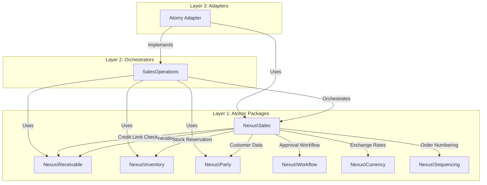
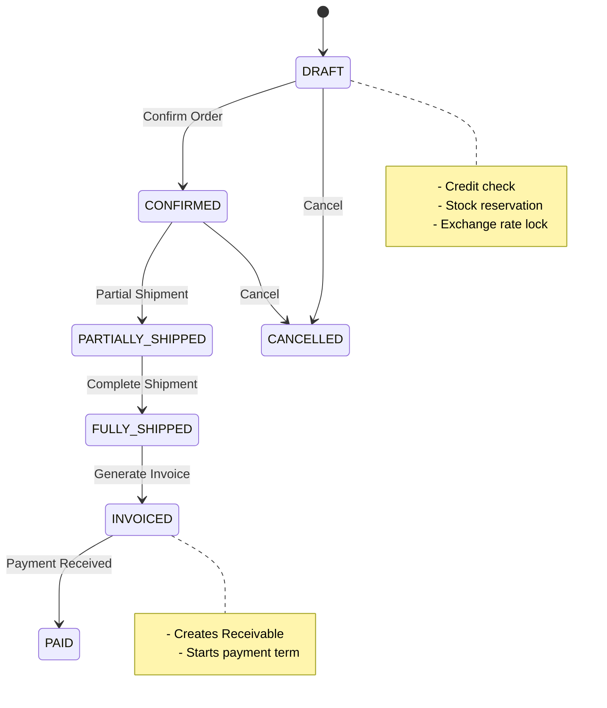
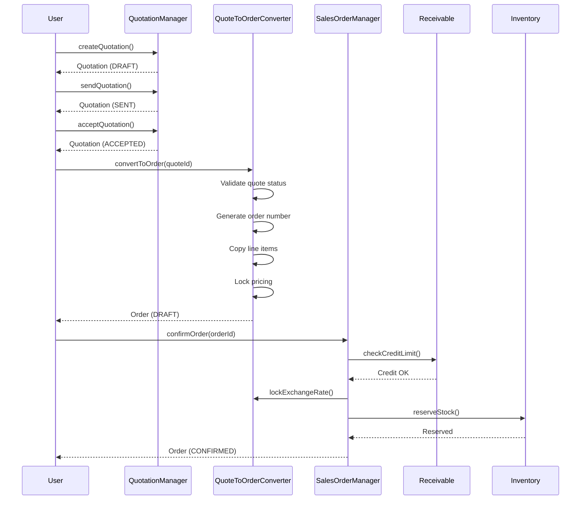
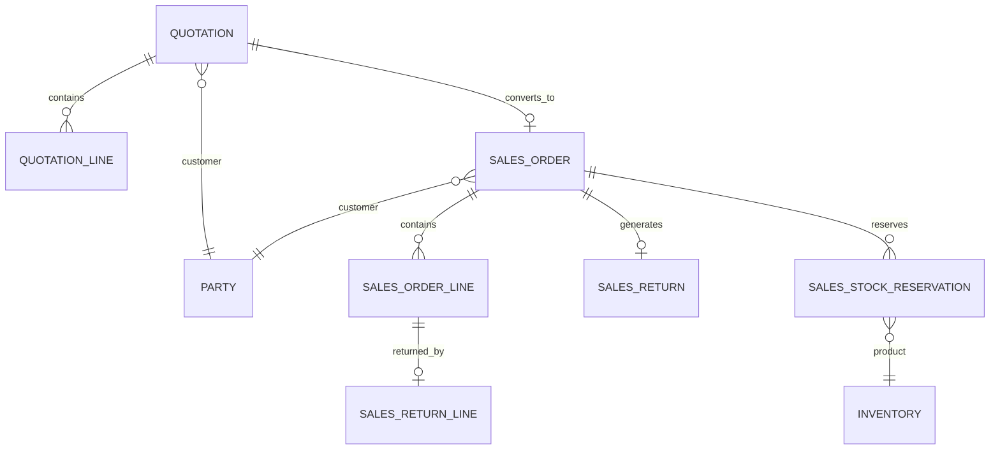

# Sales Package Refactoring - Implementation Plan

**Document Version:** 1.0  
**Date:** 2026-02-19  
**Status:** HIGH PRIORITY  
**Architecture Reference:** `ARCHITECTURE.md`, `docs/ORCHESTRATOR_INTERFACE_SEGREGATION.md`

---

## Executive Summary

This document outlines a comprehensive implementation plan for refactoring the **Nexus\Sales** package. The package has been identified as HIGH priority due to four critical unimplemented features that throw runtime exceptions, preventing end-to-end sales order processing.

### Current Critical Issues

| Issue | File | Exception | Impact |
|-------|------|-----------|--------|
| Sales Returns Unimplemented | `StubSalesReturnManager.php` | `BadMethodCallException` | Returns/RMA workflow blocked |
| No Credit Validation | `NoOpCreditLimitChecker.php` | Always returns `TRUE` | No credit risk management |
| Quote-to-Order Conversion | `QuoteToOrderConverter.php:79` | `RuntimeException` | Cannot convert quotes to orders |
| Order Creation Incomplete | `SalesOrderManager.php:68` | `RuntimeException` | Cannot create sales orders |

### Refactoring Objectives

1. **Implement all four critical features** to enable full sales workflow
2. **Integrate with existing atomic packages** (Receivable, Inventory, Party, Workflow)
3. **Maintain framework-agnostic design** per ARCHITECTURE.md
4. **Follow Nexus atomic package patterns**

---

## 1. System Architecture

### 1.1 Integration Architecture Overview



### 1.2 Sales Order Workflow



### 1.3 Quote-to-Order Conversion Flow



---

## 2. Implementation Phases

### Phase 1: Database Schema Design (Foundation)

**Objective:** Create the database schema required for sales orders, quotation line items, and return orders.

#### 2.1.1 Sales Orders Table

```sql
CREATE TABLE sales_orders (
    id VARCHAR(26) NOT NULL,
    tenant_id VARCHAR(26) NOT NULL,
    order_number VARCHAR(50) NOT NULL,
    customer_id VARCHAR(26) NOT NULL,
    quotation_id VARCHAR(26) DEFAULT NULL,
    
    -- Status & Workflow
    status VARCHAR(30) NOT NULL DEFAULT 'DRAFT',
    workflow_instance_id VARCHAR(26) DEFAULT NULL,
    
    -- Financial
    currency_code VARCHAR(3) NOT NULL DEFAULT 'MYR',
    exchange_rate DECIMAL(18,6) DEFAULT NULL,
    exchange_rate_locked_at DATETIME DEFAULT NULL,
    subtotal DECIMAL(18,4) NOT NULL DEFAULT 0,
    tax_amount DECIMAL(18,4) NOT NULL DEFAULT 0,
    discount_amount DECIMAL(18,4) NOT NULL DEFAULT 0,
    total DECIMAL(18,4) NOT NULL DEFAULT 0,
    
    -- Payment
    payment_term VARCHAR(20) DEFAULT NULL,
    due_date DATE DEFAULT NULL,
    customer_po_number VARCHAR(100) DEFAULT NULL,
    
    -- Fulfillment
    shipping_address_id VARCHAR(26) DEFAULT NULL,
    billing_address_id VARCHAR(26) DEFAULT NULL,
    warehouse_id VARCHAR(26) DEFAULT NULL,
    
    -- Sales Team
    salesperson_id VARCHAR(26) DEFAULT NULL,
    commission_percentage DECIMAL(5,2) DEFAULT NULL,
    
    -- Metadata
    metadata JSON DEFAULT NULL,
    created_by VARCHAR(26) NOT NULL,
    confirmed_by VARCHAR(26) DEFAULT NULL,
    confirmed_at DATETIME DEFAULT NULL,
    
    -- Timestamps
    created_at DATETIME NOT NULL,
    updated_at DATETIME NOT NULL,
    deleted_at DATETIME DEFAULT NULL,
    
    PRIMARY KEY(id),
    UNIQUE INDEX UNIQ_SO_ORDER_NUMBER (tenant_id, order_number),
    INDEX IDX_SO_TENANT (tenant_id),
    INDEX IDX_SO_CUSTOMER (customer_id),
    INDEX IDX_SO_STATUS (status),
    INDEX IDX_SO_QUOTATION (quotation_id)
) ENGINE=InnoDB DEFAULT CHARSET=utf8mb4;
```

#### 2.1.2 Sales Order Lines Table

```sql
CREATE TABLE sales_order_lines (
    id VARCHAR(26) NOT NULL,
    sales_order_id VARCHAR(26) NOT NULL,
    line_number INT NOT NULL,
    
    -- Product
    product_variant_id VARCHAR(26) NOT NULL,
    product_name VARCHAR(255) NOT NULL,
    sku VARCHAR(100) NOT NULL,
    
    -- Quantity
    quantity DECIMAL(18,4) NOT NULL,
    uom_code VARCHAR(10) NOT NULL,
    
    -- Pricing
    unit_price DECIMAL(18,4) NOT NULL,
    discount_percentage DECIMAL(5,2) DEFAULT 0,
    discount_amount DECIMAL(18,4) DEFAULT 0,
    tax_code VARCHAR(20) DEFAULT NULL,
    tax_rate DECIMAL(5,4) DEFAULT 0,
    line_total DECIMAL(18,4) NOT NULL,
    
    -- Fulfillment
    quantity_shipped DECIMAL(18,4) NOT NULL DEFAULT 0,
    quantity_invoiced DECIMAL(18,4) NOT NULL DEFAULT 0,
    
    -- Serial/Lot
    serial_number VARCHAR(100) DEFAULT NULL,
    lot_number VARCHAR(100) DEFAULT NULL,
    
    -- Metadata
    metadata JSON DEFAULT NULL,
    
    created_at DATETIME NOT NULL,
    updated_at DATETIME NOT NULL,
    
    PRIMARY KEY(id),
    INDEX IDX_SOL_ORDER (sales_order_id),
    INDEX IDX_SOL_PRODUCT (product_variant_id)
) ENGINE=InnoDB DEFAULT CHARSET=utf8mb4;
```

#### 2.1.3 Quotations Table

```sql
CREATE TABLE quotations (
    id VARCHAR(26) NOT NULL,
    tenant_id VARCHAR(26) NOT NULL,
    quote_number VARCHAR(50) NOT NULL,
    customer_id VARCHAR(26) NOT NULL,
    
    -- Status
    status VARCHAR(30) NOT NULL DEFAULT 'DRAFT',
    converted_to_order_id VARCHAR(26) DEFAULT NULL,
    
    -- Validity
    quote_date DATE NOT NULL,
    valid_until DATE NOT NULL,
    
    -- Financial
    currency_code VARCHAR(3) NOT NULL DEFAULT 'MYR',
    subtotal DECIMAL(18,4) NOT NULL DEFAULT 0,
    tax_amount DECIMAL(18,4) NOT NULL DEFAULT 0,
    discount_amount DECIMAL(18,4) NOT NULL DEFAULT 0,
    total DECIMAL(18,4) NOT NULL DEFAULT 0,
    
    -- Terms
    payment_term VARCHAR(20) DEFAULT NULL,
    shipping_terms VARCHAR(255) DEFAULT NULL,
    
    -- Addresses
    shipping_address_id VARCHAR(26) DEFAULT NULL,
    billing_address_id VARCHAR(26) DEFAULT NULL,
    
    -- Sales
    salesperson_id VARCHAR(26) DEFAULT NULL,
    
    -- Metadata
    customer_notes TEXT DEFAULT NULL,
    internal_notes TEXT DEFAULT NULL,
    metadata JSON DEFAULT NULL,
    
    -- Audit
    prepared_by VARCHAR(26) NOT NULL,
    sent_by VARCHAR(26) DEFAULT NULL,
    sent_at DATETIME DEFAULT NULL,
    accepted_by VARCHAR(26) DEFAULT NULL,
    accepted_at DATETIME DEFAULT NULL,
    rejected_by VARCHAR(26) DEFAULT NULL,
    rejected_at DATETIME DEFAULT NULL,
    rejection_reason TEXT DEFAULT NULL,
    
    created_at DATETIME NOT NULL,
    updated_at DATETIME NOT NULL,
    deleted_at DATETIME DEFAULT NULL,
    
    PRIMARY KEY(id),
    UNIQUE INDEX UNIQ_Q_QUOTE_NUMBER (tenant_id, quote_number),
    INDEX IDX_Q_TENANT (tenant_id),
    INDEX IDX_Q_CUSTOMER (customer_id),
    INDEX IDX_Q_STATUS (status),
    INDEX IDX_Q_VALID (valid_until)
) ENGINE=InnoDB DEFAULT CHARSET=utf8mb4;
```

#### 2.1.4 Quotation Lines Table

```sql
CREATE TABLE quotation_lines (
    id VARCHAR(26) NOT NULL,
    quotation_id VARCHAR(26) NOT NULL,
    line_number INT NOT NULL,
    
    -- Product
    product_variant_id VARCHAR(26) NOT NULL,
    product_name VARCHAR(255) NOT NULL,
    sku VARCHAR(100) NOT NULL,
    
    -- Quantity
    quantity DECIMAL(18,4) NOT NULL,
    uom_code VARCHAR(10) NOT NULL,
    
    -- Pricing
    unit_price DECIMAL(18,4) NOT NULL,
    discount_percentage DECIMAL(5,2) DEFAULT 0,
    discount_amount DECIMAL(18,4) DEFAULT 0,
    tax_code VARCHAR(20) DEFAULT NULL,
    tax_rate DECIMAL(5,4) DEFAULT 0,
    line_total DECIMAL(18,4) NOT NULL,
    
    -- Metadata
    metadata JSON DEFAULT NULL,
    
    created_at DATETIME NOT NULL,
    updated_at DATETIME NOT NULL,
    
    PRIMARY KEY(id),
    INDEX IDX_QL_QUOTATION (quotation_id),
    INDEX IDX_QL_PRODUCT (product_variant_id)
) ENGINE=InnoDB DEFAULT CHARSET=utf8mb4;
```

#### 2.1.5 Sales Returns (RMA) Table

```sql
CREATE TABLE sales_returns (
    id VARCHAR(26) NOT NULL,
    tenant_id VARCHAR(26) NOT NULL,
    return_number VARCHAR(50) NOT NULL,
    sales_order_id VARCHAR(26) NOT NULL,
    
    -- Status
    status VARCHAR(30) NOT NULL DEFAULT 'PENDING',
    
    -- Return Details
    return_reason VARCHAR(255) NOT NULL,
    return_type VARCHAR(20) NOT NULL DEFAULT 'CREDIT',
    resolution VARCHAR(20) DEFAULT NULL,
    
    -- Financial
    credit_note_id VARCHAR(26) DEFAULT NULL,
    refund_amount DECIMAL(18,4) DEFAULT 0,
    
    -- Approval
    approved_by VARCHAR(26) DEFAULT NULL,
    approved_at DATETIME DEFAULT NULL,
    
    -- Metadata
    customer_notes TEXT DEFAULT NULL,
    internal_notes TEXT DEFAULT NULL,
    metadata JSON DEFAULT NULL,
    
    -- Audit
    requested_by VARCHAR(26) NOT NULL,
    processed_by VARCHAR(26) DEFAULT NULL,
    processed_at DATETIME DEFAULT NULL,
    
    created_at DATETIME NOT NULL,
    updated_at DATETIME NOT NULL,
    completed_at DATETIME DEFAULT NULL,
    
    PRIMARY KEY(id),
    UNIQUE INDEX UNIQ_SR_RETURN_NUMBER (tenant_id, return_number),
    INDEX IDX_SR_TENANT (tenant_id),
    INDEX IDX_SR_ORDER (sales_order_id),
    INDEX IDX_SR_STATUS (status)
) ENGINE=InnoDB DEFAULT CHARSET=utf8mb4;
```

#### 2.1.6 Return Line Items Table

```sql
CREATE TABLE sales_return_lines (
    id VARCHAR(26) NOT NULL,
    sales_return_id VARCHAR(26) NOT NULL,
    sales_order_line_id VARCHAR(26) NOT NULL,
    
    quantity_requested DECIMAL(18,4) NOT NULL,
    quantity_approved DECIMAL(18,4) DEFAULT 0,
    quantity_received DECIMAL(18,4) DEFAULT 0,
    
    -- Resolution
    unit_credit_amount DECIMAL(18,4) DEFAULT 0,
    line_credit_amount DECIMAL(18,4) DEFAULT 0,
    restocking_fee DECIMAL(18,4) DEFAULT 0,
    
    condition_received VARCHAR(20) DEFAULT NULL,
    
    metadata JSON DEFAULT NULL,
    
    created_at DATETIME NOT NULL,
    updated_at DATETIME NOT NULL,
    
    PRIMARY KEY(id),
    INDEX IDX_SRL_RETURN (sales_return_id),
    INDEX IDX_SRL_ORDER_LINE (sales_order_line_id)
) ENGINE=InnoDB DEFAULT CHARSET=utf8mb4;
```

#### 2.1.7 Stock Reservations Table

```sql
CREATE TABLE sales_stock_reservations (
    id VARCHAR(26) NOT NULL,
    tenant_id VARCHAR(26) NOT NULL,
    sales_order_id VARCHAR(26) NOT NULL,
    sales_order_line_id VARCHAR(26) NOT NULL,
    
    product_variant_id VARCHAR(26) NOT NULL,
    warehouse_id VARCHAR(26) NOT NULL,
    
    quantity_reserved DECIMAL(18,4) NOT NULL,
    quantity_fulfilled DECIMAL(18,4) NOT NULL DEFAULT 0,
    
    reservation_status VARCHAR(20) NOT NULL DEFAULT 'ACTIVE',
    
    expires_at DATETIME NOT NULL,
    fulfilled_at DATETIME DEFAULT NULL,
    released_at DATETIME DEFAULT NULL,
    
    created_at DATETIME NOT NULL,
    updated_at DATETIME NOT NULL,
    
    PRIMARY KEY(id),
    INDEX IDX_SSR_ORDER (sales_order_id),
    INDEX IDX_SSR_ORDER_LINE (sales_order_line_id),
    INDEX IDX_SSR_PRODUCT (product_variant_id),
    INDEX IDX_SSR_WAREHOUSE (warehouse_id),
    INDEX IDX_SSR_EXPIRES (expires_at)
) ENGINE=InnoDB DEFAULT CHARSET=utf8mb4;
```

---

## 3. Interface Definitions

### 3.1 Required New Interfaces in Sales Package

#### 3.1.1 Sales Order Repository Interface

```php
// packages/Sales/src/Contracts/SalesOrderRepositoryInterface.php
interface SalesOrderRepositoryInterface
{
    public function findById(string $orderId): ?SalesOrderInterface;
    public function findByTenant(string $tenantId, int $page = 1, int $perPage = 20): array;
    public function findByCustomer(string $tenantId, string $customerId): array;
    public function findByStatus(string $tenantId, string $status): array;
    public function save(SalesOrderInterface $order): SalesOrderInterface;
    public function delete(string $orderId): void;
}
```

#### 3.1.2 Quotation Repository Interface

```php
// packages/Sales/src/Contracts/QuotationRepositoryInterface.php
interface QuotationRepositoryInterface
{
    public function findById(string $quotationId): ?QuotationInterface;
    public function findByTenant(string $tenantId, int $page = 1, int $perPage = 20): array;
    public function findByCustomer(string $tenantId, string $customerId): array;
    public function findByStatus(string $tenantId, string $status): array;
    public function findExpired(string $tenantId): array;
    public function save(QuotationInterface $quotation): QuotationInterface;
    public function delete(string $quotationId): void;
}
```

#### 3.1.3 Sales Return Repository Interface

```php
// packages/Sales/src/Contracts/SalesReturnRepositoryInterface.php
interface SalesReturnRepositoryInterface
{
    public function findById(string $returnId): ?SalesReturnInterface;
    public function findByOrder(string $salesOrderId): array;
    public function findByStatus(string $tenantId, string $status): array;
    public function save(SalesReturnInterface $return): SalesReturnInterface;
    public function delete(string $returnId): void;
}
```

### 3.2 Updated Interface Contracts

#### 3.2.1 Enhanced CreditLimitCheckerInterface

```php
// packages/Sales/src/Contracts/CreditLimitCheckerInterface.php
interface CreditLimitCheckerInterface
{
    /**
     * Check if customer has sufficient credit for the order.
     */
    public function checkCreditLimit(
        string $tenantId,
        string $customerId,
        float $orderTotal,
        string $currencyCode
    ): bool;

    /**
     * Get available credit for customer.
     */
    public function getAvailableCredit(
        string $tenantId,
        string $customerId
    ): float;

    /**
     * Get customer's credit limit.
     */
    public function getCreditLimit(string $customerId): ?float;
}
```

#### 3.2.2 Enhanced StockReservationInterface

```php
// packages/Sales/src/Contracts/StockReservationInterface.php
interface StockReservationInterface
{
    /**
     * Reserve stock for entire sales order.
     */
    public function reserveStockForOrder(string $salesOrderId): array;

    /**
     * Release all stock reservations for an order.
     */
    public function releaseStockReservation(string $salesOrderId): void;

    /**
     * Get active reservations for an order.
     */
    public function getOrderReservations(string $salesOrderId): array;

    /**
     * Check if stock is available for order lines.
     */
    public function checkStockAvailability(string $salesOrderId): StockAvailabilityResult;
}
```

---

## 4. Implementation Tasks

### 4.1 Phase 2: Core Service Implementation

#### Task 4.1.1: Implement QuoteToOrderConverter

**File:** `packages/Sales/src/Services/QuoteToOrderConverter.php`

**Current State:**
- Line 79 throws `RuntimeException('Quote-to-order conversion not implemented in package layer')`

**Implementation Requirements:**

1. Validate quotation status is ACCEPTED
2. Generate unique order number using SequenceGenerator
3. Create SalesOrder entity from Quotation data
4. Copy all line items with pricing from quotation
5. Link to source quotation via converted_to_order_id
6. Set order status to DRAFT
7. Save order to repository
8. Update quotation status to CONVERTED_TO_ORDER
9. Log audit event

#### Task 4.1.2: Implement SalesOrderManager::createOrder

**File:** `packages/Sales/src/Services/SalesOrderManager.php`

**Current State:**
- Line 69 throws `RuntimeException('Sales order creation not implemented in package layer')`

**Implementation Requirements:**

1. Generate unique order number
2. Create SalesOrder entity with provided customer and line data
3. Calculate line totals, discounts, and taxes
4. Calculate order subtotal, tax, and total
5. Save to repository
6. Log creation event

#### Task 4.1.3: Implement Real CreditLimitChecker

**File:** Replace `packages/Sales/src/Services/NoOpCreditLimitChecker.php`

**Current State:**
- Always returns `true` (no actual credit validation)

**Implementation Requirements:**

1. Integrate with Nexus\Receivable for credit limit data
2. Get customer credit limit from customer entity
3. Get current outstanding balance from ReceivableManager
4. Calculate available credit (limit - balance)
5. Compare order total against available credit
6. Throw CreditLimitExceededException if insufficient
7. Handle unlimited credit (null limit) case

#### Task 4.1.4: Implement SalesReturnManager

**File:** Replace `packages/Sales/src/Services/StubSalesReturnManager.php`

**Current State:**
- Throws `BadMethodCallException` - Returns feature completely unimplemented

**Implementation Requirements:**

1. Validate sales order exists and can have returns
2. Generate unique return number
3. Create SalesReturn entity
4. Process return line items (map to order lines)
5. Calculate return totals
6. Implement approval workflow
7. Implement return receipt processing
8. Generate credit note via Receivable integration

### 4.2 Phase 3: Inventory Integration

#### Task 4.2.1: Implement StockReservationService

**File:** New file `packages/Sales/src/Services/InventoryStockReservation.php`

**Implementation Requirements:**

1. Integrate with Nexus\Inventory ReservationManager
2. Reserve stock for each order line item
3. Use order's warehouse or default warehouse
4. Set TTL for reservation (72 hours for order confirmation)
5. Handle partial stock availability
6. Release reservations on order cancellation
7. Implement availability check before confirmation

### 4.3 Phase 4: Invoice Generation Integration

#### Task 4.3.1: Implement InvoiceManager Integration

**File:** Replace `packages/Sales/src/Services/StubInvoiceManager.php`

**Implementation Requirements:**

1. Integrate with Nexus\Receivable ReceivableManager
2. Create invoice from confirmed sales order
3. Snapshot line items with prices and taxes
4. Set payment terms and due date
5. Handle partial invoicing for shipments
6. Link invoice to source order

---

## 5. Service Bindings (Adapter Layer)

### 5.1 Laravel Service Provider Configuration

```php
// In Atomy adapter ServiceProvider

public function register(): void
{
    // Sales Package Bindings
    $this->app->singleton(
        \Nexus\Sales\Contracts\SalesOrderRepositoryInterface::class,
        \Atomy\Sales\EloquentSalesOrderRepository::class
    );
    
    $this->app->singleton(
        \Nexus\Sales\Contracts\QuotationRepositoryInterface::class,
        \Atomy\Sales\EloquentQuotationRepository::class
    );
    
    $this->app->singleton(
        \Nexus\Sales\Contracts\SalesReturnRepositoryInterface::class,
        \Atomy\Sales\EloquentSalesReturnRepository::class
    );

    // Replace stubs with real implementations
    $this->app->singleton(
        \Nexus\Sales\Contracts\CreditLimitCheckerInterface::class,
        \Nexus\Sales\Services\ReceivableCreditLimitChecker::class
    );
    
    $this->app->singleton(
        \Nexus\Sales\Contracts\StockReservationInterface::class,
        \Nexus\Sales\Services\InventoryStockReservation::class
    );
    
    $this->app->singleton(
        \Nexus\Sales\Contracts\InvoiceManagerInterface::class,
        \Nexus\Sales\Services\ReceivableInvoiceManager::class
    );
    
    $this->app->singleton(
        \Nexus\Sales\Contracts\SalesReturnInterface::class,
        \Nexus\Sales\Services\SalesReturnManager::class
    );
}
```

---

## 6. Test Coverage Requirements

### 6.1 Unit Tests

| Component | Test Class | Coverage Target |
|-----------|------------|-----------------|
| QuoteToOrderConverter | `QuoteToOrderConverterTest` | 90% |
| SalesOrderManager | `SalesOrderManagerTest` | 90% |
| CreditLimitChecker | `ReceivableCreditLimitCheckerTest` | 85% |
| SalesReturnManager | `SalesReturnManagerTest` | 85% |
| InventoryStockReservation | `InventoryStockReservationTest` | 85% |
| ReceivableInvoiceManager | `ReceivableInvoiceManagerTest` | 85% |

### 6.2 Integration Tests

| Scenario | Test Class | Priority |
|----------|------------|----------|
| Full quote-to-order workflow | `QuoteToOrderIntegrationTest` | HIGH |
| Order confirmation with credit check | `OrderConfirmationIntegrationTest` | HIGH |
| Order confirmation with stock reservation | `StockReservationIntegrationTest` | HIGH |
| Return workflow with credit note | `ReturnWorkflowIntegrationTest` | HIGH |
| Invoice generation from order | `InvoiceGenerationIntegrationTest` | HIGH |
| Partial shipment invoicing | `PartialShipmentIntegrationTest` | MEDIUM |
| Credit limit exceeded handling | `CreditLimitExceededIntegrationTest` | MEDIUM |
| Order cancellation with stock release | `OrderCancellationIntegrationTest` | MEDIUM |

### 6.3 Test Scenarios

#### 6.3.1 Quote to Order Conversion Tests

```php
public function test_converts_accepted_quote_to_order(): void
{
    // Arrange
    $quotation = $this->createQuotation([
        'status' => QuoteStatus::ACCEPTED,
    ]);
    
    // Act
    $order = $this->converter->convertToOrder($quotation->getId());
    
    // Assert
    $this->assertEquals(SalesOrderStatus::DRAFT, $order->getStatus());
    $this->assertEquals($quotation->getCustomerId(), $order->getCustomerId());
    $this->assertEquals($quotation->getId(), $order->getQuotationId());
    $this->assertCount($quotation->getLines()->count(), $order->getLines());
}

public function test_fails_to_convert_draft_quote(): void
{
    $this->expectException(InvalidQuoteStatusException::class);
    
    $quotation = $this->createQuotation(['status' => QuoteStatus::DRAFT]);
    $this->converter->convertToOrder($quotation->getId());
}
```

#### 6.3.2 Credit Limit Tests

```php
public function test_credit_approved_when_within_limit(): void
{
    // Arrange
    $customer = $this->createCustomer(['credit_limit' => 10000]);
    $this->mockReceivableManager->shouldReceive('getCustomerBalance')
        ->andReturn(5000);
    
    // Act
    $result = $this->checker->checkCreditLimit(
        'tenant-1',
        'customer-1',
        4000,
        'MYR'
    );
    
    // Assert
    $this->assertTrue($result);
}

public function test_credit_rejected_when_exceeds_limit(): void
{
    $this->expectException(CreditLimitExceededException::class);
    
    $customer = $this->createCustomer(['credit_limit' => 10000]);
    $this->mockReceivableManager->shouldReceive('getCustomerBalance')
        ->andReturn(8000);
    
    $this->checker->checkCreditLimit(
        'tenant-1',
        'customer-1',
        5000, // 5000 + 8000 = 13000 > 10000
        'MYR'
    );
}
```

---

## 7. Risk Assessment and Mitigation

### 7.1 Risk Matrix

| Risk | Severity | Likelihood | Impact | Mitigation |
|------|----------|------------|--------|------------|
| Credit check causes order delays | HIGH | MEDIUM | HIGH | Implement async credit check with fallback |
| Stock reservation race conditions | HIGH | MEDIUM | HIGH | Use database locking and retry logic |
| Circular dependency between Sales/Receivable | MEDIUM | LOW | HIGH | Use interface injection, not concrete classes |
| Migration failures on large datasets | HIGH | LOW | HIGH | Plan batch migrations with checkpoints |
| Test environment setup complexity | MEDIUM | MEDIUM | MEDIUM | Create test fixtures and factories |

### 7.2 Mitigation Strategies

#### 7.2.1 Credit Check Performance

- Implement caching for credit limits (5-minute TTL)
- Consider async credit check with webhook callback
- Add circuit breaker for Receivable service failures

#### 7.2.2 Stock Reservation

- Use pessimistic locking when checking availability
- Implement idempotent reservation (check existing first)
- Add retry with exponential backoff for transient failures

#### 7.2.3 Circular Dependencies

- Sales package depends on Receivable interface only
- Receivable knows nothing about Sales
- Use constructor injection with interface types

---

## 8. Implementation Timeline

### Phase Summary

| Phase | Description | Deliverables |
|-------|-------------|---------------|
| Phase 1 | Database Schema | 7 new tables, migrations |
| Phase 2 | Core Services | 4 service implementations |
| Phase 3 | Inventory Integration | Stock reservation service |
| Phase 4 | Invoice Integration | Invoice generation service |
| Phase 5 | Testing | Unit and integration tests |

### Implementation Order

1. Create database migrations
2. Implement repository interfaces
3. Implement QuoteToOrderConverter
4. Implement SalesOrderManager::createOrder
5. Implement ReceivableCreditLimitChecker
6. Implement SalesReturnManager
7. Implement InventoryStockReservation
8. Implement ReceivableInvoiceManager
9. Write unit tests
10. Write integration tests
11. Run full test suite

---

## 9. Dependencies

### Required Package Versions

| Package | Minimum Version | Purpose |
|---------|-----------------|---------|
| `nexus/receivable` | 1.0.0 | Credit checks, invoice generation |
| `nexus/inventory` | 1.0.0 | Stock reservation |
| `nexus/party` | 1.0.0 | Customer data |
| `nexus/workflow` | 1.0.0 | Approval workflows |
| `nexus/currency` | 1.0.0 | Exchange rate locking |
| `nexus/sequencing` | 1.0.0 | Order number generation |
| `nexus/audit-logger` | 1.0.0 | Audit trail |

---

## 10. Success Criteria

### Functional Requirements

- [ ] Quote-to-order conversion completes without errors
- [ ] Sales order creation persists to database
- [ ] Credit limit check rejects orders exceeding limit
- [ ] Stock reservations created on order confirmation
- [ ] Sales returns create credit notes in Receivable
- [ ] Invoices generated from confirmed orders

### Non-Functional Requirements

- [ ] All unit tests pass with >85% coverage
- [ ] Integration tests pass for all workflows
- [ ] No circular dependencies introduced
- [ ] All services are framework-agnostic
- [ ] Code follows Nexus coding standards

---

## 11. Appendix

### A. Entity Relationships



### B. Status Enums

**QuoteStatus:**
- DRAFT, SENT, ACCEPTED, REJECTED, EXPIRED, CONVERTED_TO_ORDER

**SalesOrderStatus:**
- DRAFT, CONFIRMED, PARTIALLY_SHIPPED, FULLY_SHIPPED, INVOICED, PAID, CANCELLED

**ReturnStatus:**
- PENDING, APPROVED, RECEIVED, PROCESSED, REJECTED, CANCELLED

---

**Document prepared by:** Architecture Team  
**Last Updated:** 2026-02-19  
**Next Review:** After Phase 2 completion
